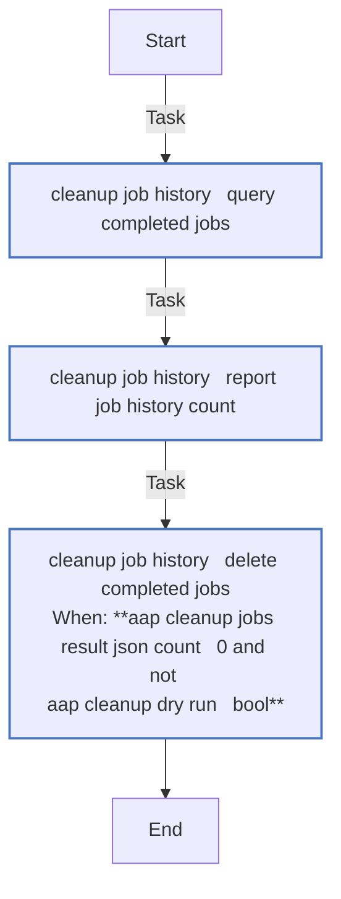

# aap_cleanup

Remove AAP resources seeded by the `aap_seed` role. Discovers resources via the AAP controller API and removes them in reverse dependency order using `infra.aap_configuration.dispatch` (or `infra.controller_configuration.dispatch` for AAP 2.4).

## Requirements

- AAP controller API access (hostname + credentials or token)
- `infra.aap_configuration` >= 3.4.1 (AAP 2.5+) or `infra.controller_configuration` >= 3.1.2 (AAP 2.4)

## Role Variables

| Variable | Default | Description |
|----------|---------|-------------|
| `aap_cleanup_controller_hostname` | env/var lookup | AAP controller hostname |
| `aap_cleanup_controller_username` | env/var lookup | AAP controller username |
| `aap_cleanup_controller_password` | env/var lookup | AAP controller password |
| `aap_cleanup_controller_token` | env/var lookup | AAP OAuth token (preferred over user/pass) |
| `aap_cleanup_controller_validate_certs` | env/var lookup | Validate TLS certificates |
| `aap_cleanup_aap_org_name` | `aap_org_name` | Organization to clean |
| `aap_cleanup_dry_run` | `false` | Query and report only, no deletions |
| `aap_cleanup_workflows_remove` | `true` | Remove workflow job templates |
| `aap_cleanup_job_templates_remove` | `true` | Remove job templates |
| `aap_cleanup_hosts_remove` | `true` | Remove hosts |
| `aap_cleanup_inventories_remove` | `true` | Remove inventories |
| `aap_cleanup_projects_remove` | `true` | Remove projects |
| `aap_cleanup_execution_environments_remove` | `true` | Remove execution environments |
| `aap_cleanup_credentials_remove` | `true` | Remove credentials |
| `aap_cleanup_credential_types_remove` | `true` | Remove custom credential types |
| `aap_cleanup_organization_remove` | `false` | Remove organization (destructive) |
| `aap_cleanup_job_history_purge` | `false` | Purge completed job history |
| `aap_cleanup_providers` | `[vmware, ovirt]` | Provider-specific resources to target |

## Deletion Order

Resources are removed in reverse creation order to respect dependencies:

1. Workflow Job Templates
2. Job Templates
3. Hosts
4. Inventories
5. Projects
6. Execution Environments
7. Credentials
8. Credential Types
9. Organizations (optional)
10. Job History (optional)

## Example Playbook

```yaml
- hosts: localhost
  roles:
    - role: infra.openshift_virtualization_migration.aap_cleanup
      vars:
        aap_cleanup_dry_run: true  # preview first
```
<!-- DOCSIBLE START -->
## aap_cleanup

```
Role belongs to infra/openshift_virtualization_migration
Namespace - infra
Collection - openshift_virtualization_migration
Version - 1.25.0
Repository - https://github.com/redhat-cop/openshift_virtualization_migration
```

Description: Remove AAP resources seeded by the aap_seed role

### Defaults

**These are static variables with lower priority**

#### File: defaults/main.yml

| Var          | Type         | Value       |Choices    |Required    | Title       |
|--------------|--------------|-------------|-------------|-------------|-------------|
| [`aap_cleanup_aap_org_name`](defaults/main.yml#L27)   | str   | `{{ aap_org_name }}` |  None  |   None  |  None |
| [`aap_cleanup_api_base`](defaults/main.yml#L30)   | str   | `<multiline value: folded_strip>` |  None  |   None  |  None |
| [`aap_cleanup_cac_collection`](defaults/main.yml#L22)   | str   | `<multiline value: folded_strip>` |  None  |   None  |  None |
| [`aap_cleanup_controller_configuration_async_retries`](defaults/main.yml#L55)   | int   | `60` |  None  |   None  |  None |
| [`aap_cleanup_controller_hostname`](defaults/main.yml#L3)   | str   | `<multiline value: folded_strip>` |  None  |   None  |  None |
| [`aap_cleanup_controller_password`](defaults/main.yml#L9)   | str   | `<multiline value: folded_strip>` |  None  |   None  |  None |
| [`aap_cleanup_controller_token`](defaults/main.yml#L12)   | str   | `<multiline value: folded_strip>` |  None  |   None  |  None |
| [`aap_cleanup_controller_username`](defaults/main.yml#L6)   | str   | `<multiline value: folded_strip>` |  None  |   None  |  None |
| [`aap_cleanup_controller_validate_certs`](defaults/main.yml#L15)   | str   | `<multiline value: folded_strip>` |  None  |   None  |  None |
| [`aap_cleanup_credential_types_remove`](defaults/main.yml#L44)   | bool   | `True` |  None  |   None  |  None |
| [`aap_cleanup_credentials_remove`](defaults/main.yml#L43)   | bool   | `True` |  None  |   None  |  None |
| [`aap_cleanup_dry_run`](defaults/main.yml#L52)   | bool   | `False` |  None  |   None  |  None |
| [`aap_cleanup_execution_environments_remove`](defaults/main.yml#L42)   | bool   | `True` |  None  |   None  |  None |
| [`aap_cleanup_hosts_remove`](defaults/main.yml#L39)   | bool   | `True` |  None  |   None  |  None |
| [`aap_cleanup_inventories_remove`](defaults/main.yml#L40)   | bool   | `True` |  None  |   None  |  None |
| [`aap_cleanup_job_history_purge`](defaults/main.yml#L46)   | bool   | `False` |  None  |   None  |  None |
| [`aap_cleanup_job_templates_remove`](defaults/main.yml#L38)   | bool   | `True` |  None  |   None  |  None |
| [`aap_cleanup_organization_remove`](defaults/main.yml#L45)   | bool   | `False` |  None  |   None  |  None |
| [`aap_cleanup_projects_remove`](defaults/main.yml#L41)   | bool   | `True` |  None  |   None  |  None |
| [`aap_cleanup_providers`](defaults/main.yml#L49)   | str   | `{{ cleanup_providers ¦ default(['vmware', 'ovirt']) }}` |  None  |   None  |  None |
| [`aap_cleanup_secure_logging`](defaults/main.yml#L19)   | str   | `{{ secure_logging ¦ default(true) }}` |  None  |   None  |  None |
| [`aap_cleanup_workflows_remove`](defaults/main.yml#L37)   | bool   | `True` |  None  |   None  |  None |

<summary><b>🖇️ Full descriptions for vars in defaults/main.yml</b></summary>
<br>
<b>`aap_cleanup_aap_org_name`:</b> None
<br>
<b>`aap_cleanup_api_base`:</b> None
<br>
<b>`aap_cleanup_cac_collection`:</b> None
<br>
<b>`aap_cleanup_controller_configuration_async_retries`:</b> None
<br>
<b>`aap_cleanup_controller_hostname`:</b> None
<br>
<b>`aap_cleanup_controller_password`:</b> None
<br>
<b>`aap_cleanup_controller_token`:</b> None
<br>
<b>`aap_cleanup_controller_username`:</b> None
<br>
<b>`aap_cleanup_controller_validate_certs`:</b> None
<br>
<b>`aap_cleanup_credential_types_remove`:</b> None
<br>
<b>`aap_cleanup_credentials_remove`:</b> None
<br>
<b>`aap_cleanup_dry_run`:</b> None
<br>
<b>`aap_cleanup_execution_environments_remove`:</b> None
<br>
<b>`aap_cleanup_hosts_remove`:</b> None
<br>
<b>`aap_cleanup_inventories_remove`:</b> None
<br>
<b>`aap_cleanup_job_history_purge`:</b> None
<br>
<b>`aap_cleanup_job_templates_remove`:</b> None
<br>
<b>`aap_cleanup_organization_remove`:</b> None
<br>
<b>`aap_cleanup_projects_remove`:</b> None
<br>
<b>`aap_cleanup_providers`:</b> None
<br>
<b>`aap_cleanup_secure_logging`:</b> None
<br>
<b>`aap_cleanup_workflows_remove`:</b> None
<br>
<br>

### Tasks

#### File: tasks/main.yml

| Name | Module | Has Conditions |
| ---- | ------ | --------- |
| Ensure AAP API credentials are set | `ansible.builtin.assert` | False |
| Build authentication headers | `ansible.builtin.set_fact` | False |
| Resolve organization ID | `ansible.builtin.uri` | False |
| Set organization ID | `ansible.builtin.set_fact` | True |
| Discover and remove AAP resources | `block` | True |
| Remove workflow job templates | `ansible.builtin.include_tasks` | True |
| Remove job templates | `ansible.builtin.include_tasks` | True |
| Remove hosts | `ansible.builtin.include_tasks` | True |
| Remove inventories | `ansible.builtin.include_tasks` | True |
| Remove projects | `ansible.builtin.include_tasks` | True |
| Remove execution environments | `ansible.builtin.include_tasks` | True |
| Remove credentials | `ansible.builtin.include_tasks` | True |
| Remove credential types | `ansible.builtin.include_tasks` | True |
| Remove organization | `ansible.builtin.include_tasks` | True |
| Purge job history | `ansible.builtin.include_tasks` | True |

#### File: tasks/_build_absent_resources.yml

| Name | Module | Has Conditions |
| ---- | ------ | --------- |
| _build_absent_resources ¦ Query resources from AAP API — {{ _aap_cleanup_resource_type }} | `ansible.builtin.uri` | False |
| _build_absent_resources ¦ Filter out managed/built-in credential types | `ansible.builtin.set_fact` | True |
| _build_absent_resources ¦ Set results for non-filtered resources | `ansible.builtin.set_fact` | True |
| _build_absent_resources ¦ Report resources found — {{ _aap_cleanup_resource_type }} | `ansible.builtin.debug` | False |
| _build_absent_resources ¦ Display resources to remove | `ansible.builtin.debug` | True |
| _build_absent_resources ¦ Build and dispatch absent resources — {{ _aap_cleanup_resource_type }} | `block` | True |
| _build_absent_resources ¦ Build absent resource list — {{ _aap_cleanup_resource_type }} | `ansible.builtin.set_fact` | False |
| _build_absent_resources ¦ Set dispatch variable — {{ _aap_cleanup_dispatch_var }} | `ansible.builtin.set_fact` | False |
| _build_absent_resources ¦ Dispatch removal — {{ _aap_cleanup_resource_type }} | `ansible.builtin.include_role` | False |
| _build_absent_resources ¦ Clear dispatch variable — {{ _aap_cleanup_dispatch_var }} | `ansible.builtin.set_fact` | False |

#### File: tasks/_cleanup_job_history.yml

| Name | Module | Has Conditions |
| ---- | ------ | --------- |
| _cleanup_job_history ¦ Query completed jobs | `ansible.builtin.uri` | False |
| _cleanup_job_history ¦ Report job history count | `ansible.builtin.debug` | False |
| _cleanup_job_history ¦ Delete completed jobs | `ansible.builtin.uri` | True |

## Task Flow Graphs

### Graph for _build_absent_resources.yml

```mermaid
flowchart TD
Start
classDef block stroke:#3498db,stroke-width:2px;
classDef task stroke:#4b76bb,stroke-width:2px;
classDef includeTasks stroke:#16a085,stroke-width:2px;
classDef importTasks stroke:#34495e,stroke-width:2px;
classDef includeRole stroke:#2980b9,stroke-width:2px;
classDef importRole stroke:#699ba7,stroke-width:2px;
classDef includeVars stroke:#8e44ad,stroke-width:2px;
classDef rescue stroke:#665352,stroke-width:2px;

  Start-->|Task| _build_absent_resources___Query_resources_from_AAP_API____aap_cleanup_resource_type0[ build absent resources   query resources from aap<br>api    aap cleanup resource type]:::task
  _build_absent_resources___Query_resources_from_AAP_API____aap_cleanup_resource_type0-->|Task| _build_absent_resources___Filter_out_managed_built_in_credential_types1[ build absent resources   filter out managed built<br>in credential types<br>When: **aap cleanup filter managed   default false   <br>bool**]:::task
  _build_absent_resources___Filter_out_managed_built_in_credential_types1-->|Task| _build_absent_resources___Set_results_for_non_filtered_resources2[ build absent resources   set results for non<br>filtered resources<br>When: **not   aap cleanup filter managed   default false  <br> bool**]:::task
  _build_absent_resources___Set_results_for_non_filtered_resources2-->|Task| _build_absent_resources___Report_resources_found____aap_cleanup_resource_type3[ build absent resources   report resources found  <br> aap cleanup resource type]:::task
  _build_absent_resources___Report_resources_found____aap_cleanup_resource_type3-->|Task| _build_absent_resources___Display_resources_to_remove4[ build absent resources   display resources to<br>remove<br>When: **aap cleanup filtered results   length   0**]:::task
  _build_absent_resources___Display_resources_to_remove4-->|Block Start| _build_absent_resources___Build_and_dispatch_absent_resources____aap_cleanup_resource_type5_block_start_0[[ build absent resources   build and dispatch<br>absent resources    aap cleanup resource type<br>When: **aap cleanup filtered results   length   0 and not<br> aap cleanup dry run   bool**]]:::block
  _build_absent_resources___Build_and_dispatch_absent_resources____aap_cleanup_resource_type5_block_start_0-->|Task| _build_absent_resources___Build_absent_resource_list____aap_cleanup_resource_type0[ build absent resources   build absent resource<br>list    aap cleanup resource type]:::task
  _build_absent_resources___Build_absent_resource_list____aap_cleanup_resource_type0-->|Task| _build_absent_resources___Set_dispatch_variable____aap_cleanup_dispatch_var1[ build absent resources   set dispatch variable   <br>aap cleanup dispatch var]:::task
  _build_absent_resources___Set_dispatch_variable____aap_cleanup_dispatch_var1-->|Include role| _build_absent_resources___Dispatch_removal____aap_cleanup_resource_type____aap_cleanup_cac_collection____dispatch_2( build absent resources   dispatch removal    aap<br>cleanup resource type<br>include_role:    aap cleanup cac collection    dispatch):::includeRole
  _build_absent_resources___Dispatch_removal____aap_cleanup_resource_type____aap_cleanup_cac_collection____dispatch_2-->|Task| _build_absent_resources___Clear_dispatch_variable____aap_cleanup_dispatch_var3[ build absent resources   clear dispatch variable <br>  aap cleanup dispatch var]:::task
  _build_absent_resources___Clear_dispatch_variable____aap_cleanup_dispatch_var3-.->|End of Block| _build_absent_resources___Build_and_dispatch_absent_resources____aap_cleanup_resource_type5_block_start_0
  _build_absent_resources___Clear_dispatch_variable____aap_cleanup_dispatch_var3-->End
```



### Graph for _cleanup_job_history.yml



### Graph for main.yml

```mermaid
flowchart TD
Start
classDef block stroke:#3498db,stroke-width:2px;
classDef task stroke:#4b76bb,stroke-width:2px;
classDef includeTasks stroke:#16a085,stroke-width:2px;
classDef importTasks stroke:#34495e,stroke-width:2px;
classDef includeRole stroke:#2980b9,stroke-width:2px;
classDef importRole stroke:#699ba7,stroke-width:2px;
classDef includeVars stroke:#8e44ad,stroke-width:2px;
classDef rescue stroke:#665352,stroke-width:2px;

  Start-->|Task| Ensure_AAP_API_credentials_are_set0[ensure aap api credentials are set]:::task
  Ensure_AAP_API_credentials_are_set0-->|Task| Build_authentication_headers1[build authentication headers]:::task
  Build_authentication_headers1-->|Task| Resolve_organization_ID2[resolve organization id]:::task
  Resolve_organization_ID2-->|Task| Set_organization_ID3[set organization id<br>When: **aap cleanup org result json count   0**]:::task
  Set_organization_ID3-->|Block Start| Discover_and_remove_AAP_resources4_block_start_0[[discover and remove aap resources<br>When: **aap cleanup org id is defined**]]:::block
  Discover_and_remove_AAP_resources4_block_start_0-->|Include task| Remove_workflow_job_templates__build_absent_resources_yml_0[remove workflow job templates<br>When: **aap cleanup workflows remove   bool**<br>include_task:  build absent resources yml]:::includeTasks
  Remove_workflow_job_templates__build_absent_resources_yml_0-->|Include task| Remove_job_templates__build_absent_resources_yml_1[remove job templates<br>When: **aap cleanup job templates remove   bool**<br>include_task:  build absent resources yml]:::includeTasks
  Remove_job_templates__build_absent_resources_yml_1-->|Include task| Remove_hosts__build_absent_resources_yml_2[remove hosts<br>When: **aap cleanup hosts remove   bool**<br>include_task:  build absent resources yml]:::includeTasks
  Remove_hosts__build_absent_resources_yml_2-->|Include task| Remove_inventories__build_absent_resources_yml_3[remove inventories<br>When: **aap cleanup inventories remove   bool**<br>include_task:  build absent resources yml]:::includeTasks
  Remove_inventories__build_absent_resources_yml_3-->|Include task| Remove_projects__build_absent_resources_yml_4[remove projects<br>When: **aap cleanup projects remove   bool**<br>include_task:  build absent resources yml]:::includeTasks
  Remove_projects__build_absent_resources_yml_4-->|Include task| Remove_execution_environments__build_absent_resources_yml_5[remove execution environments<br>When: **aap cleanup execution environments remove   bool**<br>include_task:  build absent resources yml]:::includeTasks
  Remove_execution_environments__build_absent_resources_yml_5-->|Include task| Remove_credentials__build_absent_resources_yml_6[remove credentials<br>When: **aap cleanup credentials remove   bool**<br>include_task:  build absent resources yml]:::includeTasks
  Remove_credentials__build_absent_resources_yml_6-->|Include task| Remove_credential_types__build_absent_resources_yml_7[remove credential types<br>When: **aap cleanup credential types remove   bool**<br>include_task:  build absent resources yml]:::includeTasks
  Remove_credential_types__build_absent_resources_yml_7-->|Include task| Remove_organization__build_absent_resources_yml_8[remove organization<br>When: **aap cleanup organization remove   bool**<br>include_task:  build absent resources yml]:::includeTasks
  Remove_organization__build_absent_resources_yml_8-->|Include task| Purge_job_history__cleanup_job_history_yml_9[purge job history<br>When: **aap cleanup job history purge   bool**<br>include_task:  cleanup job history yml]:::includeTasks
  Purge_job_history__cleanup_job_history_yml_9-.->|End of Block| Discover_and_remove_AAP_resources4_block_start_0
  Purge_job_history__cleanup_job_history_yml_9-->End
```



## Author Information

Red Hat

## License

GPL-3.0-or-later

## Minimum Ansible Version

2.15

## Platforms

* **EL**: ['9']

<!-- DOCSIBLE END -->