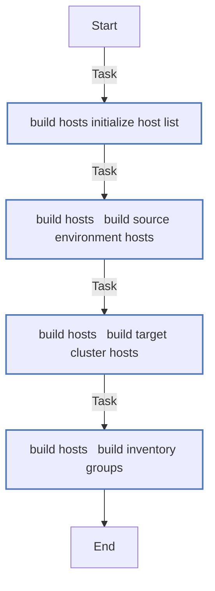
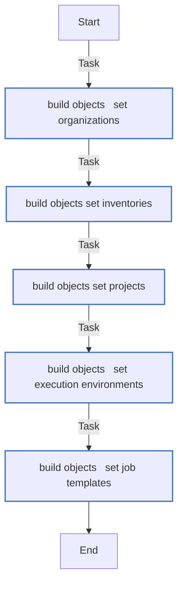
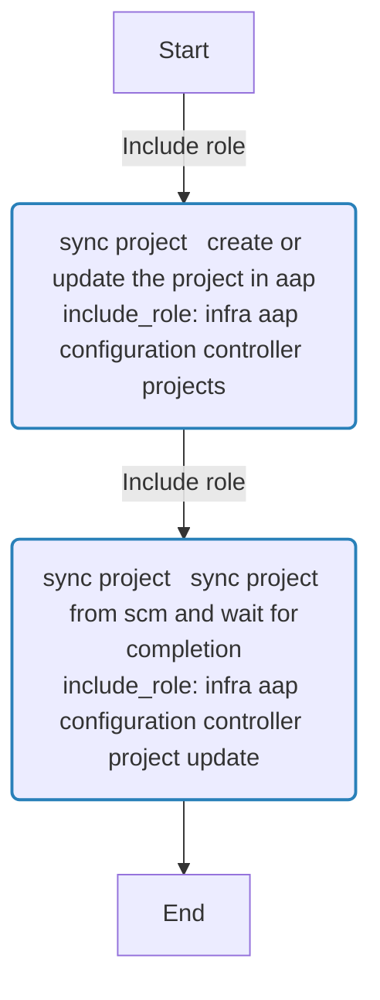
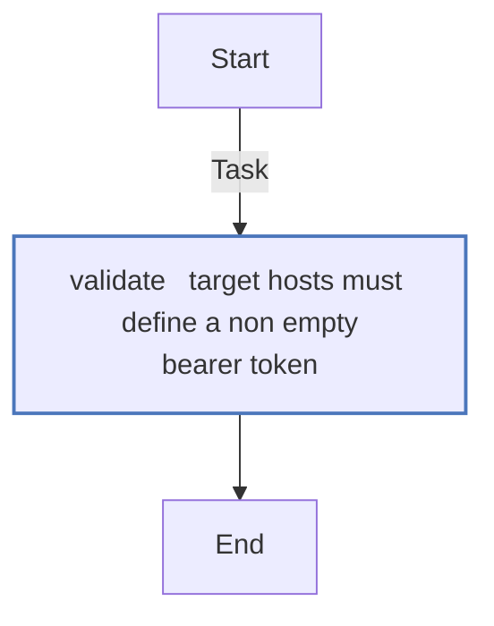

# aap_seed

Seeds Ansible Automation Platform with Migration Factory Configuration as Code content.

The role dynamically builds all AAP objects from the Ansible inventory and role defaults at runtime:

- **Credential types** -- custom type for source hypervisor environments
- **Credentials** -- one per source (vSphere/RHV), one per target (OpenShift bearer token), and optionally a Git credential for private repos
- **Inventory, hosts, groups** -- source and target hosts with non-sensitive metadata
- **Execution environments** -- optional custom EE definitions
- **Project** -- SCM-backed project synced from Git
- **Job templates** -- default migrate template

Target cluster credentials use the built-in AAP credential type
"OpenShift or Kubernetes API Bearer Token".

## Architecture

All object shapes are defined in `defaults/main.yml` as `aap_seed_controller_*`
lists. During execution the role:

1. Applies `_create` toggles to skip disabled categories
2. Validates inventory host variables
3. Renders credentials from Jinja2 templates in `templates/`
4. Builds hosts and groups by looping over inventory groups
5. Syncs the SCM project
6. Copies `aap_seed_controller_*` to `controller_*` (handoff)
7. Calls `infra.aap_configuration.dispatch`

Users can override any object list by redefining the corresponding
`aap_seed_controller_*` variable, or disable an entire category with its
`_create` toggle.

## Requirements

- `infra.aap_configuration` collection (>= 4.x)
- `ansible.controller` collection

## Role Variables

### AAP Connection

Set these in your inventory under the `migration_aap` host. The role cascades
from generic `aap_*` variables so they can be shared with other roles.

| Inventory Variable | Role Variable | Type | Description |
|--------------------|---------------|------|-------------|
| `aap_hostname` | `aap_seed_hostname` | str | FQDN or URL of the AAP controller API endpoint |
| `aap_username` | `aap_seed_username` | str | Username for AAP authentication (mutually exclusive with token) |
| `aap_password` | `aap_seed_password` | str | Password for AAP authentication (mutually exclusive with token) |
| `aap_token` | `aap_seed_token` | str | OAuth token for AAP authentication |
| `aap_validate_certs` | `aap_seed_validate_certs` | bool | Validate TLS certificates (default: `true`) |
| — | `aap_seed_secure_logging` | bool | Suppress credential loop output (default: `true`; set to `false` for debugging) |

### AAP Content Configuration

| Variable | Default | Description |
|----------|---------|-------------|
| `aap_seed_org_name` | `Default` | AAP organization for all objects |
| `aap_seed_project_name` | `OpenShift Virtualization Migration` | SCM project name |
| `aap_seed_project_scm_url` | cascades from `aap_project_scm_url` | Git URL |
| `aap_seed_project_scm_branch` | cascades from `aap_project_scm_branch` | Git branch or tag |
| `aap_seed_project_sync_timeout` | `120` | SCM sync timeout in seconds |
| `aap_seed_project_credential` | cascades from `aap_project_credential` | Name of the Git credential to create and attach to the project (leave empty to skip) |
| `aap_seed_inventory_name` | `OpenShift Virtualization Migration` | AAP inventory name |
| `aap_seed_execution_environment` | `Default execution environment` | Execution environment for job templates |
| `aap_seed_migrate_template_name` | `OpenShift Virtualization Migration - Migrate` | Name of the default job template |
| `aap_seed_migrate_playbook` | `playbooks/vmf_migrate.yml` | Playbook path for the default job template |

### Git Credential (optional)

When `aap_project_credential` (or `aap_seed_project_credential`) is set, the
role creates a Source Control credential in AAP. Provide either
username/password or an SSH key in the inventory.

| Inventory Variable | Role Variable | Default | Description |
|--------------------|---------------|---------|-------------|
| `aap_git_username` | `aap_seed_git_username` | `""` | Git username for HTTPS authentication |
| `aap_git_password` | `aap_seed_git_password` | `""` | Git password or personal access token |
| `aap_git_ssh_key` | `aap_seed_git_ssh_key` | `""` | SSH private key for Git authentication |
| `aap_git_ssh_key_unlock` | `aap_seed_git_ssh_key_unlock` | `""` | Passphrase to unlock the SSH key |

### Credential and Inventory Group Names

| Variable | Default | Description |
|----------|---------|-------------|
| `aap_seed_source_credential_type` | `Migration Factory - Source Environment` | Custom credential type for sources |
| `aap_seed_target_credential_type` | `OpenShift or Kubernetes API Bearer Token` | Credential type for targets (built-in) |
| `aap_seed_source_inventory_group` | `vm_sources` | Inventory group containing source hosts |
| `aap_seed_target_inventory_group` | `migration_clusters` | Inventory group containing target hosts |

### Create Toggles

Set any toggle to `false` to skip that object category entirely.

| Variable | Default | Description |
|----------|---------|-------------|
| `aap_seed_organizations_create` | `true` | Create organizations (only when list is non-empty) |
| `aap_seed_credential_types_create` | `true` | Create custom source credential type |
| `aap_seed_credentials_create` | `true` | Build and push all credentials |
| `aap_seed_inventories_create` | `true` | Create the AAP inventory |
| `aap_seed_hosts_create` | `true` | Build and push inventory hosts and groups |
| `aap_seed_execution_environments_create` | `true` | Create execution environments (only when list is non-empty) |
| `aap_seed_projects_create` | `true` | Create and sync the SCM project |
| `aap_seed_templates_create` | `true` | Create job templates |

### Overridable Object Lists

Override these to completely replace the role's default object definitions.

| Variable | Description |
|----------|-------------|
| `aap_seed_controller_organizations` | Organization definitions (default: `[]`) |
| `aap_seed_controller_credential_types` | Custom credential type definitions |
| `aap_seed_controller_execution_environments` | Execution environment definitions (default: `[]`) |
| `aap_seed_controller_inventories` | AAP inventory definitions |
| `aap_seed_controller_projects` | AAP project definitions |
| `aap_seed_controller_templates` | AAP job template definitions |

## Inventory Host Variables

### Source hosts (`vm_sources` group)

```yaml
vcenter-prod:
  type: vmware               # vmware or ovirt
  host: vcenter.example.com
  sdk_endpoint: /sdk
  username: administrator@vsphere.local
  password: changeme          # use ansible-vault
  # insecure_skip_tls_verify: true   # default: false
```

### Target hosts (`migration_clusters` group)

Provide one of `openshift_api_key` (permanent) or `openshift_temporary_api_key` (short-lived):

```yaml
ocp-prod:
  openshift_host: https://api.ocp-prod.example.com:6443
  openshift_api_key: sha256~XXXXXXXXXXX
  # openshift_verify_ssl: false      # default: true
  vm_sources:
    - vcenter-prod
  aap_hosts:
    - aap-instance
  mtv_namespace: openshift-mtv
  default_target_namespace: vm-workloads
  configure_mtv: true
```

## Example Playbook

```yaml
---
- name: Seed AAP with Migration Factory content
  hosts: migration_aap
  connection: local
  gather_facts: false

  tasks:
    - name: Sync project and push CaC objects to AAP
      ansible.builtin.import_role:
        name: aap_seed
```

### Add a custom execution environment

```yaml
aap_seed_controller_execution_environments:
  - name: Migration Factory EE
    image: quay.io/org/migration-factory-ee:latest
```

### Skip specific object types

```yaml
- name: Only push credentials (no project, templates, or inventory)
  hosts: migration_aap
  connection: local
  gather_facts: false

  tasks:
    - name: Push credentials only
      ansible.builtin.import_role:
        name: aap_seed
      vars:
        aap_seed_projects_create: false
        aap_seed_templates_create: false
        aap_seed_inventories_create: false
        aap_seed_hosts_create: false
```
<!-- DOCSIBLE START -->
## aap_seed

```
Role belongs to infra/openshift_virtualization_migration
Namespace - infra
Collection - openshift_virtualization_migration
Version - 1.25.0
Repository - https://github.com/redhat-cop/openshift_virtualization_migration
```

Description: Seed AAP with Migration Factory Configuration as Code content

### Argument Specifications

<details>
<summary><b>🧩 Argument Specifications in `meta/argument_specs`</b></summary>

#### Key: main

* **Description**: ['Dynamically builds all AAP Configuration as Code objects from the Ansible inventory and role defaults, syncs the SCM project, and pushes everything to AAP via infra.aap_configuration.dispatch.', 'Object types managed include credential types, credentials, inventories, hosts, groups, projects, job templates, execution environments, and organizations.', 'Target cluster credentials use the built-in AAP credential type "OpenShift or Kubernetes API Bearer Token".', 'Each object type can be skipped with a C(_create) toggle or replaced entirely by overriding the corresponding C(aap_seed_controller_*) variable.']
* **Options**:
  * **aap_seed_controller_execution_environments**:
    * **Required**: False
    * **Type**: list
    * **Default**: []
    * **Description**: List of AAP execution environment definitions. Empty by default; populate to create custom EEs. Each entry follows the C(infra.aap_configuration.controller_execution_environments) schema (name, image, etc.).
  * **aap_seed_controller_inventories**:
    * **Required**: False
    * **Type**: list
    * **Default**: none
    * **Description**: List of AAP inventory definitions. Override to replace the default Migration Factory inventory.
  * **aap_seed_controller_organizations**:
    * **Required**: False
    * **Type**: list
    * **Default**: []
    * **Description**: List of AAP organization definitions. Empty by default; populate to create organizations before other objects. Each entry follows the C(infra.aap_configuration.gateway_organizations) schema.
  * **aap_seed_controller_projects**:
    * **Required**: False
    * **Type**: list
    * **Default**: none
    * **Description**: List of AAP project definitions. Override to replace the default SCM project.
  * **aap_seed_controller_templates**:
    * **Required**: False
    * **Type**: list
    * **Default**: none
    * **Description**: List of AAP job template definitions. Override to replace the default migrate template.
  * **aap_seed_credential_types_create**:
    * **Required**: False
    * **Type**: bool
    * **Default**: True
    * **Description**: Create the custom source credential type in AAP. Set to C(false) to skip.
  * **aap_seed_credentials_create**:
    * **Required**: False
    * **Type**: bool
    * **Default**: True
    * **Description**: Build and push credentials for source and target hosts. Set to C(false) to skip.
  * **aap_seed_execution_environment**:
    * **Required**: False
    * **Type**: str
    * **Default**: Default execution environment
    * **Description**: Execution environment assigned to job templates.
  * **aap_seed_execution_environments_create**:
    * **Required**: False
    * **Type**: bool
    * **Default**: True
    * **Description**: Create execution environments in AAP. Set to C(false) to skip.  Only applies when I(aap_seed_controller_execution_environments) is non-empty.
  * **aap_seed_git_password**:
    * **Required**: False
    * **Type**: str
    * **Default**:
    * **Description**: Git password or personal access token. Defaults to C(aap_git_password) from inventory.
  * **aap_seed_git_ssh_key**:
    * **Required**: False
    * **Type**: str
    * **Default**:
    * **Description**: SSH private key for Git authentication. Defaults to C(aap_git_ssh_key) from inventory.
  * **aap_seed_git_ssh_key_unlock**:
    * **Required**: False
    * **Type**: str
    * **Default**:
    * **Description**: Passphrase to unlock the SSH key. Defaults to C(aap_git_ssh_key_unlock) from inventory.
  * **aap_seed_git_username**:
    * **Required**: False
    * **Type**: str
    * **Default**:
    * **Description**: Git username for HTTPS authentication. Defaults to C(aap_git_username) from inventory.
  * **aap_seed_hostname**:
    * **Required**: False
    * **Type**: str
    * **Default**: none
    * **Description**: FQDN or URL of the AAP controller API endpoint. Defaults to C(aap_hostname) from inventory.
  * **aap_seed_hosts_create**:
    * **Required**: False
    * **Type**: bool
    * **Default**: True
    * **Description**: Build and push inventory hosts and groups from the Ansible inventory. Set to C(false) to skip.
  * **aap_seed_inventories_create**:
    * **Required**: False
    * **Type**: bool
    * **Default**: True
    * **Description**: Create the AAP inventory. Set to C(false) to skip.
  * **aap_seed_inventory_name**:
    * **Required**: False
    * **Type**: str
    * **Default**: OpenShift Virtualization Migration
    * **Description**: Name of the inventory created in AAP. Source and target hosts are added to this inventory.
  * **aap_seed_mtv_provider_playbook**:
    * **Required**: False
    * **Type**: str
    * **Default**: playbooks/vmf_mtv_provider.yml
    * **Description**: Playbook path for the MTV Provider job template.
  * **aap_seed_mtv_provider_template_name**:
    * **Required**: False
    * **Type**: str
    * **Default**: OpenShift Virtualization Migration - MTV Provider
    * **Description**: Name of the MTV Provider job template created in AAP.
  * **aap_seed_org_name**:
    * **Required**: False
    * **Type**: str
    * **Default**: Default
    * **Description**: AAP organization that owns the project, inventory, and credentials.
  * **aap_seed_organizations_create**:
    * **Required**: False
    * **Type**: bool
    * **Default**: True
    * **Description**: Create organizations in AAP. Set to C(false) to skip. Only applies when I(aap_seed_controller_organizations) is non-empty.
  * **aap_seed_password**:
    * **Required**: False
    * **Type**: str
    * **Default**: none
    * **Description**: Password for AAP controller authentication. Mutually exclusive with I(aap_seed_token). Defaults to C(aap_password) from inventory.
  * **aap_seed_project_credential**:
    * **Required**: False
    * **Type**: str
    * **Default**:
    * **Description**: Name of the Git credential to create and attach to the SCM project. Leave empty to skip. Defaults to C(aap_project_credential) from inventory.
  * **aap_seed_project_name**:
    * **Required**: False
    * **Type**: str
    * **Default**: OpenShift Virtualization Migration
    * **Description**: Name of the SCM-backed project created in AAP.
  * **aap_seed_project_scm_branch**:
    * **Required**: False
    * **Type**: str
    * **Default**: v2
    * **Description**: Git branch or tag to checkout for the project. Defaults to C(aap_project_scm_branch) from inventory.
  * **aap_seed_project_scm_url**:
    * **Required**: False
    * **Type**: str
    * **Default**: https://github.com/redhat-cop/openshift_virtualization_migration.git
    * **Description**: Git URL used as the project SCM source. Defaults to C(aap_project_scm_url) from inventory.
  * **aap_seed_project_sync_timeout**:
    * **Required**: False
    * **Type**: int
    * **Default**: 120
    * **Description**: Maximum seconds to wait for the SCM project sync to complete.
  * **aap_seed_projects_create**:
    * **Required**: False
    * **Type**: bool
    * **Default**: True
    * **Description**: Create and sync the SCM project. Set to C(false) to skip.
  * **aap_seed_secure_logging**:
    * **Required**: False
    * **Type**: bool
    * **Default**: True
    * **Description**: Suppress task output for credential loops to prevent secrets from leaking to logs.  Set to C(false) when debugging credential construction.
  * **aap_seed_source_credential_type**:
    * **Required**: False
    * **Type**: str
    * **Default**: Migration Factory - Source Environment
    * **Description**: Name of the custom credential type created in AAP for source hypervisor environments (vSphere, RHV).
  * **aap_seed_source_inventory_group**:
    * **Required**: False
    * **Type**: str
    * **Default**: vm_sources
    * **Description**: Ansible inventory group containing source hypervisor hosts. Each host in this group becomes an AAP inventory host and a source-environment credential.
  * **aap_seed_target_credential_type**:
    * **Required**: False
    * **Type**: str
    * **Default**: OpenShift or Kubernetes API Bearer Token
    * **Description**: AAP credential type used for target OpenShift clusters. Defaults to the built-in bearer token type. Each target host should set I(openshift_api_key) or I(openshift_temporary_api_key).
  * **aap_seed_target_inventory_group**:
    * **Required**: False
    * **Type**: str
    * **Default**: migration_clusters
    * **Description**: Ansible inventory group containing target OpenShift cluster hosts. Each host in this group becomes an AAP inventory host and a target-cluster credential.
  * **aap_seed_templates_create**:
    * **Required**: False
    * **Type**: bool
    * **Default**: True
    * **Description**: Create job templates. Set to C(false) to skip.
  * **aap_seed_token**:
    * **Required**: False
    * **Type**: str
    * **Default**: none
    * **Description**: OAuth token for AAP controller authentication. Mutually exclusive with I(aap_seed_username)/I(aap_seed_password). Defaults to C(aap_token) from inventory.
  * **aap_seed_username**:
    * **Required**: False
    * **Type**: str
    * **Default**: none
    * **Description**: Username for AAP controller authentication. Mutually exclusive with I(aap_seed_token). Defaults to C(aap_username) from inventory.
  * **aap_seed_validate_certs**:
    * **Required**: False
    * **Type**: bool
    * **Default**: True
    * **Description**: Whether to validate TLS certificates when connecting to AAP. Defaults to C(aap_validate_certs) from inventory, or C(true) if unset.

</details>

### Defaults

**These are static variables with lower priority**

#### File: defaults/main.yml

| Var          | Type         | Value       |Choices    |Required    | Title       |
|--------------|--------------|-------------|-------------|-------------|-------------|
| [`aap_seed_common_survey_spec`](defaults/main.yml#L43)   | dict   | `{}` |  None  |   None  |  None |
| [`aap_seed_common_survey_spec.description`](defaults/main.yml#L45)   | str   | `` |  None  |   None  |  None |
| [`aap_seed_common_survey_spec.name`](defaults/main.yml#L44)   | str   | `` |  None  |   None  |  None |
| [`aap_seed_common_survey_spec.spec`](defaults/main.yml#L46)   | list   | `[]` |  None  |   None  |  None |
| [`aap_seed_common_survey_spec.spec.0`](defaults/main.yml#L47)   | dict   | `{}` |  None  |   None  |  None |
| [`aap_seed_common_survey_spec.spec.0.question_description`](defaults/main.yml#L48)   | str   | `<multiline value: folded_strip>` |  None  |   None  |  None |
| [`aap_seed_common_survey_spec.spec.0.question_name`](defaults/main.yml#L47)   | str   | `Source Name` |  None  |   None  |  None |
| [`aap_seed_common_survey_spec.spec.0.required`](defaults/main.yml#L54)   | bool   | `True` |  None  |   None  |  None |
| [`aap_seed_common_survey_spec.spec.0.type`](defaults/main.yml#L53)   | str   | `text` |  None  |   None  |  None |
| [`aap_seed_common_survey_spec.spec.0.variable`](defaults/main.yml#L52)   | str   | `source_name` |  None  |   None  |  None |
| [`aap_seed_common_survey_spec.spec.1`](defaults/main.yml#L55)   | dict   | `{}` |  None  |   None  |  None |
| [`aap_seed_common_survey_spec.spec.1.question_description`](defaults/main.yml#L56)   | str   | `<multiline value: folded_strip>` |  None  |   None  |  None |
| [`aap_seed_common_survey_spec.spec.1.question_name`](defaults/main.yml#L55)   | str   | `Target Name` |  None  |   None  |  None |
| [`aap_seed_common_survey_spec.spec.1.required`](defaults/main.yml#L62)   | bool   | `True` |  None  |   None  |  None |
| [`aap_seed_common_survey_spec.spec.1.type`](defaults/main.yml#L61)   | str   | `text` |  None  |   None  |  None |
| [`aap_seed_common_survey_spec.spec.1.variable`](defaults/main.yml#L60)   | str   | `target_name` |  None  |   None  |  None |
| [`aap_seed_controller_credential_types`](defaults/main.yml#L86)   | list   | `[]` |  None  |   None  |  None |
| [`aap_seed_controller_credential_types.0`](defaults/main.yml#L87)   | dict   | `{}` |  None  |   None  |  None |
| [`aap_seed_controller_credential_types.0.injectors`](defaults/main.yml#L114)   | dict   | `{}` |  None  |   None  |  None |
| [`aap_seed_controller_credential_types.0.injectors.extra_vars`](defaults/main.yml#L115)   | dict   | `{}` |  None  |   None  |  None |
| [`aap_seed_controller_credential_types.0.injectors.extra_vars.mf_insecure_skip_tls_verify`](defaults/main.yml#L120)   | str   | `{  { insecure_skip_tls_verify }}` |  None  |   None  |  None |
| [`aap_seed_controller_credential_types.0.injectors.extra_vars.mf_source_certificate`](defaults/main.yml#L119)   | str   | `{  { certificate }}` |  None  |   None  |  None |
| [`aap_seed_controller_credential_types.0.injectors.extra_vars.mf_source_host`](defaults/main.yml#L116)   | str   | `{  { host }}` |  None  |   None  |  None |
| [`aap_seed_controller_credential_types.0.injectors.extra_vars.mf_source_password`](defaults/main.yml#L118)   | str   | `{  { password }}` |  None  |   None  |  None |
| [`aap_seed_controller_credential_types.0.injectors.extra_vars.mf_source_username`](defaults/main.yml#L117)   | str   | `{  { username }}` |  None  |   None  |  None |
| [`aap_seed_controller_credential_types.0.inputs`](defaults/main.yml#L90)   | dict   | `{}` |  None  |   None  |  None |
| [`aap_seed_controller_credential_types.0.inputs.fields`](defaults/main.yml#L91)   | list   | `[]` |  None  |   None  |  None |
| [`aap_seed_controller_credential_types.0.inputs.fields.0`](defaults/main.yml#L92)   | dict   | `{}` |  None  |   None  |  None |
| [`aap_seed_controller_credential_types.0.inputs.fields.0.id`](defaults/main.yml#L92)   | str   | `host` |  None  |   None  |  None |
| [`aap_seed_controller_credential_types.0.inputs.fields.0.label`](defaults/main.yml#L94)   | str   | `Hostname or IP` |  None  |   None  |  None |
| [`aap_seed_controller_credential_types.0.inputs.fields.0.type`](defaults/main.yml#L93)   | str   | `string` |  None  |   None  |  None |
| [`aap_seed_controller_credential_types.0.inputs.fields.1`](defaults/main.yml#L95)   | dict   | `{}` |  None  |   None  |  None |
| [`aap_seed_controller_credential_types.0.inputs.fields.1.id`](defaults/main.yml#L95)   | str   | `username` |  None  |   None  |  None |
| [`aap_seed_controller_credential_types.0.inputs.fields.1.label`](defaults/main.yml#L97)   | str   | `Username` |  None  |   None  |  None |
| [`aap_seed_controller_credential_types.0.inputs.fields.1.type`](defaults/main.yml#L96)   | str   | `string` |  None  |   None  |  None |
| [`aap_seed_controller_credential_types.0.inputs.fields.2`](defaults/main.yml#L98)   | dict   | `{}` |  None  |   None  |  None |
| [`aap_seed_controller_credential_types.0.inputs.fields.2.id`](defaults/main.yml#L98)   | str   | `password` |  None  |   None  |  None |
| [`aap_seed_controller_credential_types.0.inputs.fields.2.label`](defaults/main.yml#L100)   | str   | `Password` |  None  |   None  |  None |
| [`aap_seed_controller_credential_types.0.inputs.fields.2.secret`](defaults/main.yml#L101)   | bool   | `True` |  None  |   None  |  None |
| [`aap_seed_controller_credential_types.0.inputs.fields.2.type`](defaults/main.yml#L99)   | str   | `string` |  None  |   None  |  None |
| [`aap_seed_controller_credential_types.0.inputs.fields.3`](defaults/main.yml#L102)   | dict   | `{}` |  None  |   None  |  None |
| [`aap_seed_controller_credential_types.0.inputs.fields.3.id`](defaults/main.yml#L102)   | str   | `certificate` |  None  |   None  |  None |
| [`aap_seed_controller_credential_types.0.inputs.fields.3.label`](defaults/main.yml#L104)   | str   | `SSL/TLS CA Certificate` |  None  |   None  |  None |
| [`aap_seed_controller_credential_types.0.inputs.fields.3.multiline`](defaults/main.yml#L105)   | bool   | `True` |  None  |   None  |  None |
| [`aap_seed_controller_credential_types.0.inputs.fields.3.secret`](defaults/main.yml#L106)   | bool   | `True` |  None  |   None  |  None |
| [`aap_seed_controller_credential_types.0.inputs.fields.3.type`](defaults/main.yml#L103)   | str   | `string` |  None  |   None  |  None |
| [`aap_seed_controller_credential_types.0.inputs.fields.4`](defaults/main.yml#L107)   | dict   | `{}` |  None  |   None  |  None |
| [`aap_seed_controller_credential_types.0.inputs.fields.4.id`](defaults/main.yml#L107)   | str   | `insecure_skip_tls_verify` |  None  |   None  |  None |
| [`aap_seed_controller_credential_types.0.inputs.fields.4.label`](defaults/main.yml#L109)   | str   | `Insecure Skip TLS Verify` |  None  |   None  |  None |
| [`aap_seed_controller_credential_types.0.inputs.fields.4.type`](defaults/main.yml#L108)   | str   | `boolean` |  None  |   None  |  None |
| [`aap_seed_controller_credential_types.0.inputs.required`](defaults/main.yml#L110)   | list   | `[]` |  None  |   None  |  None |
| [`aap_seed_controller_credential_types.0.inputs.required.0`](defaults/main.yml#L111)   | str   | `host` |  None  |   None  |  None |
| [`aap_seed_controller_credential_types.0.inputs.required.1`](defaults/main.yml#L112)   | str   | `username` |  None  |   None  |  None |
| [`aap_seed_controller_credential_types.0.inputs.required.2`](defaults/main.yml#L113)   | str   | `password` |  None  |   None  |  None |
| [`aap_seed_controller_credential_types.0.kind`](defaults/main.yml#L89)   | str   | `cloud` |  None  |   None  |  None |
| [`aap_seed_controller_credential_types.0.name`](defaults/main.yml#L87)   | str   | `{{ aap_seed_source_credential_type }}` |  None  |   None  |  None |
| [`aap_seed_controller_credential_types.0.organization`](defaults/main.yml#L88)   | str   | `{{ aap_seed_org_name }}` |  None  |   None  |  None |
| [`aap_seed_controller_execution_environments`](defaults/main.yml#L135)   | list   | `[]` |  None  |   None  |  None |
| [`aap_seed_controller_inventories`](defaults/main.yml#L122)   | list   | `[]` |  None  |   None  |  None |
| [`aap_seed_controller_inventories.0`](defaults/main.yml#L123)   | dict   | `{}` |  None  |   None  |  None |
| [`aap_seed_controller_inventories.0.name`](defaults/main.yml#L123)   | str   | `{{ aap_seed_inventory_name }}` |  None  |   None  |  None |
| [`aap_seed_controller_inventories.0.organization`](defaults/main.yml#L124)   | str   | `{{ aap_seed_org_name }}` |  None  |   None  |  None |
| [`aap_seed_controller_organizations`](defaults/main.yml#L84)   | list   | `[]` |  None  |   None  |  None |
| [`aap_seed_controller_projects`](defaults/main.yml#L126)   | list   | `[]` |  None  |   None  |  None |
| [`aap_seed_controller_projects.0`](defaults/main.yml#L127)   | dict   | `{}` |  None  |   None  |  None |
| [`aap_seed_controller_projects.0.credential`](defaults/main.yml#L133)   | str   | `{{ aap_seed_project_credential ¦ default(omit, true) }}` |  None  |   None  |  None |
| [`aap_seed_controller_projects.0.name`](defaults/main.yml#L127)   | str   | `{{ aap_seed_project_name }}` |  None  |   None  |  None |
| [`aap_seed_controller_projects.0.organization`](defaults/main.yml#L128)   | str   | `{{ aap_seed_org_name }}` |  None  |   None  |  None |
| [`aap_seed_controller_projects.0.scm_branch`](defaults/main.yml#L131)   | str   | `{{ aap_seed_project_scm_branch }}` |  None  |   None  |  None |
| [`aap_seed_controller_projects.0.scm_type`](defaults/main.yml#L129)   | str   | `git` |  None  |   None  |  None |
| [`aap_seed_controller_projects.0.scm_update_on_launch`](defaults/main.yml#L132)   | bool   | `True` |  None  |   None  |  None |
| [`aap_seed_controller_projects.0.scm_url`](defaults/main.yml#L130)   | str   | `{{ aap_seed_project_scm_url }}` |  None  |   None  |  None |
| [`aap_seed_controller_templates`](defaults/main.yml#L137)   | list   | `[]` |  None  |   None  |  None |
| [`aap_seed_controller_templates.0`](defaults/main.yml#L138)   | dict   | `{}` |  None  |   None  |  None |
| [`aap_seed_controller_templates.0.ask_credential_on_launch`](defaults/main.yml#L144)   | bool   | `True` |  None  |   None  |  None |
| [`aap_seed_controller_templates.0.ask_variables_on_launch`](defaults/main.yml#L145)   | bool   | `True` |  None  |   None  |  None |
| [`aap_seed_controller_templates.0.execution_environment`](defaults/main.yml#L143)   | str   | `{{ aap_seed_execution_environment }}` |  None  |   None  |  None |
| [`aap_seed_controller_templates.0.inventory`](defaults/main.yml#L142)   | str   | `{{ aap_seed_inventory_name }}` |  None  |   None  |  None |
| [`aap_seed_controller_templates.0.name`](defaults/main.yml#L138)   | str   | `{{ aap_seed_migrate_template_name }}` |  None  |   None  |  None |
| [`aap_seed_controller_templates.0.organization`](defaults/main.yml#L139)   | str   | `{{ aap_seed_org_name }}` |  None  |   None  |  None |
| [`aap_seed_controller_templates.0.playbook`](defaults/main.yml#L141)   | str   | `{{ aap_seed_migrate_playbook }}` |  None  |   None  |  None |
| [`aap_seed_controller_templates.0.project`](defaults/main.yml#L140)   | str   | `{{ aap_seed_project_name }}` |  None  |   None  |  None |
| [`aap_seed_controller_templates.0.survey_enabled`](defaults/main.yml#L147)   | bool   | `True` |  None  |   None  |  None |
| [`aap_seed_controller_templates.0.survey_spec`](defaults/main.yml#L148)   | str   | `{{ aap_seed_common_survey_spec }}` |  None  |   None  |  None |
| [`aap_seed_controller_templates.0.verbosity`](defaults/main.yml#L146)   | int   | `0` |  None  |   None  |  None |
| [`aap_seed_controller_templates.1`](defaults/main.yml#L149)   | dict   | `{}` |  None  |   None  |  None |
| [`aap_seed_controller_templates.1.ask_credential_on_launch`](defaults/main.yml#L155)   | bool   | `True` |  None  |   None  |  None |
| [`aap_seed_controller_templates.1.ask_variables_on_launch`](defaults/main.yml#L156)   | bool   | `True` |  None  |   None  |  None |
| [`aap_seed_controller_templates.1.execution_environment`](defaults/main.yml#L154)   | str   | `{{ aap_seed_execution_environment }}` |  None  |   None  |  None |
| [`aap_seed_controller_templates.1.inventory`](defaults/main.yml#L153)   | str   | `{{ aap_seed_inventory_name }}` |  None  |   None  |  None |
| [`aap_seed_controller_templates.1.name`](defaults/main.yml#L149)   | str   | `{{ aap_seed_mtv_provider_template_name }}` |  None  |   None  |  None |
| [`aap_seed_controller_templates.1.organization`](defaults/main.yml#L150)   | str   | `{{ aap_seed_org_name }}` |  None  |   None  |  None |
| [`aap_seed_controller_templates.1.playbook`](defaults/main.yml#L152)   | str   | `{{ aap_seed_mtv_provider_playbook }}` |  None  |   None  |  None |
| [`aap_seed_controller_templates.1.project`](defaults/main.yml#L151)   | str   | `{{ aap_seed_project_name }}` |  None  |   None  |  None |
| [`aap_seed_controller_templates.1.survey_enabled`](defaults/main.yml#L158)   | bool   | `True` |  None  |   None  |  None |
| [`aap_seed_controller_templates.1.survey_spec`](defaults/main.yml#L159)   | str   | `{{ aap_seed_common_survey_spec }}` |  None  |   None  |  None |
| [`aap_seed_controller_templates.1.verbosity`](defaults/main.yml#L157)   | int   | `0` |  None  |   None  |  None |
| [`aap_seed_credential_types_create`](defaults/main.yml#L68)   | bool   | `True` |  None  |   None  |  None |
| [`aap_seed_credentials_create`](defaults/main.yml#L69)   | bool   | `True` |  None  |   None  |  None |
| [`aap_seed_execution_environment`](defaults/main.yml#L23)   | str   | `{{ aap_execution_environment ¦ default('Default execution environment') }}` |  None  |   None  |  None |
| [`aap_seed_execution_environments_create`](defaults/main.yml#L73)   | bool   | `True` |  None  |   None  |  None |
| [`aap_seed_git_password`](defaults/main.yml#L33)   | str   | `{{ aap_git_password ¦ default('') }}` |  None  |   None  |  None |
| [`aap_seed_git_ssh_key`](defaults/main.yml#L34)   | str   | `{{ aap_git_ssh_key ¦ default('') }}` |  None  |   None  |  None |
| [`aap_seed_git_ssh_key_unlock`](defaults/main.yml#L35)   | str   | `{{ aap_git_ssh_key_unlock ¦ default('') }}` |  None  |   None  |  None |
| [`aap_seed_git_username`](defaults/main.yml#L32)   | str   | `{{ aap_git_username ¦ default('') }}` |  None  |   None  |  None |
| [`aap_seed_hostname`](defaults/main.yml#L5)   | str   | `{{ aap_hostname }}` |  None  |   None  |  None |
| [`aap_seed_hosts_create`](defaults/main.yml#L71)   | bool   | `True` |  None  |   None  |  None |
| [`aap_seed_inventories_create`](defaults/main.yml#L70)   | bool   | `True` |  None  |   None  |  None |
| [`aap_seed_inventory_name`](defaults/main.yml#L22)   | str   | `OpenShift Virtualization Migration` |  None  |   None  |  None |
| [`aap_seed_migrate_playbook`](defaults/main.yml#L38)   | str   | `playbooks/vmf_migrate.yml` |  None  |   None  |  None |
| [`aap_seed_migrate_template_name`](defaults/main.yml#L37)   | str   | `OpenShift Virtualization Migration - Migrate` |  None  |   None  |  None |
| [`aap_seed_mtv_provider_playbook`](defaults/main.yml#L41)   | str   | `playbooks/vmf_mtv_provider.yml` |  None  |   None  |  None |
| [`aap_seed_mtv_provider_template_name`](defaults/main.yml#L40)   | str   | `OpenShift Virtualization Migration - MTV Provider` |  None  |   None  |  None |
| [`aap_seed_org_name`](defaults/main.yml#L15)   | str   | `Default` |  None  |   None  |  None |
| [`aap_seed_organizations_create`](defaults/main.yml#L67)   | bool   | `True` |  None  |   None  |  None |
| [`aap_seed_password`](defaults/main.yml#L7)   | str   | `{{ aap_password ¦ default(omit) }}` |  None  |   None  |  None |
| [`aap_seed_project_credential`](defaults/main.yml#L31)   | str   | `{{ aap_project_credential ¦ default('') }}` |  None  |   None  |  None |
| [`aap_seed_project_name`](defaults/main.yml#L16)   | str   | `OpenShift Virtualization Migration` |  None  |   None  |  None |
| [`aap_seed_project_scm_branch`](defaults/main.yml#L20)   | str   | `{{ aap_project_scm_branch ¦ default('v2') }}` |  None  |   None  |  None |
| [`aap_seed_project_scm_url`](defaults/main.yml#L17)   | str   | `<multiline value: folded_strip>` |  None  |   None  |  None |
| [`aap_seed_project_sync_timeout`](defaults/main.yml#L21)   | int   | `120` |  None  |   None  |  None |
| [`aap_seed_projects_create`](defaults/main.yml#L72)   | bool   | `True` |  None  |   None  |  None |
| [`aap_seed_secure_logging`](defaults/main.yml#L10)   | bool   | `True` |  None  |   None  |  None |
| [`aap_seed_source_credential_type`](defaults/main.yml#L25)   | str   | `Migration Factory - Source Environment` |  None  |   None  |  None |
| [`aap_seed_source_inventory_group`](defaults/main.yml#L28)   | str   | `vm_sources` |  None  |   None  |  None |
| [`aap_seed_target_credential_type`](defaults/main.yml#L26)   | str   | `OpenShift or Kubernetes API Bearer Token` |  None  |   None  |  None |
| [`aap_seed_target_inventory_group`](defaults/main.yml#L29)   | str   | `migration_clusters` |  None  |   None  |  None |
| [`aap_seed_templates_create`](defaults/main.yml#L74)   | bool   | `True` |  None  |   None  |  None |
| [`aap_seed_token`](defaults/main.yml#L8)   | str   | `{{ aap_token ¦ default(omit) }}` |  None  |   None  |  None |
| [`aap_seed_username`](defaults/main.yml#L6)   | str   | `{{ aap_username ¦ default(omit) }}` |  None  |   None  |  None |
| [`aap_seed_validate_certs`](defaults/main.yml#L9)   | str   | `{{ aap_validate_certs ¦ default(true) }}` |  None  |   None  |  None |

<summary><b>🖇️ Full descriptions for vars in defaults/main.yml</b></summary>
<br>
<b>`aap_seed_common_survey_spec`:</b> None
<br>
<b>`aap_seed_common_survey_spec.description`:</b> None
<br>
<b>`aap_seed_common_survey_spec.name`:</b> None
<br>
<b>`aap_seed_common_survey_spec.spec`:</b> None
<br>
<b>`aap_seed_common_survey_spec.spec.0`:</b> None
<br>
<b>`aap_seed_common_survey_spec.spec.0.question_description`:</b> None
<br>
<b>`aap_seed_common_survey_spec.spec.0.question_name`:</b> None
<br>
<b>`aap_seed_common_survey_spec.spec.0.required`:</b> None
<br>
<b>`aap_seed_common_survey_spec.spec.0.type`:</b> None
<br>
<b>`aap_seed_common_survey_spec.spec.0.variable`:</b> None
<br>
<b>`aap_seed_common_survey_spec.spec.1`:</b> None
<br>
<b>`aap_seed_common_survey_spec.spec.1.question_description`:</b> None
<br>
<b>`aap_seed_common_survey_spec.spec.1.question_name`:</b> None
<br>
<b>`aap_seed_common_survey_spec.spec.1.required`:</b> None
<br>
<b>`aap_seed_common_survey_spec.spec.1.type`:</b> None
<br>
<b>`aap_seed_common_survey_spec.spec.1.variable`:</b> None
<br>
<b>`aap_seed_controller_credential_types`:</b> None
<br>
<b>`aap_seed_controller_credential_types.0`:</b> None
<br>
<b>`aap_seed_controller_credential_types.0.injectors`:</b> None
<br>
<b>`aap_seed_controller_credential_types.0.injectors.extra_vars`:</b> None
<br>
<b>`aap_seed_controller_credential_types.0.injectors.extra_vars.mf_insecure_skip_tls_verify`:</b> None
<br>
<b>`aap_seed_controller_credential_types.0.injectors.extra_vars.mf_source_certificate`:</b> None
<br>
<b>`aap_seed_controller_credential_types.0.injectors.extra_vars.mf_source_host`:</b> None
<br>
<b>`aap_seed_controller_credential_types.0.injectors.extra_vars.mf_source_password`:</b> None
<br>
<b>`aap_seed_controller_credential_types.0.injectors.extra_vars.mf_source_username`:</b> None
<br>
<b>`aap_seed_controller_credential_types.0.inputs`:</b> None
<br>
<b>`aap_seed_controller_credential_types.0.inputs.fields`:</b> None
<br>
<b>`aap_seed_controller_credential_types.0.inputs.fields.0`:</b> None
<br>
<b>`aap_seed_controller_credential_types.0.inputs.fields.0.id`:</b> None
<br>
<b>`aap_seed_controller_credential_types.0.inputs.fields.0.label`:</b> None
<br>
<b>`aap_seed_controller_credential_types.0.inputs.fields.0.type`:</b> None
<br>
<b>`aap_seed_controller_credential_types.0.inputs.fields.1`:</b> None
<br>
<b>`aap_seed_controller_credential_types.0.inputs.fields.1.id`:</b> None
<br>
<b>`aap_seed_controller_credential_types.0.inputs.fields.1.label`:</b> None
<br>
<b>`aap_seed_controller_credential_types.0.inputs.fields.1.type`:</b> None
<br>
<b>`aap_seed_controller_credential_types.0.inputs.fields.2`:</b> None
<br>
<b>`aap_seed_controller_credential_types.0.inputs.fields.2.id`:</b> None
<br>
<b>`aap_seed_controller_credential_types.0.inputs.fields.2.label`:</b> None
<br>
<b>`aap_seed_controller_credential_types.0.inputs.fields.2.secret`:</b> None
<br>
<b>`aap_seed_controller_credential_types.0.inputs.fields.2.type`:</b> None
<br>
<b>`aap_seed_controller_credential_types.0.inputs.fields.3`:</b> None
<br>
<b>`aap_seed_controller_credential_types.0.inputs.fields.3.id`:</b> None
<br>
<b>`aap_seed_controller_credential_types.0.inputs.fields.3.label`:</b> None
<br>
<b>`aap_seed_controller_credential_types.0.inputs.fields.3.multiline`:</b> None
<br>
<b>`aap_seed_controller_credential_types.0.inputs.fields.3.secret`:</b> None
<br>
<b>`aap_seed_controller_credential_types.0.inputs.fields.3.type`:</b> None
<br>
<b>`aap_seed_controller_credential_types.0.inputs.fields.4`:</b> None
<br>
<b>`aap_seed_controller_credential_types.0.inputs.fields.4.id`:</b> None
<br>
<b>`aap_seed_controller_credential_types.0.inputs.fields.4.label`:</b> None
<br>
<b>`aap_seed_controller_credential_types.0.inputs.fields.4.type`:</b> None
<br>
<b>`aap_seed_controller_credential_types.0.inputs.required`:</b> None
<br>
<b>`aap_seed_controller_credential_types.0.inputs.required.0`:</b> None
<br>
<b>`aap_seed_controller_credential_types.0.inputs.required.1`:</b> None
<br>
<b>`aap_seed_controller_credential_types.0.inputs.required.2`:</b> None
<br>
<b>`aap_seed_controller_credential_types.0.kind`:</b> None
<br>
<b>`aap_seed_controller_credential_types.0.name`:</b> None
<br>
<b>`aap_seed_controller_credential_types.0.organization`:</b> None
<br>
<b>`aap_seed_controller_execution_environments`:</b> None
<br>
<b>`aap_seed_controller_inventories`:</b> None
<br>
<b>`aap_seed_controller_inventories.0`:</b> None
<br>
<b>`aap_seed_controller_inventories.0.name`:</b> None
<br>
<b>`aap_seed_controller_inventories.0.organization`:</b> None
<br>
<b>`aap_seed_controller_organizations`:</b> None
<br>
<b>`aap_seed_controller_projects`:</b> None
<br>
<b>`aap_seed_controller_projects.0`:</b> None
<br>
<b>`aap_seed_controller_projects.0.credential`:</b> None
<br>
<b>`aap_seed_controller_projects.0.name`:</b> None
<br>
<b>`aap_seed_controller_projects.0.organization`:</b> None
<br>
<b>`aap_seed_controller_projects.0.scm_branch`:</b> None
<br>
<b>`aap_seed_controller_projects.0.scm_type`:</b> None
<br>
<b>`aap_seed_controller_projects.0.scm_update_on_launch`:</b> None
<br>
<b>`aap_seed_controller_projects.0.scm_url`:</b> None
<br>
<b>`aap_seed_controller_templates`:</b> None
<br>
<b>`aap_seed_controller_templates.0`:</b> None
<br>
<b>`aap_seed_controller_templates.0.ask_credential_on_launch`:</b> None
<br>
<b>`aap_seed_controller_templates.0.ask_variables_on_launch`:</b> None
<br>
<b>`aap_seed_controller_templates.0.execution_environment`:</b> None
<br>
<b>`aap_seed_controller_templates.0.inventory`:</b> None
<br>
<b>`aap_seed_controller_templates.0.name`:</b> None
<br>
<b>`aap_seed_controller_templates.0.organization`:</b> None
<br>
<b>`aap_seed_controller_templates.0.playbook`:</b> None
<br>
<b>`aap_seed_controller_templates.0.project`:</b> None
<br>
<b>`aap_seed_controller_templates.0.survey_enabled`:</b> None
<br>
<b>`aap_seed_controller_templates.0.survey_spec`:</b> None
<br>
<b>`aap_seed_controller_templates.0.verbosity`:</b> None
<br>
<b>`aap_seed_controller_templates.1`:</b> None
<br>
<b>`aap_seed_controller_templates.1.ask_credential_on_launch`:</b> None
<br>
<b>`aap_seed_controller_templates.1.ask_variables_on_launch`:</b> None
<br>
<b>`aap_seed_controller_templates.1.execution_environment`:</b> None
<br>
<b>`aap_seed_controller_templates.1.inventory`:</b> None
<br>
<b>`aap_seed_controller_templates.1.name`:</b> None
<br>
<b>`aap_seed_controller_templates.1.organization`:</b> None
<br>
<b>`aap_seed_controller_templates.1.playbook`:</b> None
<br>
<b>`aap_seed_controller_templates.1.project`:</b> None
<br>
<b>`aap_seed_controller_templates.1.survey_enabled`:</b> None
<br>
<b>`aap_seed_controller_templates.1.survey_spec`:</b> None
<br>
<b>`aap_seed_controller_templates.1.verbosity`:</b> None
<br>
<b>`aap_seed_credential_types_create`:</b> None
<br>
<b>`aap_seed_credentials_create`:</b> None
<br>
<b>`aap_seed_execution_environment`:</b> None
<br>
<b>`aap_seed_execution_environments_create`:</b> None
<br>
<b>`aap_seed_git_password`:</b> None
<br>
<b>`aap_seed_git_ssh_key`:</b> None
<br>
<b>`aap_seed_git_ssh_key_unlock`:</b> None
<br>
<b>`aap_seed_git_username`:</b> None
<br>
<b>`aap_seed_hostname`:</b> None
<br>
<b>`aap_seed_hosts_create`:</b> None
<br>
<b>`aap_seed_inventories_create`:</b> None
<br>
<b>`aap_seed_inventory_name`:</b> None
<br>
<b>`aap_seed_migrate_playbook`:</b> None
<br>
<b>`aap_seed_migrate_template_name`:</b> None
<br>
<b>`aap_seed_mtv_provider_playbook`:</b> None
<br>
<b>`aap_seed_mtv_provider_template_name`:</b> None
<br>
<b>`aap_seed_org_name`:</b> None
<br>
<b>`aap_seed_organizations_create`:</b> None
<br>
<b>`aap_seed_password`:</b> None
<br>
<b>`aap_seed_project_credential`:</b> None
<br>
<b>`aap_seed_project_name`:</b> None
<br>
<b>`aap_seed_project_scm_branch`:</b> None
<br>
<b>`aap_seed_project_scm_url`:</b> None
<br>
<b>`aap_seed_project_sync_timeout`:</b> None
<br>
<b>`aap_seed_projects_create`:</b> None
<br>
<b>`aap_seed_secure_logging`:</b> None
<br>
<b>`aap_seed_source_credential_type`:</b> None
<br>
<b>`aap_seed_source_inventory_group`:</b> None
<br>
<b>`aap_seed_target_credential_type`:</b> None
<br>
<b>`aap_seed_target_inventory_group`:</b> None
<br>
<b>`aap_seed_templates_create`:</b> None
<br>
<b>`aap_seed_token`:</b> None
<br>
<b>`aap_seed_username`:</b> None
<br>
<b>`aap_seed_validate_certs`:</b> None
<br>
<br>

### Tasks

#### File: tasks/main.yml

| Name | Module | Has Conditions |
| ---- | ------ | --------- |
| Seed AAP with Migration Factory content | `block` | False |
| Build simple AAP objects from defaults | `ansible.builtin.include_tasks` | False |
| Validate inventory host variables | `ansible.builtin.include_tasks` | False |
| Build credentials from inventory | `ansible.builtin.include_tasks` | False |
| Build hosts and groups from inventory | `ansible.builtin.include_tasks` | True |
| Create project and sync from SCM | `block` | True |
| Sync SCM project | `ansible.builtin.include_tasks` | False |
| Copy aap_seed_controller_* to controller_* for dispatch | `ansible.builtin.set_fact` | False |
| Push CaC content to AAP | `ansible.builtin.include_role` | False |

#### File: tasks/build_credentials.yml

| Name | Module | Has Conditions |
| ---- | ------ | --------- |
| build_credentials ¦ Apply credential type toggle | `ansible.builtin.set_fact` | False |
| build_credentials ¦ Initialize credential list | `ansible.builtin.set_fact` | True |
| build_credentials ¦ Build source environment credentials | `ansible.builtin.set_fact` | True |
| build_credentials ¦ Build target cluster credentials | `ansible.builtin.set_fact` | True |
| build_credentials ¦ Build Git credential for SCM project | `ansible.builtin.set_fact` | True |
| build_credentials ¦ Disable credentials when toggle is off | `ansible.builtin.set_fact` | True |

#### File: tasks/build_hosts.yml

| Name | Module | Has Conditions |
| ---- | ------ | --------- |
| build_hosts ¦ Initialize host list | `ansible.builtin.set_fact` | False |
| build_hosts ¦ Build source environment hosts | `ansible.builtin.set_fact` | False |
| build_hosts ¦ Build target cluster hosts | `ansible.builtin.set_fact` | False |
| build_hosts ¦ Build inventory groups | `ansible.builtin.set_fact` | False |

#### File: tasks/build_objects.yml

| Name | Module | Has Conditions |
| ---- | ------ | --------- |
| build_objects ¦ Set organizations | `ansible.builtin.set_fact` | False |
| build_objects ¦ Set inventories | `ansible.builtin.set_fact` | False |
| build_objects ¦ Set projects | `ansible.builtin.set_fact` | False |
| build_objects ¦ Set execution environments | `ansible.builtin.set_fact` | False |
| build_objects ¦ Set job templates | `ansible.builtin.set_fact` | False |

#### File: tasks/sync_project.yml

| Name | Module | Has Conditions |
| ---- | ------ | --------- |
| sync_project ¦ Create or update the project in AAP | `ansible.builtin.include_role` | False |
| sync_project ¦ Sync project from SCM and wait for completion | `ansible.builtin.include_role` | False |

#### File: tasks/validate.yml

| Name | Module | Has Conditions |
| ---- | ------ | --------- |
| validate ¦ Target hosts must define a non-empty bearer token | `ansible.builtin.assert` | False |

## Task Flow Graphs

### Graph for build_credentials.yml

```mermaid
flowchart TD
Start
classDef block stroke:#3498db,stroke-width:2px;
classDef task stroke:#4b76bb,stroke-width:2px;
classDef includeTasks stroke:#16a085,stroke-width:2px;
classDef importTasks stroke:#34495e,stroke-width:2px;
classDef includeRole stroke:#2980b9,stroke-width:2px;
classDef importRole stroke:#699ba7,stroke-width:2px;
classDef includeVars stroke:#8e44ad,stroke-width:2px;
classDef rescue stroke:#665352,stroke-width:2px;

  Start-->|Task| build_credentials___Apply_credential_type_toggle0[build credentials   apply credential type toggle]:::task
  build_credentials___Apply_credential_type_toggle0-->|Task| build_credentials___Initialize_credential_list1[build credentials   initialize credential list<br>When: **aap seed credentials create   bool**]:::task
  build_credentials___Initialize_credential_list1-->|Task| build_credentials___Build_source_environment_credentials2[build credentials   build source environment<br>credentials<br>When: **aap seed credentials create   bool**]:::task
  build_credentials___Build_source_environment_credentials2-->|Task| build_credentials___Build_target_cluster_credentials3[build credentials   build target cluster<br>credentials<br>When: **aap seed credentials create   bool**]:::task
  build_credentials___Build_target_cluster_credentials3-->|Task| build_credentials___Build_Git_credential_for_SCM_project4[build credentials   build git credential for scm<br>project<br>When: **aap seed credentials create   bool and aap seed<br>project credential   default     true    length  <br>0**]:::task
  build_credentials___Build_Git_credential_for_SCM_project4-->|Task| build_credentials___Disable_credentials_when_toggle_is_off5[build credentials   disable credentials when<br>toggle is off<br>When: **not  aap seed credentials create   bool**]:::task
  build_credentials___Disable_credentials_when_toggle_is_off5-->End
```



### Graph for build_hosts.yml



### Graph for build_objects.yml



### Graph for main.yml

```mermaid
flowchart TD
Start
classDef block stroke:#3498db,stroke-width:2px;
classDef task stroke:#4b76bb,stroke-width:2px;
classDef includeTasks stroke:#16a085,stroke-width:2px;
classDef importTasks stroke:#34495e,stroke-width:2px;
classDef includeRole stroke:#2980b9,stroke-width:2px;
classDef importRole stroke:#699ba7,stroke-width:2px;
classDef includeVars stroke:#8e44ad,stroke-width:2px;
classDef rescue stroke:#665352,stroke-width:2px;

  Start-->|Block Start| Seed_AAP_with_Migration_Factory_content0_block_start_0[[seed aap with migration factory content]]:::block
  Seed_AAP_with_Migration_Factory_content0_block_start_0-->|Include task| Build_simple_AAP_objects_from_defaults_build_objects_yml_0[build simple aap objects from defaults<br>include_task: build objects yml]:::includeTasks
  Build_simple_AAP_objects_from_defaults_build_objects_yml_0-->|Include task| Validate_inventory_host_variables_validate_yml_1[validate inventory host variables<br>include_task: validate yml]:::includeTasks
  Validate_inventory_host_variables_validate_yml_1-->|Include task| Build_credentials_from_inventory_build_credentials_yml_2[build credentials from inventory<br>include_task: build credentials yml]:::includeTasks
  Build_credentials_from_inventory_build_credentials_yml_2-->|Include task| Build_hosts_and_groups_from_inventory_build_hosts_yml_3[build hosts and groups from inventory<br>When: **aap seed hosts create   bool**<br>include_task: build hosts yml]:::includeTasks
  Build_hosts_and_groups_from_inventory_build_hosts_yml_3-->|Block Start| Create_project_and_sync_from_SCM4_block_start_1[[create project and sync from scm<br>When: **aap seed projects create   bool**]]:::block
  Create_project_and_sync_from_SCM4_block_start_1-->|Include task| Sync_SCM_project_sync_project_yml_0[sync scm project<br>include_task: sync project yml]:::includeTasks
  Sync_SCM_project_sync_project_yml_0-.->|End of Block| Create_project_and_sync_from_SCM4_block_start_1
  Sync_SCM_project_sync_project_yml_0-->|Rescue Start| Create_project_and_sync_from_SCM4_rescue_start_1[create project and sync from scm<br>When: **aap seed projects create   bool**]:::rescue
  Create_project_and_sync_from_SCM4_rescue_start_1-->|Task| Project_sync_failed0[project sync failed]:::task
  Project_sync_failed0-.->|End of Rescue Block| Create_project_and_sync_from_SCM4_block_start_1
  Project_sync_failed0-->|Task| Copy_aap_seed_controller___to_controller___for_dispatch5[copy aap seed controller   to controller   for<br>dispatch]:::task
  Copy_aap_seed_controller___to_controller___for_dispatch5-->|Include role| Push_CaC_content_to_AAP_infra_aap_configuration_dispatch_6(push cac content to aap<br>include_role: infra aap configuration dispatch):::includeRole
  Push_CaC_content_to_AAP_infra_aap_configuration_dispatch_6-.->|End of Block| Seed_AAP_with_Migration_Factory_content0_block_start_0
  Push_CaC_content_to_AAP_infra_aap_configuration_dispatch_6-->End
```



### Graph for sync_project.yml



### Graph for validate.yml



## Author Information

Red Hat

## License

GPL-3.0-or-later

## Minimum Ansible Version

2.16

## Platforms

No platforms specified.

<!-- DOCSIBLE END -->