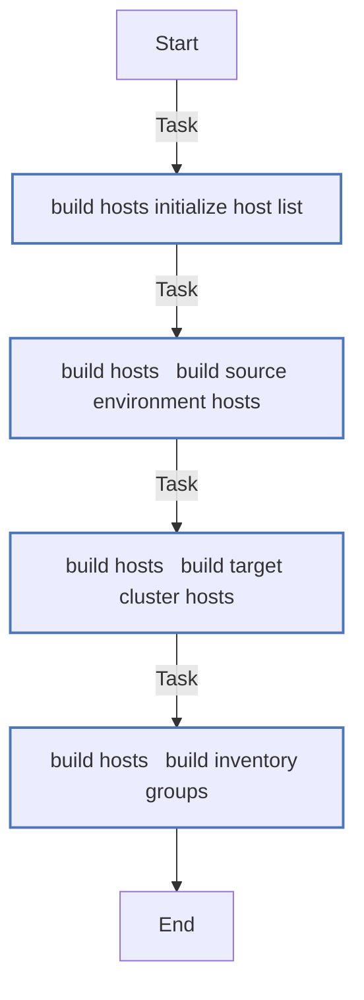
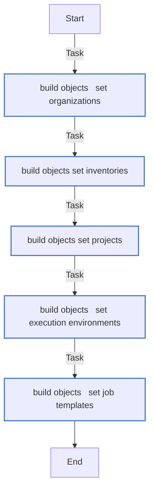
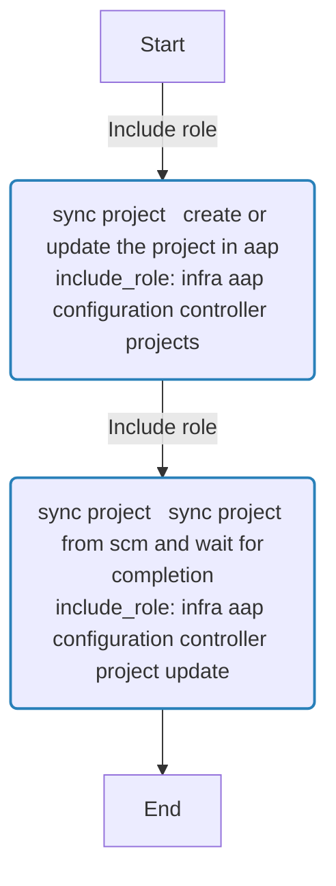
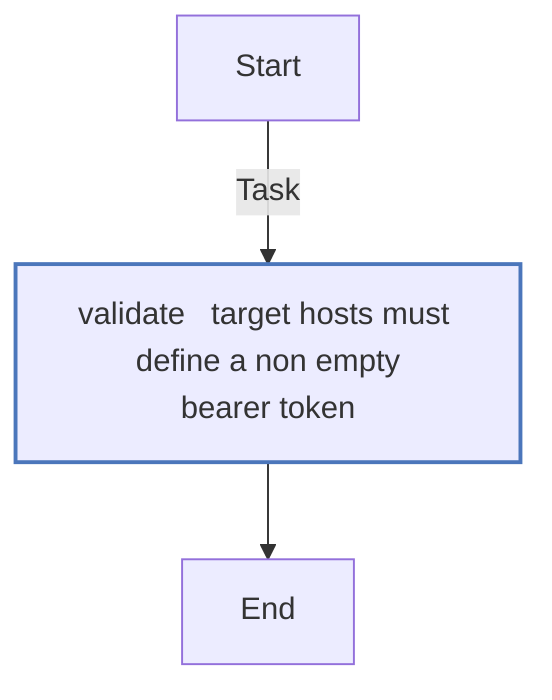

<!-- DOCSIBLE START -->
## aap_seed

```
Role belongs to infra/openshift_virtualization_migration
Namespace - infra
Collection - openshift_virtualization_migration
Version - 1.25.0
Repository - https://github.com/redhat-cop/openshift_virtualization_migration
```

Description: Seed AAP with Migration Factory Configuration as Code content

### Argument Specifications

<details>
<summary><b>🧩 Argument Specifications in `meta/argument_specs`</b></summary>

#### Key: main

* **Description**: ['Dynamically builds all AAP Configuration as Code objects from the Ansible inventory and role defaults, syncs the SCM project, and pushes everything to AAP via infra.aap_configuration.dispatch.', 'Object types managed include credential types, credentials, inventories, hosts, groups, projects, job templates, execution environments, and organizations.', 'Target cluster credentials use the built-in AAP credential type "OpenShift or Kubernetes API Bearer Token".', 'Each object type can be skipped with a C(_create) toggle or replaced entirely by overriding the corresponding C(aap_seed_controller_*) variable.']
* **Options**:
  * **aap_seed_controller_execution_environments**:
    * **Required**: False
    * **Type**: list
    * **Default**: []
    * **Description**: List of AAP execution environment definitions. Empty by default; populate to create custom EEs. Each entry follows the C(infra.aap_configuration.controller_execution_environments) schema (name, image, etc.).
  * **aap_seed_controller_inventories**:
    * **Required**: False
    * **Type**: list
    * **Default**: none
    * **Description**: List of AAP inventory definitions. Override to replace the default Migration Factory inventory.
  * **aap_seed_controller_organizations**:
    * **Required**: False
    * **Type**: list
    * **Default**: []
    * **Description**: List of AAP organization definitions. Empty by default; populate to create organizations before other objects. Each entry follows the C(infra.aap_configuration.gateway_organizations) schema.
  * **aap_seed_controller_projects**:
    * **Required**: False
    * **Type**: list
    * **Default**: none
    * **Description**: List of AAP project definitions. Override to replace the default SCM project.
  * **aap_seed_controller_templates**:
    * **Required**: False
    * **Type**: list
    * **Default**: none
    * **Description**: List of AAP job template definitions. Override to replace the default migrate template.
  * **aap_seed_credential_types_create**:
    * **Required**: False
    * **Type**: bool
    * **Default**: True
    * **Description**: Create the custom source credential type in AAP. Set to C(false) to skip.
  * **aap_seed_credentials_create**:
    * **Required**: False
    * **Type**: bool
    * **Default**: True
    * **Description**: Build and push credentials for source and target hosts. Set to C(false) to skip.
  * **aap_seed_execution_environment**:
    * **Required**: False
    * **Type**: str
    * **Default**: Default execution environment
    * **Description**: Execution environment assigned to job templates.
  * **aap_seed_execution_environments_create**:
    * **Required**: False
    * **Type**: bool
    * **Default**: True
    * **Description**: Create execution environments in AAP. Set to C(false) to skip.  Only applies when I(aap_seed_controller_execution_environments) is non-empty.
  * **aap_seed_git_password**:
    * **Required**: False
    * **Type**: str
    * **Default**:
    * **Description**: Git password or personal access token. Defaults to C(aap_git_password) from inventory.
  * **aap_seed_git_ssh_key**:
    * **Required**: False
    * **Type**: str
    * **Default**:
    * **Description**: SSH private key for Git authentication. Defaults to C(aap_git_ssh_key) from inventory.
  * **aap_seed_git_ssh_key_unlock**:
    * **Required**: False
    * **Type**: str
    * **Default**:
    * **Description**: Passphrase to unlock the SSH key. Defaults to C(aap_git_ssh_key_unlock) from inventory.
  * **aap_seed_git_username**:
    * **Required**: False
    * **Type**: str
    * **Default**:
    * **Description**: Git username for HTTPS authentication. Defaults to C(aap_git_username) from inventory.
  * **aap_seed_hostname**:
    * **Required**: False
    * **Type**: str
    * **Default**: none
    * **Description**: FQDN or URL of the AAP controller API endpoint. Defaults to C(aap_hostname) from inventory.
  * **aap_seed_hosts_create**:
    * **Required**: False
    * **Type**: bool
    * **Default**: True
    * **Description**: Build and push inventory hosts and groups from the Ansible inventory. Set to C(false) to skip.
  * **aap_seed_inventories_create**:
    * **Required**: False
    * **Type**: bool
    * **Default**: True
    * **Description**: Create the AAP inventory. Set to C(false) to skip.
  * **aap_seed_inventory_name**:
    * **Required**: False
    * **Type**: str
    * **Default**: OpenShift Virtualization Migration
    * **Description**: Name of the inventory created in AAP. Source and target hosts are added to this inventory.
  * **aap_seed_mtv_provider_playbook**:
    * **Required**: False
    * **Type**: str
    * **Default**: playbooks/vmf_mtv_provider.yml
    * **Description**: Playbook path for the MTV Provider job template.
  * **aap_seed_mtv_provider_template_name**:
    * **Required**: False
    * **Type**: str
    * **Default**: OpenShift Virtualization Migration - MTV Provider
    * **Description**: Name of the MTV Provider job template created in AAP.
  * **aap_seed_org_name**:
    * **Required**: False
    * **Type**: str
    * **Default**: Default
    * **Description**: AAP organization that owns the project, inventory, and credentials.
  * **aap_seed_organizations_create**:
    * **Required**: False
    * **Type**: bool
    * **Default**: True
    * **Description**: Create organizations in AAP. Set to C(false) to skip. Only applies when I(aap_seed_controller_organizations) is non-empty.
  * **aap_seed_password**:
    * **Required**: False
    * **Type**: str
    * **Default**: none
    * **Description**: Password for AAP controller authentication. Mutually exclusive with I(aap_seed_token). Defaults to C(aap_password) from inventory.
  * **aap_seed_project_credential**:
    * **Required**: False
    * **Type**: str
    * **Default**:
    * **Description**: Name of the Git credential to create and attach to the SCM project. Leave empty to skip. Defaults to C(aap_project_credential) from inventory.
  * **aap_seed_project_name**:
    * **Required**: False
    * **Type**: str
    * **Default**: OpenShift Virtualization Migration
    * **Description**: Name of the SCM-backed project created in AAP.
  * **aap_seed_project_scm_branch**:
    * **Required**: False
    * **Type**: str
    * **Default**: v2
    * **Description**: Git branch or tag to checkout for the project. Defaults to C(aap_project_scm_branch) from inventory.
  * **aap_seed_project_scm_url**:
    * **Required**: False
    * **Type**: str
    * **Default**: https://github.com/redhat-cop/openshift_virtualization_migration.git
    * **Description**: Git URL used as the project SCM source. Defaults to C(aap_project_scm_url) from inventory.
  * **aap_seed_project_sync_timeout**:
    * **Required**: False
    * **Type**: int
    * **Default**: 120
    * **Description**: Maximum seconds to wait for the SCM project sync to complete.
  * **aap_seed_projects_create**:
    * **Required**: False
    * **Type**: bool
    * **Default**: True
    * **Description**: Create and sync the SCM project. Set to C(false) to skip.
  * **aap_seed_secure_logging**:
    * **Required**: False
    * **Type**: bool
    * **Default**: True
    * **Description**: Suppress task output for credential loops to prevent secrets from leaking to logs.  Set to C(false) when debugging credential construction.
  * **aap_seed_source_credential_type**:
    * **Required**: False
    * **Type**: str
    * **Default**: Migration Factory - Source Environment
    * **Description**: Name of the custom credential type created in AAP for source hypervisor environments (vSphere, RHV).
  * **aap_seed_source_inventory_group**:
    * **Required**: False
    * **Type**: str
    * **Default**: vm_sources
    * **Description**: Ansible inventory group containing source hypervisor hosts. Each host in this group becomes an AAP inventory host and a source-environment credential.
  * **aap_seed_target_credential_type**:
    * **Required**: False
    * **Type**: str
    * **Default**: OpenShift or Kubernetes API Bearer Token
    * **Description**: AAP credential type used for target OpenShift clusters. Defaults to the built-in bearer token type. Each target host should set I(openshift_api_key) or I(openshift_temporary_api_key).
  * **aap_seed_target_inventory_group**:
    * **Required**: False
    * **Type**: str
    * **Default**: migration_clusters
    * **Description**: Ansible inventory group containing target OpenShift cluster hosts. Each host in this group becomes an AAP inventory host and a target-cluster credential.
  * **aap_seed_templates_create**:
    * **Required**: False
    * **Type**: bool
    * **Default**: True
    * **Description**: Create job templates. Set to C(false) to skip.
  * **aap_seed_token**:
    * **Required**: False
    * **Type**: str
    * **Default**: none
    * **Description**: OAuth token for AAP controller authentication. Mutually exclusive with I(aap_seed_username)/I(aap_seed_password). Defaults to C(aap_token) from inventory.
  * **aap_seed_username**:
    * **Required**: False
    * **Type**: str
    * **Default**: none
    * **Description**: Username for AAP controller authentication. Mutually exclusive with I(aap_seed_token). Defaults to C(aap_username) from inventory.
  * **aap_seed_validate_certs**:
    * **Required**: False
    * **Type**: bool
    * **Default**: True
    * **Description**: Whether to validate TLS certificates when connecting to AAP. Defaults to C(aap_validate_certs) from inventory, or C(true) if unset.

</details>

### Defaults

**These are static variables with lower priority**

#### File: defaults/main.yml

| Var          | Type         | Value       |Choices    |Required    | Title       |
|--------------|--------------|-------------|-------------|-------------|-------------|
| [`aap_seed_common_survey_spec`](defaults/main.yml#L142)   | dict   | `{}` |  None  |   False  |  Common Survey Spec |
| [`aap_seed_common_survey_spec.description`](defaults/main.yml#L144)   | str   | `` |  None  |   None  |  None |
| [`aap_seed_common_survey_spec.name`](defaults/main.yml#L143)   | str   | `` |  None  |   None  |  None |
| [`aap_seed_common_survey_spec.spec`](defaults/main.yml#L145)   | list   | `[]` |  None  |   None  |  None |
| [`aap_seed_common_survey_spec.spec.0`](defaults/main.yml#L146)   | dict   | `{}` |  None  |   None  |  None |
| [`aap_seed_common_survey_spec.spec.0.question_description`](defaults/main.yml#L147)   | str   | `<multiline value: folded_strip>` |  None  |   None  |  None |
| [`aap_seed_common_survey_spec.spec.0.question_name`](defaults/main.yml#L146)   | str   | `Source Name` |  None  |   None  |  None |
| [`aap_seed_common_survey_spec.spec.0.required`](defaults/main.yml#L153)   | bool   | `True` |  None  |   None  |  None |
| [`aap_seed_common_survey_spec.spec.0.type`](defaults/main.yml#L152)   | str   | `text` |  None  |   None  |  None |
| [`aap_seed_common_survey_spec.spec.0.variable`](defaults/main.yml#L151)   | str   | `source_name` |  None  |   None  |  None |
| [`aap_seed_common_survey_spec.spec.1`](defaults/main.yml#L154)   | dict   | `{}` |  None  |   None  |  None |
| [`aap_seed_common_survey_spec.spec.1.question_description`](defaults/main.yml#L155)   | str   | `<multiline value: folded_strip>` |  None  |   None  |  None |
| [`aap_seed_common_survey_spec.spec.1.question_name`](defaults/main.yml#L154)   | str   | `Target Name` |  None  |   None  |  None |
| [`aap_seed_common_survey_spec.spec.1.required`](defaults/main.yml#L161)   | bool   | `True` |  None  |   None  |  None |
| [`aap_seed_common_survey_spec.spec.1.type`](defaults/main.yml#L160)   | str   | `text` |  None  |   None  |  None |
| [`aap_seed_common_survey_spec.spec.1.variable`](defaults/main.yml#L159)   | str   | `target_name` |  None  |   None  |  None |
| [`aap_seed_controller_credential_types`](defaults/main.yml#L213)   | list   | `[]` |  None  |   False  |  Controller Credential Types |
| [`aap_seed_controller_credential_types.0`](defaults/main.yml#L214)   | dict   | `{}` |  None  |   None  |  None |
| [`aap_seed_controller_credential_types.0.injectors`](defaults/main.yml#L241)   | dict   | `{}` |  None  |   None  |  None |
| [`aap_seed_controller_credential_types.0.injectors.extra_vars`](defaults/main.yml#L242)   | dict   | `{}` |  None  |   None  |  None |
| [`aap_seed_controller_credential_types.0.injectors.extra_vars.mf_insecure_skip_tls_verify`](defaults/main.yml#L247)   | str   | `{  { insecure_skip_tls_verify }}` |  None  |   None  |  None |
| [`aap_seed_controller_credential_types.0.injectors.extra_vars.mf_source_certificate`](defaults/main.yml#L246)   | str   | `{  { certificate }}` |  None  |   None  |  None |
| [`aap_seed_controller_credential_types.0.injectors.extra_vars.mf_source_host`](defaults/main.yml#L243)   | str   | `{  { host }}` |  None  |   None  |  None |
| [`aap_seed_controller_credential_types.0.injectors.extra_vars.mf_source_password`](defaults/main.yml#L245)   | str   | `{  { password }}` |  None  |   None  |  None |
| [`aap_seed_controller_credential_types.0.injectors.extra_vars.mf_source_username`](defaults/main.yml#L244)   | str   | `{  { username }}` |  None  |   None  |  None |
| [`aap_seed_controller_credential_types.0.inputs`](defaults/main.yml#L217)   | dict   | `{}` |  None  |   None  |  None |
| [`aap_seed_controller_credential_types.0.inputs.fields`](defaults/main.yml#L218)   | list   | `[]` |  None  |   None  |  None |
| [`aap_seed_controller_credential_types.0.inputs.fields.0`](defaults/main.yml#L219)   | dict   | `{}` |  None  |   None  |  None |
| [`aap_seed_controller_credential_types.0.inputs.fields.0.id`](defaults/main.yml#L219)   | str   | `host` |  None  |   None  |  None |
| [`aap_seed_controller_credential_types.0.inputs.fields.0.label`](defaults/main.yml#L221)   | str   | `Hostname or IP` |  None  |   None  |  None |
| [`aap_seed_controller_credential_types.0.inputs.fields.0.type`](defaults/main.yml#L220)   | str   | `string` |  None  |   None  |  None |
| [`aap_seed_controller_credential_types.0.inputs.fields.1`](defaults/main.yml#L222)   | dict   | `{}` |  None  |   None  |  None |
| [`aap_seed_controller_credential_types.0.inputs.fields.1.id`](defaults/main.yml#L222)   | str   | `username` |  None  |   None  |  None |
| [`aap_seed_controller_credential_types.0.inputs.fields.1.label`](defaults/main.yml#L224)   | str   | `Username` |  None  |   None  |  None |
| [`aap_seed_controller_credential_types.0.inputs.fields.1.type`](defaults/main.yml#L223)   | str   | `string` |  None  |   None  |  None |
| [`aap_seed_controller_credential_types.0.inputs.fields.2`](defaults/main.yml#L225)   | dict   | `{}` |  None  |   None  |  None |
| [`aap_seed_controller_credential_types.0.inputs.fields.2.id`](defaults/main.yml#L225)   | str   | `password` |  None  |   None  |  None |
| [`aap_seed_controller_credential_types.0.inputs.fields.2.label`](defaults/main.yml#L227)   | str   | `Password` |  None  |   None  |  None |
| [`aap_seed_controller_credential_types.0.inputs.fields.2.secret`](defaults/main.yml#L228)   | bool   | `True` |  None  |   None  |  None |
| [`aap_seed_controller_credential_types.0.inputs.fields.2.type`](defaults/main.yml#L226)   | str   | `string` |  None  |   None  |  None |
| [`aap_seed_controller_credential_types.0.inputs.fields.3`](defaults/main.yml#L229)   | dict   | `{}` |  None  |   None  |  None |
| [`aap_seed_controller_credential_types.0.inputs.fields.3.id`](defaults/main.yml#L229)   | str   | `certificate` |  None  |   None  |  None |
| [`aap_seed_controller_credential_types.0.inputs.fields.3.label`](defaults/main.yml#L231)   | str   | `SSL/TLS CA Certificate` |  None  |   None  |  None |
| [`aap_seed_controller_credential_types.0.inputs.fields.3.multiline`](defaults/main.yml#L232)   | bool   | `True` |  None  |   None  |  None |
| [`aap_seed_controller_credential_types.0.inputs.fields.3.secret`](defaults/main.yml#L233)   | bool   | `True` |  None  |   None  |  None |
| [`aap_seed_controller_credential_types.0.inputs.fields.3.type`](defaults/main.yml#L230)   | str   | `string` |  None  |   None  |  None |
| [`aap_seed_controller_credential_types.0.inputs.fields.4`](defaults/main.yml#L234)   | dict   | `{}` |  None  |   None  |  None |
| [`aap_seed_controller_credential_types.0.inputs.fields.4.id`](defaults/main.yml#L234)   | str   | `insecure_skip_tls_verify` |  None  |   None  |  None |
| [`aap_seed_controller_credential_types.0.inputs.fields.4.label`](defaults/main.yml#L236)   | str   | `Insecure Skip TLS Verify` |  None  |   None  |  None |
| [`aap_seed_controller_credential_types.0.inputs.fields.4.type`](defaults/main.yml#L235)   | str   | `boolean` |  None  |   None  |  None |
| [`aap_seed_controller_credential_types.0.inputs.required`](defaults/main.yml#L237)   | list   | `[]` |  None  |   None  |  None |
| [`aap_seed_controller_credential_types.0.inputs.required.0`](defaults/main.yml#L238)   | str   | `host` |  None  |   None  |  None |
| [`aap_seed_controller_credential_types.0.inputs.required.1`](defaults/main.yml#L239)   | str   | `username` |  None  |   None  |  None |
| [`aap_seed_controller_credential_types.0.inputs.required.2`](defaults/main.yml#L240)   | str   | `password` |  None  |   None  |  None |
| [`aap_seed_controller_credential_types.0.kind`](defaults/main.yml#L216)   | str   | `cloud` |  None  |   None  |  None |
| [`aap_seed_controller_credential_types.0.name`](defaults/main.yml#L214)   | str   | `{{ aap_seed_source_credential_type }}` |  None  |   None  |  None |
| [`aap_seed_controller_credential_types.0.organization`](defaults/main.yml#L215)   | str   | `{{ aap_seed_org_name }}` |  None  |   None  |  None |
| [`aap_seed_controller_execution_environments`](defaults/main.yml#L273)   | list   | `[]` |  None  |   False  |  Controller Execution Environments |
| [`aap_seed_controller_inventories`](defaults/main.yml#L252)   | list   | `[]` |  None  |   False  |  Controller Inventories |
| [`aap_seed_controller_inventories.0`](defaults/main.yml#L253)   | dict   | `{}` |  None  |   None  |  None |
| [`aap_seed_controller_inventories.0.name`](defaults/main.yml#L253)   | str   | `{{ aap_seed_inventory_name }}` |  None  |   None  |  None |
| [`aap_seed_controller_inventories.0.organization`](defaults/main.yml#L254)   | str   | `{{ aap_seed_org_name }}` |  None  |   None  |  None |
| [`aap_seed_controller_organizations`](defaults/main.yml#L206)   | list   | `[]` |  None  |   False  |  Controller Organizations |
| [`aap_seed_controller_projects`](defaults/main.yml#L259)   | list   | `[]` |  None  |   False  |  Controller Projects |
| [`aap_seed_controller_projects.0`](defaults/main.yml#L260)   | dict   | `{}` |  None  |   None  |  None |
| [`aap_seed_controller_projects.0.credential`](defaults/main.yml#L266)   | str   | `{{ aap_seed_project_credential ¦ default(omit, true) }}` |  None  |   None  |  None |
| [`aap_seed_controller_projects.0.name`](defaults/main.yml#L260)   | str   | `{{ aap_seed_project_name }}` |  None  |   None  |  None |
| [`aap_seed_controller_projects.0.organization`](defaults/main.yml#L261)   | str   | `{{ aap_seed_org_name }}` |  None  |   None  |  None |
| [`aap_seed_controller_projects.0.scm_branch`](defaults/main.yml#L264)   | str   | `{{ aap_seed_project_scm_branch }}` |  None  |   None  |  None |
| [`aap_seed_controller_projects.0.scm_type`](defaults/main.yml#L262)   | str   | `git` |  None  |   None  |  None |
| [`aap_seed_controller_projects.0.scm_update_on_launch`](defaults/main.yml#L265)   | bool   | `True` |  None  |   None  |  None |
| [`aap_seed_controller_projects.0.scm_url`](defaults/main.yml#L263)   | str   | `{{ aap_seed_project_scm_url }}` |  None  |   None  |  None |
| [`aap_seed_controller_templates`](defaults/main.yml#L280)   | list   | `[]` |  None  |   False  |  Controller Templates |
| [`aap_seed_controller_templates.0`](defaults/main.yml#L281)   | dict   | `{}` |  None  |   None  |  None |
| [`aap_seed_controller_templates.0.ask_credential_on_launch`](defaults/main.yml#L287)   | bool   | `True` |  None  |   None  |  None |
| [`aap_seed_controller_templates.0.ask_variables_on_launch`](defaults/main.yml#L288)   | bool   | `True` |  None  |   None  |  None |
| [`aap_seed_controller_templates.0.execution_environment`](defaults/main.yml#L286)   | str   | `{{ aap_seed_execution_environment }}` |  None  |   None  |  None |
| [`aap_seed_controller_templates.0.inventory`](defaults/main.yml#L285)   | str   | `{{ aap_seed_inventory_name }}` |  None  |   None  |  None |
| [`aap_seed_controller_templates.0.name`](defaults/main.yml#L281)   | str   | `{{ aap_seed_migrate_template_name }}` |  None  |   None  |  None |
| [`aap_seed_controller_templates.0.organization`](defaults/main.yml#L282)   | str   | `{{ aap_seed_org_name }}` |  None  |   None  |  None |
| [`aap_seed_controller_templates.0.playbook`](defaults/main.yml#L284)   | str   | `{{ aap_seed_migrate_playbook }}` |  None  |   None  |  None |
| [`aap_seed_controller_templates.0.project`](defaults/main.yml#L283)   | str   | `{{ aap_seed_project_name }}` |  None  |   None  |  None |
| [`aap_seed_controller_templates.0.survey_enabled`](defaults/main.yml#L290)   | bool   | `True` |  None  |   None  |  None |
| [`aap_seed_controller_templates.0.survey_spec`](defaults/main.yml#L291)   | str   | `{{ aap_seed_common_survey_spec }}` |  None  |   None  |  None |
| [`aap_seed_controller_templates.0.verbosity`](defaults/main.yml#L289)   | int   | `0` |  None  |   None  |  None |
| [`aap_seed_controller_templates.1`](defaults/main.yml#L292)   | dict   | `{}` |  None  |   None  |  None |
| [`aap_seed_controller_templates.1.ask_credential_on_launch`](defaults/main.yml#L298)   | bool   | `True` |  None  |   None  |  None |
| [`aap_seed_controller_templates.1.ask_variables_on_launch`](defaults/main.yml#L299)   | bool   | `True` |  None  |   None  |  None |
| [`aap_seed_controller_templates.1.execution_environment`](defaults/main.yml#L297)   | str   | `{{ aap_seed_execution_environment }}` |  None  |   None  |  None |
| [`aap_seed_controller_templates.1.inventory`](defaults/main.yml#L296)   | str   | `{{ aap_seed_inventory_name }}` |  None  |   None  |  None |
| [`aap_seed_controller_templates.1.name`](defaults/main.yml#L292)   | str   | `{{ aap_seed_mtv_provider_template_name }}` |  None  |   None  |  None |
| [`aap_seed_controller_templates.1.organization`](defaults/main.yml#L293)   | str   | `{{ aap_seed_org_name }}` |  None  |   None  |  None |
| [`aap_seed_controller_templates.1.playbook`](defaults/main.yml#L295)   | str   | `{{ aap_seed_mtv_provider_playbook }}` |  None  |   None  |  None |
| [`aap_seed_controller_templates.1.project`](defaults/main.yml#L294)   | str   | `{{ aap_seed_project_name }}` |  None  |   None  |  None |
| [`aap_seed_controller_templates.1.survey_enabled`](defaults/main.yml#L301)   | bool   | `True` |  None  |   None  |  None |
| [`aap_seed_controller_templates.1.survey_spec`](defaults/main.yml#L302)   | str   | `{{ aap_seed_common_survey_spec }}` |  None  |   None  |  None |
| [`aap_seed_controller_templates.1.verbosity`](defaults/main.yml#L300)   | int   | `0` |  None  |   None  |  None |
| [`aap_seed_credential_types_create`](defaults/main.yml#L171)   | bool   | `True` |  None  |   False  |  Create Credential Types |
| [`aap_seed_credentials_create`](defaults/main.yml#L176)   | bool   | `True` |  None  |   False  |  Create Credentials |
| [`aap_seed_execution_environment`](defaults/main.yml#L70)   | str   | `{{ aap_execution_environment ¦ default('Default execution environment') }}` |  None  |   False  |  Execution Environment |
| [`aap_seed_execution_environments_create`](defaults/main.yml#L196)   | bool   | `True` |  None  |   False  |  Create Execution Environments |
| [`aap_seed_git_password`](defaults/main.yml#L105)   | str   | `{{ aap_git_password ¦ default('') }}` |  None  |   False  |  Git Password |
| [`aap_seed_git_ssh_key`](defaults/main.yml#L110)   | str   | `{{ aap_git_ssh_key ¦ default('') }}` |  None  |   False  |  Git SSH Key |
| [`aap_seed_git_ssh_key_unlock`](defaults/main.yml#L115)   | str   | `{{ aap_git_ssh_key_unlock ¦ default('') }}` |  None  |   False  |  Git SSH Key Unlock |
| [`aap_seed_git_username`](defaults/main.yml#L100)   | str   | `{{ aap_git_username ¦ default('') }}` |  None  |   False  |  Git Username |
| [`aap_seed_hostname`](defaults/main.yml#L6)   | str   | `{{ aap_hostname }}` |  None  |   True  |  AAP Hostname |
| [`aap_seed_hosts_create`](defaults/main.yml#L186)   | bool   | `True` |  None  |   False  |  Create Hosts |
| [`aap_seed_inventories_create`](defaults/main.yml#L181)   | bool   | `True` |  None  |   False  |  Create Inventories |
| [`aap_seed_inventory_name`](defaults/main.yml#L65)   | str   | `OpenShift Virtualization Migration` |  None  |   False  |  Inventory Name |
| [`aap_seed_migrate_playbook`](defaults/main.yml#L125)   | str   | `playbooks/vmf_migrate.yml` |  None  |   False  |  Migrate Playbook |
| [`aap_seed_migrate_template_name`](defaults/main.yml#L120)   | str   | `OpenShift Virtualization Migration - Migrate` |  None  |   False  |  Migrate Template Name |
| [`aap_seed_mtv_provider_playbook`](defaults/main.yml#L135)   | str   | `playbooks/vmf_mtv_provider.yml` |  None  |   False  |  MTV Provider Playbook |
| [`aap_seed_mtv_provider_template_name`](defaults/main.yml#L130)   | str   | `OpenShift Virtualization Migration - MTV Provider` |  None  |   False  |  MTV Provider Template Name |
| [`aap_seed_org_name`](defaults/main.yml#L38)   | str   | `Default` |  None  |   False  |  Organization Name |
| [`aap_seed_organizations_create`](defaults/main.yml#L166)   | bool   | `True` |  None  |   False  |  Create Organizations |
| [`aap_seed_password`](defaults/main.yml#L16)   | str   | `{{ aap_password ¦ default(omit) }}` |  None  |   False  |  AAP Password |
| [`aap_seed_project_credential`](defaults/main.yml#L95)   | str   | `{{ aap_project_credential ¦ default('') }}` |  None  |   False  |  Project Credential |
| [`aap_seed_project_name`](defaults/main.yml#L43)   | str   | `OpenShift Virtualization Migration` |  None  |   False  |  Project Name |
| [`aap_seed_project_scm_branch`](defaults/main.yml#L55)   | str   | `{{ aap_project_scm_branch ¦ default('v2') }}` |  None  |   False  |  Project SCM Branch |
| [`aap_seed_project_scm_url`](defaults/main.yml#L48)   | str   | `<multiline value: folded_strip>` |  None  |   False  |  Project SCM URL |
| [`aap_seed_project_sync_timeout`](defaults/main.yml#L60)   | int   | `120` |  None  |   False  |  Project Sync Timeout |
| [`aap_seed_projects_create`](defaults/main.yml#L191)   | bool   | `True` |  None  |   False  |  Create Projects |
| [`aap_seed_secure_logging`](defaults/main.yml#L33)   | bool   | `True` |  None  |   False  |  Secure Logging |
| [`aap_seed_source_credential_type`](defaults/main.yml#L75)   | str   | `Migration Factory - Source Environment` |  None  |   False  |  Source Credential Type |
| [`aap_seed_source_inventory_group`](defaults/main.yml#L85)   | str   | `vm_sources` |  None  |   False  |  Source Inventory Group |
| [`aap_seed_target_credential_type`](defaults/main.yml#L80)   | str   | `OpenShift or Kubernetes API Bearer Token` |  None  |   False  |  Target Credential Type |
| [`aap_seed_target_inventory_group`](defaults/main.yml#L90)   | str   | `migration_clusters` |  None  |   False  |  Target Inventory Group |
| [`aap_seed_templates_create`](defaults/main.yml#L201)   | bool   | `True` |  None  |   False  |  Create Templates |
| [`aap_seed_token`](defaults/main.yml#L21)   | str   | `{{ aap_token ¦ default(omit) }}` |  None  |   False  |  AAP Token |
| [`aap_seed_username`](defaults/main.yml#L11)   | str   | `{{ aap_username ¦ default(omit) }}` |  None  |   False  |  AAP Username |
| [`aap_seed_validate_certs`](defaults/main.yml#L26)   | str   | `{{ aap_validate_certs ¦ default(true) }}` |  None  |   False  |  Validate Certificates |

<summary><b>🖇️ Full descriptions for vars in defaults/main.yml</b></summary>
<br>
<b>`aap_seed_common_survey_spec`:</b> >-
<br>
<b>`aap_seed_common_survey_spec.description`:</b> None
<br>
<b>`aap_seed_common_survey_spec.name`:</b> None
<br>
<b>`aap_seed_common_survey_spec.spec`:</b> None
<br>
<b>`aap_seed_common_survey_spec.spec.0`:</b> None
<br>
<b>`aap_seed_common_survey_spec.spec.0.question_description`:</b> None
<br>
<b>`aap_seed_common_survey_spec.spec.0.question_name`:</b> None
<br>
<b>`aap_seed_common_survey_spec.spec.0.required`:</b> None
<br>
<b>`aap_seed_common_survey_spec.spec.0.type`:</b> None
<br>
<b>`aap_seed_common_survey_spec.spec.0.variable`:</b> None
<br>
<b>`aap_seed_common_survey_spec.spec.1`:</b> None
<br>
<b>`aap_seed_common_survey_spec.spec.1.question_description`:</b> None
<br>
<b>`aap_seed_common_survey_spec.spec.1.question_name`:</b> None
<br>
<b>`aap_seed_common_survey_spec.spec.1.required`:</b> None
<br>
<b>`aap_seed_common_survey_spec.spec.1.type`:</b> None
<br>
<b>`aap_seed_common_survey_spec.spec.1.variable`:</b> None
<br>
<b>`aap_seed_controller_credential_types`:</b> >-
<br>
<b>`aap_seed_controller_credential_types.0`:</b> None
<br>
<b>`aap_seed_controller_credential_types.0.injectors`:</b> None
<br>
<b>`aap_seed_controller_credential_types.0.injectors.extra_vars`:</b> None
<br>
<b>`aap_seed_controller_credential_types.0.injectors.extra_vars.mf_insecure_skip_tls_verify`:</b> None
<br>
<b>`aap_seed_controller_credential_types.0.injectors.extra_vars.mf_source_certificate`:</b> None
<br>
<b>`aap_seed_controller_credential_types.0.injectors.extra_vars.mf_source_host`:</b> None
<br>
<b>`aap_seed_controller_credential_types.0.injectors.extra_vars.mf_source_password`:</b> None
<br>
<b>`aap_seed_controller_credential_types.0.injectors.extra_vars.mf_source_username`:</b> None
<br>
<b>`aap_seed_controller_credential_types.0.inputs`:</b> None
<br>
<b>`aap_seed_controller_credential_types.0.inputs.fields`:</b> None
<br>
<b>`aap_seed_controller_credential_types.0.inputs.fields.0`:</b> None
<br>
<b>`aap_seed_controller_credential_types.0.inputs.fields.0.id`:</b> None
<br>
<b>`aap_seed_controller_credential_types.0.inputs.fields.0.label`:</b> None
<br>
<b>`aap_seed_controller_credential_types.0.inputs.fields.0.type`:</b> None
<br>
<b>`aap_seed_controller_credential_types.0.inputs.fields.1`:</b> None
<br>
<b>`aap_seed_controller_credential_types.0.inputs.fields.1.id`:</b> None
<br>
<b>`aap_seed_controller_credential_types.0.inputs.fields.1.label`:</b> None
<br>
<b>`aap_seed_controller_credential_types.0.inputs.fields.1.type`:</b> None
<br>
<b>`aap_seed_controller_credential_types.0.inputs.fields.2`:</b> None
<br>
<b>`aap_seed_controller_credential_types.0.inputs.fields.2.id`:</b> None
<br>
<b>`aap_seed_controller_credential_types.0.inputs.fields.2.label`:</b> None
<br>
<b>`aap_seed_controller_credential_types.0.inputs.fields.2.secret`:</b> None
<br>
<b>`aap_seed_controller_credential_types.0.inputs.fields.2.type`:</b> None
<br>
<b>`aap_seed_controller_credential_types.0.inputs.fields.3`:</b> None
<br>
<b>`aap_seed_controller_credential_types.0.inputs.fields.3.id`:</b> None
<br>
<b>`aap_seed_controller_credential_types.0.inputs.fields.3.label`:</b> None
<br>
<b>`aap_seed_controller_credential_types.0.inputs.fields.3.multiline`:</b> None
<br>
<b>`aap_seed_controller_credential_types.0.inputs.fields.3.secret`:</b> None
<br>
<b>`aap_seed_controller_credential_types.0.inputs.fields.3.type`:</b> None
<br>
<b>`aap_seed_controller_credential_types.0.inputs.fields.4`:</b> None
<br>
<b>`aap_seed_controller_credential_types.0.inputs.fields.4.id`:</b> None
<br>
<b>`aap_seed_controller_credential_types.0.inputs.fields.4.label`:</b> None
<br>
<b>`aap_seed_controller_credential_types.0.inputs.fields.4.type`:</b> None
<br>
<b>`aap_seed_controller_credential_types.0.inputs.required`:</b> None
<br>
<b>`aap_seed_controller_credential_types.0.inputs.required.0`:</b> None
<br>
<b>`aap_seed_controller_credential_types.0.inputs.required.1`:</b> None
<br>
<b>`aap_seed_controller_credential_types.0.inputs.required.2`:</b> None
<br>
<b>`aap_seed_controller_credential_types.0.kind`:</b> None
<br>
<b>`aap_seed_controller_credential_types.0.name`:</b> None
<br>
<b>`aap_seed_controller_credential_types.0.organization`:</b> None
<br>
<b>`aap_seed_controller_execution_environments`:</b> >-
<br>
<b>`aap_seed_controller_inventories`:</b> List of AAP inventory definitions.
<br>
<b>`aap_seed_controller_inventories.0`:</b> None
<br>
<b>`aap_seed_controller_inventories.0.name`:</b> None
<br>
<b>`aap_seed_controller_inventories.0.organization`:</b> None
<br>
<b>`aap_seed_controller_organizations`:</b> List of AAP organization definitions.
<br>
<b>`aap_seed_controller_projects`:</b> List of AAP project definitions.
<br>
<b>`aap_seed_controller_projects.0`:</b> None
<br>
<b>`aap_seed_controller_projects.0.credential`:</b> None
<br>
<b>`aap_seed_controller_projects.0.name`:</b> None
<br>
<b>`aap_seed_controller_projects.0.organization`:</b> None
<br>
<b>`aap_seed_controller_projects.0.scm_branch`:</b> None
<br>
<b>`aap_seed_controller_projects.0.scm_type`:</b> None
<br>
<b>`aap_seed_controller_projects.0.scm_update_on_launch`:</b> None
<br>
<b>`aap_seed_controller_projects.0.scm_url`:</b> None
<br>
<b>`aap_seed_controller_templates`:</b> >-
<br>
<b>`aap_seed_controller_templates.0`:</b> None
<br>
<b>`aap_seed_controller_templates.0.ask_credential_on_launch`:</b> None
<br>
<b>`aap_seed_controller_templates.0.ask_variables_on_launch`:</b> None
<br>
<b>`aap_seed_controller_templates.0.execution_environment`:</b> None
<br>
<b>`aap_seed_controller_templates.0.inventory`:</b> None
<br>
<b>`aap_seed_controller_templates.0.name`:</b> None
<br>
<b>`aap_seed_controller_templates.0.organization`:</b> None
<br>
<b>`aap_seed_controller_templates.0.playbook`:</b> None
<br>
<b>`aap_seed_controller_templates.0.project`:</b> None
<br>
<b>`aap_seed_controller_templates.0.survey_enabled`:</b> None
<br>
<b>`aap_seed_controller_templates.0.survey_spec`:</b> None
<br>
<b>`aap_seed_controller_templates.0.verbosity`:</b> None
<br>
<b>`aap_seed_controller_templates.1`:</b> None
<br>
<b>`aap_seed_controller_templates.1.ask_credential_on_launch`:</b> None
<br>
<b>`aap_seed_controller_templates.1.ask_variables_on_launch`:</b> None
<br>
<b>`aap_seed_controller_templates.1.execution_environment`:</b> None
<br>
<b>`aap_seed_controller_templates.1.inventory`:</b> None
<br>
<b>`aap_seed_controller_templates.1.name`:</b> None
<br>
<b>`aap_seed_controller_templates.1.organization`:</b> None
<br>
<b>`aap_seed_controller_templates.1.playbook`:</b> None
<br>
<b>`aap_seed_controller_templates.1.project`:</b> None
<br>
<b>`aap_seed_controller_templates.1.survey_enabled`:</b> None
<br>
<b>`aap_seed_controller_templates.1.survey_spec`:</b> None
<br>
<b>`aap_seed_controller_templates.1.verbosity`:</b> None
<br>
<b>`aap_seed_credential_types_create`:</b> Whether to create custom credential type objects in AAP.
<br>
<b>`aap_seed_credentials_create`:</b> Whether to create credential objects in AAP.
<br>
<b>`aap_seed_execution_environment`:</b> Execution environment assigned to job templates. Cascades from aap_execution_environment.
<br>
<b>`aap_seed_execution_environments_create`:</b> Whether to create execution environment objects in AAP.
<br>
<b>`aap_seed_git_password`:</b> Password or token for Git authentication (HTTPS). Cascades from aap_git_password.
<br>
<b>`aap_seed_git_ssh_key`:</b> SSH private key for Git authentication. Cascades from aap_git_ssh_key.
<br>
<b>`aap_seed_git_ssh_key_unlock`:</b> Passphrase to unlock the SSH key. Cascades from aap_git_ssh_key_unlock.
<br>
<b>`aap_seed_git_username`:</b> Username for Git authentication (HTTPS). Cascades from aap_git_username.
<br>
<b>`aap_seed_hostname`:</b> Hostname of the AAP instance. Cascades from aap_hostname inventory variable.
<br>
<b>`aap_seed_hosts_create`:</b> Whether to create host objects in AAP.
<br>
<b>`aap_seed_inventories_create`:</b> Whether to create inventory objects in AAP.
<br>
<b>`aap_seed_inventory_name`:</b> Name of the AAP inventory created for migration hosts.
<br>
<b>`aap_seed_migrate_playbook`:</b> Playbook path for the migration job template.
<br>
<b>`aap_seed_migrate_template_name`:</b> Name of the migration job template created in AAP.
<br>
<b>`aap_seed_mtv_provider_playbook`:</b> Playbook path for the MTV provider job template.
<br>
<b>`aap_seed_mtv_provider_template_name`:</b> Name of the MTV provider job template created in AAP.
<br>
<b>`aap_seed_org_name`:</b> AAP organization name used for all created objects.
<br>
<b>`aap_seed_organizations_create`:</b> Whether to create organization objects in AAP.
<br>
<b>`aap_seed_password`:</b> Password for AAP authentication. Cascades from aap_password inventory variable.
<br>
<b>`aap_seed_project_credential`:</b> Name of the Git credential to attach to the AAP project. Leave empty to skip.
<br>
<b>`aap_seed_project_name`:</b> Name of the AAP project created for the migration collection.
<br>
<b>`aap_seed_project_scm_branch`:</b> Git branch for the AAP project. Cascades from aap_project_scm_branch.
<br>
<b>`aap_seed_project_scm_url`:</b> Git repository URL for the AAP project. Cascades from aap_project_scm_url.
<br>
<b>`aap_seed_project_sync_timeout`:</b> Timeout in seconds for AAP project sync operations.
<br>
<b>`aap_seed_projects_create`:</b> Whether to create project objects in AAP.
<br>
<b>`aap_seed_secure_logging`:</b> >-
<br>
<b>`aap_seed_source_credential_type`:</b> Name of the custom credential type created for source hypervisor environments.
<br>
<b>`aap_seed_source_inventory_group`:</b> AAP inventory group name containing source hypervisor hosts.
<br>
<b>`aap_seed_target_credential_type`:</b> Name of the built-in credential type used for OpenShift target clusters.
<br>
<b>`aap_seed_target_inventory_group`:</b> AAP inventory group name containing target OpenShift cluster hosts.
<br>
<b>`aap_seed_templates_create`:</b> Whether to create job template objects in AAP.
<br>
<b>`aap_seed_token`:</b> OAuth token for AAP authentication. Cascades from aap_token inventory variable.
<br>
<b>`aap_seed_username`:</b> Username for AAP authentication. Cascades from aap_username inventory variable.
<br>
<b>`aap_seed_validate_certs`:</b> Whether to validate TLS certificates for AAP connections.
<br>
<br>

### Tasks

#### File: tasks/main.yml

| Name | Module | Has Conditions |
| ---- | ------ | --------- |
| Seed AAP with Migration Factory content | `block` | False |
| Build simple AAP objects from defaults | `ansible.builtin.include_tasks` | False |
| Validate inventory host variables | `ansible.builtin.include_tasks` | False |
| Build credentials from inventory | `ansible.builtin.include_tasks` | False |
| Build hosts and groups from inventory | `ansible.builtin.include_tasks` | True |
| Create project and sync from SCM | `block` | True |
| Sync SCM project | `ansible.builtin.include_tasks` | False |
| Copy aap_seed_controller_* to controller_* for dispatch | `ansible.builtin.set_fact` | False |
| Push CaC content to AAP | `ansible.builtin.include_role` | False |

#### File: tasks/build_credentials.yml

| Name | Module | Has Conditions |
| ---- | ------ | --------- |
| build_credentials ¦ Apply credential type toggle | `ansible.builtin.set_fact` | False |
| build_credentials ¦ Initialize credential list | `ansible.builtin.set_fact` | True |
| build_credentials ¦ Build source environment credentials | `ansible.builtin.set_fact` | True |
| build_credentials ¦ Build target cluster credentials | `ansible.builtin.set_fact` | True |
| build_credentials ¦ Build Git credential for SCM project | `ansible.builtin.set_fact` | True |
| build_credentials ¦ Disable credentials when toggle is off | `ansible.builtin.set_fact` | True |

#### File: tasks/build_hosts.yml

| Name | Module | Has Conditions |
| ---- | ------ | --------- |
| build_hosts ¦ Initialize host list | `ansible.builtin.set_fact` | False |
| build_hosts ¦ Build source environment hosts | `ansible.builtin.set_fact` | False |
| build_hosts ¦ Build target cluster hosts | `ansible.builtin.set_fact` | False |
| build_hosts ¦ Build inventory groups | `ansible.builtin.set_fact` | False |

#### File: tasks/build_objects.yml

| Name | Module | Has Conditions |
| ---- | ------ | --------- |
| build_objects ¦ Set organizations | `ansible.builtin.set_fact` | False |
| build_objects ¦ Set inventories | `ansible.builtin.set_fact` | False |
| build_objects ¦ Set projects | `ansible.builtin.set_fact` | False |
| build_objects ¦ Set execution environments | `ansible.builtin.set_fact` | False |
| build_objects ¦ Set job templates | `ansible.builtin.set_fact` | False |

#### File: tasks/sync_project.yml

| Name | Module | Has Conditions |
| ---- | ------ | --------- |
| sync_project ¦ Create or update the project in AAP | `ansible.builtin.include_role` | False |
| sync_project ¦ Sync project from SCM and wait for completion | `ansible.builtin.include_role` | False |

#### File: tasks/validate.yml

| Name | Module | Has Conditions |
| ---- | ------ | --------- |
| validate ¦ Target hosts must define a non-empty bearer token | `ansible.builtin.assert` | False |

## Task Flow Graphs

### Graph for build_credentials.yml

```mermaid
flowchart TD
Start
classDef block stroke:#3498db,stroke-width:2px;
classDef task stroke:#4b76bb,stroke-width:2px;
classDef includeTasks stroke:#16a085,stroke-width:2px;
classDef importTasks stroke:#34495e,stroke-width:2px;
classDef includeRole stroke:#2980b9,stroke-width:2px;
classDef importRole stroke:#699ba7,stroke-width:2px;
classDef includeVars stroke:#8e44ad,stroke-width:2px;
classDef rescue stroke:#665352,stroke-width:2px;

  Start-->|Task| build_credentials___Apply_credential_type_toggle0[build credentials   apply credential type toggle]:::task
  build_credentials___Apply_credential_type_toggle0-->|Task| build_credentials___Initialize_credential_list1[build credentials   initialize credential list<br>When: **aap seed credentials create   bool**]:::task
  build_credentials___Initialize_credential_list1-->|Task| build_credentials___Build_source_environment_credentials2[build credentials   build source environment<br>credentials<br>When: **aap seed credentials create   bool**]:::task
  build_credentials___Build_source_environment_credentials2-->|Task| build_credentials___Build_target_cluster_credentials3[build credentials   build target cluster<br>credentials<br>When: **aap seed credentials create   bool**]:::task
  build_credentials___Build_target_cluster_credentials3-->|Task| build_credentials___Build_Git_credential_for_SCM_project4[build credentials   build git credential for scm<br>project<br>When: **aap seed credentials create   bool and aap seed<br>project credential   default     true    length  <br>0**]:::task
  build_credentials___Build_Git_credential_for_SCM_project4-->|Task| build_credentials___Disable_credentials_when_toggle_is_off5[build credentials   disable credentials when<br>toggle is off<br>When: **not  aap seed credentials create   bool**]:::task
  build_credentials___Disable_credentials_when_toggle_is_off5-->End
```



### Graph for build_hosts.yml



### Graph for build_objects.yml



### Graph for main.yml

```mermaid
flowchart TD
Start
classDef block stroke:#3498db,stroke-width:2px;
classDef task stroke:#4b76bb,stroke-width:2px;
classDef includeTasks stroke:#16a085,stroke-width:2px;
classDef importTasks stroke:#34495e,stroke-width:2px;
classDef includeRole stroke:#2980b9,stroke-width:2px;
classDef importRole stroke:#699ba7,stroke-width:2px;
classDef includeVars stroke:#8e44ad,stroke-width:2px;
classDef rescue stroke:#665352,stroke-width:2px;

  Start-->|Block Start| Seed_AAP_with_Migration_Factory_content0_block_start_0[[seed aap with migration factory content]]:::block
  Seed_AAP_with_Migration_Factory_content0_block_start_0-->|Include task| Build_simple_AAP_objects_from_defaults_build_objects_yml_0[build simple aap objects from defaults<br>include_task: build objects yml]:::includeTasks
  Build_simple_AAP_objects_from_defaults_build_objects_yml_0-->|Include task| Validate_inventory_host_variables_validate_yml_1[validate inventory host variables<br>include_task: validate yml]:::includeTasks
  Validate_inventory_host_variables_validate_yml_1-->|Include task| Build_credentials_from_inventory_build_credentials_yml_2[build credentials from inventory<br>include_task: build credentials yml]:::includeTasks
  Build_credentials_from_inventory_build_credentials_yml_2-->|Include task| Build_hosts_and_groups_from_inventory_build_hosts_yml_3[build hosts and groups from inventory<br>When: **aap seed hosts create   bool**<br>include_task: build hosts yml]:::includeTasks
  Build_hosts_and_groups_from_inventory_build_hosts_yml_3-->|Block Start| Create_project_and_sync_from_SCM4_block_start_1[[create project and sync from scm<br>When: **aap seed projects create   bool**]]:::block
  Create_project_and_sync_from_SCM4_block_start_1-->|Include task| Sync_SCM_project_sync_project_yml_0[sync scm project<br>include_task: sync project yml]:::includeTasks
  Sync_SCM_project_sync_project_yml_0-.->|End of Block| Create_project_and_sync_from_SCM4_block_start_1
  Sync_SCM_project_sync_project_yml_0-->|Rescue Start| Create_project_and_sync_from_SCM4_rescue_start_1[create project and sync from scm<br>When: **aap seed projects create   bool**]:::rescue
  Create_project_and_sync_from_SCM4_rescue_start_1-->|Task| Project_sync_failed0[project sync failed]:::task
  Project_sync_failed0-.->|End of Rescue Block| Create_project_and_sync_from_SCM4_block_start_1
  Project_sync_failed0-->|Task| Copy_aap_seed_controller___to_controller___for_dispatch5[copy aap seed controller   to controller   for<br>dispatch]:::task
  Copy_aap_seed_controller___to_controller___for_dispatch5-->|Include role| Push_CaC_content_to_AAP_infra_aap_configuration_dispatch_6(push cac content to aap<br>include_role: infra aap configuration dispatch):::includeRole
  Push_CaC_content_to_AAP_infra_aap_configuration_dispatch_6-.->|End of Block| Seed_AAP_with_Migration_Factory_content0_block_start_0
  Push_CaC_content_to_AAP_infra_aap_configuration_dispatch_6-->End
```



### Graph for sync_project.yml



### Graph for validate.yml



## Author Information

Red Hat

## License

GPL-3.0-or-later

## Minimum Ansible Version

2.16

## Platforms

No platforms specified.

<!-- DOCSIBLE END -->