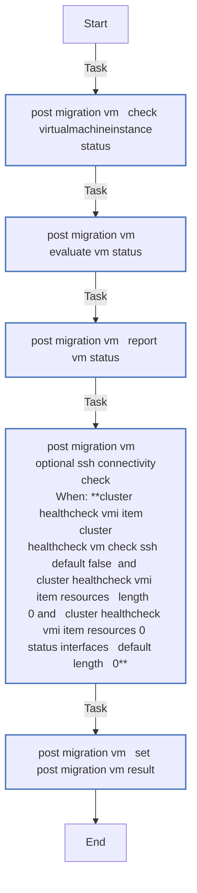
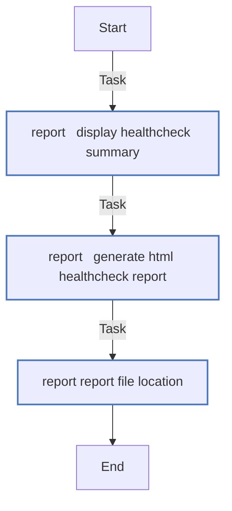
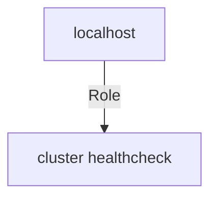

# cluster_healthcheck

```
Role belongs to infra/openshift_virtualization_migration
Namespace - infra
Collection - openshift_virtualization_migration
```

Description: Cluster health validation for OpenShift Virtualization migration environments.

## Requirements

- OpenShift cluster with `kubeconfig` configured
- `kubernetes.core` collection installed
- OpenShift Virtualization (CNV) operator installed
- Migration Toolkit for Virtualization (MTV) operator installed

## Role Variables

### Defaults

| Variable | Type | Default | Description |
|----------|------|---------|-------------|
| `cluster_healthcheck_checks` | list | See defaults/main.yml | List of health checks to run |
| `cluster_healthcheck_post_migration_vms` | list | `[]` | VMs to check post-migration |
| `cluster_healthcheck_generate_report` | bool | `true` | Generate HTML report |
| `cluster_healthcheck_report_path` | str | `/tmp/cluster_healthcheck_report.html` | Report output path |
| `cluster_healthcheck_mtv_namespace` | str | `openshift-mtv` | MTV operator namespace |
| `cluster_healthcheck_kubevirt_namespace` | str | `openshift-cnv` | KubeVirt operator namespace |
| `cluster_healthcheck_ssh_timeout` | int | `10` | SSH check timeout in seconds |
| `cluster_healthcheck_debug` | bool | `false` | Enable verbose debug output |

### Post-Migration VM Format

```yaml
cluster_healthcheck_post_migration_vms:
  - name: my-vm
    namespace: my-namespace
    check_ssh: true  # optional, default false
```

## Health Checks

| Check | Description |
|-------|-------------|
| `ocp_node_health` | Node Ready status, resource pressure, kubevirt.io/schedulable label |
| `kubevirt_health` | HyperConverged CR, virt-* pods, CDI operator |
| `mtv_health` | ForkliftController, MTV pods, Providers, Plans |
| `storage_health` | StorageClasses, CSI drivers, PV capacity, pending PVCs |
| `network_health` | Multus, NADs, OVN/SDN health, migration network |

## Example Playbook

```yaml
- name: Run cluster healthchecks
  hosts: localhost
  connection: local
  gather_facts: false
  roles:
    - role: infra.openshift_virtualization_migration.cluster_healthcheck
      vars:
        cluster_healthcheck_post_migration_vms:
          - name: rhel9-vm
            namespace: migration-target
```
<!-- DOCSIBLE START -->
## cluster_healthcheck

```
Role belongs to infra/openshift_virtualization_migration
Namespace - infra
Collection - openshift_virtualization_migration
Version - 1.25.0
Repository - https://github.com/redhat-cop/openshift_virtualization_migration
```

Description: Cluster health validation for OpenShift Virtualization migration environments.

### Defaults

**These are static variables with lower priority**

#### File: defaults/main.yml

| Var          | Type         | Value       |Choices    |Required    | Title       |
|--------------|--------------|-------------|-------------|-------------|-------------|
| [`cluster_healthcheck_checks`](defaults/main.yml#L3)   | list   | `[]` |  None  |   None  |  None |
| [`cluster_healthcheck_checks.0`](defaults/main.yml#L4)   | str   | `ocp_node_health` |  None  |   None  |  None |
| [`cluster_healthcheck_checks.1`](defaults/main.yml#L5)   | str   | `kubevirt_health` |  None  |   None  |  None |
| [`cluster_healthcheck_checks.2`](defaults/main.yml#L6)   | str   | `mtv_health` |  None  |   None  |  None |
| [`cluster_healthcheck_checks.3`](defaults/main.yml#L7)   | str   | `storage_health` |  None  |   None  |  None |
| [`cluster_healthcheck_checks.4`](defaults/main.yml#L8)   | str   | `network_health` |  None  |   None  |  None |
| [`cluster_healthcheck_debug`](defaults/main.yml#L22)   | bool   | `False` |  None  |   None  |  None |
| [`cluster_healthcheck_generate_report`](defaults/main.yml#L12)   | bool   | `True` |  None  |   None  |  None |
| [`cluster_healthcheck_kubevirt_namespace`](defaults/main.yml#L18)   | str   | `openshift-cnv` |  None  |   None  |  None |
| [`cluster_healthcheck_mtv_namespace`](defaults/main.yml#L16)   | str   | `openshift-mtv` |  None  |   None  |  None |
| [`cluster_healthcheck_post_migration_vms`](defaults/main.yml#L10)   | list   | `[]` |  None  |   None  |  None |
| [`cluster_healthcheck_report_path`](defaults/main.yml#L14)   | str   | `/tmp/cluster_healthcheck_report.html` |  None  |   None  |  None |
| [`cluster_healthcheck_ssh_timeout`](defaults/main.yml#L20)   | int   | `10` |  None  |   None  |  None |

<summary><b>🖇️ Full descriptions for vars in defaults/main.yml</b></summary>
<br>
<b>`cluster_healthcheck_checks`:</b> None
<br>
<b>`cluster_healthcheck_checks.0`:</b> None
<br>
<b>`cluster_healthcheck_checks.1`:</b> None
<br>
<b>`cluster_healthcheck_checks.2`:</b> None
<br>
<b>`cluster_healthcheck_checks.3`:</b> None
<br>
<b>`cluster_healthcheck_checks.4`:</b> None
<br>
<b>`cluster_healthcheck_debug`:</b> None
<br>
<b>`cluster_healthcheck_generate_report`:</b> None
<br>
<b>`cluster_healthcheck_kubevirt_namespace`:</b> None
<br>
<b>`cluster_healthcheck_mtv_namespace`:</b> None
<br>
<b>`cluster_healthcheck_post_migration_vms`:</b> None
<br>
<b>`cluster_healthcheck_report_path`:</b> None
<br>
<b>`cluster_healthcheck_ssh_timeout`:</b> None
<br>
<br>

### Vars

**These are variables with higher priority**

#### File: vars/main.yml

| Var          | Type         | Value       |
|--------------|--------------|-------------|
| [__cluster_healthcheck_results](vars/main.yml#L3)   | dict   | `{}` |

### Tasks

#### File: tasks/main.yml

| Name | Module | Has Conditions |
| ---- | ------ | --------- |
| Initialize healthcheck results | `ansible.builtin.set_fact` | False |
| Include ocp_node_health tasks | `ansible.builtin.include_tasks` | True |
| Include kubevirt_health tasks | `ansible.builtin.include_tasks` | True |
| Include mtv_health tasks | `ansible.builtin.include_tasks` | True |
| Include storage_health tasks | `ansible.builtin.include_tasks` | True |
| Include network_health tasks | `ansible.builtin.include_tasks` | True |
| Include post_migration_vm tasks | `ansible.builtin.include_tasks` | True |
| Include report tasks | `ansible.builtin.include_tasks` | True |

#### File: tasks/kubevirt_health.yml

| Name | Module | Has Conditions |
| ---- | ------ | --------- |
| kubevirt_health ¦ Get HyperConverged CR status | `kubernetes.core.k8s_info` | False |
| kubevirt_health ¦ Evaluate HyperConverged conditions | `ansible.builtin.set_fact` | False |
| kubevirt_health ¦ Report HyperConverged status | `ansible.builtin.debug` | False |
| kubevirt_health ¦ Check virt-operator pods | `kubernetes.core.k8s_info` | False |
| kubevirt_health ¦ Check virt-controller pods | `kubernetes.core.k8s_info` | False |
| kubevirt_health ¦ Check virt-handler pods | `kubernetes.core.k8s_info` | False |
| kubevirt_health ¦ Check virt-api pods | `kubernetes.core.k8s_info` | False |
| kubevirt_health ¦ Evaluate KubeVirt pod health | `ansible.builtin.set_fact` | False |
| kubevirt_health ¦ Check CDI operator pods | `kubernetes.core.k8s_info` | False |
| kubevirt_health ¦ Check CDI deployment pods | `kubernetes.core.k8s_info` | False |
| kubevirt_health ¦ Check CDI apiserver pods | `kubernetes.core.k8s_info` | False |
| kubevirt_health ¦ Check CDI uploadproxy pods | `kubernetes.core.k8s_info` | False |
| kubevirt_health ¦ Evaluate CDI health | `ansible.builtin.set_fact` | False |
| kubevirt_health ¦ Set kubevirt health result | `ansible.builtin.set_fact` | False |

#### File: tasks/mtv_health.yml

| Name | Module | Has Conditions |
| ---- | ------ | --------- |
| mtv_health ¦ Check ForkliftController CR | `kubernetes.core.k8s_info` | False |
| mtv_health ¦ Evaluate ForkliftController health | `ansible.builtin.set_fact` | False |
| mtv_health ¦ Report ForkliftController status | `ansible.builtin.debug` | False |
| mtv_health ¦ Check MTV operator pods | `kubernetes.core.k8s_info` | False |
| mtv_health ¦ Evaluate MTV operator pod status | `ansible.builtin.set_fact` | False |
| mtv_health ¦ Check Provider CRs | `kubernetes.core.k8s_info` | False |
| mtv_health ¦ Identify Ready providers | `ansible.builtin.set_fact` | False |
| mtv_health ¦ Evaluate Provider readiness | `ansible.builtin.set_fact` | False |
| mtv_health ¦ Check for failed migration Plans | `kubernetes.core.k8s_info` | False |
| mtv_health ¦ Evaluate failed Plans | `ansible.builtin.set_fact` | False |
| mtv_health ¦ Report failed Plans | `ansible.builtin.debug` | False |
| mtv_health ¦ Set MTV health result | `ansible.builtin.set_fact` | False |

#### File: tasks/network_health.yml

| Name | Module | Has Conditions |
| ---- | ------ | --------- |
| network_health ¦ Check Multus pods | `kubernetes.core.k8s_info` | False |
| network_health ¦ Evaluate Multus pod health | `ansible.builtin.set_fact` | False |
| network_health ¦ List NetworkAttachmentDefinitions | `kubernetes.core.k8s_info` | False |
| network_health ¦ Report NetworkAttachmentDefinitions | `ansible.builtin.debug` | True |
| network_health ¦ Check OVN-Kubernetes pods | `kubernetes.core.k8s_info` | False |
| network_health ¦ Check OpenShiftSDN pods as fallback | `kubernetes.core.k8s_info` | True |
| network_health ¦ Evaluate SDN health | `ansible.builtin.set_fact` | False |
| network_health ¦ Get HyperConverged CR for migration network config | `kubernetes.core.k8s_info` | False |
| network_health ¦ Extract configured migration network | `ansible.builtin.set_fact` | True |
| network_health ¦ Check migration network NAD | `kubernetes.core.k8s_info` | True |
| network_health ¦ Set network health result | `ansible.builtin.set_fact` | False |

#### File: tasks/ocp_node_health.yml

| Name | Module | Has Conditions |
| ---- | ------ | --------- |
| ocp_node_health ¦ Get all cluster nodes | `kubernetes.core.k8s_info` | False |
| ocp_node_health ¦ Evaluate node Ready status | `ansible.builtin.set_fact` | False |
| ocp_node_health ¦ Report nodes not Ready | `ansible.builtin.debug` | False |
| ocp_node_health ¦ Check for resource pressure conditions | `ansible.builtin.set_fact` | True |
| ocp_node_health ¦ Report nodes with resource pressure | `ansible.builtin.debug` | False |
| ocp_node_health ¦ Check allocatable vs capacity ratios | `ansible.builtin.set_fact` | False |
| ocp_node_health ¦ Display capacity information | `ansible.builtin.debug` | True |
| ocp_node_health ¦ Verify worker nodes have kubevirt.io/schedulable label | `ansible.builtin.set_fact` | False |
| ocp_node_health ¦ Report workers missing kubevirt.io/schedulable label | `ansible.builtin.debug` | False |
| ocp_node_health ¦ Set node health result | `ansible.builtin.set_fact` | False |

#### File: tasks/post_migration_vm.yml

| Name | Module | Has Conditions |
| ---- | ------ | --------- |
| post_migration_vm ¦ Check VirtualMachineInstance status | `kubernetes.core.k8s_info` | False |
| post_migration_vm ¦ Evaluate VM status | `ansible.builtin.set_fact` | False |
| post_migration_vm ¦ Report VM status | `ansible.builtin.debug` | False |
| post_migration_vm ¦ Optional SSH connectivity check | `ansible.builtin.wait_for` | True |
| post_migration_vm ¦ Set post-migration VM result | `ansible.builtin.set_fact` | False |

#### File: tasks/report.yml

| Name | Module | Has Conditions |
| ---- | ------ | --------- |
| report ¦ Display healthcheck summary | `ansible.builtin.debug` | False |
| report ¦ Generate HTML healthcheck report | `ansible.builtin.template` | False |
| report ¦ Report file location | `ansible.builtin.debug` | False |

#### File: tasks/storage_health.yml

| Name | Module | Has Conditions |
| ---- | ------ | --------- |
| storage_health ¦ Get StorageClass resources | `kubernetes.core.k8s_info` | False |
| storage_health ¦ Check for default StorageClass | `ansible.builtin.set_fact` | False |
| storage_health ¦ Report StorageClasses | `ansible.builtin.debug` | False |
| storage_health ¦ Check CSI driver pods | `kubernetes.core.k8s_info` | False |
| storage_health ¦ Report CSI drivers | `ansible.builtin.debug` | False |
| storage_health ¦ Get PersistentVolumes | `kubernetes.core.k8s_info` | False |
| storage_health ¦ Evaluate PV capacity | `ansible.builtin.set_fact` | False |
| storage_health ¦ Check for PVCs stuck in Pending | `kubernetes.core.k8s_info` | False |
| storage_health ¦ Report pending PVCs | `ansible.builtin.debug` | False |
| storage_health ¦ Set storage health result | `ansible.builtin.set_fact` | False |

## Task Flow Graphs

### Graph for kubevirt_health.yml

```mermaid
flowchart TD
Start
classDef block stroke:#3498db,stroke-width:2px;
classDef task stroke:#4b76bb,stroke-width:2px;
classDef includeTasks stroke:#16a085,stroke-width:2px;
classDef importTasks stroke:#34495e,stroke-width:2px;
classDef includeRole stroke:#2980b9,stroke-width:2px;
classDef importRole stroke:#699ba7,stroke-width:2px;
classDef includeVars stroke:#8e44ad,stroke-width:2px;
classDef rescue stroke:#665352,stroke-width:2px;

  Start-->|Task| kubevirt_health___Get_HyperConverged_CR_status0[kubevirt health   get hyperconverged cr status]:::task
  kubevirt_health___Get_HyperConverged_CR_status0-->|Task| kubevirt_health___Evaluate_HyperConverged_conditions1[kubevirt health   evaluate hyperconverged<br>conditions]:::task
  kubevirt_health___Evaluate_HyperConverged_conditions1-->|Task| kubevirt_health___Report_HyperConverged_status2[kubevirt health   report hyperconverged status]:::task
  kubevirt_health___Report_HyperConverged_status2-->|Task| kubevirt_health___Check_virt_operator_pods3[kubevirt health   check virt operator pods]:::task
  kubevirt_health___Check_virt_operator_pods3-->|Task| kubevirt_health___Check_virt_controller_pods4[kubevirt health   check virt controller pods]:::task
  kubevirt_health___Check_virt_controller_pods4-->|Task| kubevirt_health___Check_virt_handler_pods5[kubevirt health   check virt handler pods]:::task
  kubevirt_health___Check_virt_handler_pods5-->|Task| kubevirt_health___Check_virt_api_pods6[kubevirt health   check virt api pods]:::task
  kubevirt_health___Check_virt_api_pods6-->|Task| kubevirt_health___Evaluate_KubeVirt_pod_health7[kubevirt health   evaluate kubevirt pod health]:::task
  kubevirt_health___Evaluate_KubeVirt_pod_health7-->|Task| kubevirt_health___Check_CDI_operator_pods8[kubevirt health   check cdi operator pods]:::task
  kubevirt_health___Check_CDI_operator_pods8-->|Task| kubevirt_health___Check_CDI_deployment_pods9[kubevirt health   check cdi deployment pods]:::task
  kubevirt_health___Check_CDI_deployment_pods9-->|Task| kubevirt_health___Check_CDI_apiserver_pods10[kubevirt health   check cdi apiserver pods]:::task
  kubevirt_health___Check_CDI_apiserver_pods10-->|Task| kubevirt_health___Check_CDI_uploadproxy_pods11[kubevirt health   check cdi uploadproxy pods]:::task
  kubevirt_health___Check_CDI_uploadproxy_pods11-->|Task| kubevirt_health___Evaluate_CDI_health12[kubevirt health   evaluate cdi health]:::task
  kubevirt_health___Evaluate_CDI_health12-->|Task| kubevirt_health___Set_kubevirt_health_result13[kubevirt health   set kubevirt health result]:::task
  kubevirt_health___Set_kubevirt_health_result13-->End
```



### Graph for main.yml

```mermaid
flowchart TD
Start
classDef block stroke:#3498db,stroke-width:2px;
classDef task stroke:#4b76bb,stroke-width:2px;
classDef includeTasks stroke:#16a085,stroke-width:2px;
classDef importTasks stroke:#34495e,stroke-width:2px;
classDef includeRole stroke:#2980b9,stroke-width:2px;
classDef importRole stroke:#699ba7,stroke-width:2px;
classDef includeVars stroke:#8e44ad,stroke-width:2px;
classDef rescue stroke:#665352,stroke-width:2px;

  Start-->|Task| Initialize_healthcheck_results0[initialize healthcheck results]:::task
  Initialize_healthcheck_results0-->|Include task| Include_ocp_node_health_tasks_ocp_node_health_yml_1[include ocp node health tasks<br>When: **ocp node health  in cluster healthcheck checks**<br>include_task: ocp node health yml]:::includeTasks
  Include_ocp_node_health_tasks_ocp_node_health_yml_1-->|Include task| Include_kubevirt_health_tasks_kubevirt_health_yml_2[include kubevirt health tasks<br>When: **kubevirt health  in cluster healthcheck checks**<br>include_task: kubevirt health yml]:::includeTasks
  Include_kubevirt_health_tasks_kubevirt_health_yml_2-->|Include task| Include_mtv_health_tasks_mtv_health_yml_3[include mtv health tasks<br>When: **mtv health  in cluster healthcheck checks**<br>include_task: mtv health yml]:::includeTasks
  Include_mtv_health_tasks_mtv_health_yml_3-->|Include task| Include_storage_health_tasks_storage_health_yml_4[include storage health tasks<br>When: **storage health  in cluster healthcheck checks**<br>include_task: storage health yml]:::includeTasks
  Include_storage_health_tasks_storage_health_yml_4-->|Include task| Include_network_health_tasks_network_health_yml_5[include network health tasks<br>When: **network health  in cluster healthcheck checks**<br>include_task: network health yml]:::includeTasks
  Include_network_health_tasks_network_health_yml_5-->|Include task| Include_post_migration_vm_tasks_post_migration_vm_yml_6[include post migration vm tasks<br>When: **cluster healthcheck post migration vms   length  <br>0**<br>include_task: post migration vm yml]:::includeTasks
  Include_post_migration_vm_tasks_post_migration_vm_yml_6-->|Include task| Include_report_tasks_report_yml_7[include report tasks<br>When: **cluster healthcheck generate report**<br>include_task: report yml]:::includeTasks
  Include_report_tasks_report_yml_7-->End
```



### Graph for mtv_health.yml

```mermaid
flowchart TD
Start
classDef block stroke:#3498db,stroke-width:2px;
classDef task stroke:#4b76bb,stroke-width:2px;
classDef includeTasks stroke:#16a085,stroke-width:2px;
classDef importTasks stroke:#34495e,stroke-width:2px;
classDef includeRole stroke:#2980b9,stroke-width:2px;
classDef importRole stroke:#699ba7,stroke-width:2px;
classDef includeVars stroke:#8e44ad,stroke-width:2px;
classDef rescue stroke:#665352,stroke-width:2px;

  Start-->|Task| mtv_health___Check_ForkliftController_CR0[mtv health   check forkliftcontroller cr]:::task
  mtv_health___Check_ForkliftController_CR0-->|Task| mtv_health___Evaluate_ForkliftController_health1[mtv health   evaluate forkliftcontroller health]:::task
  mtv_health___Evaluate_ForkliftController_health1-->|Task| mtv_health___Report_ForkliftController_status2[mtv health   report forkliftcontroller status]:::task
  mtv_health___Report_ForkliftController_status2-->|Task| mtv_health___Check_MTV_operator_pods3[mtv health   check mtv operator pods]:::task
  mtv_health___Check_MTV_operator_pods3-->|Task| mtv_health___Evaluate_MTV_operator_pod_status4[mtv health   evaluate mtv operator pod status]:::task
  mtv_health___Evaluate_MTV_operator_pod_status4-->|Task| mtv_health___Check_Provider_CRs5[mtv health   check provider crs]:::task
  mtv_health___Check_Provider_CRs5-->|Task| mtv_health___Identify_Ready_providers6[mtv health   identify ready providers]:::task
  mtv_health___Identify_Ready_providers6-->|Task| mtv_health___Evaluate_Provider_readiness7[mtv health   evaluate provider readiness]:::task
  mtv_health___Evaluate_Provider_readiness7-->|Task| mtv_health___Check_for_failed_migration_Plans8[mtv health   check for failed migration plans]:::task
  mtv_health___Check_for_failed_migration_Plans8-->|Task| mtv_health___Evaluate_failed_Plans9[mtv health   evaluate failed plans]:::task
  mtv_health___Evaluate_failed_Plans9-->|Task| mtv_health___Report_failed_Plans10[mtv health   report failed plans]:::task
  mtv_health___Report_failed_Plans10-->|Task| mtv_health___Set_MTV_health_result11[mtv health   set mtv health result]:::task
  mtv_health___Set_MTV_health_result11-->End
```



### Graph for network_health.yml

```mermaid
flowchart TD
Start
classDef block stroke:#3498db,stroke-width:2px;
classDef task stroke:#4b76bb,stroke-width:2px;
classDef includeTasks stroke:#16a085,stroke-width:2px;
classDef importTasks stroke:#34495e,stroke-width:2px;
classDef includeRole stroke:#2980b9,stroke-width:2px;
classDef importRole stroke:#699ba7,stroke-width:2px;
classDef includeVars stroke:#8e44ad,stroke-width:2px;
classDef rescue stroke:#665352,stroke-width:2px;

  Start-->|Task| network_health___Check_Multus_pods0[network health   check multus pods]:::task
  network_health___Check_Multus_pods0-->|Task| network_health___Evaluate_Multus_pod_health1[network health   evaluate multus pod health]:::task
  network_health___Evaluate_Multus_pod_health1-->|Task| network_health___List_NetworkAttachmentDefinitions2[network health   list networkattachmentdefinitions]:::task
  network_health___List_NetworkAttachmentDefinitions2-->|Task| network_health___Report_NetworkAttachmentDefinitions3[network health   report<br>networkattachmentdefinitions<br>When: **cluster healthcheck debug**]:::task
  network_health___Report_NetworkAttachmentDefinitions3-->|Task| network_health___Check_OVN_Kubernetes_pods4[network health   check ovn kubernetes pods]:::task
  network_health___Check_OVN_Kubernetes_pods4-->|Task| network_health___Check_OpenShiftSDN_pods_as_fallback5[network health   check openshiftsdn pods as<br>fallback<br>When: **cluster healthcheck ovn pods resources   length <br>  0**]:::task
  network_health___Check_OpenShiftSDN_pods_as_fallback5-->|Task| network_health___Evaluate_SDN_health6[network health   evaluate sdn health]:::task
  network_health___Evaluate_SDN_health6-->|Task| network_health___Get_HyperConverged_CR_for_migration_network_config7[network health   get hyperconverged cr for<br>migration network config]:::task
  network_health___Get_HyperConverged_CR_for_migration_network_config7-->|Task| network_health___Extract_configured_migration_network8[network health   extract configured migration<br>network<br>When: **cluster healthcheck hco network resources  <br>length   0**]:::task
  network_health___Extract_configured_migration_network8-->|Task| network_health___Check_migration_network_NAD9[network health   check migration network nad<br>When: **cluster healthcheck migration network   default <br>     length   0**]:::task
  network_health___Check_migration_network_NAD9-->|Task| network_health___Set_network_health_result10[network health   set network health result]:::task
  network_health___Set_network_health_result10-->End
```



### Graph for ocp_node_health.yml

```mermaid
flowchart TD
Start
classDef block stroke:#3498db,stroke-width:2px;
classDef task stroke:#4b76bb,stroke-width:2px;
classDef includeTasks stroke:#16a085,stroke-width:2px;
classDef importTasks stroke:#34495e,stroke-width:2px;
classDef includeRole stroke:#2980b9,stroke-width:2px;
classDef importRole stroke:#699ba7,stroke-width:2px;
classDef includeVars stroke:#8e44ad,stroke-width:2px;
classDef rescue stroke:#665352,stroke-width:2px;

  Start-->|Task| ocp_node_health___Get_all_cluster_nodes0[ocp node health   get all cluster nodes]:::task
  ocp_node_health___Get_all_cluster_nodes0-->|Task| ocp_node_health___Evaluate_node_Ready_status1[ocp node health   evaluate node ready status]:::task
  ocp_node_health___Evaluate_node_Ready_status1-->|Task| ocp_node_health___Report_nodes_not_Ready2[ocp node health   report nodes not ready]:::task
  ocp_node_health___Report_nodes_not_Ready2-->|Task| ocp_node_health___Check_for_resource_pressure_conditions3[ocp node health   check for resource pressure<br>conditions<br>When: **item status conditions   selectattr  type    in   <br> memorypressure    diskpressure    pidpressure    <br> selectattr  status    equalto    true     list  <br>length   0**]:::task
  ocp_node_health___Check_for_resource_pressure_conditions3-->|Task| ocp_node_health___Report_nodes_with_resource_pressure4[ocp node health   report nodes with resource<br>pressure]:::task
  ocp_node_health___Report_nodes_with_resource_pressure4-->|Task| ocp_node_health___Check_allocatable_vs_capacity_ratios5[ocp node health   check allocatable vs capacity<br>ratios]:::task
  ocp_node_health___Check_allocatable_vs_capacity_ratios5-->|Task| ocp_node_health___Display_capacity_information6[ocp node health   display capacity information<br>When: **cluster healthcheck debug**]:::task
  ocp_node_health___Display_capacity_information6-->|Task| ocp_node_health___Verify_worker_nodes_have_kubevirt_io_schedulable_label7[ocp node health   verify worker nodes have<br>kubevirt io schedulable label]:::task
  ocp_node_health___Verify_worker_nodes_have_kubevirt_io_schedulable_label7-->|Task| ocp_node_health___Report_workers_missing_kubevirt_io_schedulable_label8[ocp node health   report workers missing kubevirt<br>io schedulable label]:::task
  ocp_node_health___Report_workers_missing_kubevirt_io_schedulable_label8-->|Task| ocp_node_health___Set_node_health_result9[ocp node health   set node health result]:::task
  ocp_node_health___Set_node_health_result9-->End
```



### Graph for post_migration_vm.yml



### Graph for report.yml



### Graph for storage_health.yml

```mermaid
flowchart TD
Start
classDef block stroke:#3498db,stroke-width:2px;
classDef task stroke:#4b76bb,stroke-width:2px;
classDef includeTasks stroke:#16a085,stroke-width:2px;
classDef importTasks stroke:#34495e,stroke-width:2px;
classDef includeRole stroke:#2980b9,stroke-width:2px;
classDef importRole stroke:#699ba7,stroke-width:2px;
classDef includeVars stroke:#8e44ad,stroke-width:2px;
classDef rescue stroke:#665352,stroke-width:2px;

  Start-->|Task| storage_health___Get_StorageClass_resources0[storage health   get storageclass resources]:::task
  storage_health___Get_StorageClass_resources0-->|Task| storage_health___Check_for_default_StorageClass1[storage health   check for default storageclass]:::task
  storage_health___Check_for_default_StorageClass1-->|Task| storage_health___Report_StorageClasses2[storage health   report storageclasses]:::task
  storage_health___Report_StorageClasses2-->|Task| storage_health___Check_CSI_driver_pods3[storage health   check csi driver pods]:::task
  storage_health___Check_CSI_driver_pods3-->|Task| storage_health___Report_CSI_drivers4[storage health   report csi drivers]:::task
  storage_health___Report_CSI_drivers4-->|Task| storage_health___Get_PersistentVolumes5[storage health   get persistentvolumes]:::task
  storage_health___Get_PersistentVolumes5-->|Task| storage_health___Evaluate_PV_capacity6[storage health   evaluate pv capacity]:::task
  storage_health___Evaluate_PV_capacity6-->|Task| storage_health___Check_for_PVCs_stuck_in_Pending7[storage health   check for pvcs stuck in pending]:::task
  storage_health___Check_for_PVCs_stuck_in_Pending7-->|Task| storage_health___Report_pending_PVCs8[storage health   report pending pvcs]:::task
  storage_health___Report_pending_PVCs8-->|Task| storage_health___Set_storage_health_result9[storage health   set storage health result]:::task
  storage_health___Set_storage_health_result9-->End
```



## Playbook

```yml
---
- name: Test cluster_healthcheck role
  hosts: localhost
  connection: local
  gather_facts: false
  roles:
    - role: cluster_healthcheck
...

```

## Playbook graph



## Author Information

OpenShift Virtualization Migration Contributors

## License

GPL-3.0-only

## Minimum Ansible Version

2.15.0

## Platforms

No platforms specified.

<!-- DOCSIBLE END -->