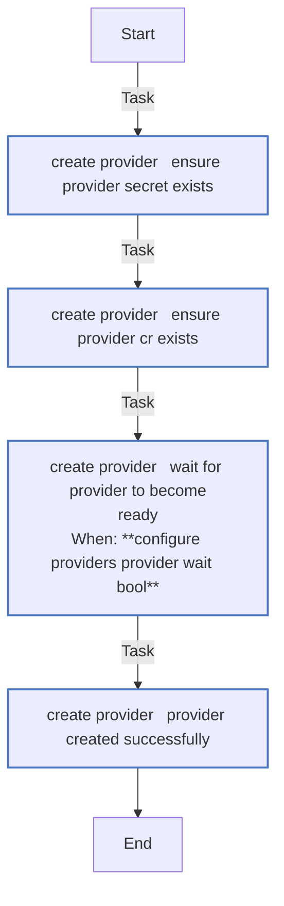
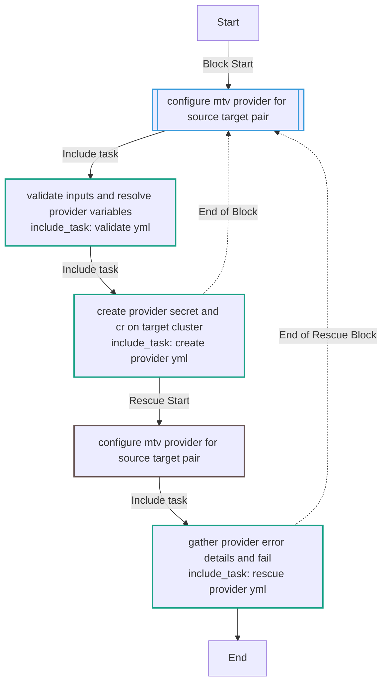
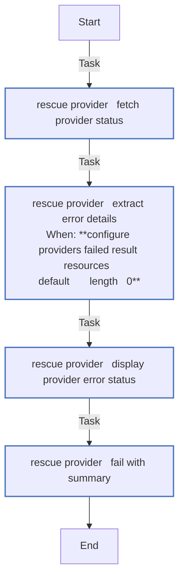

# configure_providers

Create MTV/Forklift source provider custom resources on OpenShift target
clusters. Designed to run from AAP with credential injection.

## Overview

This role creates a Forklift `Provider` CR and its backing `Secret` on a
target OpenShift cluster for a given source environment (vSphere or oVirt).
It is intended to be launched as an AAP job template with `source_name` and
`target_name` survey variables.

For targets with multiple sources (`vm_sources: [vcenter-prod, vcenter-lab]`),
launch the job template once per source-target pair. Each run creates one
provider. The role is idempotent — re-running for the same pair updates in
place.

## Requirements

- MTV (Forklift) operator must be installed on the target OpenShift cluster
- `kubernetes.core` and `redhat.openshift` Ansible collections
- AAP credential types:
  - **Migration Factory - Source Environment** (custom) — injects
    `mf_source_username`, `mf_source_password`, `mf_source_certificate`,
    `mf_source_host`, `mf_insecure_skip_tls_verify`
  - **OpenShift or Kubernetes API Bearer Token** (built-in) — sets
    `K8S_AUTH_HOST`, `K8S_AUTH_API_KEY`, `K8S_AUTH_VERIFY_SSL` as
    environment variables, which `kubernetes.core` and `redhat.openshift`
    modules read automatically

## Role Variables

### Required (survey variables)

| Variable | Description |
|----------|-------------|
| `source_name` | Name of the source environment (must match an AAP inventory host in `vm_sources`) |
| `target_name` | Name of the target OpenShift cluster (must match an AAP inventory host in `migration_clusters`) |

### Optional (role defaults)

| Variable | Default | Description |
|----------|---------|-------------|
| `configure_providers_mtv_namespace` | From `hostvars[target_name].mtv_namespace` or `openshift-mtv` | Namespace where MTV is installed |
| `configure_providers_provider_wait` | `true` | Wait for Provider to reach Ready status |
| `configure_providers_provider_wait_timeout` | `120` | Seconds to wait for Ready |
| `configure_providers_provider_wait_poll` | `10` | Seconds between status polls |
| `configure_providers_provider_state` | `present` | Set to `absent` to remove a provider |
| `configure_providers_api_version` | `forklift.konveyor.io/v1beta1` | Forklift API version |

### Source host vars (from AAP inventory)

These are resolved from `hostvars[source_name]` at runtime:

| Variable | Required | Description |
|----------|----------|-------------|
| `type` | Yes | Source type: `vmware` or `ovirt` |
| `host` | Yes | Source hostname or IP |
| `sdk_endpoint` | No (default: `/sdk`) | SDK endpoint path |
| `vddk.image` | No | VDDK init image URL (VMware only) |

### Target host vars (from AAP inventory)

| Variable | Required | Description |
|----------|----------|-------------|
| `mtv_namespace` | No (default: `openshift-mtv`) | Namespace where MTV is installed |
| `vm_sources` | Yes | List of source names mapped to this target |

## Resources Created

For each source-target pair, the role creates:

1. **Secret** (`<source_name>-provider-secret`) — contains source
   credentials (user, password, and optionally cacert or insecureSkipVerify)
2. **Provider** (`<source_name>`) — Forklift Provider CR pointing to the
   source with the secret reference

### VMware Provider Example

```yaml
apiVersion: forklift.konveyor.io/v1beta1
kind: Provider
metadata:
  name: vcenter-prod
  namespace: openshift-mtv
spec:
  type: vsphere
  url: https://vcenter.prod.example.com/sdk
  secret:
    name: vcenter-prod-provider-secret
    namespace: openshift-mtv
  settings:
    vddkInitImage: registry.example.com/vddk:8.0
```

### oVirt Provider Example

```yaml
apiVersion: forklift.konveyor.io/v1beta1
kind: Provider
metadata:
  name: rhv-legacy
  namespace: openshift-mtv
spec:
  type: ovirt
  url: https://rhvm.example.com/ovirt-engine/api
  secret:
    name: rhv-legacy-provider-secret
    namespace: openshift-mtv
```

## Error Handling

If the Provider fails to reach `Ready` status within the timeout, the role:

1. Fetches the Provider CR's current status conditions
2. Displays a structured error with the provider name, type, URL, phase,
   and MTV's reported failure reason
3. Provides troubleshooting guidance (check credentials, verify source
   reachability, TLS settings, MTV operator status)

## AAP Job Template

The `aap_seed` role creates a job template named
**OpenShift Virtualization Migration - Configure MTV** that runs
`playbooks/vmf_configure_providers.yml`. Attach both source and target
credentials when launching.
<!-- DOCSIBLE START -->
## configure_providers

```
Role belongs to infra/openshift_virtualization_migration
Namespace - infra
Collection - openshift_virtualization_migration
Version - 1.25.0
Repository - https://github.com/redhat-cop/openshift_virtualization_migration
```

Description: Create MTV/Forklift source provider CRs on OpenShift target clusters. Designed to run from AAP with credential injection.

### Argument Specifications

<details>
<summary><b>🧩 Argument Specifications in `meta/argument_specs`</b></summary>

#### Key: main

* **Description**: ['Creates a Forklift Provider custom resource and its backing Secret on a target OpenShift cluster for a given source environment.', 'Designed to run from AAP with credential injection. The source credential injects mf_source_username, mf_source_password, and mf_source_certificate as extra vars. OpenShift connection is provided by the AAP OpenShift credential which sets K8S_AUTH_* environment variables.', 'For targets with multiple sources, launch the job template once per source-target pair.']
* **Options**:
  * **configure_providers_api_version**:
    * **Required**: False
    * **Type**: str
    * **Default**: forklift.konveyor.io/v1beta1
    * **Description**: Forklift API version for Provider CRs.
  * **configure_providers_auto_retrieve_cert**:
    * **Required**: False
    * **Type**: bool
    * **Default**: True
    * **Description**: Whether to automatically retrieve the source TLS certificate when insecureSkipTlsVerify is false and no certificate is provided.
  * **configure_providers_provider_namespace**:
    * **Required**: False
    * **Type**: str
    * **Default**: openshift-mtv
    * **Description**: Namespace where the provider will be created. Resolved from the target host's mtv_namespace variable by default.
  * **configure_providers_provider_override**:
    * **Required**: False
    * **Type**: dict
    * **Default**: {}
    * **Description**: Override configuration merged into the Provider CR spec. Allows setting additional properties such as settings or other fields that evolve with the Forklift API.
  * **configure_providers_provider_state**:
    * **Required**: False
    * **Type**: str
    * **Default**: present
    * **Description**: Desired state of the provider. Set to absent to remove a previously created provider and its secret.
    * **Choices**:
      * present
      * absent
  * **configure_providers_provider_wait**:
    * **Required**: False
    * **Type**: bool
    * **Default**: True
    * **Description**: Whether to wait for the Provider CR to reach Ready status after creation.
  * **configure_providers_provider_wait_poll**:
    * **Required**: False
    * **Type**: int
    * **Default**: 10
    * **Description**: Seconds between status polls while waiting for Ready.
  * **configure_providers_provider_wait_timeout**:
    * **Required**: False
    * **Type**: int
    * **Default**: 120
    * **Description**: Seconds to wait for the Provider to become Ready before failing.
  * **configure_providers_secure_logging**:
    * **Required**: False
    * **Type**: bool
    * **Default**: True
    * **Description**: Whether to enable secure logging for sensitive tasks.
  * **source_name**:
    * **Required**: True
    * **Type**: str
    * **Default**: none
    * **Description**: Name of the source environment (must match an AAP inventory host in the vm_sources group).
  * **target_name**:
    * **Required**: True
    * **Type**: str
    * **Default**: none
    * **Description**: Name of the target OpenShift cluster (must match an AAP inventory host in the migration_clusters group).

</details>

### Defaults

**These are static variables with lower priority**

#### File: defaults/main.yml

| Var          | Type         | Value       |Choices    |Required    | Title       |
|--------------|--------------|-------------|-------------|-------------|-------------|
| [`configure_providers_api_version`](defaults/main.yml#L26)   | str   | `forklift.konveyor.io/v1beta1` |  None  |   None  |  None |
| [`configure_providers_auto_retrieve_cert`](defaults/main.yml#L33)   | bool   | `True` |  None  |   None  |  None |
| [`configure_providers_provider_namespace`](defaults/main.yml#L10)   | str   | `<multiline value: folded_strip>` |  None  |   None  |  None |
| [`configure_providers_provider_override`](defaults/main.yml#L29)   | dict   | `{}` |  None  |   None  |  None |
| [`configure_providers_provider_state`](defaults/main.yml#L23)   | str   | `present` |  None  |   None  |  None |
| [`configure_providers_provider_wait`](defaults/main.yml#L14)   | bool   | `True` |  None  |   None  |  None |
| [`configure_providers_provider_wait_poll`](defaults/main.yml#L20)   | int   | `10` |  None  |   None  |  None |
| [`configure_providers_provider_wait_timeout`](defaults/main.yml#L17)   | int   | `120` |  None  |   None  |  None |
| [`configure_providers_secure_logging`](defaults/main.yml#L2)   | str   | `{{ secure_logging ¦ default(true) }}` |  None  |   None  |  None |
| [`configure_providers_source_host`](defaults/main.yml#L41)   | str   | `<multiline value: folded_strip>` |  None  |   None  |  None |
| [`configure_providers_source_sdk_endpoint`](defaults/main.yml#L44)   | str   | `<multiline value: folded_strip>` |  None  |   None  |  None |
| [`configure_providers_source_type`](defaults/main.yml#L38)   | str   | `<multiline value: folded_strip>` |  None  |   None  |  None |
| [`configure_providers_source_vddk`](defaults/main.yml#L47)   | str   | `{{ hostvars[source_name]['vddk'] ¦ default({}) }}` |  None  |   None  |  None |

<summary><b>🖇️ Full descriptions for vars in defaults/main.yml</b></summary>
<br>
<b>`configure_providers_api_version`:</b> None
<br>
<b>`configure_providers_auto_retrieve_cert`:</b> None
<br>
<b>`configure_providers_provider_namespace`:</b> None
<br>
<b>`configure_providers_provider_override`:</b> None
<br>
<b>`configure_providers_provider_state`:</b> None
<br>
<b>`configure_providers_provider_wait`:</b> None
<br>
<b>`configure_providers_provider_wait_poll`:</b> None
<br>
<b>`configure_providers_provider_wait_timeout`:</b> None
<br>
<b>`configure_providers_secure_logging`:</b> None
<br>
<b>`configure_providers_source_host`:</b> None
<br>
<b>`configure_providers_source_sdk_endpoint`:</b> None
<br>
<b>`configure_providers_source_type`:</b> None
<br>
<b>`configure_providers_source_vddk`:</b> None
<br>
<br>

### Tasks

#### File: tasks/main.yml

| Name | Module | Has Conditions |
| ---- | ------ | --------- |
| Configure MTV provider for source-target pair | `block` | False |
| Validate inputs and resolve provider variables | `ansible.builtin.include_tasks` | False |
| Create provider secret and CR on target cluster | `ansible.builtin.include_tasks` | False |

#### File: tasks/create_provider.yml

| Name | Module | Has Conditions |
| ---- | ------ | --------- |
| create_provider ¦ Ensure provider secret exists | `redhat.openshift.k8s` | False |
| create_provider ¦ Ensure provider CR exists | `redhat.openshift.k8s` | False |
| create_provider ¦ Wait for provider to become Ready | `kubernetes.core.k8s_info` | True |
| create_provider ¦ Provider created successfully | `ansible.builtin.debug` | False |

#### File: tasks/rescue_provider.yml

| Name | Module | Has Conditions |
| ---- | ------ | --------- |
| rescue_provider ¦ Fetch provider status | `kubernetes.core.k8s_info` | False |
| rescue_provider ¦ Extract error details | `ansible.builtin.set_fact` | True |
| rescue_provider ¦ Display provider error status | `ansible.builtin.debug` | False |
| rescue_provider ¦ Fail with summary | `ansible.builtin.fail` | False |

#### File: tasks/validate.yml

| Name | Module | Has Conditions |
| ---- | ------ | --------- |
| validate ¦ Assert required survey variables are defined | `ansible.builtin.assert` | False |
| validate ¦ Assert target exists in AAP inventory | `ansible.builtin.assert` | False |
| validate ¦ Assert source exists in AAP inventory | `ansible.builtin.assert` | False |
| validate ¦ Assert source is mapped to this target | `ansible.builtin.assert` | False |
| validate ¦ Assert source credentials are injected | `ansible.builtin.assert` | False |
| validate ¦ Assert source type is supported | `ansible.builtin.assert` | False |
| validate ¦ Check Forklift CRD exists on target cluster | `kubernetes.core.k8s_info` | False |
| validate ¦ Assert MTV operator is installed | `ansible.builtin.assert` | False |
| validate ¦ Resolve provider variables | `ansible.builtin.set_fact` | False |
| validate ¦ Retrieve source TLS certificate | `block` | True |
| validate ¦ Retrieve remote certificate from source | `community.crypto.get_certificate` | False |
| validate ¦ Set retrieved certificate | `ansible.builtin.set_fact` | False |

## Task Flow Graphs

### Graph for create_provider.yml



### Graph for main.yml



### Graph for rescue_provider.yml



### Graph for validate.yml

```mermaid
flowchart TD
Start
classDef block stroke:#3498db,stroke-width:2px;
classDef task stroke:#4b76bb,stroke-width:2px;
classDef includeTasks stroke:#16a085,stroke-width:2px;
classDef importTasks stroke:#34495e,stroke-width:2px;
classDef includeRole stroke:#2980b9,stroke-width:2px;
classDef importRole stroke:#699ba7,stroke-width:2px;
classDef includeVars stroke:#8e44ad,stroke-width:2px;
classDef rescue stroke:#665352,stroke-width:2px;

  Start-->|Task| validate___Assert_required_survey_variables_are_defined0[validate   assert required survey variables are<br>defined]:::task
  validate___Assert_required_survey_variables_are_defined0-->|Task| validate___Assert_target_exists_in_AAP_inventory1[validate   assert target exists in aap inventory]:::task
  validate___Assert_target_exists_in_AAP_inventory1-->|Task| validate___Assert_source_exists_in_AAP_inventory2[validate   assert source exists in aap inventory]:::task
  validate___Assert_source_exists_in_AAP_inventory2-->|Task| validate___Assert_source_is_mapped_to_this_target3[validate   assert source is mapped to this target]:::task
  validate___Assert_source_is_mapped_to_this_target3-->|Task| validate___Assert_source_credentials_are_injected4[validate   assert source credentials are injected]:::task
  validate___Assert_source_credentials_are_injected4-->|Task| validate___Assert_source_type_is_supported5[validate   assert source type is supported]:::task
  validate___Assert_source_type_is_supported5-->|Task| validate___Check_Forklift_CRD_exists_on_target_cluster6[validate   check forklift crd exists on target<br>cluster]:::task
  validate___Check_Forklift_CRD_exists_on_target_cluster6-->|Task| validate___Assert_MTV_operator_is_installed7[validate   assert mtv operator is installed]:::task
  validate___Assert_MTV_operator_is_installed7-->|Task| validate___Resolve_provider_variables8[validate   resolve provider variables]:::task
  validate___Resolve_provider_variables8-->|Block Start| validate___Retrieve_source_TLS_certificate9_block_start_0[[validate   retrieve source tls certificate<br>When: **configure providers auto retrieve cert   bool and<br>not  mf insecure skip tls verify   default false  <br> bool  and mf source certificate   default      <br>trim   length    0**]]:::block
  validate___Retrieve_source_TLS_certificate9_block_start_0-->|Task| validate___Retrieve_remote_certificate_from_source0[validate   retrieve remote certificate from source]:::task
  validate___Retrieve_remote_certificate_from_source0-->|Task| validate___Set_retrieved_certificate1[validate   set retrieved certificate]:::task
  validate___Set_retrieved_certificate1-.->|End of Block| validate___Retrieve_source_TLS_certificate9_block_start_0
  validate___Set_retrieved_certificate1-->End
```



## Author Information

Red Hat

## License

GPL-3.0-or-later

## Minimum Ansible Version

2.16

## Platforms

No platforms specified.

<!-- DOCSIBLE END -->