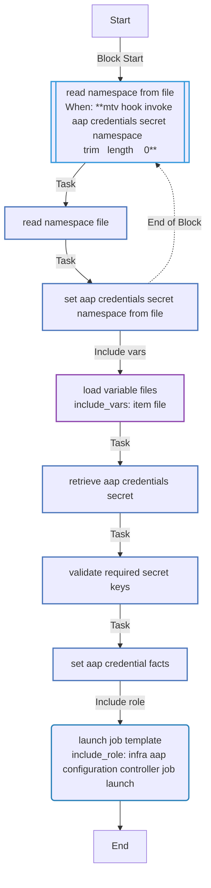

<!-- STATIC CONTENT START
Use this section for adding additional content to the README
This will not be overwritten by Docsible -->
# 📃 Role overview

Enables invoking Ansible Automation Platform as part of an MTV hook.

_Note_: MTV version 2.12+ enables native support for invoking Ansible Automation Platform. This role provides greater customizations and support for older versions of MTV.

## Setup / Prerequisites

The following steps must be completed prior to utilizing the contents included in this role as part of a MTV hook.

### Create a Pull Secret (Optional)

Components that are invoked by this role are not included in the _hook-runner_ image which requires the use of a custom image. If this image is not publicly available, create an Image Pull Secret in the namespace the Plan/Hook will be executed from.

### Create a Service Account

It is recommended that a dedicated Service Account be associated with the MTV hook job. Create a Service Account that can be used by the hook.

```yaml
apiVersion: v1
kind: ServiceAccount
metadata:
  name: mtv-aap-hook
```

_Note:_ If a Pull Secret was created above, add the name of the _Secret_ to the `imagePullSecrets` field.

### Grant Privileges to the Service Account

Create a _Role_ and _RoleBinding_ to enable the Hook Pod

```yaml
apiVersion: rbac.authorization.k8s.io/v1
kind: Role
metadata:
  name: mtv-hook-aap-secret-reader
rules:
- apiGroups:
  - ""
  resourceNames:
  - mtv-aap-credentials
  resources:
  - secrets
  verbs:
  - get
---
apiVersion: rbac.authorization.k8s.io/v1
kind: RoleBinding
metadata:
  name: mtv-hook-aap-secret-reader
roleRef:
  apiGroup: rbac.authorization.k8s.io
  kind: Role
  name: mtv-hook-aap-secret-reader
subjects:
- kind: ServiceAccount
  name: mtv-aap-hook
```

### Create AAP Credentials Secret

A _Secret_ containing the location and credential for accessing AAP is required to be created in the namespace the hook will be executed. The name of the secret should match the `Role` created above to enable least privilege principle. Support is available to provide username/password or an oauth token.

```yaml
kind: Secret
apiVersion: v1
metadata:
  name: mtv-aap-credentials
stringData:
  aap_controller_hostname: https://aap.example.com
  aap_password: admin
  aap_username: password
  #aap_token: token
type: Opaque
```

## Create a Hook

Once the prerequisite steps have been completed, create the MTV hook. The following parameters need to be specified:

* `image`: Location of the image containing the necessary Ansible dependencies (this collection)
* `playbook`: base64 representation of the playbook to perform the automation. The `mtv_hook_invoke_aap.yml` playbook within the _playbooks_ directory provides a baseline that can be customized to suit invoking AAP.

```yaml
apiVersion: forklift.konveyor.io/v1beta1
kind: Hook
metadata:
  name: aap-mtv-hook
spec:
  image: '<hook-runner>'
  playbook: <base-64-playbook>
  serviceAccount: mtv-aap-hook
```

## Add the Hook to the Plan

Associate the previously created Hook to the VM's within the plan as either a _PreHook_ or _PostHook_. An example of how a Hook be added to a `Plan` can be found below:

```yaml
...
  vms:
    - hooks:
        - hook:
            name: aap-mtv-hook
            namespace: <namespace>
          step: PreHook
      id: vm-44
      name: haproxy-user2
...
```

<!-- STATIC CONTENT END -->
<!-- Everything below will be overwritten by Docsible -->
<!-- DOCSIBLE START -->
## mtv_hook_invoke_aap

```
Role belongs to infra/openshift_virtualization_migration
Namespace - infra
Collection - openshift_virtualization_migration
Version - 1.25.0
Repository - https://github.com/redhat-cop/openshift_virtualization_migration
```

Description: Triggers AAP automation as part of an MTV hook.

### Argument Specifications

<details>
<summary><b>🧩 Argument Specifications in `meta/argument_specs`</b></summary>

#### Key: main

* **Description**: Triggers AAP automation as part of an MTV hook.
* **Options**:
  * **mtv_hook_invoke_aap_credentials_secret**:
    * **Required**: False
    * **Type**: str
    * **Default**: mtv-aap-credentials
    * **Description**: Name of the Secret containing AAP credentials.
  * **mtv_hook_invoke_aap_credentials_secret_namespace**:
    * **Required**: False
    * **Type**: str
    * **Default**:
    * **Description**: Namespace of the Secret containing AAP credentials.
  * **mtv_hook_invoke_aap_job_template**:
    * **Required**: True
    * **Type**: str
    * **Default**: none
    * **Description**: Name of the AAP job template.
  * **mtv_hook_invoke_aap_job_template_extra_vars**:
    * **Required**: False
    * **Type**: dict
    * **Default**: {}
    * **Description**: Extra variables for the AAP job template.
  * **mtv_hook_invoke_aap_job_template_wait**:
    * **Required**: False
    * **Type**: bool
    * **Default**: True
    * **Description**: Whether to wait for the AAP job template to complete.
  * **mtv_hook_invoke_aap_organization**:
    * **Required**: False
    * **Type**: str
    * **Default**: Default
    * **Description**: Name of the AAP organization.
  * **mtv_hook_invoke_aap_plan_file**:
    * **Required**: False
    * **Type**: str
    * **Default**: plan.yml
    * **Description**: Location of the plan file.
  * **mtv_hook_invoke_aap_plan_var**:
    * **Required**: False
    * **Type**: str
    * **Default**: plan
    * **Description**: Name of the variable associated with the plan variable file.
  * **mtv_hook_invoke_aap_secure_logging**:
    * **Required**: False
    * **Type**: bool
    * **Default**: True
    * **Description**: Whether to enable secure logging.
  * **mtv_hook_invoke_aap_workload_file**:
    * **Required**: False
    * **Type**: str
    * **Default**: workload.yml
    * **Description**: Location of the workload file.
  * **mtv_hook_invoke_aap_workload_var**:
    * **Required**: False
    * **Type**: str
    * **Default**: workload
    * **Description**: Name of the variable associated with the workload variable file.

</details>

### Defaults

**These are static variables with lower priority**

#### File: defaults/main.yml

| Var          | Type         | Value       |Choices    |Required    | Title       |
|--------------|--------------|-------------|-------------|-------------|-------------|
| [`mtv_hook_invoke_aap_credentials_secret`](defaults/main.yml#L6)   | str   | `mtv-aap-credentials` |  None  |   True  |  AAP Credentials Secret |
| [`mtv_hook_invoke_aap_credentials_secret_namespace`](defaults/main.yml#L11)   | str   | `` |  None  |   False  |  AAP Credentials Secret Namespace |
| [`mtv_hook_invoke_aap_job_template`](defaults/main.yml#L21)   | str   | `` |  None  |   True  |  AAP Job Template |
| [`mtv_hook_invoke_aap_job_template_extra_vars`](defaults/main.yml#L26)   | dict   | `{}` |  None  |   False  |  AAP Job Template Extra Vars |
| [`mtv_hook_invoke_aap_job_template_wait`](defaults/main.yml#L36)   | bool   | `True` |  None  |   False  |  AAP Job Template Wait |
| [`mtv_hook_invoke_aap_organization`](defaults/main.yml#L16)   | str   | `Default` |  None  |   False  |  AAP Organization |
| [`mtv_hook_invoke_aap_plan_file`](defaults/main.yml#L46)   | str   | `plan.yml` |  None  |   False  |  Plan File |
| [`mtv_hook_invoke_aap_plan_var`](defaults/main.yml#L56)   | str   | `plan` |  None  |   False  |  Plan variable name |
| [`mtv_hook_invoke_aap_secure_logging`](defaults/main.yml#L31)   | str   | `{{ secure_logging ¦ default(true) }}` |  None  |   False  |  Secure Logging |
| [`mtv_hook_invoke_aap_workload_file`](defaults/main.yml#L41)   | str   | `workload.yml` |  None  |   False  |  Workload File |
| [`mtv_hook_invoke_aap_workload_var`](defaults/main.yml#L51)   | str   | `workload` |  None  |   False  |  Workload variable name |

<summary><b>🖇️ Full descriptions for vars in defaults/main.yml</b></summary>
<br>
<b>`mtv_hook_invoke_aap_credentials_secret`:</b> Name of the Secret containing AAP credentials.
<br>
<b>`mtv_hook_invoke_aap_credentials_secret_namespace`:</b> Namespace of the Secret containing AAP credentials.
<br>
<b>`mtv_hook_invoke_aap_job_template`:</b> Name of the AAP job template.
<br>
<b>`mtv_hook_invoke_aap_job_template_extra_vars`:</b> Extra variables for the AAP job template.
<br>
<b>`mtv_hook_invoke_aap_job_template_wait`:</b> Whether to wait for the AAP job template to complete.
<br>
<b>`mtv_hook_invoke_aap_organization`:</b> Name of the AAP organization.
<br>
<b>`mtv_hook_invoke_aap_plan_file`:</b> Location of the plan file.
<br>
<b>`mtv_hook_invoke_aap_plan_var`:</b> Name of the variable associated with the plan variable file.
<br>
<b>`mtv_hook_invoke_aap_secure_logging`:</b> Whether to enable secure logging.
<br>
<b>`mtv_hook_invoke_aap_workload_file`:</b> Location of the workload file.
<br>
<b>`mtv_hook_invoke_aap_workload_var`:</b> Name of the variable associated with the workload variable file.
<br>
<br>

### Vars

**These are variables with higher priority**

#### File: vars/main.yml

| Var          | Type         | Value       |
|--------------|--------------|-------------|
| [__mtv_hook_invoke_aap_namespace_file](vars/main.yml#L3)   | str   | `/var/run/secrets/kubernetes.io/serviceaccount/namespace` |

### Tasks

#### File: tasks/main.yml

| Name | Module | Has Conditions |
| ---- | ------ | --------- |
| Read namespace from file | `block` | True |
| Read namespace file | `ansible.builtin.slurp` | False |
| Set aap_credentials_secret_namespace from file | `ansible.builtin.set_fact` | False |
| Load Variable Files | `ansible.builtin.include_vars` | False |
| Retrieve AAP Credentials Secret | `kubernetes.core.k8s_info` | False |
| Validate Required Secret Keys | `ansible.builtin.assert` | False |
| Set AAP Credential Facts | `ansible.builtin.set_fact` | False |
| Launch Job Template | `ansible.builtin.include_role` | False |

## Task Flow Graphs

### Graph for main.yml



## Author Information

Red Hat

## License

GPL-3.0-only

## Minimum Ansible Version

2.15.0

## Platforms

No platforms specified.

<!-- DOCSIBLE END -->