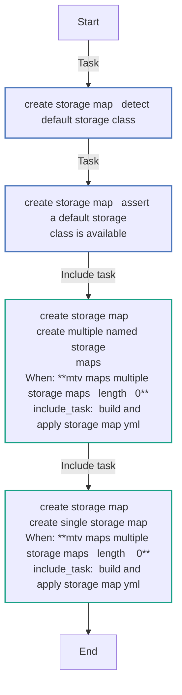
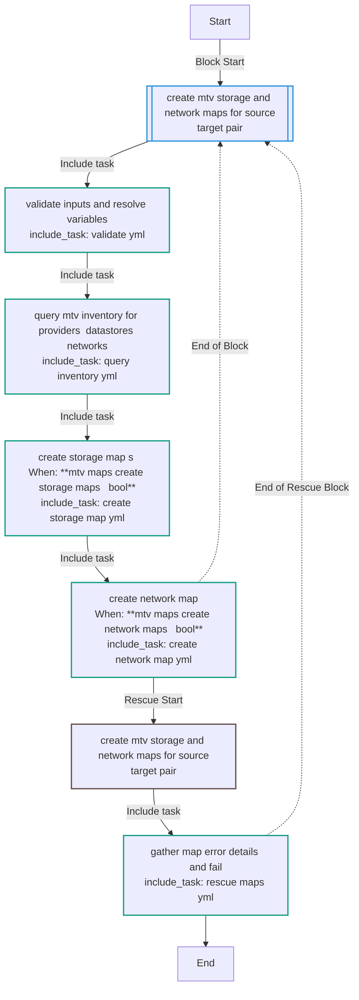
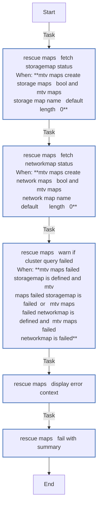

<!-- STATIC CONTENT START -->
# mtv_maps

Create MTV/Forklift StorageMap and NetworkMap CRs on OpenShift target clusters.

<!-- STATIC CONTENT END -->
<!-- DOCSIBLE START -->
## mtv_maps

```
Role belongs to infra/openshift_virtualization_migration
Namespace - infra
Collection - openshift_virtualization_migration
Version - 1.25.0
Repository - https://github.com/redhat-cop/openshift_virtualization_migration
```

Description: Create MTV/Forklift StorageMap and NetworkMap CRs on OpenShift target clusters for a given source-target pair.

### Argument Specifications

<details>
<summary><b>🧩 Argument Specifications in `meta/argument_specs`</b></summary>

#### Key: main

* **Description**: ['Creates StorageMap and/or NetworkMap custom resources on a target OpenShift cluster for a given source-target pair. Queries the MTV inventory to discover datastores, storage classes, networks, and NADs, then builds and applies the mapping CRs.', 'Designed to run from AAP with OCP credential injection. The OpenShift connection is provided by the AAP OpenShift credential which sets K8S_AUTH_* environment variables. Source credentials are NOT required — the role queries the MTV inventory which already has access to the source environment via its Provider CR.', 'Uses the mtv_query_inventory role (included via include_role) for all MTV inventory API queries.']
* **Options**:
  * **mtv_maps_api_version**:
    * **Required**: False
    * **Type**: str
    * **Default**: forklift.konveyor.io/v1beta1
    * **Description**: Forklift API version for map CRs.
  * **mtv_maps_create_network_maps**:
    * **Required**: False
    * **Type**: bool
    * **Default**: True
    * **Description**: Whether to create NetworkMap CRs.
  * **mtv_maps_create_storage_maps**:
    * **Required**: False
    * **Type**: bool
    * **Default**: True
    * **Description**: Whether to create StorageMap CRs.
  * **mtv_maps_default_storage_class**:
    * **Required**: False
    * **Type**: str
    * **Default**:
    * **Description**: Default storage class on the destination cluster. If empty, auto-detected from the cluster's default StorageClass annotation.
  * **mtv_maps_destination_provider_name**:
    * **Required**: False
    * **Type**: str
    * **Default**: host
    * **Description**: Name of the destination (OpenShift) provider in the MTV inventory.
  * **mtv_maps_inventory_retrieval_method**:
    * **Required**: False
    * **Type**: str
    * **Default**: api
    * **Description**: Method used by mtv_query_inventory to retrieve data from the MTV inventory service.
    * **Choices**:
      * api
      * exec
  * **mtv_maps_multiple_storage_maps**:
    * **Required**: False
    * **Type**: dict
    * **Default**: {}
    * **Description**: Dictionary of named storage maps. Keys are map names (sanitised to RFC 1123), values are lists of per-datastore overrides. Takes precedence over mtv_maps_storage_map_overrides.
  * **mtv_maps_nad_source_annotation**:
    * **Required**: False
    * **Type**: str
    * **Default**: infra.openshift-virtualization-migration/source-portgroup
    * **Description**: Annotation on NetworkAttachmentDefinitions used for auto-matching source portgroups to destination NADs.
  * **mtv_maps_namespace**:
    * **Required**: False
    * **Type**: str
    * **Default**: openshift-mtv
    * **Description**: Namespace where the StorageMap and NetworkMap CRs will be created. Resolved from the target host's mtv_namespace variable by default.
  * **mtv_maps_network_map_overrides**:
    * **Required**: False
    * **Type**: list
    * **Default**: []
    * **Description**: Per-network overrides for the network map. Each entry may contain id, destination_type (pod/multus/ignored), nad (namespace/name or just name), exclude, and include.
  * **mtv_maps_openshift_api_key**:
    * **Required**: True
    * **Type**: str
    * **Default**: none
    * **Description**: OpenShift API key / bearer token. Cascades from K8S_AUTH_API_KEY env var or inventory variables.
  * **mtv_maps_openshift_host**:
    * **Required**: True
    * **Type**: str
    * **Default**: none
    * **Description**: OpenShift host URL. Cascades from K8S_AUTH_HOST env var or openshift_host inventory variable.
  * **mtv_maps_openshift_verify_ssl**:
    * **Required**: False
    * **Type**: bool
    * **Default**: True
    * **Description**: Whether to verify SSL certificates for OpenShift connections.
  * **mtv_maps_query_delay**:
    * **Required**: False
    * **Type**: int
    * **Default**: 5
    * **Description**: Delay in seconds between inventory query retries.
  * **mtv_maps_query_retries**:
    * **Required**: False
    * **Type**: int
    * **Default**: 5
    * **Description**: Number of retries for inventory queries.
  * **mtv_maps_secure_logging**:
    * **Required**: False
    * **Type**: bool
    * **Default**: True
    * **Description**: Whether to enable secure logging for sensitive tasks.
  * **mtv_maps_source_provider_name**:
    * **Required**: False
    * **Type**: str
    * **Default**: none
    * **Description**: Name of the source provider in the MTV inventory. Defaults to the rfc1123-sanitised source_name.
  * **mtv_maps_source_type**:
    * **Required**: False
    * **Type**: str
    * **Default**: vmware
    * **Description**: Type of the source environment. Resolved from the source host's type variable in the AAP inventory.
    * **Choices**:
      * vmware
      * ovirt
  * **mtv_maps_storage_map_overrides**:
    * **Required**: False
    * **Type**: list
    * **Default**: []
    * **Description**: Per-datastore overrides for the single storage map. Each entry may contain id, storageClass, exclude, and include. Ignored when mtv_maps_multiple_storage_maps is populated.
  * **source_name**:
    * **Required**: True
    * **Type**: str
    * **Default**: none
    * **Description**: Name of the source environment (must match an AAP inventory host in the vm_sources group).
  * **target_name**:
    * **Required**: True
    * **Type**: str
    * **Default**: none
    * **Description**: Name of the target OpenShift cluster (must match an AAP inventory host in the migration_clusters group).

</details>

### Defaults

**These are static variables with lower priority**

#### File: defaults/main.yml

| Var          | Type         | Value       |Choices    |Required    | Title       |
|--------------|--------------|-------------|-------------|-------------|-------------|
| [`mtv_maps_api_version`](defaults/main.yml#L78)   | str   | `forklift.konveyor.io/v1beta1` |  None  |   False  |  Forklift API Version |
| [`mtv_maps_create_network_maps`](defaults/main.yml#L52)   | bool   | `True` |  None  |   False  |  Create Network Maps |
| [`mtv_maps_create_storage_maps`](defaults/main.yml#L47)   | bool   | `True` |  None  |   False  |  Create Storage Maps |
| [`mtv_maps_default_storage_class`](defaults/main.yml#L93)   | str   | `` |  None  |   False  |  Default Storage Class |
| [`mtv_maps_destination_provider_name`](defaults/main.yml#L73)   | str   | `host` |  None  |   False  |  Destination Provider Name |
| [`mtv_maps_inventory_retrieval_method`](defaults/main.yml#L132)   | str   | `api` |  None  |   False  |  Inventory Retrieval Method |
| [`mtv_maps_managed_by_label`](defaults/main.yml#L147)   | str   | `ansible-migration-factory` |  None  |   False  |  Managed By Label |
| [`mtv_maps_multiple_storage_maps`](defaults/main.yml#L109)   | dict   | `{}` |  None  |   False  |  Multiple Storage Maps |
| [`mtv_maps_nad_source_annotation`](defaults/main.yml#L124)   | str   | `<multiline value: folded_strip>` |  None  |   False  |  NAD Source Annotation |
| [`mtv_maps_namespace`](defaults/main.yml#L59)   | str   | `<multiline value: folded_strip>` |  None  |   False  |  Namespace |
| [`mtv_maps_network_map_overrides`](defaults/main.yml#L117)   | list   | `[]` |  None  |   False  |  Network Map Overrides |
| [`mtv_maps_openshift_api_key`](defaults/main.yml#L23)   | str   | `<multiline value: folded_strip>` |  None  |   True  |  OpenShift API Key |
| [`mtv_maps_openshift_host`](defaults/main.yml#L13)   | str   | `<multiline value: folded_strip>` |  None  |   True  |  OpenShift Host |
| [`mtv_maps_openshift_verify_ssl`](defaults/main.yml#L38)   | str   | `<multiline value: folded_strip>` |  None  |   False  |  OpenShift Verify SSL |
| [`mtv_maps_query_delay`](defaults/main.yml#L142)   | int   | `5` |  None  |   False  |  Query Delay |
| [`mtv_maps_query_retries`](defaults/main.yml#L137)   | int   | `5` |  None  |   False  |  Query Retries |
| [`mtv_maps_secure_logging`](defaults/main.yml#L6)   | str   | `{{ secure_logging ¦ default(true) }}` |  None  |   False  |  Secure Logging |
| [`mtv_maps_source_provider_name`](defaults/main.yml#L67)   | str   | `<multiline value: folded_strip>` |  None  |   False  |  Source Provider Name |
| [`mtv_maps_source_type`](defaults/main.yml#L85)   | str   | `<multiline value: folded_strip>` |  None  |   False  |  Source Type |
| [`mtv_maps_storage_map_overrides`](defaults/main.yml#L101)   | list   | `[]` |  None  |   False  |  Storage Map Overrides |

<summary><b>🖇️ Full descriptions for vars in defaults/main.yml</b></summary>
<br>
<b>`mtv_maps_api_version`:</b> Forklift API version for map CRs.
<br>
<b>`mtv_maps_create_network_maps`:</b> Whether to create NetworkMap CRs.
<br>
<b>`mtv_maps_create_storage_maps`:</b> Whether to create StorageMap CRs.
<br>
<b>`mtv_maps_default_storage_class`:</b> >-
<br>
<b>`mtv_maps_destination_provider_name`:</b> Name of the destination (OpenShift) provider in the MTV inventory.
<br>
<b>`mtv_maps_inventory_retrieval_method`:</b> >-
<br>
<b>`mtv_maps_managed_by_label`:</b> Value of the app.kubernetes.io/managed-by label applied to CRs.
<br>
<b>`mtv_maps_multiple_storage_maps`:</b> >-
<br>
<b>`mtv_maps_nad_source_annotation`:</b> >-
<br>
<b>`mtv_maps_namespace`:</b> >-
<br>
<b>`mtv_maps_network_map_overrides`:</b> >-
<br>
<b>`mtv_maps_openshift_api_key`:</b> >-
<br>
<b>`mtv_maps_openshift_host`:</b> >-
<br>
<b>`mtv_maps_openshift_verify_ssl`:</b> Whether to verify SSL certificates for OpenShift connections.
<br>
<b>`mtv_maps_query_delay`:</b> Delay in seconds between inventory query retries.
<br>
<b>`mtv_maps_query_retries`:</b> Number of retries for inventory queries.
<br>
<b>`mtv_maps_secure_logging`:</b> Whether to enable secure logging for sensitive tasks.
<br>
<b>`mtv_maps_source_provider_name`:</b> >-
<br>
<b>`mtv_maps_source_type`:</b> >-
<br>
<b>`mtv_maps_storage_map_overrides`:</b> >-
<br>
<br>

### Tasks

#### File: tasks/main.yml

| Name | Module | Has Conditions |
| ---- | ------ | --------- |
| Create MTV storage and network maps for source-target pair | `block` | False |
| Validate inputs and resolve variables | `ansible.builtin.include_tasks` | False |
| Query MTV inventory for providers, datastores, networks | `ansible.builtin.include_tasks` | False |
| Create storage map(s) | `ansible.builtin.include_tasks` | True |
| Create network map | `ansible.builtin.include_tasks` | True |

#### File: tasks/_build_and_apply_storage_map.yml

| Name | Module | Has Conditions |
| ---- | ------ | --------- |
| _build_and_apply_storage_map ¦ Reset state for this iteration | `ansible.builtin.set_fact` | False |
| _build_and_apply_storage_map ¦ Extract included datastore IDs | `ansible.builtin.set_fact` | True |
| _build_and_apply_storage_map ¦ Extract excluded datastore IDs | `ansible.builtin.set_fact` | True |
| _build_and_apply_storage_map ¦ Filter datastores | `ansible.builtin.set_fact` | False |
| _build_and_apply_storage_map ¦ Build map entries | `ansible.builtin.set_fact` | False |
| _build_and_apply_storage_map ¦ Apply StorageMap CR | `redhat.openshift.k8s` | False |
| _build_and_apply_storage_map ¦ StorageMap created successfully | `ansible.builtin.debug` | False |

#### File: tasks/_resolve_network_destination.yml

| Name | Module | Has Conditions |
| ---- | ------ | --------- |
| _resolve_network_destination ¦ Look up explicit override for this network | `ansible.builtin.set_fact` | False |
| _resolve_network_destination ¦ Try annotation-based NAD auto-match | `ansible.builtin.set_fact` | True |
| _resolve_network_destination ¦ Warn if multiple NADs match the same portgroup | `ansible.builtin.debug` | True |
| _resolve_network_destination ¦ Build destination from explicit override | `ansible.builtin.set_fact` | True |
| _resolve_network_destination ¦ Build destination from auto-matched NAD | `ansible.builtin.set_fact` | True |
| _resolve_network_destination ¦ Default destination to pod network | `ansible.builtin.set_fact` | True |
| _resolve_network_destination ¦ Append entry to network map | `ansible.builtin.set_fact` | False |

#### File: tasks/create_network_map.yml

| Name | Module | Has Conditions |
| ---- | ------ | --------- |
| create_network_map ¦ Reset state | `ansible.builtin.set_fact` | False |
| create_network_map ¦ Extract included network IDs | `ansible.builtin.set_fact` | True |
| create_network_map ¦ Extract excluded network IDs | `ansible.builtin.set_fact` | True |
| create_network_map ¦ Filter networks | `ansible.builtin.set_fact` | False |
| create_network_map ¦ Build map entries | `ansible.builtin.include_tasks` | False |
| create_network_map ¦ Apply NetworkMap CR | `redhat.openshift.k8s` | False |
| create_network_map ¦ NetworkMap created successfully | `ansible.builtin.debug` | False |

#### File: tasks/create_storage_map.yml

| Name | Module | Has Conditions |
| ---- | ------ | --------- |
| create_storage_map ¦ Detect default storage class | `ansible.builtin.set_fact` | False |
| create_storage_map ¦ Assert a default storage class is available | `ansible.builtin.assert` | False |
| create_storage_map ¦ Create multiple named storage maps | `ansible.builtin.include_tasks` | True |
| create_storage_map ¦ Create single storage map | `ansible.builtin.include_tasks` | True |

#### File: tasks/query_inventory.yml

| Name | Module | Has Conditions |
| ---- | ------ | --------- |
| query_inventory ¦ Query MTV providers | `ansible.builtin.include_role` | False |
| query_inventory ¦ Assert source provider exists in MTV inventory | `ansible.builtin.assert` | False |
| query_inventory ¦ Assert destination provider exists in MTV inventory | `ansible.builtin.assert` | False |
| query_inventory ¦ Resolve provider references | `ansible.builtin.set_fact` | False |
| query_inventory ¦ Query source datastores | `ansible.builtin.include_role` | True |
| query_inventory ¦ Query destination storage classes | `ansible.builtin.include_role` | True |
| query_inventory ¦ Query source networks | `ansible.builtin.include_role` | True |
| query_inventory ¦ Query destination network attachment definitions | `ansible.builtin.include_role` | True |

#### File: tasks/rescue_maps.yml

| Name | Module | Has Conditions |
| ---- | ------ | --------- |
| rescue_maps ¦ Fetch StorageMap status | `kubernetes.core.k8s_info` | True |
| rescue_maps ¦ Fetch NetworkMap status | `kubernetes.core.k8s_info` | True |
| rescue_maps ¦ Warn if cluster query failed | `ansible.builtin.debug` | True |
| rescue_maps ¦ Display error context | `ansible.builtin.debug` | False |
| rescue_maps ¦ Fail with summary | `ansible.builtin.fail` | False |

#### File: tasks/validate.yml

| Name | Module | Has Conditions |
| ---- | ------ | --------- |
| validate ¦ Assert required survey variables are defined | `ansible.builtin.assert` | False |
| validate ¦ Assert target exists in AAP inventory | `ansible.builtin.assert` | False |
| validate ¦ Assert source exists in AAP inventory | `ansible.builtin.assert` | False |
| validate ¦ Assert source is mapped to this target | `ansible.builtin.assert` | False |
| validate ¦ Assert source type is supported | `ansible.builtin.assert` | False |
| validate ¦ Assert mutually exclusive storage map overrides | `ansible.builtin.assert` | True |
| validate ¦ Assert storage overrides do not mix include and exclude | `ansible.builtin.assert` | True |
| validate ¦ Assert network overrides do not mix include and exclude | `ansible.builtin.assert` | True |
| validate ¦ Check StorageMap CRD exists on target cluster | `kubernetes.core.k8s_info` | True |
| validate ¦ Assert StorageMap CRD is installed | `ansible.builtin.assert` | True |
| validate ¦ Check NetworkMap CRD exists on target cluster | `kubernetes.core.k8s_info` | True |
| validate ¦ Assert NetworkMap CRD is installed | `ansible.builtin.assert` | True |
| validate ¦ Resolve source-type-specific variables | `ansible.builtin.set_fact` | False |

## Task Flow Graphs

### Graph for _build_and_apply_storage_map.yml

```mermaid
flowchart TD
Start
classDef block stroke:#3498db,stroke-width:2px;
classDef task stroke:#4b76bb,stroke-width:2px;
classDef includeTasks stroke:#16a085,stroke-width:2px;
classDef importTasks stroke:#34495e,stroke-width:2px;
classDef includeRole stroke:#2980b9,stroke-width:2px;
classDef importRole stroke:#699ba7,stroke-width:2px;
classDef includeVars stroke:#8e44ad,stroke-width:2px;
classDef rescue stroke:#665352,stroke-width:2px;

  Start-->|Task| _build_and_apply_storage_map___Reset_state_for_this_iteration0[ build and apply storage map   reset state for<br>this iteration]:::task
  _build_and_apply_storage_map___Reset_state_for_this_iteration0-->|Task| _build_and_apply_storage_map___Extract_included_datastore_IDs1[ build and apply storage map   extract included<br>datastore ids<br>When: **mtv maps current overrides   selectattr  include <br>  defined     list   length   0**]:::task
  _build_and_apply_storage_map___Extract_included_datastore_IDs1-->|Task| _build_and_apply_storage_map___Extract_excluded_datastore_IDs2[ build and apply storage map   extract excluded<br>datastore ids<br>When: **mtv maps current overrides   selectattr  exclude <br>  defined     list   length   0**]:::task
  _build_and_apply_storage_map___Extract_excluded_datastore_IDs2-->|Task| _build_and_apply_storage_map___Filter_datastores3[ build and apply storage map   filter datastores]:::task
  _build_and_apply_storage_map___Filter_datastores3-->|Task| _build_and_apply_storage_map___Build_map_entries4[ build and apply storage map   build map entries]:::task
  _build_and_apply_storage_map___Build_map_entries4-->|Task| _build_and_apply_storage_map___Apply_StorageMap_CR5[ build and apply storage map   apply storagemap cr]:::task
  _build_and_apply_storage_map___Apply_StorageMap_CR5-->|Task| _build_and_apply_storage_map___StorageMap_created_successfully6[ build and apply storage map   storagemap created<br>successfully]:::task
  _build_and_apply_storage_map___StorageMap_created_successfully6-->End
```



### Graph for _resolve_network_destination.yml

```mermaid
flowchart TD
Start
classDef block stroke:#3498db,stroke-width:2px;
classDef task stroke:#4b76bb,stroke-width:2px;
classDef includeTasks stroke:#16a085,stroke-width:2px;
classDef importTasks stroke:#34495e,stroke-width:2px;
classDef includeRole stroke:#2980b9,stroke-width:2px;
classDef importRole stroke:#699ba7,stroke-width:2px;
classDef includeVars stroke:#8e44ad,stroke-width:2px;
classDef rescue stroke:#665352,stroke-width:2px;

  Start-->|Task| _resolve_network_destination___Look_up_explicit_override_for_this_network0[ resolve network destination   look up explicit<br>override for this network]:::task
  _resolve_network_destination___Look_up_explicit_override_for_this_network0-->|Task| _resolve_network_destination___Try_annotation_based_NAD_auto_match1[ resolve network destination   try annotation<br>based nad auto match<br>When: **mtv maps net override destination type is not<br>defined**]:::task
  _resolve_network_destination___Try_annotation_based_NAD_auto_match1-->|Task| _resolve_network_destination___Warn_if_multiple_NADs_match_the_same_portgroup2[ resolve network destination   warn if multiple<br>nads match the same portgroup<br>When: **mtv maps net matching nads is defined and  mtv<br>maps net matching nads   length   1**]:::task
  _resolve_network_destination___Warn_if_multiple_NADs_match_the_same_portgroup2-->|Task| _resolve_network_destination___Build_destination_from_explicit_override3[ resolve network destination   build destination<br>from explicit override<br>When: **mtv maps net override destination type is defined**]:::task
  _resolve_network_destination___Build_destination_from_explicit_override3-->|Task| _resolve_network_destination___Build_destination_from_auto_matched_NAD4[ resolve network destination   build destination<br>from auto matched nad<br>When: **mtv maps net override destination type is not<br>defined and  mtv maps net matching nads   default <br>     length   0**]:::task
  _resolve_network_destination___Build_destination_from_auto_matched_NAD4-->|Task| _resolve_network_destination___Default_destination_to_pod_network5[ resolve network destination   default destination<br>to pod network<br>When: **mtv maps net override destination type is not<br>defined and  mtv maps net matching nads   default <br>     length    0**]:::task
  _resolve_network_destination___Default_destination_to_pod_network5-->|Task| _resolve_network_destination___Append_entry_to_network_map6[ resolve network destination   append entry to<br>network map]:::task
  _resolve_network_destination___Append_entry_to_network_map6-->End
```



### Graph for create_network_map.yml

```mermaid
flowchart TD
Start
classDef block stroke:#3498db,stroke-width:2px;
classDef task stroke:#4b76bb,stroke-width:2px;
classDef includeTasks stroke:#16a085,stroke-width:2px;
classDef importTasks stroke:#34495e,stroke-width:2px;
classDef includeRole stroke:#2980b9,stroke-width:2px;
classDef importRole stroke:#699ba7,stroke-width:2px;
classDef includeVars stroke:#8e44ad,stroke-width:2px;
classDef rescue stroke:#665352,stroke-width:2px;

  Start-->|Task| create_network_map___Reset_state0[create network map   reset state]:::task
  create_network_map___Reset_state0-->|Task| create_network_map___Extract_included_network_IDs1[create network map   extract included network ids<br>When: **mtv maps network map overrides   selectattr <br>include    defined     list   length   0**]:::task
  create_network_map___Extract_included_network_IDs1-->|Task| create_network_map___Extract_excluded_network_IDs2[create network map   extract excluded network ids<br>When: **mtv maps network map overrides   selectattr <br>exclude    defined     list   length   0**]:::task
  create_network_map___Extract_excluded_network_IDs2-->|Task| create_network_map___Filter_networks3[create network map   filter networks]:::task
  create_network_map___Filter_networks3-->|Include task| create_network_map___Build_map_entries__resolve_network_destination_yml_4[create network map   build map entries<br>include_task:  resolve network destination yml]:::includeTasks
  create_network_map___Build_map_entries__resolve_network_destination_yml_4-->|Task| create_network_map___Apply_NetworkMap_CR5[create network map   apply networkmap cr]:::task
  create_network_map___Apply_NetworkMap_CR5-->|Task| create_network_map___NetworkMap_created_successfully6[create network map   networkmap created<br>successfully]:::task
  create_network_map___NetworkMap_created_successfully6-->End
```



### Graph for create_storage_map.yml



### Graph for main.yml



### Graph for query_inventory.yml

```mermaid
flowchart TD
Start
classDef block stroke:#3498db,stroke-width:2px;
classDef task stroke:#4b76bb,stroke-width:2px;
classDef includeTasks stroke:#16a085,stroke-width:2px;
classDef importTasks stroke:#34495e,stroke-width:2px;
classDef includeRole stroke:#2980b9,stroke-width:2px;
classDef importRole stroke:#699ba7,stroke-width:2px;
classDef includeVars stroke:#8e44ad,stroke-width:2px;
classDef rescue stroke:#665352,stroke-width:2px;

  Start-->|Include role| query_inventory___Query_MTV_providers_infra_openshift_virtualization_migration_mtv_query_inventory_0(query inventory   query mtv providers<br>include_role: infra openshift virtualization migration mtv query<br>inventory):::includeRole
  query_inventory___Query_MTV_providers_infra_openshift_virtualization_migration_mtv_query_inventory_0-->|Task| query_inventory___Assert_source_provider_exists_in_MTV_inventory1[query inventory   assert source provider exists in<br>mtv inventory]:::task
  query_inventory___Assert_source_provider_exists_in_MTV_inventory1-->|Task| query_inventory___Assert_destination_provider_exists_in_MTV_inventory2[query inventory   assert destination provider<br>exists in mtv inventory]:::task
  query_inventory___Assert_destination_provider_exists_in_MTV_inventory2-->|Task| query_inventory___Resolve_provider_references3[query inventory   resolve provider references]:::task
  query_inventory___Resolve_provider_references3-->|Include role| query_inventory___Query_source_datastores_infra_openshift_virtualization_migration_mtv_query_inventory_4(query inventory   query source datastores<br>When: **mtv maps create storage maps   bool**<br>include_role: infra openshift virtualization migration mtv query<br>inventory):::includeRole
  query_inventory___Query_source_datastores_infra_openshift_virtualization_migration_mtv_query_inventory_4-->|Include role| query_inventory___Query_destination_storage_classes_infra_openshift_virtualization_migration_mtv_query_inventory_5(query inventory   query destination storage<br>classes<br>When: **mtv maps create storage maps   bool**<br>include_role: infra openshift virtualization migration mtv query<br>inventory):::includeRole
  query_inventory___Query_destination_storage_classes_infra_openshift_virtualization_migration_mtv_query_inventory_5-->|Include role| query_inventory___Query_source_networks_infra_openshift_virtualization_migration_mtv_query_inventory_6(query inventory   query source networks<br>When: **mtv maps create network maps   bool**<br>include_role: infra openshift virtualization migration mtv query<br>inventory):::includeRole
  query_inventory___Query_source_networks_infra_openshift_virtualization_migration_mtv_query_inventory_6-->|Include role| query_inventory___Query_destination_network_attachment_definitions_infra_openshift_virtualization_migration_mtv_query_inventory_7(query inventory   query destination network<br>attachment definitions<br>When: **mtv maps create network maps   bool**<br>include_role: infra openshift virtualization migration mtv query<br>inventory):::includeRole
  query_inventory___Query_destination_network_attachment_definitions_infra_openshift_virtualization_migration_mtv_query_inventory_7-->End
```



### Graph for rescue_maps.yml



### Graph for validate.yml

```mermaid
flowchart TD
Start
classDef block stroke:#3498db,stroke-width:2px;
classDef task stroke:#4b76bb,stroke-width:2px;
classDef includeTasks stroke:#16a085,stroke-width:2px;
classDef importTasks stroke:#34495e,stroke-width:2px;
classDef includeRole stroke:#2980b9,stroke-width:2px;
classDef importRole stroke:#699ba7,stroke-width:2px;
classDef includeVars stroke:#8e44ad,stroke-width:2px;
classDef rescue stroke:#665352,stroke-width:2px;

  Start-->|Task| validate___Assert_required_survey_variables_are_defined0[validate   assert required survey variables are<br>defined]:::task
  validate___Assert_required_survey_variables_are_defined0-->|Task| validate___Assert_target_exists_in_AAP_inventory1[validate   assert target exists in aap inventory]:::task
  validate___Assert_target_exists_in_AAP_inventory1-->|Task| validate___Assert_source_exists_in_AAP_inventory2[validate   assert source exists in aap inventory]:::task
  validate___Assert_source_exists_in_AAP_inventory2-->|Task| validate___Assert_source_is_mapped_to_this_target3[validate   assert source is mapped to this target]:::task
  validate___Assert_source_is_mapped_to_this_target3-->|Task| validate___Assert_source_type_is_supported4[validate   assert source type is supported]:::task
  validate___Assert_source_type_is_supported4-->|Task| validate___Assert_mutually_exclusive_storage_map_overrides5[validate   assert mutually exclusive storage map<br>overrides<br>When: **mtv maps create storage maps   bool**]:::task
  validate___Assert_mutually_exclusive_storage_map_overrides5-->|Task| validate___Assert_storage_overrides_do_not_mix_include_and_exclude6[validate   assert storage overrides do not mix<br>include and exclude<br>When: **mtv maps create storage maps   bool and mtv maps<br>storage map overrides   length   0**]:::task
  validate___Assert_storage_overrides_do_not_mix_include_and_exclude6-->|Task| validate___Assert_network_overrides_do_not_mix_include_and_exclude7[validate   assert network overrides do not mix<br>include and exclude<br>When: **mtv maps create network maps   bool and mtv maps<br>network map overrides   length   0**]:::task
  validate___Assert_network_overrides_do_not_mix_include_and_exclude7-->|Task| validate___Check_StorageMap_CRD_exists_on_target_cluster8[validate   check storagemap crd exists on target<br>cluster<br>When: **mtv maps create storage maps   bool**]:::task
  validate___Check_StorageMap_CRD_exists_on_target_cluster8-->|Task| validate___Assert_StorageMap_CRD_is_installed9[validate   assert storagemap crd is installed<br>When: **mtv maps create storage maps   bool**]:::task
  validate___Assert_StorageMap_CRD_is_installed9-->|Task| validate___Check_NetworkMap_CRD_exists_on_target_cluster10[validate   check networkmap crd exists on target<br>cluster<br>When: **mtv maps create network maps   bool**]:::task
  validate___Check_NetworkMap_CRD_exists_on_target_cluster10-->|Task| validate___Assert_NetworkMap_CRD_is_installed11[validate   assert networkmap crd is installed<br>When: **mtv maps create network maps   bool**]:::task
  validate___Assert_NetworkMap_CRD_is_installed11-->|Task| validate___Resolve_source_type_specific_variables12[validate   resolve source type specific variables]:::task
  validate___Resolve_source_type_specific_variables12-->End
```



## Author Information

Red Hat CoP

## License

GPL-3.0-or-later

## Minimum Ansible Version

2.15

## Platforms

* **EL**: ['9']

<!-- DOCSIBLE END -->