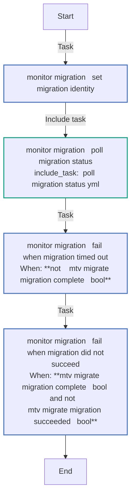

# infra.openshift_virtualization_migration mtv_migrate Role

This role creates and executes MTV (Migration Toolkit for Virtualization) migrations in OpenShift. It can create Migration objects from existing Plans and optionally monitor the migration progress until completion.

## Features

- **Migration Creation**: Creates Migration objects from existing MTV Plans
- **Verification & Monitoring**: Optionally monitors migration progress and VM status when `mtv_migrate_verify_complete` is enabled
- **Status Reporting**: Provides detailed status updates including individual VM progress during migration
- **Error Handling**: Properly handles migration failures and timeout scenarios
- **Warm Migration Support**: Supports both cold and warm migration types with cutover timing

## Migration Verification

When `mtv_migrate_verify_complete` is set to `true`, the role will:

1. Monitor the Migration object until completion or failure
2. Display regular status updates including:
   - Overall migration phase
   - VM counts (total, succeeded, running, failed)
   - Individual VM status (at verbosity level 1)
3. Retry checking every `mtv_migrate_verify_delay` seconds (default: 20)
4. Fail after `mtv_migrate_verify_retries` attempts (default: 360, ~2 hours)
5. Automatically detect successful completion or failures

## Requirements

Any pre-requisites that may not be covered by Ansible itself or the role should be mentioned here. For instance, if the role uses the EC2 module, it may be a good idea to mention in this section that the boto package is required.

## Role Variables

A description of the settable variables for this role should go here, including any variables that are in defaults/main.yml, vars/main.yml, and any variables that can/should be set via parameters to the role. Any variables that are read from other roles and/or the global scope (ie. hostvars, group vars, etc.) should be mentioned here as well.

## Dependencies

A list of other roles hosted on Galaxy should go here, plus any details in regards to parameters that may need to be set for other roles, or variables that are used from other roles.

## Example Playbook

Basic migration without verification:

```yaml
- name: Execute MTV Migration
  hosts: localhost
  roles:
    - role: infra.openshift_virtualization_migration.mtv_migrate
      mtv_migrate_plan_name: "my-migration-plan"
      mtv_migrate_plan_namespace: "openshift-mtv"
```

Migration with verification and monitoring:

```yaml
- name: Execute MTV Migration with Verification
  hosts: localhost
  roles:
    - role: infra.openshift_virtualization_migration.mtv_migrate
      mtv_migrate_plan_name: "my-migration-plan"
      mtv_migrate_plan_namespace: "openshift-mtv"
      mtv_migrate_verify_complete: true
      mtv_migrate_verify_retries: 180  # 1 hour with 20s delay
      mtv_migrate_verify_delay: 20
```

Using include_role syntax:

```yaml
- name: Execute MTV Migration
  hosts: localhost
  gather_facts: false
  tasks:
    - name: Trigger MTV migration with verification
      ansible.builtin.include_role:
        name: infra.openshift_virtualization_migration.mtv_migrate
      vars:
        mtv_migrate_plan_name: "my-migration-plan"
        mtv_migrate_plan_namespace: "openshift-mtv"
        mtv_migrate_verify_complete: true
```

## Role Idempotency

**Partially Idempotent**

- Migration creation is idempotent - running the role multiple times with the same Plan will not create duplicate migrations
- Migration verification is read-only and idempotent
- The actual migration process itself is not idempotent by nature (VMs are moved/copied)

## Role Atomicity

**Not Atomic**

This role initiates VM migrations which are long-running operations. If the role fails or is interrupted:

- The Migration object may remain in the cluster
- VMs may be in various states of migration
- Manual intervention may be required to clean up or resume migrations

## Roll-back capabilities

Define the roll-back capabilities of the role

## Argument Specification

Including an example of how to add an argument Specification file that validates the arguments provided to the role.

```yaml
argument_specs:
  main:
    short_description: Role description.
    options:
      string_arg1:
        description: string argument description.
        type: "str"
        default: "x"
        choices: ["x", "y"]
```
<!-- DOCSIBLE START -->
## mtv_migrate

```
Role belongs to infra/openshift_virtualization_migration
Namespace - infra
Collection - openshift_virtualization_migration
Version - 1.25.0
Repository - https://github.com/redhat-cop/openshift_virtualization_migration
```

Description: MTV Migrate.

### Argument Specifications

<details>
<summary><b>🧩 Argument Specifications in `meta/argument_specs`</b></summary>

#### Key: main

* **Description**: ['This role executes a migration for an existing MTV Plan resource.', 'It creates a Migration resource and optionally monitors its progress to completion.', 'Supports both warm and cold migration types.']
* **Options**:
  * **mtv_migrate_managed_by_label**:
    * **Required**: False
    * **Type**: str
    * **Default**: ansible-migration-factory
    * **Description**: Value for the app.kubernetes.io/managed-by label applied to created resources.
  * **mtv_migrate_openshift_api_key**:
    * **Required**: True
    * **Type**: str
    * **Default**: none
    * **Description**: OpenShift API token for authentication.
  * **mtv_migrate_openshift_ca_cert_path**:
    * **Required**: False
    * **Type**: str
    * **Default**: none
    * **Description**: Path to the OpenShift CA certificate file for SSL verification.
  * **mtv_migrate_openshift_host**:
    * **Required**: True
    * **Type**: str
    * **Default**: none
    * **Description**: OpenShift cluster host/API endpoint.
  * **mtv_migrate_openshift_verify_ssl**:
    * **Required**: False
    * **Type**: bool
    * **Default**: True
    * **Description**: Whether to verify SSL certificates when connecting to OpenShift.
  * **mtv_migrate_plan_name**:
    * **Required**: True
    * **Type**: str
    * **Default**: none
    * **Description**: Name of the existing MTV Plan resource to execute.
  * **mtv_migrate_plan_namespace**:
    * **Required**: True
    * **Type**: str
    * **Default**: none
    * **Description**: Namespace containing the MTV Plan resource.
  * **mtv_migrate_verify_complete**:
    * **Required**: False
    * **Type**: bool
    * **Default**: False
    * **Description**: Whether to monitor the migration and wait for completion.
  * **mtv_migrate_verify_delay**:
    * **Required**: False
    * **Type**: int
    * **Default**: 20
    * **Description**: ['Seconds to wait between polling attempts.', 'Only used when mtv_migrate_verify_complete is true.']
  * **mtv_migrate_verify_per_vm_status**:
    * **Required**: False
    * **Type**: bool
    * **Default**: False
    * **Description**: ['Whether to display detailed per-VM migration status during monitoring.', 'Only used when mtv_migrate_verify_complete is true.']
  * **mtv_migrate_verify_retries**:
    * **Required**: False
    * **Type**: int
    * **Default**: 360
    * **Description**: ['Maximum number of polling attempts when waiting for migration completion.', 'Only used when mtv_migrate_verify_complete is true.']
  * **mtv_migrate_warm_cutover_time**:
    * **Required**: False
    * **Type**: str
    * **Default**:
    * **Description**: ["ISO 8601 timestamp for when the warm cutover should occur (e.g., '2026-04-07T02:00:00Z').", 'If empty, uses the current time for immediate cutover.', 'Only applicable for warm migrations.']
  * **mtv_migrate_warm_precopy_only**:
    * **Required**: False
    * **Type**: bool
    * **Default**: False
    * **Description**: ['Whether to perform only the precopy phase for warm migrations.', 'When true, stops after precopy without performing the final cutover.']

</details>

### Defaults

**These are static variables with lower priority**

#### File: defaults/main.yml

| Var          | Type         | Value       |Choices    |Required    | Title       |
|--------------|--------------|-------------|-------------|-------------|-------------|
| [`mtv_migrate_managed_by_label`](defaults/main.yml#L69)   | str   | `ansible-migration-factory` |  None  |   False  |  Managed By Label |
| [`mtv_migrate_openshift_api_key`](defaults/main.yml#L14)   | str   | `<multiline value: folded_strip>` |  None  |   True  |  OpenShift API Key |
| [`mtv_migrate_openshift_ca_cert_path`](defaults/main.yml#L29)   | str   | `<multiline value: folded_strip>` |  None  |   False  |  OpenShift CA Certificate Path |
| [`mtv_migrate_openshift_host`](defaults/main.yml#L6)   | str   | `<multiline value: folded_strip>` |  None  |   True  |  OpenShift Host |
| [`mtv_migrate_openshift_verify_ssl`](defaults/main.yml#L38)   | str   | `<multiline value: folded_strip>` |  None  |   False  |  OpenShift Verify SSL |
| [`mtv_migrate_plan_name`](defaults/main.yml#L47)   | str   | `` |  None  |   True  |  Migration Plan Name |
| [`mtv_migrate_plan_namespace`](defaults/main.yml#L52)   | str   | `` |  None  |   True  |  Migration Plan Namespace |
| [`mtv_migrate_verify_complete`](defaults/main.yml#L74)   | bool   | `False` |  None  |   False  |  Verify Complete |
| [`mtv_migrate_verify_delay`](defaults/main.yml#L84)   | int   | `20` |  None  |   False  |  Verify Complete Delay |
| [`mtv_migrate_verify_per_vm_status`](defaults/main.yml#L89)   | bool   | `False` |  None  |   False  |  Verify Per VM Status |
| [`mtv_migrate_verify_retries`](defaults/main.yml#L79)   | int   | `360` |  None  |   False  |  Verify Complete Retries |
| [`mtv_migrate_warm_cutover_time`](defaults/main.yml#L59)   | str   | `` |  None  |   False  |  Warm Cutover Time |
| [`mtv_migrate_warm_precopy_only`](defaults/main.yml#L64)   | bool   | `False` |  None  |   False  |  Warm Precopy Only |

<summary><b>🖇️ Full descriptions for vars in defaults/main.yml</b></summary>
<br>
<b>`mtv_migrate_managed_by_label`:</b> Value of the app.kubernetes.io/managed-by label applied to resources.
<br>
<b>`mtv_migrate_openshift_api_key`:</b> OpenShift API key.
<br>
<b>`mtv_migrate_openshift_ca_cert_path`:</b> Path to the OpenShift CA Certificate.
<br>
<b>`mtv_migrate_openshift_host`:</b> OpenShift host.
<br>
<b>`mtv_migrate_openshift_verify_ssl`:</b> Whether to verify SSL certificates.
<br>
<b>`mtv_migrate_plan_name`:</b> Name of the MTV plan.
<br>
<b>`mtv_migrate_plan_namespace`:</b> Namespace of the MTV plan.
<br>
<b>`mtv_migrate_verify_complete`:</b> Whether to verify completion
<br>
<b>`mtv_migrate_verify_delay`:</b> Seconds to wait between retries
<br>
<b>`mtv_migrate_verify_per_vm_status`:</b> Whether to display per-VM migration details on each poll cycle.
<br>
<b>`mtv_migrate_verify_retries`:</b> Number of retries when waiting for completion
<br>
<b>`mtv_migrate_warm_cutover_time`:</b> >-
<br>
<b>`mtv_migrate_warm_precopy_only`:</b> Whether to perform only the precopy phase for warm migrations.
<br>
<br>

### Tasks

#### File: tasks/main.yml

| Name | Module | Has Conditions |
| ---- | ------ | --------- |
| Verify Plan Name and Namespace Provided | `ansible.builtin.assert` | False |
| Retrieve MTV Plan | `kubernetes.core.k8s_info` | False |
| Verify Plan Exists | `ansible.builtin.assert` | False |
| Set Plan Fact | `ansible.builtin.set_fact` | False |
| Set Warm Migration Fact | `ansible.builtin.set_fact` | False |
| Fail When Plan Not Ready for Migration | `ansible.builtin.fail` | True |
| Create Migration | `redhat.openshift.k8s` | False |
| Monitor Migration Progress | `ansible.builtin.include_tasks` | True |

#### File: tasks/_monitor_migration.yml

| Name | Module | Has Conditions |
| ---- | ------ | --------- |
| _monitor_migration ¦ Set Migration Identity | `ansible.builtin.set_fact` | False |
| _monitor_migration ¦ Poll Migration Status | `ansible.builtin.include_tasks` | False |
| _monitor_migration ¦ Fail When Migration Timed Out | `ansible.builtin.fail` | True |
| _monitor_migration ¦ Fail When Migration Did Not Succeed | `ansible.builtin.fail` | True |

#### File: tasks/_poll_migration_status.yml

| Name | Module | Has Conditions |
| ---- | ------ | --------- |
| _poll_migration_status ¦ Wait Before Polling | `ansible.builtin.pause` | True |
| _poll_migration_status ¦ Query Migration Status | `kubernetes.core.k8s_info` | False |
| _poll_migration_status ¦ Interpret Migration Status | `infra.openshift_virtualization_migration.mtv_migration_status` | True |
| _poll_migration_status ¦ Display Migration Progress Summary | `ansible.builtin.debug` | True |
| _poll_migration_status ¦ Display Per-VM Migration Status | `ansible.builtin.debug` | True |
| _poll_migration_status ¦ Update Completion Facts | `ansible.builtin.set_fact` | True |
| _poll_migration_status ¦ Increment Poll Attempt | `ansible.builtin.set_fact` | True |
| _poll_migration_status ¦ Recurse | `ansible.builtin.include_tasks` | True |

## Task Flow Graphs

### Graph for _monitor_migration.yml



### Graph for _poll_migration_status.yml

```mermaid
flowchart TD
Start
classDef block stroke:#3498db,stroke-width:2px;
classDef task stroke:#4b76bb,stroke-width:2px;
classDef includeTasks stroke:#16a085,stroke-width:2px;
classDef importTasks stroke:#34495e,stroke-width:2px;
classDef includeRole stroke:#2980b9,stroke-width:2px;
classDef importRole stroke:#699ba7,stroke-width:2px;
classDef includeVars stroke:#8e44ad,stroke-width:2px;
classDef rescue stroke:#665352,stroke-width:2px;

  Start-->|Task| _poll_migration_status___Wait_Before_Polling0[ poll migration status   wait before polling<br>When: **mtv migrate poll attempt   int   0**]:::task
  _poll_migration_status___Wait_Before_Polling0-->|Task| _poll_migration_status___Query_Migration_Status1[ poll migration status   query migration status]:::task
  _poll_migration_status___Query_Migration_Status1-->|Task| _poll_migration_status___Interpret_Migration_Status2[ poll migration status   interpret migration<br>status<br>When: **mtv migrate migration query resources   length  <br>0**]:::task
  _poll_migration_status___Interpret_Migration_Status2-->|Task| _poll_migration_status___Display_Migration_Progress_Summary3[ poll migration status   display migration<br>progress summary<br>When: **mtv migrate migration status is defined**]:::task
  _poll_migration_status___Display_Migration_Progress_Summary3-->|Task| _poll_migration_status___Display_Per_VM_Migration_Status4[ poll migration status   display per vm migration<br>status<br>When: **mtv migrate migration status is defined and mtv<br>migrate verify per vm status   bool**]:::task
  _poll_migration_status___Display_Per_VM_Migration_Status4-->|Task| _poll_migration_status___Update_Completion_Facts5[ poll migration status   update completion facts<br>When: **mtv migrate migration status is defined**]:::task
  _poll_migration_status___Update_Completion_Facts5-->|Task| _poll_migration_status___Increment_Poll_Attempt6[ poll migration status   increment poll attempt<br>When: **not    mtv migrate migration complete   bool**]:::task
  _poll_migration_status___Increment_Poll_Attempt6-->|Include task| _poll_migration_status___Recurse__poll_migration_status_yml_7[ poll migration status   recurse<br>When: **not    mtv migrate migration complete   bool  and <br> mtv migrate poll attempt   int   mtv migrate<br>verify retries   int**<br>include_task:  poll migration status yml]:::includeTasks
  _poll_migration_status___Recurse__poll_migration_status_yml_7-->End
```



### Graph for main.yml

```mermaid
flowchart TD
Start
classDef block stroke:#3498db,stroke-width:2px;
classDef task stroke:#4b76bb,stroke-width:2px;
classDef includeTasks stroke:#16a085,stroke-width:2px;
classDef importTasks stroke:#34495e,stroke-width:2px;
classDef includeRole stroke:#2980b9,stroke-width:2px;
classDef importRole stroke:#699ba7,stroke-width:2px;
classDef includeVars stroke:#8e44ad,stroke-width:2px;
classDef rescue stroke:#665352,stroke-width:2px;

  Start-->|Task| Verify_Plan_Name_and_Namespace_Provided0[verify plan name and namespace provided]:::task
  Verify_Plan_Name_and_Namespace_Provided0-->|Task| Retrieve_MTV_Plan1[retrieve mtv plan]:::task
  Retrieve_MTV_Plan1-->|Task| Verify_Plan_Exists2[verify plan exists]:::task
  Verify_Plan_Exists2-->|Task| Set_Plan_Fact3[set plan fact]:::task
  Set_Plan_Fact3-->|Task| Set_Warm_Migration_Fact4[set warm migration fact]:::task
  Set_Warm_Migration_Fact4-->|Task| Fail_When_Plan_Not_Ready_for_Migration5[fail when plan not ready for migration<br>When: **mtv migrate plan status migration   default    <br>true    length    0 and    mtv migrate plan status<br>conditions   default       selectattr  type   <br>defined     selectattr  status    defined    <br>selectattr  type    equalto    ready    <br>selectattr  status    equalto    true     list  <br>length    1**]:::task
  Fail_When_Plan_Not_Ready_for_Migration5-->|Task| Create_Migration6[create migration]:::task
  Create_Migration6-->|Include task| Monitor_Migration_Progress__monitor_migration_yml_7[monitor migration progress<br>When: **mtv migrate verify complete   bool**<br>include_task:  monitor migration yml]:::includeTasks
  Monitor_Migration_Progress__monitor_migration_yml_7-->End
```



## Author Information

Red Hat

## License

GPL-3.0-only

## Minimum Ansible Version

2.15.0

## Platforms

No platforms specified.

<!-- DOCSIBLE END -->