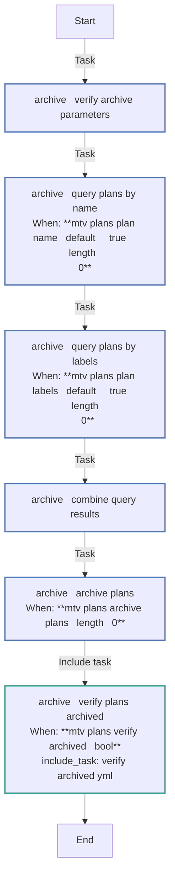
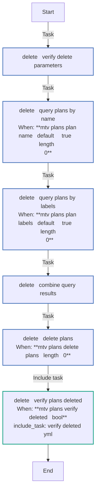
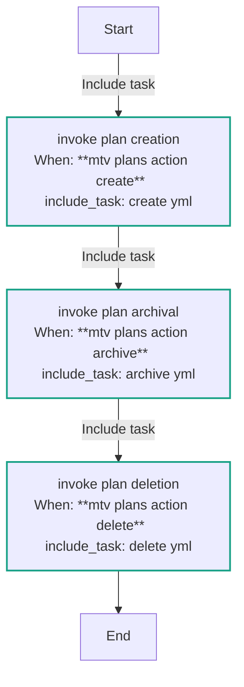

<!-- STATIC CONTENT START
Use this section for adding additional content to the README
This will not be overwritten by Docsible -->
# 📃 Role overview

Creates MTV (Migration Toolkit for Virtualization) `Plan` custom resources on an OpenShift cluster to migrate VMs from a source provider (e.g., VMware) to OpenShift Virtualization.

## Usage

### Providers

Specify the source and destination provider names and their namespaces.

```yaml
- name: Migrate with custom providers
  ansible.builtin.include_role:
    name: mtv_plans
  vars:
    mtv_plans_migration_request:
      source: vcenter-prod
      source_namespace: mtv-providers
      destination: ocp-cluster-east
      destination_namespace: mtv-providers
      vms:
        - name: db-server-01
        - name: app-server-02
```

### Custom network and storage maps

Specify explicit network and storage map names instead of the `<source>-<destination>` default.

```yaml
- name: Migrate with custom maps
  ansible.builtin.include_role:
    name: mtv_plans
  vars:
    mtv_plans_migration_request:
      network_map: prod-network-map
      network_map_namespace: vm-migrations
      storage_map: prod-storage-map
      storage_map_namespace: vm-migrations
      vms:
        - name: db-server-01
        - name: app-server-02
```

### Custom migration namespace

Control where migration resources are located and where migrated VMs land.

```yaml
- name: Migrate into a dedicated namespace
  ansible.builtin.include_role:
    name: mtv_plans
  vars:
    mtv_plans_migration_request:
      migration_namespace: vm-migrations
      target_namespace: migrated-vms
      vms:
        - name: db-server-01
        - name: app-server-02
```

### Migrate specific VMs

Migrate a set of VMs by name using defaults (`source: vmware`, `destination: host`, cold migration).

```yaml
- name: Migrate specific VMs
  ansible.builtin.include_role:
    name: mtv_plans
  vars:
    mtv_plans_migration_request:
      vms:
        - name: db-server-01
        - name: app-server-02
        - name: web-frontend-03
```

### Dry run

Preview the generated Plan manifests without applying them to the cluster.

```yaml
- name: Preview migration plans
  ansible.builtin.include_role:
    name: mtv_plans
  vars:
    mtv_plans_migration_request:
      dry_run: true
      vms:
        - name: db-server-01
        - name: app-server-02
```

### Folder-based migration with exclusions

Migrate all VMs in a VMware folder while excluding a specific VM.

```yaml
- name: Migrate folder excluding one VM
  ansible.builtin.include_role:
    name: mtv_plans
  vars:
    mtv_plans_migration_request:
      folders:
        - name: production-workloads
      vms:
        - name: legacy-vm-do-not-migrate
          exclude: true
```

### Split large migrations into multiple plans

Batch a large set of VMs into plans of 5 VMs each.

```yaml
- name: Split folder into batched plans
  ansible.builtin.include_role:
    name: mtv_plans
  vars:
    mtv_plans_migration_request:
      split_plans: true
      vms_per_plan: 5
      folders:
        - name: datacenter-workloads
```

### Warm migration with plan verification

Create a warm migration plan and wait until it reaches a `Ready` state before continuing.

```yaml
- name: Warm migration with readiness check
  ansible.builtin.include_role:
    name: mtv_plans
  vars:
    mtv_plans_migration_request:
      type: warm
      verify_plans_ready: true
      target_namespace: migrated-vms
      vms:
        - name: db-server-01
        - name: app-server-02
```

### Archive plans

Archive a plan by name.

```yaml
- name: Archive a migration plan
  ansible.builtin.include_role:
    name: mtv_plans
  vars:
    mtv_plans_action: archive
    mtv_plans_plan_name: my-migration-plan
    mtv_plans_plan_namespace: openshift-mtv
```

### Delete plans

Delete a plan by name.

```yaml
- name: Delete a migration plan
  ansible.builtin.include_role:
    name: mtv_plans
  vars:
    mtv_plans_action: delete
    mtv_plans_plan_name: my-migration-plan
    mtv_plans_plan_namespace: openshift-mtv
```

Delete plans by label selectors.

```yaml
- name: Delete plans by label
  ansible.builtin.include_role:
    name: mtv_plans
  vars:
    mtv_plans_action: delete
    mtv_plans_plan_namespace: openshift-mtv
    mtv_plans_plan_labels:
      - app=myapp
      - env=dev
```

<!-- STATIC CONTENT END -->
<!-- Everything below will be overwritten by Docsible -->
<!-- DOCSIBLE START -->
## mtv_plans

```
Role belongs to infra/openshift_virtualization_migration
Namespace - infra
Collection - openshift_virtualization_migration
Version - 1.25.0
Repository - https://github.com/redhat-cop/openshift_virtualization_migration
```

Description: Manages MTV migration plans.

### Argument Specifications

<details>
<summary><b>🧩 Argument Specifications in `meta/argument_specs`</b></summary>

#### Key: main

* **Description**: Manages MTV (Migration Toolkit for Virtualization) migration plans.
* **Options**:
  * **mtv_plans_action**:
    * **Required**: False
    * **Type**: str
    * **Default**: create
    * **Description**: Action to perform on the MTV plan.
    * **Choices**:
      * create
      * archive
      * delete
  * **mtv_plans_base_name_label**:
    * **Required**: False
    * **Type**: str
    * **Default**: infra.openshift-virtualization-migration/plan-name
    * **Description**: Label assigned to the MTV plan name.
  * **mtv_plans_managed_by_label**:
    * **Required**: False
    * **Type**: str
    * **Default**: ansible-migration-factory
    * **Description**: Value of the C(app.kubernetes.io/managed-by) label applied to resources.
  * **mtv_plans_migration_request**:
    * **Required**: True
    * **Type**: dict
    * **Default**: none
    * **Description**: Data structure representing a Plan migration request. Must contain at least one of I(vms) or I(folders).
    * **Options**:
      * **destination**:
        * **Required**: False
        * **Type**: str
        * **Default**: host
        * **Description**: Name of the destination provider where VMs will be migrated to.
      * **destination_namespace**:
        * **Required**: False
        * **Type**: str
        * **Default**: none
        * **Description**: Namespace the MTV destination provider is located within. Defaults to the I(mtv_namespace) value.
      * **dry_run**:
        * **Required**: False
        * **Type**: bool
        * **Default**: False
        * **Description**: Build the plans without applying them to the target OpenShift cluster. Plans are displayed at the end.
      * **folders**:
        * **Required**: False
        * **Type**: list
        * **Default**: []
        * **Description**: List of VMware folders containing VMs to migrate.
      * **migration_namespace**:
        * **Required**: False
        * **Type**: str
        * **Default**: none
        * **Description**: Namespace containing the migration resources. Defaults to the resolved value of I(mtv_namespace).
      * **mtv_namespace**:
        * **Required**: False
        * **Type**: str
        * **Default**: openshift-mtv
        * **Description**: Name of the namespace MTV is deployed within.
      * **network_map**:
        * **Required**: False
        * **Type**: str
        * **Default**: none
        * **Description**: Name of the NetworkMap to associate. Defaults to C(<source>-<destination>).
      * **network_map_namespace**:
        * **Required**: False
        * **Type**: str
        * **Default**: none
        * **Description**: Namespace containing the NetworkMap. Defaults to the I(mtv_namespace) value.
      * **plan_name**:
        * **Required**: False
        * **Type**: str
        * **Default**: none
        * **Description**: Name of the plan to create. Defaults to C(<source>-<destination>-yyyyMMdd-HHmm).
      * **plan_overrides**:
        * **Required**: False
        * **Type**: dict
        * **Default**: {}
        * **Description**: Configuration to apply at the Plan level.
      * **source**:
        * **Required**: False
        * **Type**: str
        * **Default**: vmware
        * **Description**: Name of the source provider containing VMs.
      * **source_namespace**:
        * **Required**: False
        * **Type**: str
        * **Default**: none
        * **Description**: Namespace the MTV source provider is located within. Defaults to the I(mtv_namespace) value.
      * **split_plans**:
        * **Required**: False
        * **Type**: bool
        * **Default**: False
        * **Description**: Determines whether to split VMs into multiple plans.
      * **storage_map**:
        * **Required**: False
        * **Type**: str
        * **Default**: none
        * **Description**: Name of the StorageMap to associate. Defaults to C(<source>-<destination>).
      * **storage_map_namespace**:
        * **Required**: False
        * **Type**: str
        * **Default**: none
        * **Description**: Namespace containing the StorageMap. Defaults to the I(mtv_namespace) value.
      * **target_namespace**:
        * **Required**: False
        * **Type**: str
        * **Default**: none
        * **Description**: Namespace VMs should be created in. Defaults to the I(mtv_namespace) value.
      * **type**:
        * **Required**: False
        * **Type**: str
        * **Default**: cold
        * **Description**: Migration type. Set to C(warm) to enable warm migrations.
        * **Choices**:
          * cold
          * warm
      * **verify_plans_ready**:
        * **Required**: False
        * **Type**: bool
        * **Default**: False
        * **Description**: Verifies plans are in a C(Ready) state after creation.
      * **vm_overrides**:
        * **Required**: False
        * **Type**: dict
        * **Default**: {}
        * **Description**: Configurations to apply to each VM (lowest priority).
      * **vms**:
        * **Required**: False
        * **Type**: list
        * **Default**: []
        * **Description**: Explicit list of VMs to migrate.
      * **vms_per_plan**:
        * **Required**: False
        * **Type**: int
        * **Default**: 10
        * **Description**: Number of VMs per plan when I(split_plans) is enabled. Must be a positive integer when I(split_plans) is C(true).
  * **mtv_plans_openshift_api_key**:
    * **Required**: True
    * **Type**: str
    * **Default**: none
    * **Description**: OpenShift API key.
  * **mtv_plans_openshift_ca_cert_path**:
    * **Required**: False
    * **Type**: str
    * **Default**: none
    * **Description**: Path to the OpenShift CA Certificate.
  * **mtv_plans_openshift_host**:
    * **Required**: True
    * **Type**: str
    * **Default**: none
    * **Description**: OpenShift host (eg. https://api.openshift.example.com:6443).
  * **mtv_plans_openshift_verify_ssl**:
    * **Required**: False
    * **Type**: bool
    * **Default**: True
    * **Description**: Whether to verify SSL certificates. Set to C(false) to disable verification.
  * **mtv_plans_plan_labels**:
    * **Required**: False
    * **Type**: list
    * **Default**: []
    * **Description**: Label selectors for plans to target (eg. C(app=myapp), C(env=prod)). Used when I(mtv_plans_action) is C(archive) or C(delete).
  * **mtv_plans_plan_name**:
    * **Required**: False
    * **Type**: str
    * **Default**:
    * **Description**: Name of the plan to target. Used when I(mtv_plans_action) is C(archive) or C(delete).
  * **mtv_plans_plan_namespace**:
    * **Required**: False
    * **Type**: str
    * **Default**:
    * **Description**: Namespace of the plan to target. Used when I(mtv_plans_action) is C(archive) or C(delete).
  * **mtv_plans_verify_archived**:
    * **Required**: False
    * **Type**: bool
    * **Default**: True
    * **Description**: Verifies plans are in an C(Archived) state after archiving. Used when I(mtv_plans_action) is C(archive).
  * **mtv_plans_verify_delay**:
    * **Required**: False
    * **Type**: int
    * **Default**: 20
    * **Description**: Amount of time in seconds to wait between retries to verify plans are ready.
  * **mtv_plans_verify_deleted**:
    * **Required**: False
    * **Type**: bool
    * **Default**: True
    * **Description**: Verifies plans have been deleted from the cluster. Used when I(mtv_plans_action) is C(delete).
  * **mtv_plans_verify_retries**:
    * **Required**: False
    * **Type**: int
    * **Default**: 180
    * **Description**: Number of retries to verify plans are ready.

</details>

### Defaults

**These are static variables with lower priority**

#### File: defaults/main.yml

| Var          | Type         | Value       |Choices    |Required    | Title       |
|--------------|--------------|-------------|-------------|-------------|-------------|
| [`mtv_plans_action`](defaults/main.yml#L86)   | str   | `create` |  None  |   False  |  Action to perform |
| [`mtv_plans_base_name_label`](defaults/main.yml#L91)   | str   | `infra.openshift-virtualization-migration/plan-name` |  None  |   False  |  MTV Migrate Annotation |
| [`mtv_plans_managed_by_label`](defaults/main.yml#L121)   | str   | `ansible-migration-factory` |  None  |   False  |  Managed By Label |
| [`mtv_plans_migration_request`](defaults/main.yml#L47)   | dict   | `{}` |  None  |   True  |  Plan Migration Request |
| [`mtv_plans_openshift_api_key`](defaults/main.yml#L14)   | str   | `<multiline value: folded_strip>` |  None  |   True  |  OpenShift API Key |
| [`mtv_plans_openshift_ca_cert_path`](defaults/main.yml#L29)   | str   | `<multiline value: folded_strip>` |  None  |   False  |  OpenShift CA Certificate Path |
| [`mtv_plans_openshift_host`](defaults/main.yml#L6)   | str   | `<multiline value: folded_strip>` |  None  |   True  |  OpenShift Host |
| [`mtv_plans_openshift_verify_ssl`](defaults/main.yml#L38)   | str   | `<multiline value: folded_strip>` |  None  |   False  |  OpenShift Verify SSL |
| [`mtv_plans_plan_labels`](defaults/main.yml#L106)   | list   | `[]` |  None  |   False  |  MTV Plan Labels |
| [`mtv_plans_plan_name`](defaults/main.yml#L96)   | str   | `` |  None  |   False  |  MTV Plan Name |
| [`mtv_plans_plan_namespace`](defaults/main.yml#L101)   | str   | `` |  None  |   False  |  MTV Plan Namespace |
| [`mtv_plans_verify_archived`](defaults/main.yml#L111)   | bool   | `True` |  None  |   False  |  MTV Verify Archived |
| [`mtv_plans_verify_delay`](defaults/main.yml#L130)   | int   | `20` |  None  |   False  |  MTV Migration Verify Plans Ready Delay |
| [`mtv_plans_verify_deleted`](defaults/main.yml#L116)   | bool   | `True` |  None  |   False  |  MTV Verify Deleted |
| [`mtv_plans_verify_retries`](defaults/main.yml#L126)   | int   | `180` |  None  |   False  |  MTV Migration Verify Plans Ready Retries |

<summary><b>🖇️ Full descriptions for vars in defaults/main.yml</b></summary>
<br>
<b>`mtv_plans_action`:</b> Action to take. Choices include: create, archive. Defaults to create.
<br>
<b>`mtv_plans_base_name_label`:</b> Label assigned to the MTV plan name
<br>
<b>`mtv_plans_managed_by_label`:</b> Value of the app.kubernetes.io/managed-by label applied to resources.
<br>
<b>`mtv_plans_migration_request`:</b> Data Structure Representing a Plan migration request
<br>
<b>`mtv_plans_openshift_api_key`:</b> OpenShift API key.
<br>
<b>`mtv_plans_openshift_ca_cert_path`:</b> Path to the OpenShift CA Certificate.
<br>
<b>`mtv_plans_openshift_host`:</b> OpenShift host.
<br>
<b>`mtv_plans_openshift_verify_ssl`:</b> Whether to verify SSL certificates.
<br>
<b>`mtv_plans_plan_labels`:</b> Labels of the plan to target
<br>
<b>`mtv_plans_plan_name`:</b> Name of the plan to target
<br>
<b>`mtv_plans_plan_namespace`:</b> Namespace of the plan to target
<br>
<b>`mtv_plans_verify_archived`:</b> Verifies Plans are in an Archived state after archiving
<br>
<b>`mtv_plans_verify_delay`:</b> Amount of time to wait between retries to verify plans are ready
<br>
<b>`mtv_plans_verify_deleted`:</b> Verifies Plans have been deleted
<br>
<b>`mtv_plans_verify_retries`:</b> Number of retries to verify plans are ready
<br>
<br>

### Vars

**These are variables with higher priority**

#### File: vars/main.yml

| Var          | Type         | Value       |
|--------------|--------------|-------------|
| [__mtv_plans_default_destination_target](vars/main.yml#L6)   | str   | `host` |
| [__mtv_plans_default_destination_target_namespace](vars/main.yml#L7)   | str   | `{{ __mtv_plans_migration_namespace }}` |
| [__mtv_plans_default_migrate_dry_run](vars/main.yml#L10)   | bool   | `False` |
| [__mtv_plans_default_namespace](vars/main.yml#L3)   | str   | `openshift-mtv` |
| [__mtv_plans_default_network_map_name](vars/main.yml#L18)   | str   | `<multiline value: folded_strip>` |
| [__mtv_plans_default_network_map_namespace](vars/main.yml#L22)   | str   | `{{ __mtv_plans_migration_namespace }}` |
| [__mtv_plans_default_plan_base_name](vars/main.yml#L14)   | str   | `<multiline value: folded_strip>` |
| [__mtv_plans_default_source_target](vars/main.yml#L4)   | str   | `vmware` |
| [__mtv_plans_default_source_target_namespace](vars/main.yml#L5)   | str   | `{{ __mtv_plans_migration_namespace }}` |
| [__mtv_plans_default_split_plans](vars/main.yml#L8)   | bool   | `False` |
| [__mtv_plans_default_storage_map_name](vars/main.yml#L23)   | str   | `<multiline value: folded_strip>` |
| [__mtv_plans_default_storage_map_namespace](vars/main.yml#L27)   | str   | `{{ __mtv_plans_migration_namespace }}` |
| [__mtv_plans_default_target_namespace](vars/main.yml#L13)   | str   | `{{ __mtv_plans_migration_namespace }}` |
| [__mtv_plans_default_type](vars/main.yml#L12)   | str   | `cold` |
| [__mtv_plans_default_verify_plans_ready](vars/main.yml#L11)   | bool   | `False` |
| [__mtv_plans_default_vms_per_plan](vars/main.yml#L9)   | int   | `10` |

### Tasks

#### File: tasks/main.yml

| Name | Module | Has Conditions |
| ---- | ------ | --------- |
| Invoke Plan Creation | `ansible.builtin.include_tasks` | True |
| Invoke Plan Archival | `ansible.builtin.include_tasks` | True |
| Invoke Plan Deletion | `ansible.builtin.include_tasks` | True |

#### File: tasks/archive.yml

| Name | Module | Has Conditions |
| ---- | ------ | --------- |
| archive ¦ Verify Archive Parameters | `ansible.builtin.assert` | False |
| archive ¦ Query Plans by Name | `kubernetes.core.k8s_info` | True |
| archive ¦ Query Plans by Labels | `kubernetes.core.k8s_info` | True |
| archive ¦ Combine Query Results | `ansible.builtin.set_fact` | False |
| archive ¦ Archive Plans | `redhat.openshift.k8s` | True |
| archive ¦ Verify Plans Archived | `ansible.builtin.include_tasks` | True |

#### File: tasks/create.yml

| Name | Module | Has Conditions |
| ---- | ------ | --------- |
| create ¦ Verify Request Provided | `ansible.builtin.assert` | False |
| create ¦ Verify VMs or Folders Provided | `ansible.builtin.assert` | False |
| create ¦ Process Request (MTV Namespace) | `ansible.builtin.set_fact` | False |
| create ¦ Process Request (Migration Namespace) | `ansible.builtin.set_fact` | False |
| create ¦ Process Request (Baseline) | `ansible.builtin.set_fact` | False |
| create ¦ Process Request (Maps) | `ansible.builtin.set_fact` | False |
| create ¦ Verify Split Plan Value is Positive | `ansible.builtin.assert` | True |
| create ¦ Set Plan Base Name | `ansible.builtin.set_fact` | False |
| create ¦ Retrieve Configured providers | `ansible.builtin.include_role` | False |
| create ¦ Set Source Provider | `ansible.builtin.set_fact` | False |
| create ¦ Verify Source Provider | `ansible.builtin.assert` | False |
| create ¦ Set Destination Provider | `ansible.builtin.set_fact` | False |
| create ¦ Verify Destination Provider | `ansible.builtin.assert` | False |
| create ¦ Retrieve StorageMap | `kubernetes.core.k8s_info` | False |
| create ¦ Verify StorageMap | `ansible.builtin.assert` | False |
| create ¦ Retrieve NetworkMap | `kubernetes.core.k8s_info` | False |
| create ¦ Verify NetworkMap | `ansible.builtin.assert` | False |
| create ¦ Process Plan Skeleton | `ansible.builtin.set_fact` | False |
| create ¦ Get Inventory vms | `ansible.builtin.include_role` | False |
| create ¦ Get Inventory folders | `ansible.builtin.include_role` | True |
| create ¦ Process VMs and Generate Plans | `infra.openshift_virtualization_migration.mtv_process_vms` | False |
| create ¦ Set Plans from processed results | `ansible.builtin.set_fact` | False |
| create ¦ Create and Verify Plans | `block` | True |
| create ¦ Create Plans | `redhat.openshift.k8s` | False |
| create ¦ Verify Plans Ready | `kubernetes.core.k8s_info` | True |
| create ¦ Display Plans (Dry Run) | `ansible.builtin.debug` | True |

#### File: tasks/delete.yml

| Name | Module | Has Conditions |
| ---- | ------ | --------- |
| delete ¦ Verify Delete Parameters | `ansible.builtin.assert` | False |
| delete ¦ Query Plans by Name | `kubernetes.core.k8s_info` | True |
| delete ¦ Query Plans by Labels | `kubernetes.core.k8s_info` | True |
| delete ¦ Combine Query Results | `ansible.builtin.set_fact` | False |
| delete ¦ Delete Plans | `redhat.openshift.k8s` | True |
| delete ¦ Verify Plans Deleted | `ansible.builtin.include_tasks` | True |

#### File: tasks/verify_archived.yml

| Name | Module | Has Conditions |
| ---- | ------ | --------- |
| verify_archived ¦ Query Plans by Name | `kubernetes.core.k8s_info` | True |
| verify_archived ¦ Query Plans by Labels | `kubernetes.core.k8s_info` | True |
| verify_archived ¦ Combine and Check Results | `ansible.builtin.set_fact` | False |
| verify_archived ¦ Evaluate Archived Status | `ansible.builtin.set_fact` | False |
| verify_archived ¦ Fail if Retries Exceeded | `ansible.builtin.fail` | True |
| verify_archived ¦ Wait Before Retry | `ansible.builtin.pause` | True |
| verify_archived ¦ Retry Verification | `ansible.builtin.include_tasks` | True |

#### File: tasks/verify_deleted.yml

| Name | Module | Has Conditions |
| ---- | ------ | --------- |
| verify_deleted ¦ Query Plans by Name | `kubernetes.core.k8s_info` | True |
| verify_deleted ¦ Query Plans by Labels | `kubernetes.core.k8s_info` | True |
| verify_deleted ¦ Combine and Check Results | `ansible.builtin.set_fact` | False |
| verify_deleted ¦ Evaluate Deleted Status | `ansible.builtin.set_fact` | False |
| verify_deleted ¦ Fail if Retries Exceeded | `ansible.builtin.fail` | True |
| verify_deleted ¦ Wait Before Retry | `ansible.builtin.pause` | True |
| verify_deleted ¦ Retry Verification | `ansible.builtin.include_tasks` | True |

## Task Flow Graphs

### Graph for archive.yml



### Graph for create.yml

```mermaid
flowchart TD
Start
classDef block stroke:#3498db,stroke-width:2px;
classDef task stroke:#4b76bb,stroke-width:2px;
classDef includeTasks stroke:#16a085,stroke-width:2px;
classDef importTasks stroke:#34495e,stroke-width:2px;
classDef includeRole stroke:#2980b9,stroke-width:2px;
classDef importRole stroke:#699ba7,stroke-width:2px;
classDef includeVars stroke:#8e44ad,stroke-width:2px;
classDef rescue stroke:#665352,stroke-width:2px;

  Start-->|Task| create___Verify_Request_Provided0[create   verify request provided]:::task
  create___Verify_Request_Provided0-->|Task| create___Verify_VMs_or_Folders_Provided1[create   verify vms or folders provided]:::task
  create___Verify_VMs_or_Folders_Provided1-->|Task| create___Process_Request__MTV_Namespace_2[create   process request  mtv namespace ]:::task
  create___Process_Request__MTV_Namespace_2-->|Task| create___Process_Request__Migration_Namespace_3[create   process request  migration namespace ]:::task
  create___Process_Request__Migration_Namespace_3-->|Task| create___Process_Request__Baseline_4[create   process request  baseline ]:::task
  create___Process_Request__Baseline_4-->|Task| create___Process_Request__Maps_5[create   process request  maps ]:::task
  create___Process_Request__Maps_5-->|Task| create___Verify_Split_Plan_Value_is_Positive6[create   verify split plan value is positive<br>When: **mtv plans mtv split plans   bool**]:::task
  create___Verify_Split_Plan_Value_is_Positive6-->|Task| create___Set_Plan_Base_Name7[create   set plan base name]:::task
  create___Set_Plan_Base_Name7-->|Include role| create___Retrieve_Configured_providers_mtv_query_inventory_8(create   retrieve configured providers<br>include_role: mtv query inventory):::includeRole
  create___Retrieve_Configured_providers_mtv_query_inventory_8-->|Task| create___Set_Source_Provider9[create   set source provider]:::task
  create___Set_Source_Provider9-->|Task| create___Verify_Source_Provider10[create   verify source provider]:::task
  create___Verify_Source_Provider10-->|Task| create___Set_Destination_Provider11[create   set destination provider]:::task
  create___Set_Destination_Provider11-->|Task| create___Verify_Destination_Provider12[create   verify destination provider]:::task
  create___Verify_Destination_Provider12-->|Task| create___Retrieve_StorageMap13[create   retrieve storagemap]:::task
  create___Retrieve_StorageMap13-->|Task| create___Verify_StorageMap14[create   verify storagemap]:::task
  create___Verify_StorageMap14-->|Task| create___Retrieve_NetworkMap15[create   retrieve networkmap]:::task
  create___Retrieve_NetworkMap15-->|Task| create___Verify_NetworkMap16[create   verify networkmap]:::task
  create___Verify_NetworkMap16-->|Task| create___Process_Plan_Skeleton17[create   process plan skeleton]:::task
  create___Process_Plan_Skeleton17-->|Include role| create___Get_Inventory_vms_mtv_query_inventory_18(create   get inventory vms<br>include_role: mtv query inventory):::includeRole
  create___Get_Inventory_vms_mtv_query_inventory_18-->|Include role| create___Get_Inventory_folders_mtv_query_inventory_19(create   get inventory folders<br>When: **folders  in mtv plans migration request and mtv<br>plans migration request  folders     default      <br>length   0**<br>include_role: mtv query inventory):::includeRole
  create___Get_Inventory_folders_mtv_query_inventory_19-->|Task| create___Process_VMs_and_Generate_Plans20[create   process vms and generate plans]:::task
  create___Process_VMs_and_Generate_Plans20-->|Task| create___Set_Plans_from_processed_results21[create   set plans from processed results]:::task
  create___Set_Plans_from_processed_results21-->|Block Start| create___Create_and_Verify_Plans22_block_start_0[[create   create and verify plans<br>When: **not   mtv plans mtv dry run bool**]]:::block
  create___Create_and_Verify_Plans22_block_start_0-->|Task| create___Create_Plans0[create   create plans]:::task
  create___Create_Plans0-->|Task| create___Verify_Plans_Ready1[create   verify plans ready<br>When: **mtv plans mtv verify plans ready bool**]:::task
  create___Verify_Plans_Ready1-.->|End of Block| create___Create_and_Verify_Plans22_block_start_0
  create___Verify_Plans_Ready1-->|Task| create___Display_Plans__Dry_Run_23[create   display plans  dry run <br>When: **mtv plans mtv dry run bool**]:::task
  create___Display_Plans__Dry_Run_23-->End
```



### Graph for delete.yml



### Graph for main.yml



### Graph for verify_archived.yml

```mermaid
flowchart TD
Start
classDef block stroke:#3498db,stroke-width:2px;
classDef task stroke:#4b76bb,stroke-width:2px;
classDef includeTasks stroke:#16a085,stroke-width:2px;
classDef importTasks stroke:#34495e,stroke-width:2px;
classDef includeRole stroke:#2980b9,stroke-width:2px;
classDef importRole stroke:#699ba7,stroke-width:2px;
classDef includeVars stroke:#8e44ad,stroke-width:2px;
classDef rescue stroke:#665352,stroke-width:2px;

  Start-->|Task| verify_archived___Query_Plans_by_Name0[verify archived   query plans by name<br>When: **mtv plans plan name   default     true    length  <br>0**]:::task
  verify_archived___Query_Plans_by_Name0-->|Task| verify_archived___Query_Plans_by_Labels1[verify archived   query plans by labels<br>When: **mtv plans plan labels   default     true    length<br>  0**]:::task
  verify_archived___Query_Plans_by_Labels1-->|Task| verify_archived___Combine_and_Check_Results2[verify archived   combine and check results]:::task
  verify_archived___Combine_and_Check_Results2-->|Task| verify_archived___Evaluate_Archived_Status3[verify archived   evaluate archived status]:::task
  verify_archived___Evaluate_Archived_Status3-->|Task| verify_archived___Fail_if_Retries_Exceeded4[verify archived   fail if retries exceeded<br>When: **not   mtv plans all archived   bool and   mtv<br>plans verify retries count   int    mtv plans<br>verify retries   int**]:::task
  verify_archived___Fail_if_Retries_Exceeded4-->|Task| verify_archived___Wait_Before_Retry5[verify archived   wait before retry<br>When: **not   mtv plans all archived   bool and   mtv<br>plans verify retries count   int   mtv plans<br>verify retries   int**]:::task
  verify_archived___Wait_Before_Retry5-->|Include task| verify_archived___Retry_Verification_verify_archived_yml_6[verify archived   retry verification<br>When: **not   mtv plans all archived   bool and   mtv<br>plans verify retries count   int   mtv plans<br>verify retries   int**<br>include_task: verify archived yml]:::includeTasks
  verify_archived___Retry_Verification_verify_archived_yml_6-->End
```



### Graph for verify_deleted.yml

```mermaid
flowchart TD
Start
classDef block stroke:#3498db,stroke-width:2px;
classDef task stroke:#4b76bb,stroke-width:2px;
classDef includeTasks stroke:#16a085,stroke-width:2px;
classDef importTasks stroke:#34495e,stroke-width:2px;
classDef includeRole stroke:#2980b9,stroke-width:2px;
classDef importRole stroke:#699ba7,stroke-width:2px;
classDef includeVars stroke:#8e44ad,stroke-width:2px;
classDef rescue stroke:#665352,stroke-width:2px;

  Start-->|Task| verify_deleted___Query_Plans_by_Name0[verify deleted   query plans by name<br>When: **mtv plans plan name   default     true    length  <br>0**]:::task
  verify_deleted___Query_Plans_by_Name0-->|Task| verify_deleted___Query_Plans_by_Labels1[verify deleted   query plans by labels<br>When: **mtv plans plan labels   default     true    length<br>  0**]:::task
  verify_deleted___Query_Plans_by_Labels1-->|Task| verify_deleted___Combine_and_Check_Results2[verify deleted   combine and check results]:::task
  verify_deleted___Combine_and_Check_Results2-->|Task| verify_deleted___Evaluate_Deleted_Status3[verify deleted   evaluate deleted status]:::task
  verify_deleted___Evaluate_Deleted_Status3-->|Task| verify_deleted___Fail_if_Retries_Exceeded4[verify deleted   fail if retries exceeded<br>When: **not   mtv plans all deleted   bool and   mtv plans<br>verify delete retries count   int    mtv plans<br>verify retries   int**]:::task
  verify_deleted___Fail_if_Retries_Exceeded4-->|Task| verify_deleted___Wait_Before_Retry5[verify deleted   wait before retry<br>When: **not   mtv plans all deleted   bool and   mtv plans<br>verify delete retries count   int   mtv plans<br>verify retries   int**]:::task
  verify_deleted___Wait_Before_Retry5-->|Include task| verify_deleted___Retry_Verification_verify_deleted_yml_6[verify deleted   retry verification<br>When: **not   mtv plans all deleted   bool and   mtv plans<br>verify delete retries count   int   mtv plans<br>verify retries   int**<br>include_task: verify deleted yml]:::includeTasks
  verify_deleted___Retry_Verification_verify_deleted_yml_6-->End
```



## Author Information

Red Hat

## License

GPL-3.0-only

## Minimum Ansible Version

2.15.0

## Platforms

No platforms specified.

<!-- DOCSIBLE END -->