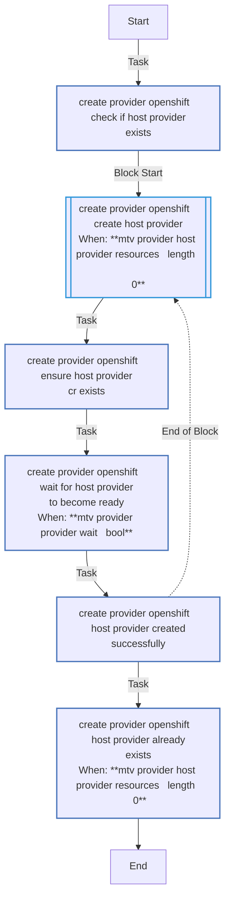
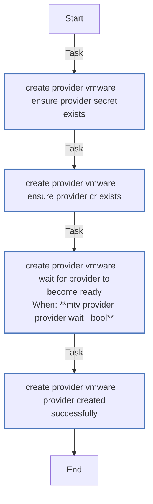
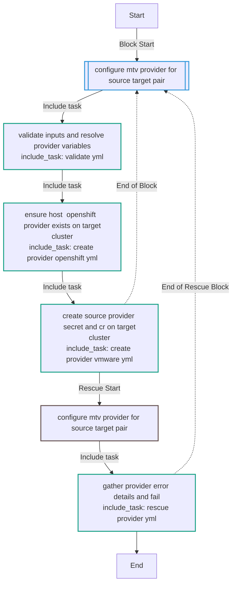
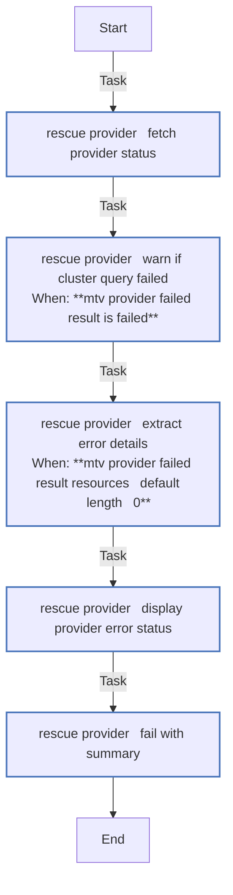

<!-- STATIC CONTENT START -->
# mtv_provider

Create MTV/Forklift source provider CRs on OpenShift target clusters.

<!-- STATIC CONTENT END -->
<!-- DOCSIBLE START -->
## mtv_provider

```
Role belongs to infra/openshift_virtualization_migration
Namespace - infra
Collection - openshift_virtualization_migration
Version - 1.25.0
Repository - https://github.com/redhat-cop/openshift_virtualization_migration
```

Description: Ensure host OpenShift provider and source provider CRs exist on target clusters. Designed to run from AAP with credential injection.

### Argument Specifications

<details>
<summary><b>🧩 Argument Specifications in `meta/argument_specs`</b></summary>

#### Key: main

* **Description**: ['Ensures the host OpenShift provider exists in the target namespace, then creates a Forklift Provider custom resource and its backing Secret for a given source environment.', 'Designed to run from AAP with credential injection. The source credential injects VMWARE_* environment variables and C(source_name) as an extra var. OpenShift connection is provided by the AAP target credential which sets K8S_AUTH_* environment variables and C(target_name) as an extra var.', 'For targets with multiple sources, launch the job template once per source-target pair.']
* **Options**:
  * **mtv_provider_api_version**:
    * **Required**: False
    * **Type**: str
    * **Default**: forklift.konveyor.io/v1beta1
    * **Description**: Forklift API version for Provider CRs.
  * **mtv_provider_auto_retrieve_cert**:
    * **Required**: False
    * **Type**: bool
    * **Default**: True
    * **Description**: Whether to automatically retrieve the source TLS certificate when verify_ssl is true and no certificate is provided. Set to C(false) to skip all certificate retrieval and rely on the user-provided certificate or insecureSkipVerify.
  * **mtv_provider_managed_by_label**:
    * **Required**: False
    * **Type**: str
    * **Default**: ansible-migration-factory
    * **Description**: Value of the app.kubernetes.io/managed-by label applied to Provider and Secret CRs.
  * **mtv_provider_openshift_provider_name**:
    * **Required**: False
    * **Type**: str
    * **Default**: host
    * **Description**: Name of the host OpenShift provider CR created in the target namespace. Defaults to C(host) to match the Forklift convention.
  * **mtv_provider_provider_namespace**:
    * **Required**: False
    * **Type**: str
    * **Default**: openshift-mtv
    * **Description**: Namespace where the provider will be created. Resolved from the target host's mtv_namespace variable by default.
  * **mtv_provider_provider_override**:
    * **Required**: False
    * **Type**: dict
    * **Default**: {}
    * **Description**: Override configuration merged into the Provider CR spec. Allows setting additional properties such as settings or other fields that evolve with the Forklift API.
  * **mtv_provider_provider_state**:
    * **Required**: False
    * **Type**: str
    * **Default**: present
    * **Description**: Desired state of the provider. Set to absent to remove a previously created provider and its secret.
    * **Choices**:
      * present
      * absent
  * **mtv_provider_provider_wait**:
    * **Required**: False
    * **Type**: bool
    * **Default**: True
    * **Description**: Whether to wait for the Provider CR to reach Ready status after creation.
  * **mtv_provider_provider_wait_poll**:
    * **Required**: False
    * **Type**: int
    * **Default**: 10
    * **Description**: Seconds between status polls while waiting for Ready.
  * **mtv_provider_provider_wait_timeout**:
    * **Required**: False
    * **Type**: int
    * **Default**: 120
    * **Description**: Seconds to wait for the Provider to become Ready before failing.
  * **mtv_provider_secure_logging**:
    * **Required**: False
    * **Type**: bool
    * **Default**: True
    * **Description**: Whether to enable secure logging for sensitive tasks.
  * **mtv_provider_source_certificate**:
    * **Required**: False
    * **Type**: str
    * **Default**:
    * **Description**: TLS CA certificate for the source hypervisor. Cascades from C(VMWARE_CA_CERT) env var or C(mf_source_certificate).
  * **mtv_provider_source_host**:
    * **Required**: True
    * **Type**: str
    * **Default**: none
    * **Description**: Hostname or URL of the source hypervisor. Resolved from the source host's C(host) variable in the AAP inventory.
  * **mtv_provider_source_password**:
    * **Required**: True
    * **Type**: str
    * **Default**: none
    * **Description**: Password for the source hypervisor. Cascades from C(VMWARE_PASSWORD) env var or C(mf_source_password).
  * **mtv_provider_source_sdk_endpoint**:
    * **Required**: False
    * **Type**: str
    * **Default**: /sdk
    * **Description**: SDK endpoint path appended to the source host URL for VMware providers. Resolved from the source host's C(sdk_endpoint) variable by default.
  * **mtv_provider_source_type**:
    * **Required**: False
    * **Type**: str
    * **Default**: vmware
    * **Description**: Type of the source environment. Resolved from the source host's C(type) variable in the AAP inventory.
    * **Choices**:
      * vmware
      * ovirt
  * **mtv_provider_source_username**:
    * **Required**: True
    * **Type**: str
    * **Default**: none
    * **Description**: Username for the source hypervisor. Cascades from C(VMWARE_USER) env var or C(mf_source_username).
  * **mtv_provider_source_vddk**:
    * **Required**: False
    * **Type**: dict
    * **Default**: {}
    * **Description**: VDDK configuration dictionary from the source host vars. When the C(image) key is set, the VDDK init image is included in the Provider CR settings.
  * **mtv_provider_source_verify_ssl**:
    * **Required**: False
    * **Type**: bool
    * **Default**: True
    * **Description**: Whether to verify TLS certificates for the source hypervisor. Cascades from C(VMWARE_VALIDATE_CERTS) env var; falls back to the inverse of C(mf_insecure_skip_tls_verify) if set, or C(true).
  * **source_name**:
    * **Required**: True
    * **Type**: str
    * **Default**: none
    * **Description**: Name of the source environment (must match an AAP inventory host in the vm_sources group).
  * **target_name**:
    * **Required**: True
    * **Type**: str
    * **Default**: none
    * **Description**: Name of the target OpenShift cluster (must match an AAP inventory host in the migration_clusters group).

</details>

### Defaults

**These are static variables with lower priority**

#### File: defaults/main.yml

| Var          | Type         | Value       |Choices    |Required    | Title       |
|--------------|--------------|-------------|-------------|-------------|-------------|
| [`mtv_provider_api_version`](defaults/main.yml#L39)   | str   | `forklift.konveyor.io/v1beta1` |  None  |   False  |  Forklift API Version |
| [`mtv_provider_auto_retrieve_cert`](defaults/main.yml#L60)   | bool   | `True` |  None  |   False  |  Auto Retrieve Certificate |
| [`mtv_provider_managed_by_label`](defaults/main.yml#L140)   | str   | `ansible-migration-factory` |  None  |   False  |  Managed By Label |
| [`mtv_provider_openshift_provider_name`](defaults/main.yml#L46)   | str   | `host` |  None  |   False  |  OpenShift Provider Name |
| [`mtv_provider_provider_namespace`](defaults/main.yml#L13)   | str   | `<multiline value: folded_strip>` |  None  |   False  |  Provider Namespace |
| [`mtv_provider_provider_override`](defaults/main.yml#L51)   | dict   | `{}` |  None  |   False  |  Provider Override |
| [`mtv_provider_provider_state`](defaults/main.yml#L34)   | str   | `present` |  None  |   False  |  Provider State |
| [`mtv_provider_provider_wait`](defaults/main.yml#L19)   | bool   | `True` |  None  |   False  |  Wait for Provider Ready |
| [`mtv_provider_provider_wait_poll`](defaults/main.yml#L29)   | int   | `10` |  None  |   False  |  Provider Wait Poll Interval |
| [`mtv_provider_provider_wait_timeout`](defaults/main.yml#L24)   | int   | `120` |  None  |   False  |  Provider Wait Timeout |
| [`mtv_provider_secure_logging`](defaults/main.yml#L6)   | str   | `{{ secure_logging ¦ default(true) }}` |  None  |   False  |  Secure Logging |
| [`mtv_provider_source_certificate`](defaults/main.yml#L105)   | str   | `<multiline value: folded_strip>` |  None  |   False  |  Source Certificate |
| [`mtv_provider_source_host`](defaults/main.yml#L75)   | str   | `<multiline value: folded_strip>` |  None  |   True  |  Source Host |
| [`mtv_provider_source_password`](defaults/main.yml#L94)   | str   | `<multiline value: folded_strip>` |  None  |   True  |  Source Password |
| [`mtv_provider_source_sdk_endpoint`](defaults/main.yml#L129)   | str   | `<multiline value: folded_strip>` |  None  |   False  |  Source SDK Endpoint |
| [`mtv_provider_source_type`](defaults/main.yml#L67)   | str   | `<multiline value: folded_strip>` |  None  |   False  |  Source Type |
| [`mtv_provider_source_username`](defaults/main.yml#L83)   | str   | `<multiline value: folded_strip>` |  None  |   True  |  Source Username |
| [`mtv_provider_source_vddk`](defaults/main.yml#L135)   | str   | `{{ hostvars[source_name]['vddk'] ¦ default({}) }}` |  None  |   False  |  Source VDDK Configuration |
| [`mtv_provider_source_verify_ssl`](defaults/main.yml#L117)   | str   | `<multiline value: folded_strip>` |  None  |   False  |  Source Verify SSL |

<summary><b>🖇️ Full descriptions for vars in defaults/main.yml</b></summary>
<br>
<b>`mtv_provider_api_version`:</b> Forklift API version for Provider CRs.
<br>
<b>`mtv_provider_auto_retrieve_cert`:</b> >-
<br>
<b>`mtv_provider_managed_by_label`:</b> Value of the app.kubernetes.io/managed-by label applied to CRs.
<br>
<b>`mtv_provider_openshift_provider_name`:</b> >-
<br>
<b>`mtv_provider_provider_namespace`:</b> >-
<br>
<b>`mtv_provider_provider_override`:</b> Override configuration merged into the Provider CR spec.
<br>
<b>`mtv_provider_provider_state`:</b> Desired state of the provider — present or absent.
<br>
<b>`mtv_provider_provider_wait`:</b> Whether to wait for the Provider CR to reach Ready status after creation.
<br>
<b>`mtv_provider_provider_wait_poll`:</b> Seconds between status polls while waiting for Ready.
<br>
<b>`mtv_provider_provider_wait_timeout`:</b> Seconds to wait for the Provider to become Ready before failing.
<br>
<b>`mtv_provider_secure_logging`:</b> Whether to enable secure logging for sensitive tasks.
<br>
<b>`mtv_provider_source_certificate`:</b> >-
<br>
<b>`mtv_provider_source_host`:</b> >-
<br>
<b>`mtv_provider_source_password`:</b> >-
<br>
<b>`mtv_provider_source_sdk_endpoint`:</b> SDK endpoint path appended to the source host URL for VMware providers.
<br>
<b>`mtv_provider_source_type`:</b> >-
<br>
<b>`mtv_provider_source_username`:</b> >-
<br>
<b>`mtv_provider_source_vddk`:</b> VDDK configuration dictionary from the source host vars.
<br>
<b>`mtv_provider_source_verify_ssl`:</b> >-
<br>
<br>

### Tasks

#### File: tasks/main.yml

| Name | Module | Has Conditions |
| ---- | ------ | --------- |
| Configure MTV provider for source-target pair | `block` | False |
| Validate inputs and resolve provider variables | `ansible.builtin.include_tasks` | False |
| Ensure host (openshift) provider exists on target cluster | `ansible.builtin.include_tasks` | False |
| Create source provider secret and CR on target cluster | `ansible.builtin.include_tasks` | False |

#### File: tasks/create_provider_openshift.yml

| Name | Module | Has Conditions |
| ---- | ------ | --------- |
| create_provider_openshift ¦ Check if host provider exists | `kubernetes.core.k8s_info` | False |
| create_provider_openshift ¦ Create host provider | `block` | True |
| create_provider_openshift ¦ Ensure host provider CR exists | `redhat.openshift.k8s` | False |
| create_provider_openshift ¦ Wait for host provider to become Ready | `kubernetes.core.k8s_info` | True |
| create_provider_openshift ¦ Host provider created successfully | `ansible.builtin.debug` | False |
| create_provider_openshift ¦ Host provider already exists | `ansible.builtin.debug` | True |

#### File: tasks/create_provider_vmware.yml

| Name | Module | Has Conditions |
| ---- | ------ | --------- |
| create_provider_vmware ¦ Ensure provider secret exists | `redhat.openshift.k8s` | False |
| create_provider_vmware ¦ Ensure provider CR exists | `redhat.openshift.k8s` | False |
| create_provider_vmware ¦ Wait for provider to become Ready | `kubernetes.core.k8s_info` | True |
| create_provider_vmware ¦ Provider created successfully | `ansible.builtin.debug` | False |

#### File: tasks/rescue_provider.yml

| Name | Module | Has Conditions |
| ---- | ------ | --------- |
| rescue_provider ¦ Fetch provider status | `kubernetes.core.k8s_info` | False |
| rescue_provider ¦ Warn if cluster query failed | `ansible.builtin.debug` | True |
| rescue_provider ¦ Extract error details | `ansible.builtin.set_fact` | True |
| rescue_provider ¦ Display provider error status | `ansible.builtin.debug` | False |
| rescue_provider ¦ Fail with summary | `ansible.builtin.fail` | False |

#### File: tasks/validate.yml

| Name | Module | Has Conditions |
| ---- | ------ | --------- |
| validate ¦ Assert required variables are defined | `ansible.builtin.assert` | False |
| validate ¦ Assert target exists in AAP inventory | `ansible.builtin.assert` | False |
| validate ¦ Assert source exists in AAP inventory | `ansible.builtin.assert` | False |
| validate ¦ Assert source is mapped to this target | `ansible.builtin.assert` | False |
| validate ¦ Assert source host variable is defined | `ansible.builtin.assert` | False |
| validate ¦ Assert source credentials are available | `ansible.builtin.assert` | False |
| validate ¦ Assert provider_override does not contain managed keys | `ansible.builtin.assert` | True |
| validate ¦ Assert source type is supported | `ansible.builtin.assert` | False |
| validate ¦ Check Forklift CRD exists on target cluster | `kubernetes.core.k8s_info` | False |
| validate ¦ Assert MTV operator is installed | `ansible.builtin.assert` | False |
| validate ¦ Resolve provider variables | `ansible.builtin.set_fact` | False |
| validate ¦ Retrieve source TLS certificate | `block` | True |
| validate ¦ Retrieve leaf certificate from source | `community.crypto.get_certificate` | False |
| validate ¦ Fetch CA certificate from VMCA endpoint | `block` | True |
| validate ¦ Download VMCA CA certificate (DER format) | `ansible.builtin.uri` | False |
| validate ¦ Convert VMCA CA certificate from DER to PEM | `ansible.builtin.command` | False |
| validate ¦ Store VMCA root CA certificate | `ansible.builtin.set_fact` | False |
| validate ¦ Store leaf certificate (non-VMware or VMCA fallback) | `ansible.builtin.set_fact` | True |
| validate ¦ Resolve effective certificate | `ansible.builtin.set_fact` | False |

## Task Flow Graphs

### Graph for create_provider_openshift.yml



### Graph for create_provider_vmware.yml



### Graph for main.yml



### Graph for rescue_provider.yml



### Graph for validate.yml

```mermaid
flowchart TD
Start
classDef block stroke:#3498db,stroke-width:2px;
classDef task stroke:#4b76bb,stroke-width:2px;
classDef includeTasks stroke:#16a085,stroke-width:2px;
classDef importTasks stroke:#34495e,stroke-width:2px;
classDef includeRole stroke:#2980b9,stroke-width:2px;
classDef importRole stroke:#699ba7,stroke-width:2px;
classDef includeVars stroke:#8e44ad,stroke-width:2px;
classDef rescue stroke:#665352,stroke-width:2px;

  Start-->|Task| validate___Assert_required_variables_are_defined0[validate   assert required variables are defined]:::task
  validate___Assert_required_variables_are_defined0-->|Task| validate___Assert_target_exists_in_AAP_inventory1[validate   assert target exists in aap inventory]:::task
  validate___Assert_target_exists_in_AAP_inventory1-->|Task| validate___Assert_source_exists_in_AAP_inventory2[validate   assert source exists in aap inventory]:::task
  validate___Assert_source_exists_in_AAP_inventory2-->|Task| validate___Assert_source_is_mapped_to_this_target3[validate   assert source is mapped to this target]:::task
  validate___Assert_source_is_mapped_to_this_target3-->|Task| validate___Assert_source_host_variable_is_defined4[validate   assert source host variable is defined]:::task
  validate___Assert_source_host_variable_is_defined4-->|Task| validate___Assert_source_credentials_are_available5[validate   assert source credentials are available]:::task
  validate___Assert_source_credentials_are_available5-->|Task| validate___Assert_provider_override_does_not_contain_managed_keys6[validate   assert provider override does not<br>contain managed keys<br>When: **mtv provider provider override   length   0**]:::task
  validate___Assert_provider_override_does_not_contain_managed_keys6-->|Task| validate___Assert_source_type_is_supported7[validate   assert source type is supported]:::task
  validate___Assert_source_type_is_supported7-->|Task| validate___Check_Forklift_CRD_exists_on_target_cluster8[validate   check forklift crd exists on target<br>cluster]:::task
  validate___Check_Forklift_CRD_exists_on_target_cluster8-->|Task| validate___Assert_MTV_operator_is_installed9[validate   assert mtv operator is installed]:::task
  validate___Assert_MTV_operator_is_installed9-->|Task| validate___Resolve_provider_variables10[validate   resolve provider variables]:::task
  validate___Resolve_provider_variables10-->|Block Start| validate___Retrieve_source_TLS_certificate11_block_start_0[[validate   retrieve source tls certificate<br>When: **mtv provider auto retrieve cert   bool and mtv<br>provider source verify ssl   bool and mtv provider<br>source certificate   trim   length    0**]]:::block
  validate___Retrieve_source_TLS_certificate11_block_start_0-->|Task| validate___Retrieve_leaf_certificate_from_source0[validate   retrieve leaf certificate from source]:::task
  validate___Retrieve_leaf_certificate_from_source0-->|Block Start| validate___Fetch_CA_certificate_from_VMCA_endpoint1_block_start_1[[validate   fetch ca certificate from vmca endpoint<br>When: **mtv provider source type     vmware**]]:::block
  validate___Fetch_CA_certificate_from_VMCA_endpoint1_block_start_1-->|Task| validate___Download_VMCA_CA_certificate__DER_format_0[validate   download vmca ca certificate  der<br>format ]:::task
  validate___Download_VMCA_CA_certificate__DER_format_0-->|Task| validate___Convert_VMCA_CA_certificate_from_DER_to_PEM1[validate   convert vmca ca certificate from der to<br>pem]:::task
  validate___Convert_VMCA_CA_certificate_from_DER_to_PEM1-->|Task| validate___Store_VMCA_root_CA_certificate2[validate   store vmca root ca certificate]:::task
  validate___Store_VMCA_root_CA_certificate2-.->|End of Block| validate___Fetch_CA_certificate_from_VMCA_endpoint1_block_start_1
  validate___Store_VMCA_root_CA_certificate2-->|Rescue Start| validate___Fetch_CA_certificate_from_VMCA_endpoint1_rescue_start_1[validate   fetch ca certificate from vmca endpoint<br>When: **mtv provider source type     vmware**]:::rescue
  validate___Fetch_CA_certificate_from_VMCA_endpoint1_rescue_start_1-->|Task| validate___VMCA_endpoint_unavailable__falling_back_to_leaf_cert0[validate   vmca endpoint unavailable  falling back<br>to leaf cert]:::task
  validate___VMCA_endpoint_unavailable__falling_back_to_leaf_cert0-.->|End of Rescue Block| validate___Fetch_CA_certificate_from_VMCA_endpoint1_block_start_1
  validate___VMCA_endpoint_unavailable__falling_back_to_leaf_cert0-->|Task| validate___Store_leaf_certificate__non_VMware_or_VMCA_fallback_2[validate   store leaf certificate  non vmware or<br>vmca fallback <br>When: **mtv provider source certificate is not defined**]:::task
  validate___Store_leaf_certificate__non_VMware_or_VMCA_fallback_2-.->|End of Block| validate___Retrieve_source_TLS_certificate11_block_start_0
  validate___Store_leaf_certificate__non_VMware_or_VMCA_fallback_2-->|Task| validate___Resolve_effective_certificate12[validate   resolve effective certificate]:::task
  validate___Resolve_effective_certificate12-->End
```



## Author Information

Red Hat

## License

GPL-3.0-only

## Minimum Ansible Version

2.16

## Platforms

No platforms specified.

<!-- DOCSIBLE END -->