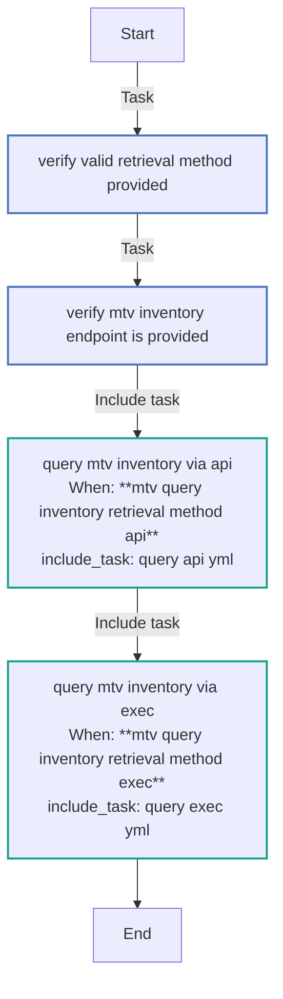
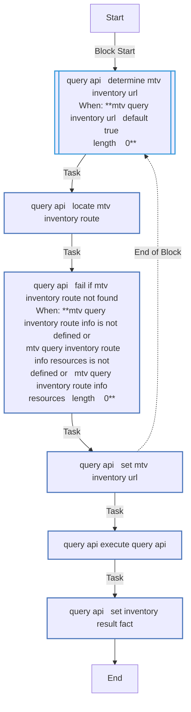
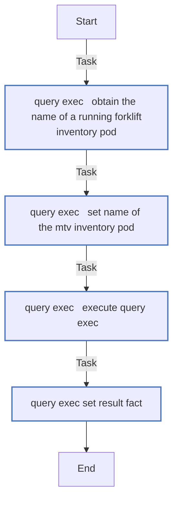

<!-- STATIC CONTENT START
Use this section for adding additional content to the README
This will not be overwritten by Docsible -->
# 📃 Role overview

<!-- STATIC CONTENT END -->
<!-- Everything below will be overwritten by Docsible -->
<!-- DOCSIBLE START -->
## mtv_query_inventory

```
Role belongs to infra/openshift_virtualization_migration
Namespace - infra
Collection - openshift_virtualization_migration
Version - 1.25.0
Repository - https://github.com/redhat-cop/openshift_virtualization_migration
```

Description: Queries MTV inventory.

### Argument Specifications

<details>
<summary><b>🧩 Argument Specifications in `meta/argument_specs`</b></summary>

#### Key: main

* **Description**: Query the MTV (Migration Toolkit for Virtualization) inventory.
* **Options**:
  * **mtv_query_inventory_api_scheme**:
    * **Required**: False
    * **Type**: str
    * **Default**: https
    * **Description**: Scheme to use when constructing the MTV Inventory URL.
  * **mtv_query_inventory_endpoint_path**:
    * **Required**: True
    * **Type**: str
    * **Default**: none
    * **Description**: Relative path to the MTV inventory retrieval endpoint (eg. /providers).
  * **mtv_query_inventory_namespace**:
    * **Required**: False
    * **Type**: str
    * **Default**: openshift-mtv
    * **Description**: Namespace containing the MTV inventory service.
  * **mtv_query_inventory_openshift_api_key**:
    * **Required**: True
    * **Type**: str
    * **Default**: none
    * **Description**: OpenShift API key.
  * **mtv_query_inventory_openshift_ca_cert_path**:
    * **Required**: False
    * **Type**: str
    * **Default**: none
    * **Description**: Path to the OpenShift CA Certificate.
  * **mtv_query_inventory_openshift_host**:
    * **Required**: True
    * **Type**: str
    * **Default**: none
    * **Description**: OpenShift host (eg. https://api.openshift.example.com:6443).
  * **mtv_query_inventory_openshift_verify_ssl**:
    * **Required**: False
    * **Type**: bool
    * **Default**: True
    * **Description**: Whether to verify SSL certificates.
  * **mtv_query_inventory_result_var**:
    * **Required**: False
    * **Type**: str
    * **Default**: mtv_query_inventory_query_result
    * **Description**: Name of the variable to store the query result.
  * **mtv_query_inventory_retrieval_method**:
    * **Required**: False
    * **Type**: str
    * **Default**: api
    * **Description**: Method to retrieve inventory data from MTV.
    * **Choices**:
      * api
      * exec
  * **mtv_query_inventory_route_name**:
    * **Required**: False
    * **Type**: str
    * **Default**: forklift-inventory
    * **Description**: MTV Inventory Route Name.
  * **mtv_query_inventory_secure_logging**:
    * **Required**: False
    * **Type**: bool
    * **Default**: True
    * **Description**: Whether to enable secure logging.
  * **mtv_query_inventory_service_name**:
    * **Required**: False
    * **Type**: str
    * **Default**: forklift-inventory
    * **Description**: MTV Inventory Service Name.
  * **mtv_query_inventory_url**:
    * **Required**: False
    * **Type**: str
    * **Default**:
    * **Description**: URL of the MTV Inventory Service. If not provided, the URL will be determined from the MTV Inventory Route.

</details>

### Defaults

**These are static variables with lower priority**

#### File: defaults/main.yml

| Var          | Type         | Value       |Choices    |Required    | Title       |
|--------------|--------------|-------------|-------------|-------------|-------------|
| [`mtv_query_inventory_api_scheme`](defaults/main.yml#L52)   | str   | `https` |  None  |   False  |  MTV Retrieval Method |
| [`mtv_query_inventory_endpoint_path`](defaults/main.yml#L57)   | NoneType   | `None` |  None  |   True  |  MTV Inventory Retrieval Endpoint |
| [`mtv_query_inventory_namespace`](defaults/main.yml#L84)   | str   | `openshift-mtv` |  None  |   False  |  Inventory Namespace |
| [`mtv_query_inventory_openshift_api_key`](defaults/main.yml#L14)   | str   | `<multiline value: folded_strip>` |  None  |   True  |  OpenShift API Key |
| [`mtv_query_inventory_openshift_ca_cert_path`](defaults/main.yml#L29)   | str   | `<multiline value: folded_strip>` |  None  |   False  |  OpenShift CA Certificate Path |
| [`mtv_query_inventory_openshift_host`](defaults/main.yml#L6)   | str   | `<multiline value: folded_strip>` |  None  |   True  |  OpenShift Host |
| [`mtv_query_inventory_openshift_verify_ssl`](defaults/main.yml#L38)   | str   | `<multiline value: folded_strip>` |  None  |   False  |  OpenShift Verify SSL |
| [`mtv_query_inventory_query_delay`](defaults/main.yml#L99)   | int   | `5` |  None  |   False  |  Inventory Query Delay |
| [`mtv_query_inventory_query_retries`](defaults/main.yml#L94)   | int   | `5` |  None  |   False  |  Inventory Query Retries |
| [`mtv_query_inventory_result_var`](defaults/main.yml#L89)   | str   | `mtv_query_inventory_query_result` |  None  |   False  |  Inventory Result Variable |
| [`mtv_query_inventory_retrieval_method`](defaults/main.yml#L47)   | str   | `api` |  None  |   False  |  MTV Retrieval Method |
| [`mtv_query_inventory_route_name`](defaults/main.yml#L74)   | str   | `forklift-inventory` |  None  |   False  |  Inventory Route Name |
| [`mtv_query_inventory_secure_logging`](defaults/main.yml#L69)   | str   | `{{ secure_logging ¦ default(true) }}` |  None  |   False  |  Secure Logging |
| [`mtv_query_inventory_service_name`](defaults/main.yml#L79)   | str   | `forklift-inventory` |  None  |   False  |  Inventory Service Name |
| [`mtv_query_inventory_url`](defaults/main.yml#L64)   | str   | `` |  None  |   False  |  Inventory URL |

<summary><b>🖇️ Full descriptions for vars in defaults/main.yml</b></summary>
<br>
<b>`mtv_query_inventory_api_scheme`:</b> Method to retrieve inventory data from MTV. Valid options are 'api' and 'exec'.
<br>
<b>`mtv_query_inventory_endpoint_path`:</b> MTV inventory retrieval endpoint.
<br>
<b>`mtv_query_inventory_namespace`:</b> Inventory Namespace
<br>
<b>`mtv_query_inventory_openshift_api_key`:</b> OpenShift API key.
<br>
<b>`mtv_query_inventory_openshift_ca_cert_path`:</b> Path to the OpenShift CA Certificate.
<br>
<b>`mtv_query_inventory_openshift_host`:</b> OpenShift host.
<br>
<b>`mtv_query_inventory_openshift_verify_ssl`:</b> Whether to verify SSL certificates.
<br>
<b>`mtv_query_inventory_query_delay`:</b> Delay between inventory query retries in seconds.
<br>
<b>`mtv_query_inventory_query_retries`:</b> Number of retries for the inventory queries.
<br>
<b>`mtv_query_inventory_result_var`:</b> Name of the variable to store the query result.
<br>
<b>`mtv_query_inventory_retrieval_method`:</b> Method to retrieve inventory data from MTV. Valid options are 'api' and 'exec'.
<br>
<b>`mtv_query_inventory_route_name`:</b> Inventory Route Name
<br>
<b>`mtv_query_inventory_secure_logging`:</b> Whether to enable secure logging.
<br>
<b>`mtv_query_inventory_service_name`:</b> Inventory Service Name
<br>
<b>`mtv_query_inventory_url`:</b> >-
<br>
<br>

### Vars

**These are variables with higher priority**

#### File: vars/main.yml

| Var          | Type         | Value       |
|--------------|--------------|-------------|
| [__mtv_query_inventory_valid_retrieval_methods](vars/main.yml#L2)   | list   | `[]` |
| [__mtv_query_inventory_valid_retrieval_methods.0](vars/main.yml#L3)   | str   | `api` |
| [__mtv_query_inventory_valid_retrieval_methods.1](vars/main.yml#L4)   | str   | `exec` |

### Tasks

#### File: tasks/main.yml

| Name | Module | Has Conditions |
| ---- | ------ | --------- |
| Verify valid retrieval method provided | `ansible.builtin.assert` | False |
| Verify MTV inventory endpoint is provided | `ansible.builtin.assert` | False |
| Query MTV inventory via api | `ansible.builtin.include_tasks` | True |
| Query MTV inventory via exec | `ansible.builtin.include_tasks` | True |

#### File: tasks/query_api.yml

| Name | Module | Has Conditions |
| ---- | ------ | --------- |
| query_api ¦ Determine MTV Inventory URL | `block` | True |
| query_api ¦ Locate MTV Inventory Route | `kubernetes.core.k8s_info` | False |
| query_api ¦ Fail if MTV Inventory Route not found | `ansible.builtin.fail` | True |
| query_api ¦ Set MTV Inventory URL | `ansible.builtin.set_fact` | False |
| query_api ¦ Execute Query (api) | `ansible.builtin.uri` | False |
| query_api ¦ Set Inventory Result Fact | `ansible.builtin.set_fact` | False |

#### File: tasks/query_exec.yml

| Name | Module | Has Conditions |
| ---- | ------ | --------- |
| query_exec ¦ Obtain the name of a Running Forklift Inventory Pod | `kubernetes.core.k8s_info` | False |
| query_exec ¦ Set name of the MTV Inventory Pod | `ansible.builtin.set_fact` | False |
| query_exec ¦ Execute Query (exec) | `kubernetes.core.k8s_exec` | False |
| query_exec ¦ Set Result Fact | `ansible.builtin.set_fact` | False |

## Task Flow Graphs

### Graph for main.yml



### Graph for query_api.yml



### Graph for query_exec.yml



## Author Information

Red Hat

## License

GPL-3.0-only

## Minimum Ansible Version

2.15.0

## Platforms

No platforms specified.

<!-- DOCSIBLE END -->