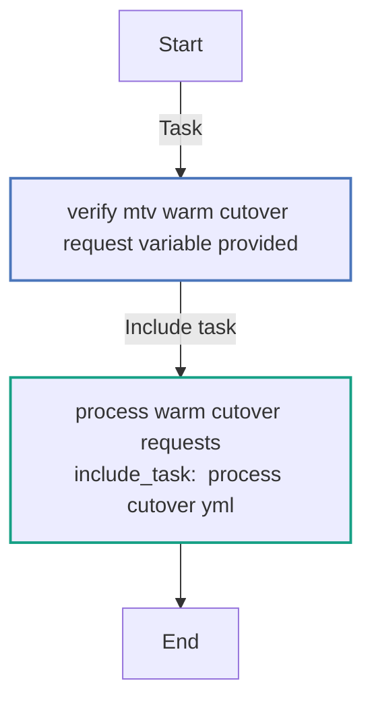
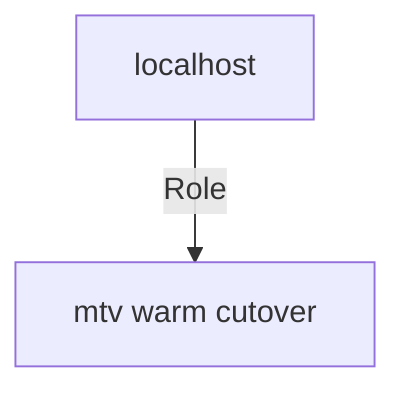

# mtv_warm_cutover
<!-- DOCSIBLE START -->
## mtv_warm_cutover

```
Role belongs to infra/openshift_virtualization_migration
Namespace - infra
Collection - openshift_virtualization_migration
Version - 1.22.0
Repository - https://github.com/redhat-cop/openshift_virtualization_migration
```

Description: Trigger cutover for warm migrations to finish the migration process.

### Argument Specifications

<details>
<summary><b>🧩 Argument Specifications in `meta/argument_specs`</b></summary>

#### Key: main

* **Description**: MTV Warm Cutover - Trigger cutover for warm migrations
* **Options**:
  * **mtv_warm_cutover_request**:
    * **Required**: True
    * **Type**: list
    * **Default**: none
    * **Description**: List of warm migration cutover requests
  * **mtv_warm_cutover_default_namespace**:
    * **Required**: false
    * **Type**: str
    * **Default**: openshift-mtv
    * **Description**: Default namespace for MTV resources
  * **mtv_warm_cutover_force_cutover**:
    * **Required**: false
    * **Type**: bool
    * **Default**: False
    * **Description**: Allow overriding an existing cutover timestamp on a Migration. Can be overridden per migration request via the force_cutover key.
  * **mtv_warm_cutover_verify_complete**:
    * **Required**: false
    * **Type**: bool
    * **Default**: True
    * **Description**: Wait until cutover migrations complete. Can be overridden per migration request via the verify_complete key.
  * **mtv_warm_cutover_verify_retries**:
    * **Required**: false
    * **Type**: int
    * **Default**: 360
    * **Description**: Number of retries when waiting for cutover completion
  * **mtv_warm_cutover_verify_delay**:
    * **Required**: false
    * **Type**: int
    * **Default**: 20
    * **Description**: Seconds to wait between retries

</details>

### Defaults

**These are static variables with lower priority**

#### File: defaults/main.yml

| Var          | Type         | Value       |Choices    |Required    | Title       |
|--------------|--------------|-------------|-------------|-------------|-------------|
| [`mtv_warm_cutover_request`](defaults/main.yml#L7)   | list   | `[]` |  None  |   True  |  Warm Cutover Request |
| [`mtv_warm_cutover_default_namespace`](defaults/main.yml#L23)   | str   | `openshift-mtv` |  None  |   False  |  MTV Namespace |
| [`mtv_warm_cutover_force_cutover`](defaults/main.yml#L29)   | bool   | `False` |  None  |   False  |  Force Cutover Override |
| [`mtv_warm_cutover_verify_complete`](defaults/main.yml#L35)   | bool   | `True` |  None  |   False  |  Verify Cutover Complete |
| [`mtv_warm_cutover_verify_retries`](defaults/main.yml#L39)   | int   | `360` |  None  |   False  |  Verify Complete Retries |
| [`mtv_warm_cutover_verify_delay`](defaults/main.yml#L43)   | int   | `20` |  None  |   False  |  Verify Complete Delay |

<summary><b>🖇️ Full descriptions for vars in defaults/main.yml</b></summary>
<br>
<b>`mtv_warm_cutover_request`:</b> List of warm migration cutover requests
<br>
<b>`mtv_warm_cutover_default_namespace`:</b> Default namespace for MTV resources
<br>
<b>`mtv_warm_cutover_force_cutover`:</b> >-
<br>
<b>`mtv_warm_cutover_verify_complete`:</b> >-
<br>
<b>`mtv_warm_cutover_verify_retries`:</b> Number of retries when waiting for cutover completion
<br>
<b>`mtv_warm_cutover_verify_delay`:</b> Seconds to wait between retries
<br>
<br>

### Tasks

#### File: tasks/main.yml

| Name | Module | Has Conditions |
| ---- | ------ | --------- |
| Verify mtv_warm_cutover_request Variable Provided | `ansible.builtin.assert` | False |
| Process Warm Cutover Requests | `ansible.builtin.include_tasks` | False |

#### File: tasks/_apply_cutover.yml

| Name | Module | Has Conditions |
| ---- | ------ | --------- |
| _apply_cutover ¦ Check if Cutover Already Defined | `ansible.builtin.set_fact` | False |
| _apply_cutover ¦ Fail When Cutover Already Set (No Force) | `ansible.builtin.fail` | True |
| _apply_cutover ¦ Override Existing Cutover Timestamp | `kubernetes.core.k8s_json_patch` | True |
| _apply_cutover ¦ Report Cutover Overridden | `ansible.builtin.debug` | True |
| _apply_cutover ¦ Patch Migration with Cutover Timestamp | `kubernetes.core.k8s_json_patch` | True |
| _apply_cutover ¦ Report Cutover Triggered | `ansible.builtin.debug` | True |
| _apply_cutover ¦ Wait for Migration to Complete | `kubernetes.core.k8s_info` | True |
| _apply_cutover ¦ Verify Migration Succeeded | `ansible.builtin.assert` | True |

#### File: tasks/_process_cutover.yml

| Name | Module | Has Conditions |
| ---- | ------ | --------- |
| _process_cutover ¦ Set Working Namespace | `ansible.builtin.set_fact` | False |
| _process_cutover ¦ Query Migrations by Name | `kubernetes.core.k8s_info` | True |
| _process_cutover ¦ Query Migrations by Label Selector | `kubernetes.core.k8s_info` | True |
| _process_cutover ¦ Query Migrations by Plan Name | `kubernetes.core.k8s_info` | True |
| _process_cutover ¦ Filter Migrations for Plan | `ansible.builtin.set_fact` | True |
| _process_cutover ¦ Build Migration List from Named Queries | `ansible.builtin.set_fact` | True |
| _process_cutover ¦ Build Migration List from Selector | `ansible.builtin.set_fact` | True |
| _process_cutover ¦ Build Migration List from Plan | `ansible.builtin.set_fact` | True |
| _process_cutover ¦ Verify Migrations Found | `ansible.builtin.assert` | False |
| _process_cutover ¦ Determine Cutover Timestamp | `ansible.builtin.set_fact` | False |
| _process_cutover ¦ Resolve Per-Request Overrides | `ansible.builtin.set_fact` | False |
| _process_cutover ¦ Trigger Cutover on Migrations | `ansible.builtin.include_tasks` | False |

## Task Flow Graphs

### Graph for _apply_cutover.yml

```mermaid
flowchart TD
Start
classDef block stroke:#3498db,stroke-width:2px;
classDef task stroke:#4b76bb,stroke-width:2px;
classDef includeTasks stroke:#16a085,stroke-width:2px;
classDef importTasks stroke:#34495e,stroke-width:2px;
classDef includeRole stroke:#2980b9,stroke-width:2px;
classDef importRole stroke:#699ba7,stroke-width:2px;
classDef includeVars stroke:#8e44ad,stroke-width:2px;
classDef rescue stroke:#665352,stroke-width:2px;

  Start-->|Task| _apply_cutover___Check_if_Cutover_Already_Defined0[ apply cutover   check if cutover already defined]:::task
  _apply_cutover___Check_if_Cutover_Already_Defined0-->|Task| _apply_cutover___Fail_When_Cutover_Already_Set__No_Force_1[ apply cutover   fail when cutover already set  no<br>force <br>When: **mtv warm cutover already set   bool and not  mtv<br>warm cutover effective force   bool**]:::task
  _apply_cutover___Fail_When_Cutover_Already_Set__No_Force_1-->|Task| _apply_cutover___Override_Existing_Cutover_Timestamp2[ apply cutover   override existing cutover<br>timestamp<br>When: **mtv warm cutover already set   bool and mtv warm<br>cutover effective force   bool**]:::task
  _apply_cutover___Override_Existing_Cutover_Timestamp2-->|Task| _apply_cutover___Report_Cutover_Overridden3[ apply cutover   report cutover overridden<br>When: **mtv warm cutover already set   bool and mtv warm<br>cutover effective force   bool**]:::task
  _apply_cutover___Report_Cutover_Overridden3-->|Task| _apply_cutover___Patch_Migration_with_Cutover_Timestamp4[ apply cutover   patch migration with cutover<br>timestamp<br>When: **not  mtv warm cutover already set   bool**]:::task
  _apply_cutover___Patch_Migration_with_Cutover_Timestamp4-->|Task| _apply_cutover___Report_Cutover_Triggered5[ apply cutover   report cutover triggered<br>When: **not  mtv warm cutover already set   bool**]:::task
  _apply_cutover___Report_Cutover_Triggered5-->|Task| _apply_cutover___Wait_for_Migration_to_Complete6[ apply cutover   wait for migration to complete<br>When: **mtv warm cutover effective verify   bool**]:::task
  _apply_cutover___Wait_for_Migration_to_Complete6-->|Task| _apply_cutover___Verify_Migration_Succeeded7[ apply cutover   verify migration succeeded<br>When: **mtv warm cutover effective verify   bool**]:::task
  _apply_cutover___Verify_Migration_Succeeded7-->End
```



### Graph for _process_cutover.yml

```mermaid
flowchart TD
Start
classDef block stroke:#3498db,stroke-width:2px;
classDef task stroke:#4b76bb,stroke-width:2px;
classDef includeTasks stroke:#16a085,stroke-width:2px;
classDef importTasks stroke:#34495e,stroke-width:2px;
classDef includeRole stroke:#2980b9,stroke-width:2px;
classDef importRole stroke:#699ba7,stroke-width:2px;
classDef includeVars stroke:#8e44ad,stroke-width:2px;
classDef rescue stroke:#665352,stroke-width:2px;

  Start-->|Task| _process_cutover___Set_Working_Namespace0[ process cutover   set working namespace]:::task
  _process_cutover___Set_Working_Namespace0-->|Task| _process_cutover___Query_Migrations_by_Name1[ process cutover   query migrations by name<br>When: **mtv warm cutover item names   default     true   <br>length   0**]:::task
  _process_cutover___Query_Migrations_by_Name1-->|Task| _process_cutover___Query_Migrations_by_Label_Selector2[ process cutover   query migrations by label<br>selector<br>When: **mtv warm cutover item names   default     true   <br>length    0 and mtv warm cutover item label<br>selectors   default     true    length   0**]:::task
  _process_cutover___Query_Migrations_by_Label_Selector2-->|Task| _process_cutover___Query_Migrations_by_Plan_Name3[ process cutover   query migrations by plan name<br>When: **mtv warm cutover item names   default     true   <br>length    0 and mtv warm cutover item label<br>selectors   default     true    length    0 and<br>mtv warm cutover item plan name   default     true<br>   length   0**]:::task
  _process_cutover___Query_Migrations_by_Plan_Name3-->|Task| _process_cutover___Filter_Migrations_for_Plan4[ process cutover   filter migrations for plan<br>When: **mtv warm cutover by plan query is not skipped**]:::task
  _process_cutover___Filter_Migrations_for_Plan4-->|Task| _process_cutover___Build_Migration_List_from_Named_Queries5[ process cutover   build migration list from named<br>queries<br>When: **mtv warm cutover by name is not skipped**]:::task
  _process_cutover___Build_Migration_List_from_Named_Queries5-->|Task| _process_cutover___Build_Migration_List_from_Selector6[ process cutover   build migration list from<br>selector<br>When: **mtv warm cutover by selector is not skipped**]:::task
  _process_cutover___Build_Migration_List_from_Selector6-->|Task| _process_cutover___Build_Migration_List_from_Plan7[ process cutover   build migration list from plan<br>When: **mtv warm cutover by plan is defined and mtv warm<br>cutover by plan is not skipped**]:::task
  _process_cutover___Build_Migration_List_from_Plan7-->|Task| _process_cutover___Verify_Migrations_Found8[ process cutover   verify migrations found]:::task
  _process_cutover___Verify_Migrations_Found8-->|Task| _process_cutover___Determine_Cutover_Timestamp9[ process cutover   determine cutover timestamp]:::task
  _process_cutover___Determine_Cutover_Timestamp9-->|Task| _process_cutover___Resolve_Per_Request_Overrides10[ process cutover   resolve per request overrides]:::task
  _process_cutover___Resolve_Per_Request_Overrides10-->|Include task| _process_cutover___Trigger_Cutover_on_Migrations__apply_cutover_yml_11[ process cutover   trigger cutover on migrations<br>include_task:  apply cutover yml]:::includeTasks
  _process_cutover___Trigger_Cutover_on_Migrations__apply_cutover_yml_11-->End
```



### Graph for main.yml



## Playbook

```yml
---
- name: Test
  hosts: localhost
  remote_user: root
  roles:
    - mtv_warm_cutover
...

```

## Playbook graph



## Author Information

OpenShift Virtualization Migration Contributors

## License

GPL-3.0-only

## Minimum Ansible Version

2.16.0

## Platforms

No platforms specified.

<!-- DOCSIBLE END -->