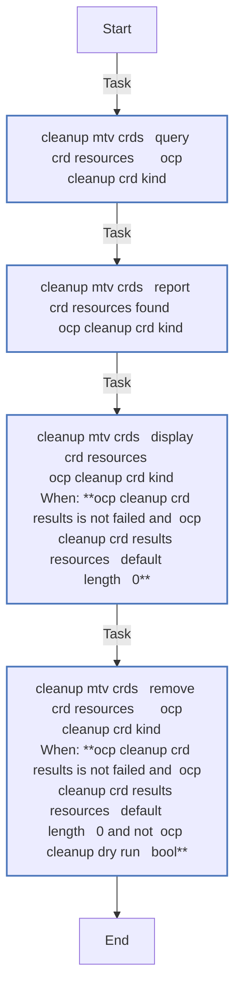
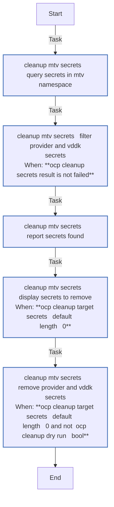
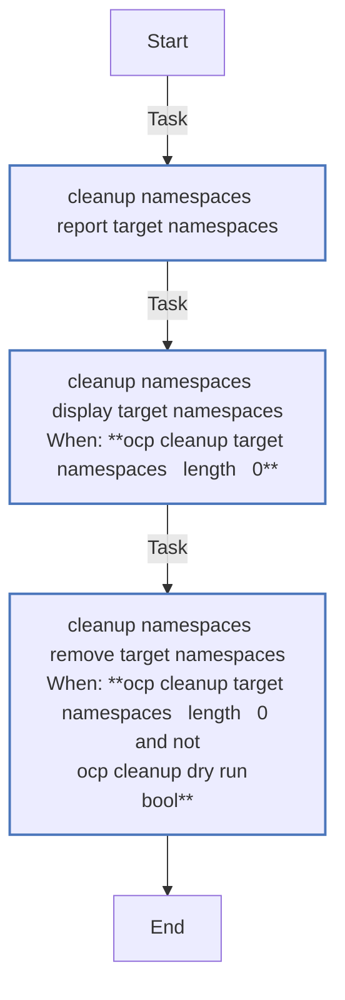
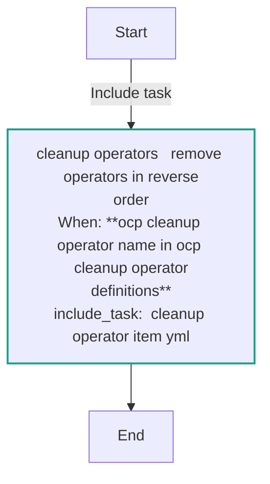

# ocp_cleanup

Remove OpenShift cluster artifacts created during virtualization migration testing. Handles MTV CRDs, provider secrets, migrated VMs/PVCs, and optionally operator teardown.

## Requirements

- OpenShift cluster access (kubeconfig or API key)
- `kubernetes.core` >= 5.2.0
- `redhat.openshift` >= 4.0.0

## Role Variables

| Variable | Default | Description |
|----------|---------|-------------|
| `ocp_cleanup_openshift_host` | env lookup | OpenShift API host |
| `ocp_cleanup_openshift_api_key` | env lookup | OpenShift API key |
| `ocp_cleanup_openshift_verify_ssl` | `true` | Validate TLS certificates |
| `ocp_cleanup_mtv_namespace` | `openshift-mtv` | MTV operator namespace |
| `ocp_cleanup_dry_run` | `false` | Query and report only, no deletions |
| `ocp_cleanup_mtv_migrations_remove` | `true` | Remove Migration CRDs |
| `ocp_cleanup_mtv_plans_remove` | `true` | Remove Plan CRDs |
| `ocp_cleanup_mtv_maps_remove` | `true` | Remove NetworkMap/StorageMap CRDs |
| `ocp_cleanup_mtv_providers_remove` | `true` | Remove Provider CRDs |
| `ocp_cleanup_mtv_secrets_remove` | `true` | Remove provider/VDDK secrets |
| `ocp_cleanup_migrated_vms_remove` | `false` | Remove migrated VMs and PVCs (destructive) |
| `ocp_cleanup_target_namespaces_remove` | `false` | Remove target namespaces (destructive) |
| `ocp_cleanup_target_namespaces` | `[]` | List of target namespaces to clean |
| `ocp_cleanup_operators_remove` | `false` | Remove operators (slow to reinstall) |
| `ocp_cleanup_operators` | all 8 | Operator list to remove |
| `ocp_cleanup_providers` | `[vmware, ovirt]` | Provider types to target |

## Deletion Order

Resources are removed respecting Kubernetes finalizer dependencies:

1. MTV Migrations
2. MTV Plans
3. NetworkMaps, StorageMaps
4. Providers
5. Provider/VDDK Secrets
6. Migrated VMs (optional)
7. PVCs (optional)
8. Target Namespaces (optional)
9. Operators: CRs → CSVs → Subscriptions → OperatorGroups → Namespaces (optional)

## Example Playbook

```yaml
- hosts: localhost
  roles:
    - role: infra.openshift_virtualization_migration.ocp_cleanup
      vars:
        ocp_cleanup_dry_run: true
        ocp_cleanup_operators_remove: true
```
<!-- DOCSIBLE START -->
## ocp_cleanup

```
Role belongs to infra/openshift_virtualization_migration
Namespace - infra
Collection - openshift_virtualization_migration
Version - 1.25.0
Repository - https://github.com/redhat-cop/openshift_virtualization_migration
```

Description: Remove OpenShift migration artifacts created during virtualization migration testing

### Defaults

**These are static variables with lower priority**

#### File: defaults/main.yml

| Var          | Type         | Value       |Choices    |Required    | Title       |
|--------------|--------------|-------------|-------------|-------------|-------------|
| [`ocp_cleanup_dry_run`](defaults/main.yml#L26)   | bool   | `False` |  None  |   None  |  None |
| [`ocp_cleanup_migrated_vms_remove`](defaults/main.yml#L21)   | bool   | `False` |  None  |   None  |  None |
| [`ocp_cleanup_mtv_crd_kinds`](defaults/main.yml#L95)   | list   | `[]` |  None  |   None  |  None |
| [`ocp_cleanup_mtv_crd_kinds.0`](defaults/main.yml#L96)   | dict   | `{}` |  None  |   None  |  None |
| [`ocp_cleanup_mtv_crd_kinds.0.api_version`](defaults/main.yml#L97)   | str   | `forklift.konveyor.io/v1beta1` |  None  |   None  |  None |
| [`ocp_cleanup_mtv_crd_kinds.0.kind`](defaults/main.yml#L96)   | str   | `Migration` |  None  |   None  |  None |
| [`ocp_cleanup_mtv_crd_kinds.1`](defaults/main.yml#L98)   | dict   | `{}` |  None  |   None  |  None |
| [`ocp_cleanup_mtv_crd_kinds.1.api_version`](defaults/main.yml#L99)   | str   | `forklift.konveyor.io/v1beta1` |  None  |   None  |  None |
| [`ocp_cleanup_mtv_crd_kinds.1.kind`](defaults/main.yml#L98)   | str   | `Plan` |  None  |   None  |  None |
| [`ocp_cleanup_mtv_crd_kinds.2`](defaults/main.yml#L100)   | dict   | `{}` |  None  |   None  |  None |
| [`ocp_cleanup_mtv_crd_kinds.2.api_version`](defaults/main.yml#L101)   | str   | `forklift.konveyor.io/v1beta1` |  None  |   None  |  None |
| [`ocp_cleanup_mtv_crd_kinds.2.kind`](defaults/main.yml#L100)   | str   | `NetworkMap` |  None  |   None  |  None |
| [`ocp_cleanup_mtv_crd_kinds.3`](defaults/main.yml#L102)   | dict   | `{}` |  None  |   None  |  None |
| [`ocp_cleanup_mtv_crd_kinds.3.api_version`](defaults/main.yml#L103)   | str   | `forklift.konveyor.io/v1beta1` |  None  |   None  |  None |
| [`ocp_cleanup_mtv_crd_kinds.3.kind`](defaults/main.yml#L102)   | str   | `StorageMap` |  None  |   None  |  None |
| [`ocp_cleanup_mtv_crd_kinds.4`](defaults/main.yml#L104)   | dict   | `{}` |  None  |   None  |  None |
| [`ocp_cleanup_mtv_crd_kinds.4.api_version`](defaults/main.yml#L105)   | str   | `forklift.konveyor.io/v1beta1` |  None  |   None  |  None |
| [`ocp_cleanup_mtv_crd_kinds.4.kind`](defaults/main.yml#L104)   | str   | `Provider` |  None  |   None  |  None |
| [`ocp_cleanup_mtv_maps_remove`](defaults/main.yml#L18)   | bool   | `True` |  None  |   None  |  None |
| [`ocp_cleanup_mtv_migrations_remove`](defaults/main.yml#L16)   | bool   | `True` |  None  |   None  |  None |
| [`ocp_cleanup_mtv_namespace`](defaults/main.yml#L10)   | str   | `{{ mtv_management_namespace ¦ default('openshift-mtv') }}` |  None  |   None  |  None |
| [`ocp_cleanup_mtv_plans_remove`](defaults/main.yml#L17)   | bool   | `True` |  None  |   None  |  None |
| [`ocp_cleanup_mtv_providers_remove`](defaults/main.yml#L19)   | bool   | `True` |  None  |   None  |  None |
| [`ocp_cleanup_mtv_secrets_remove`](defaults/main.yml#L20)   | bool   | `True` |  None  |   None  |  None |
| [`ocp_cleanup_openshift_api_key`](defaults/main.yml#L5)   | str   | `<multiline value: folded_strip>` |  None  |   None  |  None |
| [`ocp_cleanup_openshift_host`](defaults/main.yml#L3)   | str   | `<multiline value: folded_strip>` |  None  |   None  |  None |
| [`ocp_cleanup_openshift_verify_ssl`](defaults/main.yml#L7)   | str   | `{{ openshift_verify_ssl ¦ default(true) }}` |  None  |   None  |  None |
| [`ocp_cleanup_operator_definitions`](defaults/main.yml#L40)   | dict   | `{}` |  None  |   None  |  None |
| [`ocp_cleanup_operator_definitions.acm`](defaults/main.yml#L57)   | dict   | `{}` |  None  |   None  |  None |
| [`ocp_cleanup_operator_definitions.acm.extra_resources`](defaults/main.yml#L61)   | list   | `[]` |  None  |   None  |  None |
| [`ocp_cleanup_operator_definitions.acm.extra_resources.0`](defaults/main.yml#L62)   | dict   | `{}` |  None  |   None  |  None |
| [`ocp_cleanup_operator_definitions.acm.extra_resources.0.api_version`](defaults/main.yml#L62)   | str   | `operator.open-cluster-management.io/v1` |  None  |   None  |  None |
| [`ocp_cleanup_operator_definitions.acm.extra_resources.0.kind`](defaults/main.yml#L63)   | str   | `MultiClusterHub` |  None  |   None  |  None |
| [`ocp_cleanup_operator_definitions.acm.extra_resources.0.name`](defaults/main.yml#L64)   | str   | `multiclusterhub` |  None  |   None  |  None |
| [`ocp_cleanup_operator_definitions.acm.namespace`](defaults/main.yml#L58)   | str   | `open-cluster-management` |  None  |   None  |  None |
| [`ocp_cleanup_operator_definitions.acm.operatorgroup`](defaults/main.yml#L59)   | str   | `acm-operator` |  None  |   None  |  None |
| [`ocp_cleanup_operator_definitions.acm.subscription`](defaults/main.yml#L60)   | str   | `advanced-cluster-management` |  None  |   None  |  None |
| [`ocp_cleanup_operator_definitions.cnv`](defaults/main.yml#L49)   | dict   | `{}` |  None  |   None  |  None |
| [`ocp_cleanup_operator_definitions.cnv.extra_resources`](defaults/main.yml#L53)   | list   | `[]` |  None  |   None  |  None |
| [`ocp_cleanup_operator_definitions.cnv.extra_resources.0`](defaults/main.yml#L54)   | dict   | `{}` |  None  |   None  |  None |
| [`ocp_cleanup_operator_definitions.cnv.extra_resources.0.api_version`](defaults/main.yml#L54)   | str   | `hco.kubevirt.io/v1beta1` |  None  |   None  |  None |
| [`ocp_cleanup_operator_definitions.cnv.extra_resources.0.kind`](defaults/main.yml#L55)   | str   | `HyperConverged` |  None  |   None  |  None |
| [`ocp_cleanup_operator_definitions.cnv.extra_resources.0.name`](defaults/main.yml#L56)   | str   | `kubevirt-hyperconverged` |  None  |   None  |  None |
| [`ocp_cleanup_operator_definitions.cnv.namespace`](defaults/main.yml#L50)   | str   | `openshift-cnv` |  None  |   None  |  None |
| [`ocp_cleanup_operator_definitions.cnv.operatorgroup`](defaults/main.yml#L51)   | str   | `kubevirt-hyperconverged-group` |  None  |   None  |  None |
| [`ocp_cleanup_operator_definitions.cnv.subscription`](defaults/main.yml#L52)   | str   | `kubevirt-hyperconverged` |  None  |   None  |  None |
| [`ocp_cleanup_operator_definitions.far`](defaults/main.yml#L70)   | dict   | `{}` |  None  |   None  |  None |
| [`ocp_cleanup_operator_definitions.far.extra_resources`](defaults/main.yml#L74)   | list   | `[]` |  None  |   None  |  None |
| [`ocp_cleanup_operator_definitions.far.namespace`](defaults/main.yml#L71)   | str   | `openshift-workload-availability` |  None  |   None  |  None |
| [`ocp_cleanup_operator_definitions.far.operatorgroup`](defaults/main.yml#L72)   | str   | `openshift-workload-availability-operator-group` |  None  |   None  |  None |
| [`ocp_cleanup_operator_definitions.far.subscription`](defaults/main.yml#L73)   | str   | `fence-agents-remediation` |  None  |   None  |  None |
| [`ocp_cleanup_operator_definitions.gitops`](defaults/main.yml#L88)   | dict   | `{}` |  None  |   None  |  None |
| [`ocp_cleanup_operator_definitions.gitops.extra_resources`](defaults/main.yml#L92)   | list   | `[]` |  None  |   None  |  None |
| [`ocp_cleanup_operator_definitions.gitops.namespace`](defaults/main.yml#L89)   | str   | `openshift-gitops-operator` |  None  |   None  |  None |
| [`ocp_cleanup_operator_definitions.gitops.operatorgroup`](defaults/main.yml#L90)   | str   | `openshift-gitops-operator-group` |  None  |   None  |  None |
| [`ocp_cleanup_operator_definitions.gitops.subscription`](defaults/main.yml#L91)   | str   | `openshift-gitops-operator` |  None  |   None  |  None |
| [`ocp_cleanup_operator_definitions.mtv`](defaults/main.yml#L41)   | dict   | `{}` |  None  |   None  |  None |
| [`ocp_cleanup_operator_definitions.mtv.extra_resources`](defaults/main.yml#L45)   | list   | `[]` |  None  |   None  |  None |
| [`ocp_cleanup_operator_definitions.mtv.extra_resources.0`](defaults/main.yml#L46)   | dict   | `{}` |  None  |   None  |  None |
| [`ocp_cleanup_operator_definitions.mtv.extra_resources.0.api_version`](defaults/main.yml#L46)   | str   | `forklift.konveyor.io/v1beta1` |  None  |   None  |  None |
| [`ocp_cleanup_operator_definitions.mtv.extra_resources.0.kind`](defaults/main.yml#L47)   | str   | `ForkliftController` |  None  |   None  |  None |
| [`ocp_cleanup_operator_definitions.mtv.extra_resources.0.name`](defaults/main.yml#L48)   | str   | `forklift-controller` |  None  |   None  |  None |
| [`ocp_cleanup_operator_definitions.mtv.namespace`](defaults/main.yml#L42)   | str   | `openshift-mtv` |  None  |   None  |  None |
| [`ocp_cleanup_operator_definitions.mtv.operatorgroup`](defaults/main.yml#L43)   | str   | `migration` |  None  |   None  |  None |
| [`ocp_cleanup_operator_definitions.mtv.subscription`](defaults/main.yml#L44)   | str   | `mtv-operator` |  None  |   None  |  None |
| [`ocp_cleanup_operator_definitions.nho`](defaults/main.yml#L83)   | dict   | `{}` |  None  |   None  |  None |
| [`ocp_cleanup_operator_definitions.nho.extra_resources`](defaults/main.yml#L87)   | list   | `[]` |  None  |   None  |  None |
| [`ocp_cleanup_operator_definitions.nho.namespace`](defaults/main.yml#L84)   | str   | `openshift-workload-availability` |  None  |   None  |  None |
| [`ocp_cleanup_operator_definitions.nho.operatorgroup`](defaults/main.yml#L85)   | str   | `openshift-workload-availability-operator-group` |  None  |   None  |  None |
| [`ocp_cleanup_operator_definitions.nho.subscription`](defaults/main.yml#L86)   | str   | `node-healthcheck-operator` |  None  |   None  |  None |
| [`ocp_cleanup_operator_definitions.nmstate`](defaults/main.yml#L75)   | dict   | `{}` |  None  |   None  |  None |
| [`ocp_cleanup_operator_definitions.nmstate.extra_resources`](defaults/main.yml#L79)   | list   | `[]` |  None  |   None  |  None |
| [`ocp_cleanup_operator_definitions.nmstate.extra_resources.0`](defaults/main.yml#L80)   | dict   | `{}` |  None  |   None  |  None |
| [`ocp_cleanup_operator_definitions.nmstate.extra_resources.0.api_version`](defaults/main.yml#L80)   | str   | `nmstate.io/v1` |  None  |   None  |  None |
| [`ocp_cleanup_operator_definitions.nmstate.extra_resources.0.kind`](defaults/main.yml#L81)   | str   | `NMState` |  None  |   None  |  None |
| [`ocp_cleanup_operator_definitions.nmstate.extra_resources.0.name`](defaults/main.yml#L82)   | str   | `nmstate` |  None  |   None  |  None |
| [`ocp_cleanup_operator_definitions.nmstate.namespace`](defaults/main.yml#L76)   | str   | `openshift-nmstate` |  None  |   None  |  None |
| [`ocp_cleanup_operator_definitions.nmstate.operatorgroup`](defaults/main.yml#L77)   | str   | `nmstate-operator-group` |  None  |   None  |  None |
| [`ocp_cleanup_operator_definitions.nmstate.subscription`](defaults/main.yml#L78)   | str   | `kubernetes-nmstate-operator` |  None  |   None  |  None |
| [`ocp_cleanup_operator_definitions.oadp`](defaults/main.yml#L65)   | dict   | `{}` |  None  |   None  |  None |
| [`ocp_cleanup_operator_definitions.oadp.extra_resources`](defaults/main.yml#L69)   | list   | `[]` |  None  |   None  |  None |
| [`ocp_cleanup_operator_definitions.oadp.namespace`](defaults/main.yml#L66)   | str   | `openshift-adp` |  None  |   None  |  None |
| [`ocp_cleanup_operator_definitions.oadp.operatorgroup`](defaults/main.yml#L67)   | str   | `redhat-oadp-operator-group` |  None  |   None  |  None |
| [`ocp_cleanup_operator_definitions.oadp.subscription`](defaults/main.yml#L68)   | str   | `redhat-oadp-operator` |  None  |   None  |  None |
| [`ocp_cleanup_operators`](defaults/main.yml#L29)   | list   | `[]` |  None  |   None  |  None |
| [`ocp_cleanup_operators.0`](defaults/main.yml#L30)   | str   | `mtv` |  None  |   None  |  None |
| [`ocp_cleanup_operators.1`](defaults/main.yml#L31)   | str   | `cnv` |  None  |   None  |  None |
| [`ocp_cleanup_operators.2`](defaults/main.yml#L32)   | str   | `acm` |  None  |   None  |  None |
| [`ocp_cleanup_operators.3`](defaults/main.yml#L33)   | str   | `oadp` |  None  |   None  |  None |
| [`ocp_cleanup_operators.4`](defaults/main.yml#L34)   | str   | `far` |  None  |   None  |  None |
| [`ocp_cleanup_operators.5`](defaults/main.yml#L35)   | str   | `nmstate` |  None  |   None  |  None |
| [`ocp_cleanup_operators.6`](defaults/main.yml#L36)   | str   | `nho` |  None  |   None  |  None |
| [`ocp_cleanup_operators.7`](defaults/main.yml#L37)   | str   | `gitops` |  None  |   None  |  None |
| [`ocp_cleanup_operators_remove`](defaults/main.yml#L23)   | bool   | `False` |  None  |   None  |  None |
| [`ocp_cleanup_providers`](defaults/main.yml#L13)   | str   | `{{ cleanup_providers ¦ default(['vmware', 'ovirt']) }}` |  None  |   None  |  None |
| [`ocp_cleanup_target_namespaces`](defaults/main.yml#L108)   | list   | `[]` |  None  |   None  |  None |
| [`ocp_cleanup_target_namespaces_remove`](defaults/main.yml#L22)   | bool   | `False` |  None  |   None  |  None |
| [`ocp_cleanup_wait_delay`](defaults/main.yml#L112)   | int   | `10` |  None  |   None  |  None |
| [`ocp_cleanup_wait_retries`](defaults/main.yml#L111)   | int   | `60` |  None  |   None  |  None |

<summary><b>🖇️ Full descriptions for vars in defaults/main.yml</b></summary>
<br>
<b>`ocp_cleanup_dry_run`:</b> None
<br>
<b>`ocp_cleanup_migrated_vms_remove`:</b> None
<br>
<b>`ocp_cleanup_mtv_crd_kinds`:</b> None
<br>
<b>`ocp_cleanup_mtv_crd_kinds.0`:</b> None
<br>
<b>`ocp_cleanup_mtv_crd_kinds.0.api_version`:</b> None
<br>
<b>`ocp_cleanup_mtv_crd_kinds.0.kind`:</b> None
<br>
<b>`ocp_cleanup_mtv_crd_kinds.1`:</b> None
<br>
<b>`ocp_cleanup_mtv_crd_kinds.1.api_version`:</b> None
<br>
<b>`ocp_cleanup_mtv_crd_kinds.1.kind`:</b> None
<br>
<b>`ocp_cleanup_mtv_crd_kinds.2`:</b> None
<br>
<b>`ocp_cleanup_mtv_crd_kinds.2.api_version`:</b> None
<br>
<b>`ocp_cleanup_mtv_crd_kinds.2.kind`:</b> None
<br>
<b>`ocp_cleanup_mtv_crd_kinds.3`:</b> None
<br>
<b>`ocp_cleanup_mtv_crd_kinds.3.api_version`:</b> None
<br>
<b>`ocp_cleanup_mtv_crd_kinds.3.kind`:</b> None
<br>
<b>`ocp_cleanup_mtv_crd_kinds.4`:</b> None
<br>
<b>`ocp_cleanup_mtv_crd_kinds.4.api_version`:</b> None
<br>
<b>`ocp_cleanup_mtv_crd_kinds.4.kind`:</b> None
<br>
<b>`ocp_cleanup_mtv_maps_remove`:</b> None
<br>
<b>`ocp_cleanup_mtv_migrations_remove`:</b> None
<br>
<b>`ocp_cleanup_mtv_namespace`:</b> None
<br>
<b>`ocp_cleanup_mtv_plans_remove`:</b> None
<br>
<b>`ocp_cleanup_mtv_providers_remove`:</b> None
<br>
<b>`ocp_cleanup_mtv_secrets_remove`:</b> None
<br>
<b>`ocp_cleanup_openshift_api_key`:</b> None
<br>
<b>`ocp_cleanup_openshift_host`:</b> None
<br>
<b>`ocp_cleanup_openshift_verify_ssl`:</b> None
<br>
<b>`ocp_cleanup_operator_definitions`:</b> None
<br>
<b>`ocp_cleanup_operator_definitions.acm`:</b> None
<br>
<b>`ocp_cleanup_operator_definitions.acm.extra_resources`:</b> None
<br>
<b>`ocp_cleanup_operator_definitions.acm.extra_resources.0`:</b> None
<br>
<b>`ocp_cleanup_operator_definitions.acm.extra_resources.0.api_version`:</b> None
<br>
<b>`ocp_cleanup_operator_definitions.acm.extra_resources.0.kind`:</b> None
<br>
<b>`ocp_cleanup_operator_definitions.acm.extra_resources.0.name`:</b> None
<br>
<b>`ocp_cleanup_operator_definitions.acm.namespace`:</b> None
<br>
<b>`ocp_cleanup_operator_definitions.acm.operatorgroup`:</b> None
<br>
<b>`ocp_cleanup_operator_definitions.acm.subscription`:</b> None
<br>
<b>`ocp_cleanup_operator_definitions.cnv`:</b> None
<br>
<b>`ocp_cleanup_operator_definitions.cnv.extra_resources`:</b> None
<br>
<b>`ocp_cleanup_operator_definitions.cnv.extra_resources.0`:</b> None
<br>
<b>`ocp_cleanup_operator_definitions.cnv.extra_resources.0.api_version`:</b> None
<br>
<b>`ocp_cleanup_operator_definitions.cnv.extra_resources.0.kind`:</b> None
<br>
<b>`ocp_cleanup_operator_definitions.cnv.extra_resources.0.name`:</b> None
<br>
<b>`ocp_cleanup_operator_definitions.cnv.namespace`:</b> None
<br>
<b>`ocp_cleanup_operator_definitions.cnv.operatorgroup`:</b> None
<br>
<b>`ocp_cleanup_operator_definitions.cnv.subscription`:</b> None
<br>
<b>`ocp_cleanup_operator_definitions.far`:</b> None
<br>
<b>`ocp_cleanup_operator_definitions.far.extra_resources`:</b> None
<br>
<b>`ocp_cleanup_operator_definitions.far.namespace`:</b> None
<br>
<b>`ocp_cleanup_operator_definitions.far.operatorgroup`:</b> None
<br>
<b>`ocp_cleanup_operator_definitions.far.subscription`:</b> None
<br>
<b>`ocp_cleanup_operator_definitions.gitops`:</b> None
<br>
<b>`ocp_cleanup_operator_definitions.gitops.extra_resources`:</b> None
<br>
<b>`ocp_cleanup_operator_definitions.gitops.namespace`:</b> None
<br>
<b>`ocp_cleanup_operator_definitions.gitops.operatorgroup`:</b> None
<br>
<b>`ocp_cleanup_operator_definitions.gitops.subscription`:</b> None
<br>
<b>`ocp_cleanup_operator_definitions.mtv`:</b> None
<br>
<b>`ocp_cleanup_operator_definitions.mtv.extra_resources`:</b> None
<br>
<b>`ocp_cleanup_operator_definitions.mtv.extra_resources.0`:</b> None
<br>
<b>`ocp_cleanup_operator_definitions.mtv.extra_resources.0.api_version`:</b> None
<br>
<b>`ocp_cleanup_operator_definitions.mtv.extra_resources.0.kind`:</b> None
<br>
<b>`ocp_cleanup_operator_definitions.mtv.extra_resources.0.name`:</b> None
<br>
<b>`ocp_cleanup_operator_definitions.mtv.namespace`:</b> None
<br>
<b>`ocp_cleanup_operator_definitions.mtv.operatorgroup`:</b> None
<br>
<b>`ocp_cleanup_operator_definitions.mtv.subscription`:</b> None
<br>
<b>`ocp_cleanup_operator_definitions.nho`:</b> None
<br>
<b>`ocp_cleanup_operator_definitions.nho.extra_resources`:</b> None
<br>
<b>`ocp_cleanup_operator_definitions.nho.namespace`:</b> None
<br>
<b>`ocp_cleanup_operator_definitions.nho.operatorgroup`:</b> None
<br>
<b>`ocp_cleanup_operator_definitions.nho.subscription`:</b> None
<br>
<b>`ocp_cleanup_operator_definitions.nmstate`:</b> None
<br>
<b>`ocp_cleanup_operator_definitions.nmstate.extra_resources`:</b> None
<br>
<b>`ocp_cleanup_operator_definitions.nmstate.extra_resources.0`:</b> None
<br>
<b>`ocp_cleanup_operator_definitions.nmstate.extra_resources.0.api_version`:</b> None
<br>
<b>`ocp_cleanup_operator_definitions.nmstate.extra_resources.0.kind`:</b> None
<br>
<b>`ocp_cleanup_operator_definitions.nmstate.extra_resources.0.name`:</b> None
<br>
<b>`ocp_cleanup_operator_definitions.nmstate.namespace`:</b> None
<br>
<b>`ocp_cleanup_operator_definitions.nmstate.operatorgroup`:</b> None
<br>
<b>`ocp_cleanup_operator_definitions.nmstate.subscription`:</b> None
<br>
<b>`ocp_cleanup_operator_definitions.oadp`:</b> None
<br>
<b>`ocp_cleanup_operator_definitions.oadp.extra_resources`:</b> None
<br>
<b>`ocp_cleanup_operator_definitions.oadp.namespace`:</b> None
<br>
<b>`ocp_cleanup_operator_definitions.oadp.operatorgroup`:</b> None
<br>
<b>`ocp_cleanup_operator_definitions.oadp.subscription`:</b> None
<br>
<b>`ocp_cleanup_operators`:</b> None
<br>
<b>`ocp_cleanup_operators.0`:</b> None
<br>
<b>`ocp_cleanup_operators.1`:</b> None
<br>
<b>`ocp_cleanup_operators.2`:</b> None
<br>
<b>`ocp_cleanup_operators.3`:</b> None
<br>
<b>`ocp_cleanup_operators.4`:</b> None
<br>
<b>`ocp_cleanup_operators.5`:</b> None
<br>
<b>`ocp_cleanup_operators.6`:</b> None
<br>
<b>`ocp_cleanup_operators.7`:</b> None
<br>
<b>`ocp_cleanup_operators_remove`:</b> None
<br>
<b>`ocp_cleanup_providers`:</b> None
<br>
<b>`ocp_cleanup_target_namespaces`:</b> None
<br>
<b>`ocp_cleanup_target_namespaces_remove`:</b> None
<br>
<b>`ocp_cleanup_wait_delay`:</b> None
<br>
<b>`ocp_cleanup_wait_retries`:</b> None
<br>
<br>

### Tasks

#### File: tasks/main.yml

| Name | Module | Has Conditions |
| ---- | ------ | --------- |
| Remove MTV CRDs | `ansible.builtin.include_tasks` | True |
| Remove MTV secrets | `ansible.builtin.include_tasks` | True |
| Remove migrated VMs and PVCs | `ansible.builtin.include_tasks` | True |
| Remove target namespaces | `ansible.builtin.include_tasks` | True |
| Remove operators | `ansible.builtin.include_tasks` | True |

#### File: tasks/_cleanup_migrated_vms.yml

| Name | Module | Has Conditions |
| ---- | ------ | --------- |
| _cleanup_migrated_vms ¦ Query migrated VirtualMachines across target namespaces | `kubernetes.core.k8s_info` | True |
| _cleanup_migrated_vms ¦ Flatten VM results | `ansible.builtin.set_fact` | False |
| _cleanup_migrated_vms ¦ Report VMs found | `ansible.builtin.debug` | False |
| _cleanup_migrated_vms ¦ Remove VirtualMachines | `redhat.openshift.k8s` | True |
| _cleanup_migrated_vms ¦ Query PVCs in target namespaces | `kubernetes.core.k8s_info` | True |
| _cleanup_migrated_vms ¦ Flatten PVC results | `ansible.builtin.set_fact` | False |
| _cleanup_migrated_vms ¦ Report PVCs found | `ansible.builtin.debug` | False |
| _cleanup_migrated_vms ¦ Remove PVCs | `redhat.openshift.k8s` | True |

#### File: tasks/_cleanup_mtv_crds.yml

| Name | Module | Has Conditions |
| ---- | ------ | --------- |
| _cleanup_mtv_crds ¦ Query CRD resources — {{ _ocp_cleanup_crd.kind }} | `kubernetes.core.k8s_info` | False |
| _cleanup_mtv_crds ¦ Report CRD resources found — {{ _ocp_cleanup_crd.kind }} | `ansible.builtin.debug` | False |
| _cleanup_mtv_crds ¦ Display CRD resources — {{ _ocp_cleanup_crd.kind }} | `ansible.builtin.debug` | True |
| _cleanup_mtv_crds ¦ Remove CRD resources — {{ _ocp_cleanup_crd.kind }} | `redhat.openshift.k8s` | True |

#### File: tasks/_cleanup_mtv_secrets.yml

| Name | Module | Has Conditions |
| ---- | ------ | --------- |
| _cleanup_mtv_secrets ¦ Query secrets in MTV namespace | `kubernetes.core.k8s_info` | False |
| _cleanup_mtv_secrets ¦ Filter provider and VDDK secrets | `ansible.builtin.set_fact` | True |
| _cleanup_mtv_secrets ¦ Report secrets found | `ansible.builtin.debug` | False |
| _cleanup_mtv_secrets ¦ Display secrets to remove | `ansible.builtin.debug` | True |
| _cleanup_mtv_secrets ¦ Remove provider and VDDK secrets | `redhat.openshift.k8s` | True |

#### File: tasks/_cleanup_namespaces.yml

| Name | Module | Has Conditions |
| ---- | ------ | --------- |
| _cleanup_namespaces ¦ Report target namespaces | `ansible.builtin.debug` | False |
| _cleanup_namespaces ¦ Display target namespaces | `ansible.builtin.debug` | True |
| _cleanup_namespaces ¦ Remove target namespaces | `redhat.openshift.k8s` | True |

#### File: tasks/_cleanup_operator_item.yml

| Name | Module | Has Conditions |
| ---- | ------ | --------- |
| _cleanup_operator_item ¦ Set operator definition — {{ _ocp_cleanup_operator_name }} | `ansible.builtin.set_fact` | False |
| _cleanup_operator_item ¦ Report operator — {{ _ocp_cleanup_operator_name }} | `ansible.builtin.debug` | False |
| _cleanup_operator_item ¦ Remove extra resources — {{ _ocp_cleanup_operator_name }} | `redhat.openshift.k8s` | True |
| _cleanup_operator_item ¦ Query CSVs — {{ _ocp_cleanup_operator_name }} | `kubernetes.core.k8s_info` | True |
| _cleanup_operator_item ¦ Remove CSVs — {{ _ocp_cleanup_operator_name }} | `redhat.openshift.k8s` | True |
| _cleanup_operator_item ¦ Remove Subscription — {{ _ocp_cleanup_operator_name }} | `redhat.openshift.k8s` | True |
| _cleanup_operator_item ¦ Remove OperatorGroup — {{ _ocp_cleanup_operator_name }} | `redhat.openshift.k8s` | True |
| _cleanup_operator_item ¦ Remove Namespace {{ _ocp_cleanup_op_def.namespace }} | `redhat.openshift.k8s` | True |

#### File: tasks/_cleanup_operators.yml

| Name | Module | Has Conditions |
| ---- | ------ | --------- |
| _cleanup_operators ¦ Remove operators in reverse order | `ansible.builtin.include_tasks` | True |

## Task Flow Graphs

### Graph for _cleanup_migrated_vms.yml

```mermaid
flowchart TD
Start
classDef block stroke:#3498db,stroke-width:2px;
classDef task stroke:#4b76bb,stroke-width:2px;
classDef includeTasks stroke:#16a085,stroke-width:2px;
classDef importTasks stroke:#34495e,stroke-width:2px;
classDef includeRole stroke:#2980b9,stroke-width:2px;
classDef importRole stroke:#699ba7,stroke-width:2px;
classDef includeVars stroke:#8e44ad,stroke-width:2px;
classDef rescue stroke:#665352,stroke-width:2px;

  Start-->|Task| _cleanup_migrated_vms___Query_migrated_VirtualMachines_across_target_namespaces0[ cleanup migrated vms   query migrated<br>virtualmachines across target namespaces<br>When: **ocp cleanup target namespaces   length   0**]:::task
  _cleanup_migrated_vms___Query_migrated_VirtualMachines_across_target_namespaces0-->|Task| _cleanup_migrated_vms___Flatten_VM_results1[ cleanup migrated vms   flatten vm results]:::task
  _cleanup_migrated_vms___Flatten_VM_results1-->|Task| _cleanup_migrated_vms___Report_VMs_found2[ cleanup migrated vms   report vms found]:::task
  _cleanup_migrated_vms___Report_VMs_found2-->|Task| _cleanup_migrated_vms___Remove_VirtualMachines3[ cleanup migrated vms   remove virtualmachines<br>When: **ocp cleanup all vms   length   0 and not  ocp<br>cleanup dry run   bool**]:::task
  _cleanup_migrated_vms___Remove_VirtualMachines3-->|Task| _cleanup_migrated_vms___Query_PVCs_in_target_namespaces4[ cleanup migrated vms   query pvcs in target<br>namespaces<br>When: **ocp cleanup target namespaces   length   0**]:::task
  _cleanup_migrated_vms___Query_PVCs_in_target_namespaces4-->|Task| _cleanup_migrated_vms___Flatten_PVC_results5[ cleanup migrated vms   flatten pvc results]:::task
  _cleanup_migrated_vms___Flatten_PVC_results5-->|Task| _cleanup_migrated_vms___Report_PVCs_found6[ cleanup migrated vms   report pvcs found]:::task
  _cleanup_migrated_vms___Report_PVCs_found6-->|Task| _cleanup_migrated_vms___Remove_PVCs7[ cleanup migrated vms   remove pvcs<br>When: **ocp cleanup all pvcs   length   0 and not  ocp<br>cleanup dry run   bool**]:::task
  _cleanup_migrated_vms___Remove_PVCs7-->End
```



### Graph for _cleanup_mtv_crds.yml



### Graph for _cleanup_mtv_secrets.yml



### Graph for _cleanup_namespaces.yml



### Graph for _cleanup_operator_item.yml

```mermaid
flowchart TD
Start
classDef block stroke:#3498db,stroke-width:2px;
classDef task stroke:#4b76bb,stroke-width:2px;
classDef includeTasks stroke:#16a085,stroke-width:2px;
classDef importTasks stroke:#34495e,stroke-width:2px;
classDef includeRole stroke:#2980b9,stroke-width:2px;
classDef importRole stroke:#699ba7,stroke-width:2px;
classDef includeVars stroke:#8e44ad,stroke-width:2px;
classDef rescue stroke:#665352,stroke-width:2px;

  Start-->|Task| _cleanup_operator_item___Set_operator_definition____ocp_cleanup_operator_name0[ cleanup operator item   set operator definition  <br> ocp cleanup operator name]:::task
  _cleanup_operator_item___Set_operator_definition____ocp_cleanup_operator_name0-->|Task| _cleanup_operator_item___Report_operator____ocp_cleanup_operator_name1[ cleanup operator item   report operator    ocp<br>cleanup operator name]:::task
  _cleanup_operator_item___Report_operator____ocp_cleanup_operator_name1-->|Task| _cleanup_operator_item___Remove_extra_resources____ocp_cleanup_operator_name2[ cleanup operator item   remove extra resources   <br>ocp cleanup operator name<br>When: **ocp cleanup op def extra resources   length   0<br>and not  ocp cleanup dry run   bool**]:::task
  _cleanup_operator_item___Remove_extra_resources____ocp_cleanup_operator_name2-->|Task| _cleanup_operator_item___Query_CSVs____ocp_cleanup_operator_name3[ cleanup operator item   query csvs    ocp cleanup<br>operator name<br>When: **not  ocp cleanup dry run   bool**]:::task
  _cleanup_operator_item___Query_CSVs____ocp_cleanup_operator_name3-->|Task| _cleanup_operator_item___Remove_CSVs____ocp_cleanup_operator_name4[ cleanup operator item   remove csvs    ocp<br>cleanup operator name<br>When: **not  ocp cleanup dry run   bool  and  ocp cleanup<br>csvs resources   default       length   0**]:::task
  _cleanup_operator_item___Remove_CSVs____ocp_cleanup_operator_name4-->|Task| _cleanup_operator_item___Remove_Subscription____ocp_cleanup_operator_name5[ cleanup operator item   remove subscription   <br>ocp cleanup operator name<br>When: **not  ocp cleanup dry run   bool**]:::task
  _cleanup_operator_item___Remove_Subscription____ocp_cleanup_operator_name5-->|Task| _cleanup_operator_item___Remove_OperatorGroup____ocp_cleanup_operator_name6[ cleanup operator item   remove operatorgroup   <br>ocp cleanup operator name<br>When: **not  ocp cleanup dry run   bool**]:::task
  _cleanup_operator_item___Remove_OperatorGroup____ocp_cleanup_operator_name6-->|Task| _cleanup_operator_item___Remove_Namespace_____ocp_cleanup_op_def_namespace___7[ cleanup operator item   remove namespace     ocp<br>cleanup op def namespace   <br>When: **not  ocp cleanup dry run   bool**]:::task
  _cleanup_operator_item___Remove_Namespace_____ocp_cleanup_op_def_namespace___7-->End
```



### Graph for _cleanup_operators.yml



### Graph for main.yml

```mermaid
flowchart TD
Start
classDef block stroke:#3498db,stroke-width:2px;
classDef task stroke:#4b76bb,stroke-width:2px;
classDef includeTasks stroke:#16a085,stroke-width:2px;
classDef importTasks stroke:#34495e,stroke-width:2px;
classDef includeRole stroke:#2980b9,stroke-width:2px;
classDef importRole stroke:#699ba7,stroke-width:2px;
classDef includeVars stroke:#8e44ad,stroke-width:2px;
classDef rescue stroke:#665352,stroke-width:2px;

  Start-->|Include task| Remove_MTV_CRDs__cleanup_mtv_crds_yml_0[remove mtv crds<br>When: **ocp cleanup mtv migrations remove   bool and  ocp<br>cleanup crd kind     migration   or  ocp cleanup<br>mtv plans remove   bool and  ocp cleanup crd kind <br>   plan   or  ocp cleanup mtv maps remove   bool<br>and  ocp cleanup crd kind in   networkmap   <br>storagemap    or  ocp cleanup mtv providers remove<br>  bool and  ocp cleanup crd kind     provider**<br>include_task:  cleanup mtv crds yml]:::includeTasks
  Remove_MTV_CRDs__cleanup_mtv_crds_yml_0-->|Include task| Remove_MTV_secrets__cleanup_mtv_secrets_yml_1[remove mtv secrets<br>When: **ocp cleanup mtv secrets remove   bool**<br>include_task:  cleanup mtv secrets yml]:::includeTasks
  Remove_MTV_secrets__cleanup_mtv_secrets_yml_1-->|Include task| Remove_migrated_VMs_and_PVCs__cleanup_migrated_vms_yml_2[remove migrated vms and pvcs<br>When: **ocp cleanup migrated vms remove   bool**<br>include_task:  cleanup migrated vms yml]:::includeTasks
  Remove_migrated_VMs_and_PVCs__cleanup_migrated_vms_yml_2-->|Include task| Remove_target_namespaces__cleanup_namespaces_yml_3[remove target namespaces<br>When: **ocp cleanup target namespaces remove   bool**<br>include_task:  cleanup namespaces yml]:::includeTasks
  Remove_target_namespaces__cleanup_namespaces_yml_3-->|Include task| Remove_operators__cleanup_operators_yml_4[remove operators<br>When: **ocp cleanup operators remove   bool**<br>include_task:  cleanup operators yml]:::includeTasks
  Remove_operators__cleanup_operators_yml_4-->End
```



## Author Information

Red Hat

## License

GPL-3.0-or-later

## Minimum Ansible Version

2.15

## Platforms

* **EL**: ['9']

<!-- DOCSIBLE END -->