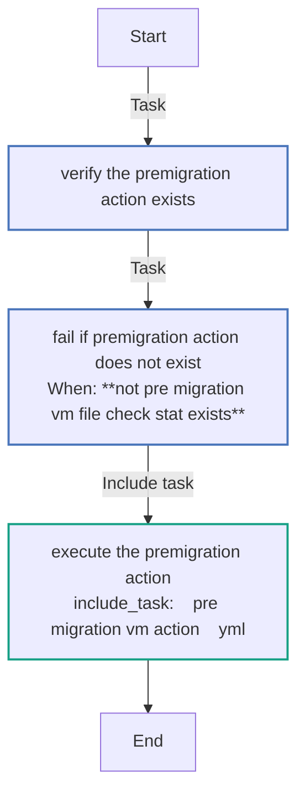

<!-- STATIC CONTENT START -->
# pre_migration_vm

Perform pre migration activities against VM's residing within source hypervisors.

<!-- STATIC CONTENT END -->
<!-- DOCSIBLE START -->
## pre_migration_vm

```
Role belongs to infra/openshift_virtualization_migration
Namespace - infra
Collection - openshift_virtualization_migration
Version - 1.25.0
Repository - https://github.com/redhat-cop/openshift_virtualization_migration
```

Description: Perform VM related activities prior to a migration

### Argument Specifications

<details>
<summary><b>🧩 Argument Specifications in `meta/argument_specs`</b></summary>

#### Key: main

* **Description**: ['This role performs pre-migration actions against a virtual machine in VMware.', 'The specific action is determined by the pre_migration_vm_action variable.']
* **Options**:
  * **pre_migration_vm_action**:
    * **Required**: True
    * **Type**: str
    * **Default**: none
    * **Description**: Action to be performed against the VM. Aligns to the name of the specific task file.
  * **pre_migration_vm_enable_cbt_power_on_post_enable**:
    * **Required**: False
    * **Type**: bool
    * **Default**: False
    * **Description**: Power on the VM after enabling CBT.
  * **pre_migration_vm_secure_logging**:
    * **Required**: False
    * **Type**: bool
    * **Default**: True
    * **Description**: Whether to enable secure logging for sensitive tasks.
  * **pre_migration_vm_vmware_ca_cert_path**:
    * **Required**: False
    * **Type**: str
    * **Default**: none
    * **Description**: Path to the VMware CA Certificate.
  * **pre_migration_vm_vmware_host**:
    * **Required**: True
    * **Type**: str
    * **Default**: none
    * **Description**: VMware host. Cascades from VMWARE_HOST env var or mf_source_host inventory variable.
  * **pre_migration_vm_vmware_password**:
    * **Required**: True
    * **Type**: str
    * **Default**: none
    * **Description**: VMware password. Cascades from VMWARE_PASSWORD env var or mf_source_password inventory variable.
  * **pre_migration_vm_vmware_username**:
    * **Required**: True
    * **Type**: str
    * **Default**: none
    * **Description**: VMware username. Cascades from VMWARE_USER env var or mf_source_username inventory variable.
  * **pre_migration_vm_vmware_verify_ssl**:
    * **Required**: False
    * **Type**: bool
    * **Default**: True
    * **Description**: Whether to verify VMware SSL certificates.
  * **pre_migration_vm_vmware_vm_datacenter**:
    * **Required**: False
    * **Type**: str
    * **Default**:
    * **Description**: VMware VM Datacenter.
  * **pre_migration_vm_vmware_vm_folder**:
    * **Required**: False
    * **Type**: str
    * **Default**:
    * **Description**: VMware VM Folder.
  * **pre_migration_vm_vmware_vm_moid**:
    * **Required**: False
    * **Type**: str
    * **Default**:
    * **Description**: VMware VM MoID.
  * **pre_migration_vm_vmware_vm_name**:
    * **Required**: False
    * **Type**: str
    * **Default**:
    * **Description**: VMware VM Name.
  * **pre_migration_vm_vmware_vm_uuid**:
    * **Required**: False
    * **Type**: str
    * **Default**:
    * **Description**: VMware VM UUID.

</details>

### Defaults

**These are static variables with lower priority**

#### File: defaults/main.yml

| Var          | Type         | Value       |Choices    |Required    | Title       |
|--------------|--------------|-------------|-------------|-------------|-------------|
| [`pre_migration_vm_action`](defaults/main.yml#L6)   | str   | `` |  None  |   True  |  Pre Migration Action |
| [`pre_migration_vm_enable_cbt_power_on_post_enable`](defaults/main.yml#L93)   | bool   | `False` |  None  |   False  |  Enable CBT Power On Post Enable |
| [`pre_migration_vm_secure_logging`](defaults/main.yml#L11)   | str   | `{{ secure_logging ¦ default(true) }}` |  None  |   False  |  Secure Logging |
| [`pre_migration_vm_vmware_ca_cert_path`](defaults/main.yml#L46)   | str   | `<multiline value: folded_strip>` |  None  |   False  |  VMware CA Certificate Path |
| [`pre_migration_vm_vmware_host`](defaults/main.yml#L18)   | str   | `<multiline value: folded_strip>` |  None  |   True  |  VMware Host |
| [`pre_migration_vm_vmware_password`](defaults/main.yml#L38)   | str   | `<multiline value: folded_strip>` |  None  |   True  |  VMware Password |
| [`pre_migration_vm_vmware_username`](defaults/main.yml#L28)   | str   | `<multiline value: folded_strip>` |  None  |   True  |  VMware Username |
| [`pre_migration_vm_vmware_verify_ssl`](defaults/main.yml#L55)   | str   | `<multiline value: folded_strip>` |  None  |   False  |  VMware Verify SSL |
| [`pre_migration_vm_vmware_vm_datacenter`](defaults/main.yml#L64)   | str   | `` |  None  |   False  |  VMware VM Datacenter |
| [`pre_migration_vm_vmware_vm_folder`](defaults/main.yml#L69)   | str   | `` |  None  |   False  |  VMware VM Folder |
| [`pre_migration_vm_vmware_vm_moid`](defaults/main.yml#L79)   | str   | `` |  None  |   False  |  VMware VM MoID |
| [`pre_migration_vm_vmware_vm_name`](defaults/main.yml#L74)   | str   | `` |  None  |   False  |  VMware VM Name |
| [`pre_migration_vm_vmware_vm_uuid`](defaults/main.yml#L84)   | str   | `` |  None  |   False  |  VMware VM UUID |

<summary><b>🖇️ Full descriptions for vars in defaults/main.yml</b></summary>
<br>
<b>`pre_migration_vm_action`:</b> Action to be performed against the VM. Aligns to the name of the specific task
<br>
<b>`pre_migration_vm_enable_cbt_power_on_post_enable`:</b> Power on the VM after enabling CBT
<br>
<b>`pre_migration_vm_secure_logging`:</b> Whether to enable secure logging for sensitive tasks.
<br>
<b>`pre_migration_vm_vmware_ca_cert_path`:</b> Path to the VMware CA Certificate.
<br>
<b>`pre_migration_vm_vmware_host`:</b> >-
<br>
<b>`pre_migration_vm_vmware_password`:</b> >-
<br>
<b>`pre_migration_vm_vmware_username`:</b> >-
<br>
<b>`pre_migration_vm_vmware_verify_ssl`:</b> Whether to verify VMware SSL certificates.
<br>
<b>`pre_migration_vm_vmware_vm_datacenter`:</b> VMware VM Datacenter.
<br>
<b>`pre_migration_vm_vmware_vm_folder`:</b> VMware VM Folder.
<br>
<b>`pre_migration_vm_vmware_vm_moid`:</b> VMware VM MoID.
<br>
<b>`pre_migration_vm_vmware_vm_name`:</b> VMware VM Name.
<br>
<b>`pre_migration_vm_vmware_vm_uuid`:</b> VMware VM UUID.
<br>
<br>

### Tasks

#### File: tasks/main.yml

| Name | Module | Has Conditions |
| ---- | ------ | --------- |
| Verify the premigration action exists | `ansible.builtin.stat` | False |
| Fail if premigration action does not exist | `ansible.builtin.fail` | True |
| Execute the premigration action | `ansible.builtin.include_tasks` | False |

#### File: tasks/enable_cbt.yml

| Name | Module | Has Conditions |
| ---- | ------ | --------- |
| enable_cbt ¦ Verify that the required variables are provided | `ansible.builtin.assert` | False |
| enable_cbt ¦ Fail if VM name, MoID, and UUID are all empty | `ansible.builtin.fail` | True |
| enable_cbt ¦ Check if CBT is enabled on the virtual machine | `vmware.vmware.guest_info` | False |
| enable_cbt ¦ Verify that a single virtual machine was found | `ansible.builtin.assert` | False |
| enable_cbt ¦ Enable CBT on the virtual machine | `block` | True |
| enable_cbt ¦ Power off the virtual machine | `vmware.vmware.vm_powerstate` | False |
| enable_cbt ¦ Enable CBT on the virtual machine | `vmware.vmware.vm_advanced_settings` | False |
| enable_cbt ¦ Power on the virtual machine | `vmware.vmware.vm_powerstate` | True |

## Task Flow Graphs

### Graph for enable_cbt.yml

```mermaid
flowchart TD
Start
classDef block stroke:#3498db,stroke-width:2px;
classDef task stroke:#4b76bb,stroke-width:2px;
classDef includeTasks stroke:#16a085,stroke-width:2px;
classDef importTasks stroke:#34495e,stroke-width:2px;
classDef includeRole stroke:#2980b9,stroke-width:2px;
classDef importRole stroke:#699ba7,stroke-width:2px;
classDef includeVars stroke:#8e44ad,stroke-width:2px;
classDef rescue stroke:#665352,stroke-width:2px;

  Start-->|Task| enable_cbt___Verify_that_the_required_variables_are_provided0[enable cbt   verify that the required variables<br>are provided]:::task
  enable_cbt___Verify_that_the_required_variables_are_provided0-->|Task| enable_cbt___Fail_if_VM_name__MoID__and_UUID_are_all_empty1[enable cbt   fail if vm name  moid  and uuid are<br>all empty<br>When: **pre migration vm vmware vm name   default     true<br>   length    0 and pre migration vm vmware vm moid<br>  default     true    length    0 and pre<br>migration vm vmware vm uuid   default     true   <br>length    0**]:::task
  enable_cbt___Fail_if_VM_name__MoID__and_UUID_are_all_empty1-->|Task| enable_cbt___Check_if_CBT_is_enabled_on_the_virtual_machine2[enable cbt   check if cbt is enabled on the<br>virtual machine]:::task
  enable_cbt___Check_if_CBT_is_enabled_on_the_virtual_machine2-->|Task| enable_cbt___Verify_that_a_single_virtual_machine_was_found3[enable cbt   verify that a single virtual machine<br>was found]:::task
  enable_cbt___Verify_that_a_single_virtual_machine_was_found3-->|Block Start| enable_cbt___Enable_CBT_on_the_virtual_machine4_block_start_0[[enable cbt   enable cbt on the virtual machine<br>When: **pre migration vm guest info results guests 0 <br>advanced settings is not defined or    pre<br>migration vm guest info results guests 0  advanced<br>settings  scsi0 0 ctkenabled     default         <br>true  or    pre migration vm guest info results<br>guests 0  advanced settings  ctkenabled    <br>default          true**]]:::block
  enable_cbt___Enable_CBT_on_the_virtual_machine4_block_start_0-->|Task| enable_cbt___Power_off_the_virtual_machine0[enable cbt   power off the virtual machine]:::task
  enable_cbt___Power_off_the_virtual_machine0-->|Task| enable_cbt___Enable_CBT_on_the_virtual_machine1[enable cbt   enable cbt on the virtual machine]:::task
  enable_cbt___Enable_CBT_on_the_virtual_machine1-->|Task| enable_cbt___Power_on_the_virtual_machine2[enable cbt   power on the virtual machine<br>When: **pre migration vm enable cbt power on post enable  <br>bool**]:::task
  enable_cbt___Power_on_the_virtual_machine2-.->|End of Block| enable_cbt___Enable_CBT_on_the_virtual_machine4_block_start_0
  enable_cbt___Power_on_the_virtual_machine2-->End
```



### Graph for main.yml



## Author Information

Red Hat

## License

GPL-3.0-only

## Minimum Ansible Version

2.16

## Platforms

No platforms specified.

<!-- DOCSIBLE END -->