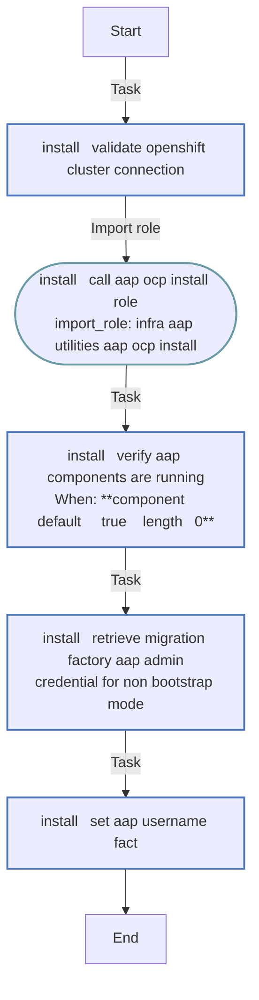
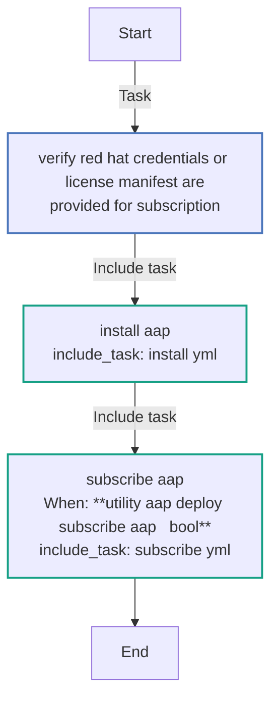

<!-- STATIC CONTENT START
Use this section for adding additional content to the README
This will not be overwritten by Docsible -->
# 📃 Role overview

<!-- STATIC CONTENT END -->
<!-- Everything below will be overwritten by Docsible -->
<!-- DOCSIBLE START -->
## utility_aap_deploy

```
Role belongs to infra/openshift_virtualization_migration
Namespace - infra
Collection - openshift_virtualization_migration
Version - 1.25.0
Repository - https://github.com/redhat-cop/openshift_virtualization_migration
```

Description: Deploys an instance of Ansible Automation Platform.

### Argument Specifications

<details>
<summary><b>🧩 Argument Specifications in `meta/argument_specs`</b></summary>

#### Key: main

* **Description**: Deploys an instance of Ansible Automation Platform.
* **Options**:
  * **utility_aap_deploy_aap_admin_username**:
    * **Required**: False
    * **Type**: str
    * **Default**: admin
    * **Description**: AAP admin username.
  * **utility_aap_deploy_aap_channel**:
    * **Required**: False
    * **Type**: str
    * **Default**: stable-2.6
    * **Description**: AAP Operator channel.
  * **utility_aap_deploy_aap_instance_name**:
    * **Required**: False
    * **Type**: str
    * **Default**: aap
    * **Description**: AAP instance name.
  * **utility_aap_deploy_aap_license_manifest**:
    * **Required**: False
    * **Type**: str
    * **Default**: 
    * **Description**: Location of the AAP license manifest file.
  * **utility_aap_deploy_aap_namespace**:
    * **Required**: False
    * **Type**: str
    * **Default**: virtualization-migration
    * **Description**: Namespace for the AAP instance.
  * **utility_aap_deploy_aap_ocp_install_controller**:
    * **Required**: False
    * **Type**: dict
    * **Default**: none
    * **Description**: AAP Controller Configuration.
  * **utility_aap_deploy_aap_ocp_install_eda**:
    * **Required**: False
    * **Type**: dict
    * **Default**: none
    * **Description**: AAP EDA Configuration.
  * **utility_aap_deploy_aap_ocp_install_hub**:
    * **Required**: False
    * **Type**: dict
    * **Default**: none
    * **Description**: AAP Hub Configuration.
  * **utility_aap_deploy_aap_ocp_install_lightspeed**:
    * **Required**: False
    * **Type**: dict
    * **Default**: none
    * **Description**: AAP Lightspeed Configuration.
  * **utility_aap_deploy_aap_ocp_install_operator**:
    * **Required**: False
    * **Type**: dict
    * **Default**: none
    * **Description**: AAP Operator Configuration.
  * **utility_aap_deploy_aap_ocp_install_platform**:
    * **Required**: False
    * **Type**: dict
    * **Default**: none
    * **Description**: AAP Platform Configuration.
  * **utility_aap_deploy_aap_setup_inst_verbosity**:
    * **Required**: False
    * **Type**: int
    * **Default**: 1
    * **Description**: Level from 0 - 5 for verbosity.
  * **utility_aap_deploy_aap_validate_certs**:
    * **Required**: False
    * **Type**: bool
    * **Default**: True
    * **Description**: Whether to verify SSL certificates for AAP.
  * **utility_aap_deploy_license_file_submission_delay**:
    * **Required**: False
    * **Type**: int
    * **Default**: 10
    * **Description**: Amount of time to wait between retries to submit the license file.
  * **utility_aap_deploy_license_file_submission_retries**:
    * **Required**: False
    * **Type**: int
    * **Default**: 25
    * **Description**: Number of retries to submit the license file.
  * **utility_aap_deploy_openshift_api_key**:
    * **Required**: True
    * **Type**: str
    * **Default**: none
    * **Description**: OpenShift API key.
  * **utility_aap_deploy_openshift_ca_cert_path**:
    * **Required**: False
    * **Type**: str
    * **Default**: none
    * **Description**: Path to the OpenShift CA Certificate.
  * **utility_aap_deploy_openshift_host**:
    * **Required**: True
    * **Type**: str
    * **Default**: none
    * **Description**: OpenShift host.
  * **utility_aap_deploy_openshift_verify_ssl**:
    * **Required**: False
    * **Type**: bool
    * **Default**: True
    * **Description**: Whether to verify SSL certificates.
  * **utility_aap_deploy_rh_client_id**:
    * **Required**: False
    * **Type**: str
    * **Default**: none
    * **Description**: Red Hat client ID.
  * **utility_aap_deploy_rh_client_secret**:
    * **Required**: False
    * **Type**: str
    * **Default**: none
    * **Description**: Red Hat client secret.
  * **utility_aap_deploy_rh_filter_product_name**:
    * **Required**: False
    * **Type**: str
    * **Default**: Red Hat Ansible Automation Platform
    * **Description**: Red Hat subscription product name.
  * **utility_aap_deploy_rh_filter_support_level**:
    * **Required**: False
    * **Type**: str
    * **Default**: Self-Support
    * **Description**: Red Hat subscription support level.
  * **utility_aap_deploy_rh_password**:
    * **Required**: False
    * **Type**: str
    * **Default**: none
    * **Description**: Red Hat password.
  * **utility_aap_deploy_rh_subscription_id**:
    * **Required**: False
    * **Type**: str
    * **Default**: 
    * **Description**: Red Hat subscription ID.
  * **utility_aap_deploy_rh_username**:
    * **Required**: False
    * **Type**: str
    * **Default**: none
    * **Description**: Red Hat username.
  * **utility_aap_deploy_secure_logging**:
    * **Required**: False
    * **Type**: bool
    * **Default**: True
    * **Description**: Whether to enable secure logging.
  * **utility_aap_deploy_subscribe_aap**:
    * **Required**: False
    * **Type**: bool
    * **Default**: True
    * **Description**: Whether to subscribe to AAP.

</details>

### Defaults

**These are static variables with lower priority**

#### File: defaults/main.yml

| Var          | Type         | Value       |Choices    |Required    | Title       |
|--------------|--------------|-------------|-------------|-------------|-------------|
| [`utility_aap_deploy_aap_admin_username`](defaults/main.yml#L54)   | str   | `admin` |  None  |   False  |  AAP Admin Username |
| [`utility_aap_deploy_aap_channel`](defaults/main.yml#L39)   | str   | `{{ aap_channel ¦ default('stable-2.6') }}` |  None  |   False  |  AAP Operator Channel |
| [`utility_aap_deploy_aap_instance_name`](defaults/main.yml#L44)   | str   | `aap` |  None  |   False  |  AAP Instance Name |
| [`utility_aap_deploy_aap_license_manifest`](defaults/main.yml#L139)   | str   | `` |  None  |   false  |  Location of the AAP license manifest file |
| [`utility_aap_deploy_aap_namespace`](defaults/main.yml#L49)   | str   | `virtualization-migration` |  None  |   False  |  AAP Namespace |
| [`utility_aap_deploy_aap_ocp_install_controller`](defaults/main.yml#L64)   | NoneType   | `None` |  None  |   False  |  AAP Controller Configuration |
| [`utility_aap_deploy_aap_ocp_install_eda`](defaults/main.yml#L89)   | NoneType   | `None` |  None  |   False  |  AAP EDA Configuration |
| [`utility_aap_deploy_aap_ocp_install_hub`](defaults/main.yml#L84)   | NoneType   | `None` |  None  |   False  |  AAP Hub Configuration |
| [`utility_aap_deploy_aap_ocp_install_lightspeed`](defaults/main.yml#L74)   | NoneType   | `None` |  None  |   False  |  AAP Lightspeed Configuration |
| [`utility_aap_deploy_aap_ocp_install_operator`](defaults/main.yml#L69)   | NoneType   | `None` |  None  |   False  |  AAP Operator Configuration |
| [`utility_aap_deploy_aap_ocp_install_platform`](defaults/main.yml#L79)   | NoneType   | `None` |  None  |   False  |  AAP Platform Configuration |
| [`utility_aap_deploy_aap_setup_inst_verbosity`](defaults/main.yml#L134)   | int   | `1` |  None  |   false  |  Level from 0 - 5 for verbosity |
| [`utility_aap_deploy_aap_validate_certs`](defaults/main.yml#L114)   | str   | `{{ aap_validate_certs ¦ default(true) }}` |  None  |   False  |  AAP Verify SSL |
| [`utility_aap_deploy_license_file_submission_delay`](defaults/main.yml#L151)   | int   | `10` |  None  |   True  |  License File Submission Delay |
| [`utility_aap_deploy_license_file_submission_retries`](defaults/main.yml#L145)   | int   | `25` |  None  |   True  |  License File Submission Retries |
| [`utility_aap_deploy_openshift_api_key`](defaults/main.yml#L12)   | str   | `<multiline value: folded_strip>` |  None  |   True  |  OpenShift API Key |
| [`utility_aap_deploy_openshift_ca_cert_path`](defaults/main.yml#L23)   | str   | `{{ openshift_ca_cert_path ¦ default(omit) }}` |  None  |   False  |  OpenShift CA Certificate Path |
| [`utility_aap_deploy_openshift_host`](defaults/main.yml#L7)   | str   | `{{ openshift_host }}` |  None  |   True  |  OpenShift Host |
| [`utility_aap_deploy_openshift_verify_ssl`](defaults/main.yml#L28)   | str   | `{{ openshift_verify_ssl ¦ default(true) }}` |  None  |   False  |  OpenShift Verify SSL |
| [`utility_aap_deploy_rh_client_id`](defaults/main.yml#L104)   | str   | `{{ rh_client_id ¦ default('', True) }}` |  None  |   False  |  Red Hat Client ID |
| [`utility_aap_deploy_rh_client_secret`](defaults/main.yml#L109)   | str   | `{{ rh_client_secret ¦ default(omit, True) }}` |  None  |   False  |  Red Hat Client Secret |
| [`utility_aap_deploy_rh_filter_product_name`](defaults/main.yml#L124)   | str   | `Red Hat Ansible Automation Platform` |  None  |   false  |  Red Hat subscription product name |
| [`utility_aap_deploy_rh_filter_support_level`](defaults/main.yml#L129)   | str   | `Self-Support` |  None  |   false  |  Red Hat subscription support level |
| [`utility_aap_deploy_rh_password`](defaults/main.yml#L99)   | str   | `{{ rh_password ¦ default('', True) }}` |  None  |   False  |  Red Hat Password |
| [`utility_aap_deploy_rh_subscription_id`](defaults/main.yml#L119)   | str   | `` |  None  |   true  |  Red Hat subscription ID |
| [`utility_aap_deploy_rh_username`](defaults/main.yml#L94)   | str   | `{{ rh_username ¦ default('', True) }}` |  None  |   False  |  Red Hat Username |
| [`utility_aap_deploy_secure_logging`](defaults/main.yml#L33)   | str   | `{{ secure_logging ¦ default(true) }}` |  None  |   False  |  Secure Logging |
| [`utility_aap_deploy_subscribe_aap`](defaults/main.yml#L59)   | bool   | `True` |  None  |   False  |  Subscribe AAP |

<summary><b>🖇️ Full descriptions for vars in defaults/main.yml</b></summary>
<br>
<b>`utility_aap_deploy_aap_admin_username`:</b> AAP admin username.
<br>
<b>`utility_aap_deploy_aap_channel`:</b> AAP Operator channel.
<br>
<b>`utility_aap_deploy_aap_instance_name`:</b> AAP instance name.
<br>
<b>`utility_aap_deploy_aap_license_manifest`:</b> Location of the AAP license manifest file
<br>
<b>`utility_aap_deploy_aap_namespace`:</b> Namespace for the AAP instance.
<br>
<b>`utility_aap_deploy_aap_ocp_install_controller`:</b> AAP Controller Configuration.
<br>
<b>`utility_aap_deploy_aap_ocp_install_eda`:</b> AAP EDA Configuration.
<br>
<b>`utility_aap_deploy_aap_ocp_install_hub`:</b> AAP Hub Configuration.
<br>
<b>`utility_aap_deploy_aap_ocp_install_lightspeed`:</b> AAP Lightspeed Configuration.
<br>
<b>`utility_aap_deploy_aap_ocp_install_operator`:</b> AAP Operator Configuration.
<br>
<b>`utility_aap_deploy_aap_ocp_install_platform`:</b> AAP Platform Configuration.
<br>
<b>`utility_aap_deploy_aap_setup_inst_verbosity`:</b> Level from 0 - 5 for verbosity
<br>
<b>`utility_aap_deploy_aap_validate_certs`:</b> Whether to verify SSL certificates.
<br>
<b>`utility_aap_deploy_license_file_submission_delay`:</b> None
<br>
<b>`utility_aap_deploy_license_file_submission_retries`:</b> None
<br>
<b>`utility_aap_deploy_openshift_api_key`:</b> OpenShift API key.
<br>
<b>`utility_aap_deploy_openshift_ca_cert_path`:</b> Path to the OpenShift CA Certificate.
<br>
<b>`utility_aap_deploy_openshift_host`:</b> OpenShift host.
<br>
<b>`utility_aap_deploy_openshift_verify_ssl`:</b> Whether to verify SSL certificates.
<br>
<b>`utility_aap_deploy_rh_client_id`:</b> Red Hat Client ID.
<br>
<b>`utility_aap_deploy_rh_client_secret`:</b> Red Hat Client Secret.
<br>
<b>`utility_aap_deploy_rh_filter_product_name`:</b> Red Hat subscription product name.
<br>
<b>`utility_aap_deploy_rh_filter_support_level`:</b> Red Hat subscription support level.
<br>
<b>`utility_aap_deploy_rh_password`:</b> Red Hat Password.
<br>
<b>`utility_aap_deploy_rh_subscription_id`:</b> Red Hat subscription ID.
<br>
<b>`utility_aap_deploy_rh_username`:</b> RH Username.
<br>
<b>`utility_aap_deploy_secure_logging`:</b> Whether to enable secure logging.
<br>
<b>`utility_aap_deploy_subscribe_aap`:</b> Whether to subscribe to AAP.
<br>
<br>

### Vars

**These are variables with higher priority**

#### File: vars/main.yml

| Var          | Type         | Value       |
|--------------|--------------|-------------|
| [__utility_aap_deploy_aap_ocp_install_controller](vars/main.yml#L7)   | dict   | `{}` |
| [__utility_aap_deploy_aap_ocp_install_controller.admin_user](vars/main.yml#L9)   | str   | `{{ utility_aap_deploy_aap_admin_username }}` |
| [__utility_aap_deploy_aap_ocp_install_controller.install](vars/main.yml#L8)   | bool   | `True` |
| [__utility_aap_deploy_aap_ocp_install_eda](vars/main.yml#L16)   | dict   | `{}` |
| [__utility_aap_deploy_aap_ocp_install_eda.install](vars/main.yml#L17)   | bool   | `False` |
| [__utility_aap_deploy_aap_ocp_install_hub](vars/main.yml#L14)   | dict   | `{}` |
| [__utility_aap_deploy_aap_ocp_install_hub.install](vars/main.yml#L15)   | bool   | `False` |
| [__utility_aap_deploy_aap_ocp_install_lightspeed](vars/main.yml#L10)   | dict   | `{}` |
| [__utility_aap_deploy_aap_ocp_install_lightspeed.install](vars/main.yml#L11)   | bool   | `False` |
| [__utility_aap_deploy_aap_ocp_install_operator](vars/main.yml#L12)   | dict   | `{}` |
| [__utility_aap_deploy_aap_ocp_install_operator.channel](vars/main.yml#L13)   | str   | `{{ utility_aap_deploy_aap_channel }}` |
| [__utility_aap_deploy_aap_ocp_install_platform](vars/main.yml#L3)   | dict   | `{}` |
| [__utility_aap_deploy_aap_ocp_install_platform.component_deployment](vars/main.yml#L6)   | str   | `unified` |
| [__utility_aap_deploy_aap_ocp_install_platform.instance_name](vars/main.yml#L5)   | str   | `{{ utility_aap_deploy_aap_instance_name }}` |
| [__utility_aap_deploy_aap_ocp_install_platform.namespace](vars/main.yml#L4)   | str   | `{{ utility_aap_deploy_aap_namespace }}` |
| [__utility_aap_deploy_aap_validate_components](vars/main.yml#L19)   | list   | `[]` |
| [__utility_aap_deploy_aap_validate_components.0](vars/main.yml#L20)   | str   | `{{ utility_aap_deploy_aap_instance_name + '-controller-web' }}` |
| [__utility_aap_deploy_aap_validate_components.1](vars/main.yml#L21)   | str   | `{{ utility_aap_deploy_aap_instance_name + '-controller-task' }}` |
| [__utility_aap_deploy_aap_validate_components.2](vars/main.yml#L22)   | str   | `{{ utility_aap_deploy_aap_instance_name + '-gateway' }}` |

### Tasks

#### File: tasks/main.yml

| Name | Module | Has Conditions |
| ---- | ------ | --------- |
| Verify Red Hat credentials or license manifest are provided for subscription | `ansible.builtin.assert` | False |
| Install AAP | `ansible.builtin.include_tasks` | False |
| Subscribe AAP | `ansible.builtin.include_tasks` | True |

#### File: tasks/install.yml

| Name | Module | Has Conditions |
| ---- | ------ | --------- |
| install ¦ Validate OpenShift cluster connection | `ansible.builtin.uri` | False |
| install ¦ Call aap_ocp_install role | `ansible.builtin.import_role` | False |
| install ¦ Verify AAP Components are running | `kubernetes.core.k8s_info` | True |
| install ¦ Retrieve Migration Factory AAP admin credential for non-bootstrap mode | `kubernetes.core.k8s_info` | False |
| install ¦ Set AAP username fact | `ansible.builtin.set_fact` | False |

#### File: tasks/subscribe.yml

| Name | Module | Has Conditions |
| ---- | ------ | --------- |
| subscribe ¦ Get subscriptions with a filter | `block` | True |
| subscribe ¦ Query Subscription | `ansible.controller.subscriptions` | False |
| subscribe ¦ Set subscription ID based on utility_aap_deploy_aap_subscriptions | `ansible.builtin.set_fact` | False |
| subscribe ¦ Attach to a subscription | `ansible.controller.license` | False |
| subscribe ¦ Verify License Manifest Exists | `block` | True |
| subscribe ¦ Check if license file exists | `ansible.builtin.stat` | False |
| subscribe ¦ Verify license file exists | `ansible.builtin.assert` | False |
| subscribe ¦ Read the License file | `ansible.builtin.slurp` | False |
| subscribe ¦ Apply license to AAP | `ansible.builtin.uri` | False |

## Task Flow Graphs

### Graph for install.yml



### Graph for main.yml



### Graph for subscribe.yml

```mermaid
flowchart TD
Start
classDef block stroke:#3498db,stroke-width:2px;
classDef task stroke:#4b76bb,stroke-width:2px;
classDef includeTasks stroke:#16a085,stroke-width:2px;
classDef importTasks stroke:#34495e,stroke-width:2px;
classDef includeRole stroke:#2980b9,stroke-width:2px;
classDef importRole stroke:#699ba7,stroke-width:2px;
classDef includeVars stroke:#8e44ad,stroke-width:2px;
classDef rescue stroke:#665352,stroke-width:2px;

  Start-->|Block Start| subscribe___Get_subscriptions_with_a_filter0_block_start_0[[subscribe   get subscriptions with a filter<br>When: **utility aap deploy aap license manifest   default <br>   true    trim   length    0**]]:::block
  subscribe___Get_subscriptions_with_a_filter0_block_start_0-->|Task| subscribe___Query_Subscription0[subscribe   query subscription]:::task
  subscribe___Query_Subscription0-->|Task| subscribe___Set_subscription_ID_based_on_utility_aap_deploy_aap_subscriptions1[subscribe   set subscription id based on utility<br>aap deploy aap subscriptions]:::task
  subscribe___Set_subscription_ID_based_on_utility_aap_deploy_aap_subscriptions1-->|Task| subscribe___Attach_to_a_subscription2[subscribe   attach to a subscription]:::task
  subscribe___Attach_to_a_subscription2-.->|End of Block| subscribe___Get_subscriptions_with_a_filter0_block_start_0
  subscribe___Attach_to_a_subscription2-->|Block Start| subscribe___Verify_License_Manifest_Exists1_block_start_0[[subscribe   verify license manifest exists<br>When: **utility aap deploy aap license manifest   default <br>   true    trim   length   0**]]:::block
  subscribe___Verify_License_Manifest_Exists1_block_start_0-->|Task| subscribe___Check_if_license_file_exists0[subscribe   check if license file exists]:::task
  subscribe___Check_if_license_file_exists0-->|Task| subscribe___Verify_license_file_exists1[subscribe   verify license file exists]:::task
  subscribe___Verify_license_file_exists1-->|Task| subscribe___Read_the_License_file2[subscribe   read the license file]:::task
  subscribe___Read_the_License_file2-->|Task| subscribe___Apply_license_to_AAP3[subscribe   apply license to aap]:::task
  subscribe___Apply_license_to_AAP3-.->|End of Block| subscribe___Verify_License_Manifest_Exists1_block_start_0
  subscribe___Apply_license_to_AAP3-->End
```



## Author Information

OpenShift Virtualization Migration Contributors

## License

GPL-3.0-only

## Minimum Ansible Version

2.15.0

## Platforms

No platforms specified.

<!-- DOCSIBLE END -->