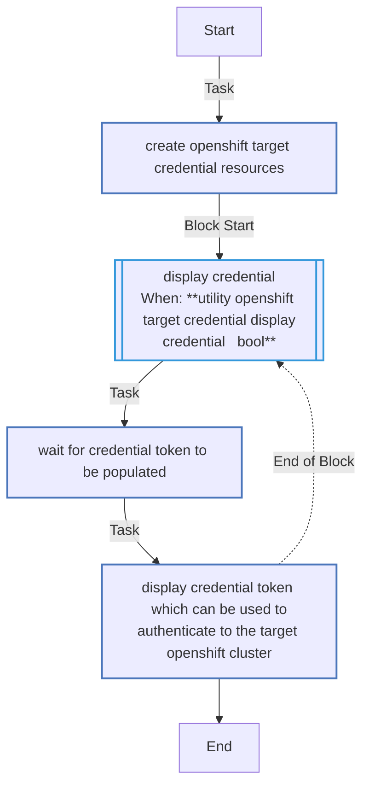

<!-- STATIC CONTENT START -->
# utility_openshift_target_credential

Manage OpenShift target cluster credentials for migration automation.

<!-- STATIC CONTENT END -->
<!-- DOCSIBLE START -->
## utility_openshift_target_credential

```
Role belongs to infra/openshift_virtualization_migration
Namespace - infra
Collection - openshift_virtualization_migration
Version - 1.25.0
Repository - https://github.com/redhat-cop/openshift_virtualization_migration
```

Description: A utility role to manage OpenShift target cluster credentials for migration

### Argument Specifications

<details>
<summary><b>🧩 Argument Specifications in `meta/argument_specs`</b></summary>

#### Key: main

* **Description**: Creates a long lived Service Account token in OpenShift for use by Ansible Automation Platform.
* **Options**:
  * **utility_openshift_target_credential_cluster_role**:
    * **Required**: False
    * **Type**: str
    * **Default**: cluster-admin
    * **Description**: Cluster Role applied to the generated OpenShift Service Account.
  * **utility_openshift_target_credential_display_credential**:
    * **Required**: False
    * **Type**: bool
    * **Default**: False
    * **Description**: Whether to display the credential.
  * **utility_openshift_target_credential_managed_by_label**:
    * **Required**: False
    * **Type**: str
    * **Default**: ansible
    * **Description**: Value of the app.kubernetes.io/managed-by label applied to resources.
  * **utility_openshift_target_credential_openshift_api_key**:
    * **Required**: True
    * **Type**: str
    * **Default**: none
    * **Description**: OpenShift API key.
  * **utility_openshift_target_credential_openshift_ca_cert_path**:
    * **Required**: False
    * **Type**: str
    * **Default**: none
    * **Description**: Path to the OpenShift CA Certificate.
  * **utility_openshift_target_credential_openshift_host**:
    * **Required**: True
    * **Type**: str
    * **Default**: none
    * **Description**: OpenShift host.
  * **utility_openshift_target_credential_openshift_verify_ssl**:
    * **Required**: False
    * **Type**: bool
    * **Default**: True
    * **Description**: Whether to verify SSL certificates.
  * **utility_openshift_target_credential_resource_name**:
    * **Required**: False
    * **Type**: str
    * **Default**: migration-factory-aap-credential
    * **Description**: Name applied to the OpenShift target credential resource.
  * **utility_openshift_target_credential_resource_namespace**:
    * **Required**: False
    * **Type**: str
    * **Default**: openshift-config
    * **Description**: Namespace applied to the OpenShift target credential resource.
  * **utility_openshift_target_credential_secure_logging**:
    * **Required**: False
    * **Type**: bool
    * **Default**: True
    * **Description**: Whether to enable secure logging.

</details>

### Defaults

**These are static variables with lower priority**

#### File: defaults/main.yml

| Var          | Type         | Value       |Choices    |Required    | Title       |
|--------------|--------------|-------------|-------------|-------------|-------------|
| [`utility_openshift_target_credential_cluster_role`](defaults/main.yml#L43)   | str   | `cluster-admin` |  None  |   False  |  Cluster Role applied to the generated OpenShift Service Account |
| [`utility_openshift_target_credential_display_credential`](defaults/main.yml#L58)   | bool   | `False` |  None  |   False  |  Display Credential |
| [`utility_openshift_target_credential_managed_by_label`](defaults/main.yml#L48)   | str   | `ansible-migration-factory` |  None  |   False  |  Managed By Label |
| [`utility_openshift_target_credential_openshift_api_key`](defaults/main.yml#L12)   | str   | `<multiline value: folded_strip>` |  None  |   True  |  OpenShift API Key |
| [`utility_openshift_target_credential_openshift_ca_cert_path`](defaults/main.yml#L23)   | str   | `{{ openshift_ca_cert_path ¦ default(omit) }}` |  None  |   False  |  OpenShift CA Certificate Path |
| [`utility_openshift_target_credential_openshift_host`](defaults/main.yml#L7)   | str   | `{{ openshift_host }}` |  None  |   True  |  OpenShift Host |
| [`utility_openshift_target_credential_openshift_verify_ssl`](defaults/main.yml#L28)   | str   | `{{ openshift_verify_ssl ¦ default(true) }}` |  None  |   False  |  OpenShift Verify SSL |
| [`utility_openshift_target_credential_resource_name`](defaults/main.yml#L33)   | str   | `migration-factory-aap-credential` |  None  |   False  |  Name applied to the OpenShift target credential resource |
| [`utility_openshift_target_credential_resource_namespace`](defaults/main.yml#L38)   | str   | `openshift-config` |  None  |   False  |  Namespace applied to the OpenShift target credential resource |
| [`utility_openshift_target_credential_secure_logging`](defaults/main.yml#L53)   | str   | `{{ secure_logging ¦ default(true) }}` |  None  |   False  |  Secure Logging |

<summary><b>🖇️ Full descriptions for vars in defaults/main.yml</b></summary>
<br>
<b>`utility_openshift_target_credential_cluster_role`:</b> Cluster Role applied to the generated OpenShift Service Account.
<br>
<b>`utility_openshift_target_credential_display_credential`:</b> Whether to display the credential.
<br>
<b>`utility_openshift_target_credential_managed_by_label`:</b> Value of the app.kubernetes.io/managed-by label applied to resources.
<br>
<b>`utility_openshift_target_credential_openshift_api_key`:</b> OpenShift API key.
<br>
<b>`utility_openshift_target_credential_openshift_ca_cert_path`:</b> Path to the OpenShift CA Certificate.
<br>
<b>`utility_openshift_target_credential_openshift_host`:</b> OpenShift host.
<br>
<b>`utility_openshift_target_credential_openshift_verify_ssl`:</b> Whether to verify SSL certificates.
<br>
<b>`utility_openshift_target_credential_resource_name`:</b> Name applied to the OpenShift target credential resource.
<br>
<b>`utility_openshift_target_credential_resource_namespace`:</b> Namespace applied to the OpenShift target credential resource.
<br>
<b>`utility_openshift_target_credential_secure_logging`:</b> Whether to enable secure logging.
<br>
<br>

### Tasks

#### File: tasks/main.yml

| Name | Module | Has Conditions |
| ---- | ------ | --------- |
| Create OpenShift target credential resources | `redhat.openshift.k8s` | False |
| Display credential | `block` | True |
| Wait for credential token to be populated | `kubernetes.core.k8s_info` | False |
| Display credential token which can be used to authenticate to the target OpenShift cluster | `ansible.builtin.debug` | False |

## Task Flow Graphs

### Graph for main.yml



## Author Information

OpenShift Virtualization Migration Contributors

## License

GPL-3.0-only

## Minimum Ansible Version

2.15.0

## Platforms

No platforms specified.

<!-- DOCSIBLE END -->