<!-- STATIC CONTENT START
Use this section for adding additional content to the README
This will not be overwritten by Docsible -->
# 📃 Role overview

<!-- STATIC CONTENT END -->
<!-- Everything below will be overwritten by Docsible -->
<!-- DOCSIBLE START -->
## validate_migration

```
Role belongs to infra/openshift_virtualization_migration
Namespace - infra
Collection - openshift_virtualization_migration
Version - 1.25.0
Repository - https://github.com/redhat-cop/openshift_virtualization_migration
```

Description: Verification of an Ansible for OpenShift Virtualization Migration environment.

### Defaults

**These are static variables with lower priority**

#### File: defaults/main.yml

| Var          | Type         | Value       |Choices    |Required    | Title       |
|--------------|--------------|-------------|-------------|-------------|-------------|
| [`validate_migration_check_vm_running`](defaults/main.yml#L44)   | bool   | `True` |  None  |   False  |  Check VM Running Status |
| [`validate_migration_cluster_name`](defaults/main.yml#L20)   | str   | `cluster01` |  None  |   None  |  None |
| [`validate_migration_debug`](defaults/main.yml#L18)   | bool   | `True` |  None  |   None  |  None |
| [`validate_migration_expected_dv_phase`](defaults/main.yml#L52)   | str   | `Succeeded` |  None  |   False  |  Expected DataVolume Phase |
| [`validate_migration_expected_provisioners`](defaults/main.yml#L3)   | list   | `[]` |  None  |   None  |  None |
| [`validate_migration_expected_provisioners.0`](defaults/main.yml#L4)   | str   | `kubernetes.io/aws-ebs` |  None  |   None  |  None |
| [`validate_migration_expected_provisioners.1`](defaults/main.yml#L5)   | str   | `kubernetes.io/azure-disk` |  None  |   None  |  None |
| [`validate_migration_expected_provisioners.10`](defaults/main.yml#L14)   | str   | `kubernetes.io/vsphere-volume` |  None  |   None  |  None |
| [`validate_migration_expected_provisioners.2`](defaults/main.yml#L6)   | str   | `kubernetes.io/azure-file` |  None  |   None  |  None |
| [`validate_migration_expected_provisioners.3`](defaults/main.yml#L7)   | str   | `kubernetes.io/cinder` |  None  |   None  |  None |
| [`validate_migration_expected_provisioners.4`](defaults/main.yml#L8)   | str   | `kubernetes.io/gce-pd` |  None  |   None  |  None |
| [`validate_migration_expected_provisioners.5`](defaults/main.yml#L9)   | str   | `kubernetes.io/hostpath-provisioner` |  None  |   None  |  None |
| [`validate_migration_expected_provisioners.6`](defaults/main.yml#L10)   | str   | `manila.csi.openstack.org` |  None  |   None  |  None |
| [`validate_migration_expected_provisioners.7`](defaults/main.yml#L11)   | str   | `openshift-storage.cephfs.csi.ceph.com` |  None  |   None  |  None |
| [`validate_migration_expected_provisioners.8`](defaults/main.yml#L12)   | str   | `openshift-storage.rbd.csi.ceph.com` |  None  |   None  |  None |
| [`validate_migration_expected_provisioners.9`](defaults/main.yml#L13)   | str   | `kubernetes.io/rbd` |  None  |   None  |  None |
| [`validate_migration_expected_vm_phase`](defaults/main.yml#L48)   | str   | `Running` |  None  |   False  |  Expected VM Phase |
| [`validate_migration_kubevirt_api_version`](defaults/main.yml#L56)   | str   | `kubevirt.io/v1` |  None  |   False  |  KubeVirt API Version |
| [`validate_migration_namespace`](defaults/main.yml#L16)   | str   | `openshift-mtv` |  None  |   None  |  None |
| [`validate_migration_post_enabled`](defaults/main.yml#L32)   | bool   | `False` |  None  |   False  |  Enable Post-Migration Validation |
| [`validate_migration_post_label_selectors`](defaults/main.yml#L40)   | list   | `[]` |  None  |   False  |  Post-Migration Label Selectors |
| [`validate_migration_post_namespace`](defaults/main.yml#L36)   | str   | `` |  None  |   False  |  Post-Migration Target Namespace |
| [`validate_migration_pre_enabled`](defaults/main.yml#L26)   | bool   | `True` |  None  |   False  |  Enable Pre-Migration Validation |

<summary><b>🖇️ Full descriptions for vars in defaults/main.yml</b></summary>
<br>
<b>`validate_migration_check_vm_running`:</b> Verify VirtualMachineInstances are running
<br>
<b>`validate_migration_cluster_name`:</b> None
<br>
<b>`validate_migration_debug`:</b> None
<br>
<b>`validate_migration_expected_dv_phase`:</b> Expected DataVolume phase
<br>
<b>`validate_migration_expected_provisioners`:</b> None
<br>
<b>`validate_migration_expected_provisioners.0`:</b> None
<br>
<b>`validate_migration_expected_provisioners.1`:</b> None
<br>
<b>`validate_migration_expected_provisioners.10`:</b> None
<br>
<b>`validate_migration_expected_provisioners.2`:</b> None
<br>
<b>`validate_migration_expected_provisioners.3`:</b> None
<br>
<b>`validate_migration_expected_provisioners.4`:</b> None
<br>
<b>`validate_migration_expected_provisioners.5`:</b> None
<br>
<b>`validate_migration_expected_provisioners.6`:</b> None
<br>
<b>`validate_migration_expected_provisioners.7`:</b> None
<br>
<b>`validate_migration_expected_provisioners.8`:</b> None
<br>
<b>`validate_migration_expected_provisioners.9`:</b> None
<br>
<b>`validate_migration_expected_vm_phase`:</b> Expected VirtualMachineInstance phase
<br>
<b>`validate_migration_kubevirt_api_version`:</b> KubeVirt API Version
<br>
<b>`validate_migration_namespace`:</b> None
<br>
<b>`validate_migration_post_enabled`:</b> Enable post-migration validation checks
<br>
<b>`validate_migration_post_label_selectors`:</b> Label selectors to filter VMs for validation
<br>
<b>`validate_migration_post_namespace`:</b> Namespace containing migrated VMs to validate
<br>
<b>`validate_migration_pre_enabled`:</b> Enable pre-migration infrastructure validation checks
<br>
<br>

### Tasks

#### File: tasks/main.yml

| Name | Module | Has Conditions |
| ---- | ------ | --------- |
| Include ocp_version tasks | `ansible.builtin.include_tasks` | True |
| Include ocp_operators tasks | `ansible.builtin.include_tasks` | True |
| Include ocp_storage_support tasks | `ansible.builtin.include_tasks` | True |
| Include vmware_firewall_rules tasks | `ansible.builtin.include_tasks` | True |
| Include post-migration VM validation | `ansible.builtin.include_tasks` | True |
| Include post-migration data volume validation | `ansible.builtin.include_tasks` | True |
| Include post-migration network validation | `ansible.builtin.include_tasks` | True |
| Include post-migration relationship validation | `ansible.builtin.include_tasks` | True |

#### File: tasks/_validate_vm.yml

| Name | Module | Has Conditions |
| ---- | ------ | --------- |
| _validate_vm ¦ Verify VM Has Required Spec Fields | `ansible.builtin.assert` | False |
| _validate_vm ¦ Verify VM Has CPU Configuration | `ansible.builtin.assert` | False |
| _validate_vm ¦ Verify VM Has Memory Configuration | `ansible.builtin.assert` | False |
| _validate_vm ¦ Verify VM Has Volumes Defined | `ansible.builtin.assert` | False |
| _validate_vm ¦ Verify VM Has Network Interfaces | `ansible.builtin.assert` | False |
| _validate_vm ¦ Collect VirtualMachineInstance Status | `kubernetes.core.k8s_info` | True |
| _validate_vm ¦ Verify VMI Is Running | `ansible.builtin.assert` | True |
| _validate_vm ¦ Record Successful Validation | `ansible.builtin.set_fact` | False |

#### File: tasks/_validate_vm_volumes.yml

| Name | Module | Has Conditions |
| ---- | ------ | --------- |
| _validate_vm_volumes ¦ Extract DataVolume References from VM | `ansible.builtin.set_fact` | False |
| _validate_vm_volumes ¦ Verify Referenced DataVolumes Exist | `block` | True |
| _validate_vm_volumes ¦ Query Referenced DataVolumes | `kubernetes.core.k8s_info` | False |
| _validate_vm_volumes ¦ Track Missing DataVolumes | `ansible.builtin.set_fact` | True |
| _validate_vm_volumes ¦ Verify Referenced PVCs Exist | `block` | True |
| _validate_vm_volumes ¦ Query Referenced PVCs | `kubernetes.core.k8s_info` | False |
| _validate_vm_volumes ¦ Verify PVC Bindings | `ansible.builtin.assert` | False |

#### File: tasks/ocp_operators.yml

| Name | Module | Has Conditions |
| ---- | ------ | --------- |
| ocp_operators ¦ Verify existence of Project {{ validate_migration_namespace }} | `block` | False |
| ocp_operators ¦ Get list of Project named {{ validate_migration_namespace }} | `kubernetes.core.k8s_info` | False |
| ocp_operators ¦ Debug Task (Runs if Project Exists) | `ansible.builtin.debug` | False |
| ocp_operators ¦ Verify OperatorGroup exists | `block` | False |
| ocp_operators ¦ Get list of OperatorGroup on Project {{ validate_migration_namespace }} | `kubernetes.core.k8s_info` | False |
| ocp_operators ¦ Debug Task (Runs if OperatorGroup Exists) | `ansible.builtin.debug` | False |
| ocp_operators ¦ Verify Subscription exists | `block` | False |
| ocp_operators ¦ Verify Subscription exists | `kubernetes.core.k8s_info` | False |
| ocp_operators ¦ Debug Task (Runs if Subscription Exists) | `ansible.builtin.debug` | False |

#### File: tasks/ocp_storage_support.yml

| Name | Module | Has Conditions |
| ---- | ------ | --------- |
| ocp_storage_support ¦ Get StorageClass resources | `kubernetes.core.k8s_info` | False |
| ocp_storage_support ¦ Available Storageclasses within OpenShift Cluster and Provisioner Status | `ansible.builtin.debug` | False |
| ocp_storage_support ¦ Get PersistentVolumes | `kubernetes.core.k8s_info` | False |
| ocp_storage_support ¦ Check validate_migration_ocp_pvs for block storage with EXT4 | `ansible.builtin.set_fact` | True |
| ocp_storage_support ¦ Print PVs for block storage with EXT4 | `ansible.builtin.debug` | True |

#### File: tasks/ocp_version.yml

| Name | Module | Has Conditions |
| ---- | ------ | --------- |
| ocp_version ¦ Get OCP version and check if it's 4.12 or higher | `kubernetes.core.k8s_info` | False |
| ocp_version ¦ Print OCP version | `ansible.builtin.debug` | False |

#### File: tasks/post_migration_data_volumes.yml

| Name | Module | Has Conditions |
| ---- | ------ | --------- |
| post_migration_data_volumes ¦ Collect DataVolumes in Target Namespace | `kubernetes.core.k8s_info` | False |
| post_migration_data_volumes ¦ Verify DataVolumes Exist | `ansible.builtin.assert` | False |
| post_migration_data_volumes ¦ Verify DataVolume Status Is Succeeded | `ansible.builtin.assert` | False |
| post_migration_data_volumes ¦ Collect PVCs in Target Namespace | `kubernetes.core.k8s_info` | False |
| post_migration_data_volumes ¦ Verify PVCs Are Bound | `ansible.builtin.assert` | False |
| post_migration_data_volumes ¦ Verify DataVolume Storage Sizes | `ansible.builtin.debug` | False |
| post_migration_data_volumes ¦ Report Data Volume Summary | `ansible.builtin.debug` | False |

#### File: tasks/post_migration_networks.yml

| Name | Module | Has Conditions |
| ---- | ------ | --------- |
| post_migration_networks ¦ Collect VirtualMachines for Network Validation | `kubernetes.core.k8s_info` | False |
| post_migration_networks ¦ Validate VM Network Interfaces | `ansible.builtin.assert` | False |
| post_migration_networks ¦ Verify Network-Interface Count Match | `ansible.builtin.assert` | False |
| post_migration_networks ¦ Collect NetworkAttachmentDefinitions | `kubernetes.core.k8s_info` | False |
| post_migration_networks ¦ Report Network Attachment Definitions | `ansible.builtin.debug` | True |
| post_migration_networks ¦ Collect NetworkPolicies | `kubernetes.core.k8s_info` | False |
| post_migration_networks ¦ Report Network Policies | `ansible.builtin.debug` | False |
| post_migration_networks ¦ Report Network Validation Summary | `ansible.builtin.debug` | False |

#### File: tasks/post_migration_relationships.yml

| Name | Module | Has Conditions |
| ---- | ------ | --------- |
| post_migration_relationships ¦ Collect VMs for Relationship Validation | `kubernetes.core.k8s_info` | False |
| post_migration_relationships ¦ Collect DataVolumes for Relationship Validation | `kubernetes.core.k8s_info` | False |
| post_migration_relationships ¦ Initialize Relationship Tracking | `ansible.builtin.set_fact` | False |
| post_migration_relationships ¦ Verify VM Volume References Exist | `ansible.builtin.include_tasks` | False |
| post_migration_relationships ¦ Check for Orphaned DataVolumes | `ansible.builtin.set_fact` | True |
| post_migration_relationships ¦ Warn About Orphaned DataVolumes | `ansible.builtin.debug` | True |
| post_migration_relationships ¦ Report Missing DataVolumes | `ansible.builtin.debug` | True |
| post_migration_relationships ¦ Report Relationship Summary | `ansible.builtin.debug` | False |

#### File: tasks/post_migration_vms.yml

| Name | Module | Has Conditions |
| ---- | ------ | --------- |
| post_migration_vms ¦ Initialize VM Validation Results | `ansible.builtin.set_fact` | False |
| post_migration_vms ¦ Collect VirtualMachines in Target Namespace | `kubernetes.core.k8s_info` | False |
| post_migration_vms ¦ Verify VirtualMachines Exist | `ansible.builtin.assert` | False |
| post_migration_vms ¦ Validate Each VirtualMachine | `ansible.builtin.include_tasks` | False |
| post_migration_vms ¦ Report VM Validation Summary | `ansible.builtin.debug` | False |

#### File: tasks/vmware_firewall_rules.yml

| Name | Module | Has Conditions |
| ---- | ------ | --------- |
| vmware_firewall_rules ¦ Build a list of all the clusters | `vmware.vmware_rest.vcenter_cluster_info` | False |
| vmware_firewall_rules ¦ Gather firewall info about all ESXi Host in given Cluster | `community.vmware.vmware_host_firewall_info` | False |
| vmware_firewall_rules ¦ Debug firewall details | `ansible.builtin.debug` | True |

## Task Flow Graphs

### Graph for _validate_vm.yml

```mermaid
flowchart TD
Start
classDef block stroke:#3498db,stroke-width:2px;
classDef task stroke:#4b76bb,stroke-width:2px;
classDef includeTasks stroke:#16a085,stroke-width:2px;
classDef importTasks stroke:#34495e,stroke-width:2px;
classDef includeRole stroke:#2980b9,stroke-width:2px;
classDef importRole stroke:#699ba7,stroke-width:2px;
classDef includeVars stroke:#8e44ad,stroke-width:2px;
classDef rescue stroke:#665352,stroke-width:2px;

  Start-->|Task| _validate_vm___Verify_VM_Has_Required_Spec_Fields0[ validate vm   verify vm has required spec fields]:::task
  _validate_vm___Verify_VM_Has_Required_Spec_Fields0-->|Task| _validate_vm___Verify_VM_Has_CPU_Configuration1[ validate vm   verify vm has cpu configuration]:::task
  _validate_vm___Verify_VM_Has_CPU_Configuration1-->|Task| _validate_vm___Verify_VM_Has_Memory_Configuration2[ validate vm   verify vm has memory configuration]:::task
  _validate_vm___Verify_VM_Has_Memory_Configuration2-->|Task| _validate_vm___Verify_VM_Has_Volumes_Defined3[ validate vm   verify vm has volumes defined]:::task
  _validate_vm___Verify_VM_Has_Volumes_Defined3-->|Task| _validate_vm___Verify_VM_Has_Network_Interfaces4[ validate vm   verify vm has network interfaces]:::task
  _validate_vm___Verify_VM_Has_Network_Interfaces4-->|Task| _validate_vm___Collect_VirtualMachineInstance_Status5[ validate vm   collect virtualmachineinstance<br>status<br>When: **validate migration check vm running   bool**]:::task
  _validate_vm___Collect_VirtualMachineInstance_Status5-->|Task| _validate_vm___Verify_VMI_Is_Running6[ validate vm   verify vmi is running<br>When: **validate migration check vm running   bool**]:::task
  _validate_vm___Verify_VMI_Is_Running6-->|Task| _validate_vm___Record_Successful_Validation7[ validate vm   record successful validation]:::task
  _validate_vm___Record_Successful_Validation7-->End
```

### Graph for _validate_vm_volumes.yml

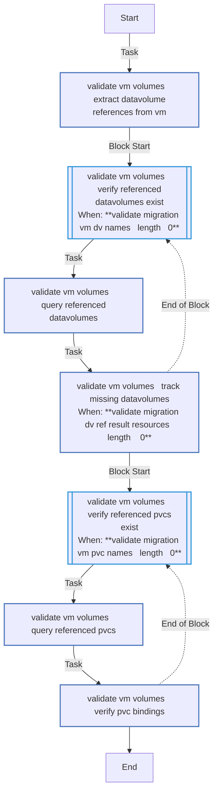

### Graph for main.yml

```mermaid
flowchart TD
Start
classDef block stroke:#3498db,stroke-width:2px;
classDef task stroke:#4b76bb,stroke-width:2px;
classDef includeTasks stroke:#16a085,stroke-width:2px;
classDef importTasks stroke:#34495e,stroke-width:2px;
classDef includeRole stroke:#2980b9,stroke-width:2px;
classDef importRole stroke:#699ba7,stroke-width:2px;
classDef includeVars stroke:#8e44ad,stroke-width:2px;
classDef rescue stroke:#665352,stroke-width:2px;

  Start-->|Include task| Include_ocp_version_tasks_ocp_version_yml_0[include ocp version tasks<br>When: **validate migration pre enabled   bool**<br>include_task: ocp version yml]:::includeTasks
  Include_ocp_version_tasks_ocp_version_yml_0-->|Include task| Include_ocp_operators_tasks_ocp_operators_yml_1[include ocp operators tasks<br>When: **validate migration pre enabled   bool**<br>include_task: ocp operators yml]:::includeTasks
  Include_ocp_operators_tasks_ocp_operators_yml_1-->|Include task| Include_ocp_storage_support_tasks_ocp_storage_support_yml_2[include ocp storage support tasks<br>When: **validate migration pre enabled   bool**<br>include_task: ocp storage support yml]:::includeTasks
  Include_ocp_storage_support_tasks_ocp_storage_support_yml_2-->|Include task| Include_vmware_firewall_rules_tasks_vmware_firewall_rules_yml_3[include vmware firewall rules tasks<br>When: **validate migration pre enabled   bool**<br>include_task: vmware firewall rules yml]:::includeTasks
  Include_vmware_firewall_rules_tasks_vmware_firewall_rules_yml_3-->|Include task| Include_post_migration_VM_validation_post_migration_vms_yml_4[include post migration vm validation<br>When: **validate migration post enabled   bool**<br>include_task: post migration vms yml]:::includeTasks
  Include_post_migration_VM_validation_post_migration_vms_yml_4-->|Include task| Include_post_migration_data_volume_validation_post_migration_data_volumes_yml_5[include post migration data volume validation<br>When: **validate migration post enabled   bool**<br>include_task: post migration data volumes yml]:::includeTasks
  Include_post_migration_data_volume_validation_post_migration_data_volumes_yml_5-->|Include task| Include_post_migration_network_validation_post_migration_networks_yml_6[include post migration network validation<br>When: **validate migration post enabled   bool**<br>include_task: post migration networks yml]:::includeTasks
  Include_post_migration_network_validation_post_migration_networks_yml_6-->|Include task| Include_post_migration_relationship_validation_post_migration_relationships_yml_7[include post migration relationship validation<br>When: **validate migration post enabled   bool**<br>include_task: post migration relationships yml]:::includeTasks
  Include_post_migration_relationship_validation_post_migration_relationships_yml_7-->End
```

### Graph for ocp_operators.yml

```mermaid
flowchart TD
Start
classDef block stroke:#3498db,stroke-width:2px;
classDef task stroke:#4b76bb,stroke-width:2px;
classDef includeTasks stroke:#16a085,stroke-width:2px;
classDef importTasks stroke:#34495e,stroke-width:2px;
classDef includeRole stroke:#2980b9,stroke-width:2px;
classDef importRole stroke:#699ba7,stroke-width:2px;
classDef includeVars stroke:#8e44ad,stroke-width:2px;
classDef rescue stroke:#665352,stroke-width:2px;

  Start-->|Block Start| ocp_operators___Verify_existence_of_Project_validate_migration_namespace0_block_start_0[[ocp operators   verify existence of project<br>validate migration namespace]]:::block
  ocp_operators___Verify_existence_of_Project_validate_migration_namespace0_block_start_0-->|Task| ocp_operators___Get_list_of_Project_named_validate_migration_namespace0[ocp operators   get list of project named validate<br>migration namespace]:::task
  ocp_operators___Get_list_of_Project_named_validate_migration_namespace0-.->|End of Block| ocp_operators___Verify_existence_of_Project_validate_migration_namespace0_block_start_0
  ocp_operators___Get_list_of_Project_named_validate_migration_namespace0-->|Rescue Start| ocp_operators___Verify_existence_of_Project_validate_migration_namespace0_rescue_start_0[ocp operators   verify existence of project<br>validate migration namespace]:::rescue
  ocp_operators___Verify_existence_of_Project_validate_migration_namespace0_rescue_start_0-->|Task| ocp_operators___Debug_Task__Runs_if_Project_doesn_t_Exists_0[ocp operators   debug task  runs if project doesn<br>t exists ]:::task
  ocp_operators___Debug_Task__Runs_if_Project_doesn_t_Exists_0-.->|End of Rescue Block| ocp_operators___Verify_existence_of_Project_validate_migration_namespace0_block_start_0
  ocp_operators___Debug_Task__Runs_if_Project_doesn_t_Exists_0-->|Task| ocp_operators___Debug_Task__Runs_if_Project_Exists_1[ocp operators   debug task  runs if project exists<br>]:::task
  ocp_operators___Debug_Task__Runs_if_Project_Exists_1-->|Block Start| ocp_operators___Verify_OperatorGroup_exists2_block_start_0[[ocp operators   verify operatorgroup exists]]:::block
  ocp_operators___Verify_OperatorGroup_exists2_block_start_0-->|Task| ocp_operators___Get_list_of_OperatorGroup_on_Project_validate_migration_namespace0[ocp operators   get list of operatorgroup on<br>project validate migration namespace]:::task
  ocp_operators___Get_list_of_OperatorGroup_on_Project_validate_migration_namespace0-.->|End of Block| ocp_operators___Verify_OperatorGroup_exists2_block_start_0
  ocp_operators___Get_list_of_OperatorGroup_on_Project_validate_migration_namespace0-->|Rescue Start| ocp_operators___Verify_OperatorGroup_exists2_rescue_start_0[ocp operators   verify operatorgroup exists]:::rescue
  ocp_operators___Verify_OperatorGroup_exists2_rescue_start_0-->|Task| ocp_operators___Debug_Task__Runs_if_OperatorGroup_doesn_t_Exists_0[ocp operators   debug task  runs if operatorgroup<br>doesn t exists ]:::task
  ocp_operators___Debug_Task__Runs_if_OperatorGroup_doesn_t_Exists_0-.->|End of Rescue Block| ocp_operators___Verify_OperatorGroup_exists2_block_start_0
  ocp_operators___Debug_Task__Runs_if_OperatorGroup_doesn_t_Exists_0-->|Task| ocp_operators___Debug_Task__Runs_if_OperatorGroup_Exists_3[ocp operators   debug task  runs if operatorgroup<br>exists ]:::task
  ocp_operators___Debug_Task__Runs_if_OperatorGroup_Exists_3-->|Block Start| ocp_operators___Verify_Subscription_exists4_block_start_0[[ocp operators   verify subscription exists]]:::block
  ocp_operators___Verify_Subscription_exists4_block_start_0-->|Task| ocp_operators___Verify_Subscription_exists0[ocp operators   verify subscription exists]:::task
  ocp_operators___Verify_Subscription_exists0-.->|End of Block| ocp_operators___Verify_Subscription_exists4_block_start_0
  ocp_operators___Verify_Subscription_exists0-->|Rescue Start| ocp_operators___Verify_Subscription_exists4_rescue_start_0[ocp operators   verify subscription exists]:::rescue
  ocp_operators___Verify_Subscription_exists4_rescue_start_0-->|Task| ocp_operators___Debug_Task__Runs_if_Subscription_doesn_t_Exists_0[ocp operators   debug task  runs if subscription<br>doesn t exists ]:::task
  ocp_operators___Debug_Task__Runs_if_Subscription_doesn_t_Exists_0-.->|End of Rescue Block| ocp_operators___Verify_Subscription_exists4_block_start_0
  ocp_operators___Debug_Task__Runs_if_Subscription_doesn_t_Exists_0-->|Task| ocp_operators___Debug_Task__Runs_if_Subscription_Exists_5[ocp operators   debug task  runs if subscription<br>exists ]:::task
  ocp_operators___Debug_Task__Runs_if_Subscription_Exists_5-->End
```

### Graph for ocp_storage_support.yml

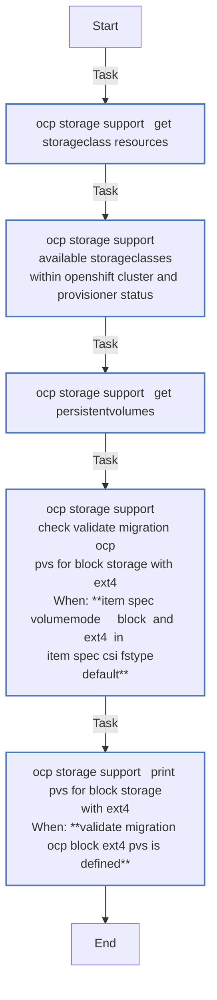

### Graph for ocp_version.yml

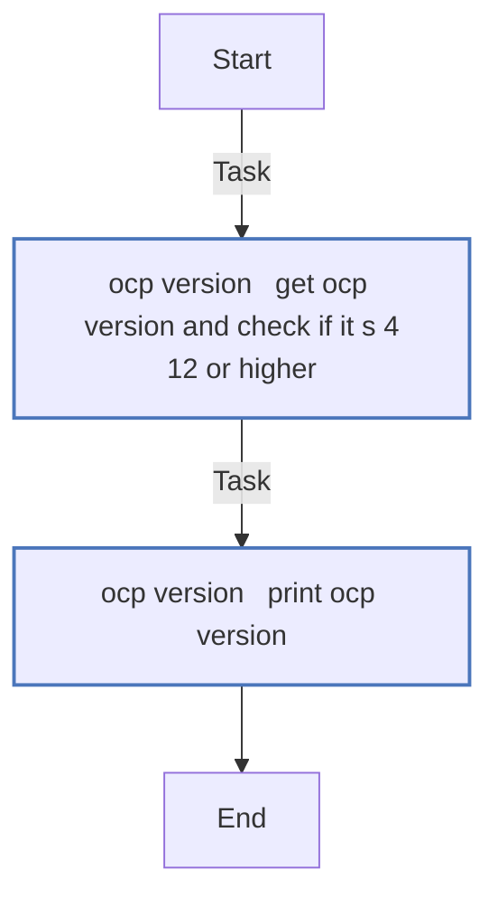

### Graph for post_migration_data_volumes.yml

```mermaid
flowchart TD
Start
classDef block stroke:#3498db,stroke-width:2px;
classDef task stroke:#4b76bb,stroke-width:2px;
classDef includeTasks stroke:#16a085,stroke-width:2px;
classDef importTasks stroke:#34495e,stroke-width:2px;
classDef includeRole stroke:#2980b9,stroke-width:2px;
classDef importRole stroke:#699ba7,stroke-width:2px;
classDef includeVars stroke:#8e44ad,stroke-width:2px;
classDef rescue stroke:#665352,stroke-width:2px;

  Start-->|Task| post_migration_data_volumes___Collect_DataVolumes_in_Target_Namespace0[post migration data volumes   collect datavolumes<br>in target namespace]:::task
  post_migration_data_volumes___Collect_DataVolumes_in_Target_Namespace0-->|Task| post_migration_data_volumes___Verify_DataVolumes_Exist1[post migration data volumes   verify datavolumes<br>exist]:::task
  post_migration_data_volumes___Verify_DataVolumes_Exist1-->|Task| post_migration_data_volumes___Verify_DataVolume_Status_Is_Succeeded2[post migration data volumes   verify datavolume<br>status is succeeded]:::task
  post_migration_data_volumes___Verify_DataVolume_Status_Is_Succeeded2-->|Task| post_migration_data_volumes___Collect_PVCs_in_Target_Namespace3[post migration data volumes   collect pvcs in<br>target namespace]:::task
  post_migration_data_volumes___Collect_PVCs_in_Target_Namespace3-->|Task| post_migration_data_volumes___Verify_PVCs_Are_Bound4[post migration data volumes   verify pvcs are<br>bound]:::task
  post_migration_data_volumes___Verify_PVCs_Are_Bound4-->|Task| post_migration_data_volumes___Verify_DataVolume_Storage_Sizes5[post migration data volumes   verify datavolume<br>storage sizes]:::task
  post_migration_data_volumes___Verify_DataVolume_Storage_Sizes5-->|Task| post_migration_data_volumes___Report_Data_Volume_Summary6[post migration data volumes   report data volume<br>summary]:::task
  post_migration_data_volumes___Report_Data_Volume_Summary6-->End
```

### Graph for post_migration_networks.yml

```mermaid
flowchart TD
Start
classDef block stroke:#3498db,stroke-width:2px;
classDef task stroke:#4b76bb,stroke-width:2px;
classDef includeTasks stroke:#16a085,stroke-width:2px;
classDef importTasks stroke:#34495e,stroke-width:2px;
classDef includeRole stroke:#2980b9,stroke-width:2px;
classDef importRole stroke:#699ba7,stroke-width:2px;
classDef includeVars stroke:#8e44ad,stroke-width:2px;
classDef rescue stroke:#665352,stroke-width:2px;

  Start-->|Task| post_migration_networks___Collect_VirtualMachines_for_Network_Validation0[post migration networks   collect virtualmachines<br>for network validation]:::task
  post_migration_networks___Collect_VirtualMachines_for_Network_Validation0-->|Task| post_migration_networks___Validate_VM_Network_Interfaces1[post migration networks   validate vm network<br>interfaces]:::task
  post_migration_networks___Validate_VM_Network_Interfaces1-->|Task| post_migration_networks___Verify_Network_Interface_Count_Match2[post migration networks   verify network interface<br>count match]:::task
  post_migration_networks___Verify_Network_Interface_Count_Match2-->|Task| post_migration_networks___Collect_NetworkAttachmentDefinitions3[post migration networks   collect<br>networkattachmentdefinitions]:::task
  post_migration_networks___Collect_NetworkAttachmentDefinitions3-->|Task| post_migration_networks___Report_Network_Attachment_Definitions4[post migration networks   report network<br>attachment definitions<br>When: **validate migration nad list resources is defined**]:::task
  post_migration_networks___Report_Network_Attachment_Definitions4-->|Task| post_migration_networks___Collect_NetworkPolicies5[post migration networks   collect networkpolicies]:::task
  post_migration_networks___Collect_NetworkPolicies5-->|Task| post_migration_networks___Report_Network_Policies6[post migration networks   report network policies]:::task
  post_migration_networks___Report_Network_Policies6-->|Task| post_migration_networks___Report_Network_Validation_Summary7[post migration networks   report network<br>validation summary]:::task
  post_migration_networks___Report_Network_Validation_Summary7-->End
```

### Graph for post_migration_relationships.yml

```mermaid
flowchart TD
Start
classDef block stroke:#3498db,stroke-width:2px;
classDef task stroke:#4b76bb,stroke-width:2px;
classDef includeTasks stroke:#16a085,stroke-width:2px;
classDef importTasks stroke:#34495e,stroke-width:2px;
classDef includeRole stroke:#2980b9,stroke-width:2px;
classDef importRole stroke:#699ba7,stroke-width:2px;
classDef includeVars stroke:#8e44ad,stroke-width:2px;
classDef rescue stroke:#665352,stroke-width:2px;

  Start-->|Task| post_migration_relationships___Collect_VMs_for_Relationship_Validation0[post migration relationships   collect vms for<br>relationship validation]:::task
  post_migration_relationships___Collect_VMs_for_Relationship_Validation0-->|Task| post_migration_relationships___Collect_DataVolumes_for_Relationship_Validation1[post migration relationships   collect datavolumes<br>for relationship validation]:::task
  post_migration_relationships___Collect_DataVolumes_for_Relationship_Validation1-->|Task| post_migration_relationships___Initialize_Relationship_Tracking2[post migration relationships   initialize<br>relationship tracking]:::task
  post_migration_relationships___Initialize_Relationship_Tracking2-->|Include task| post_migration_relationships___Verify_VM_Volume_References_Exist__validate_vm_volumes_yml_3[post migration relationships   verify vm volume<br>references exist<br>include_task:  validate vm volumes yml]:::includeTasks
  post_migration_relationships___Verify_VM_Volume_References_Exist__validate_vm_volumes_yml_3-->|Task| post_migration_relationships___Check_for_Orphaned_DataVolumes4[post migration relationships   check for orphaned<br>datavolumes<br>When: **validate migration rel dv metadata ownerreferences<br>  default       length    0**]:::task
  post_migration_relationships___Check_for_Orphaned_DataVolumes4-->|Task| post_migration_relationships___Warn_About_Orphaned_DataVolumes5[post migration relationships   warn about orphaned<br>datavolumes<br>When: **validate migration orphaned dvs   length   0**]:::task
  post_migration_relationships___Warn_About_Orphaned_DataVolumes5-->|Task| post_migration_relationships___Report_Missing_DataVolumes6[post migration relationships   report missing<br>datavolumes<br>When: **validate migration missing dvs   length   0**]:::task
  post_migration_relationships___Report_Missing_DataVolumes6-->|Task| post_migration_relationships___Report_Relationship_Summary7[post migration relationships   report relationship<br>summary]:::task
  post_migration_relationships___Report_Relationship_Summary7-->End
```

### Graph for post_migration_vms.yml

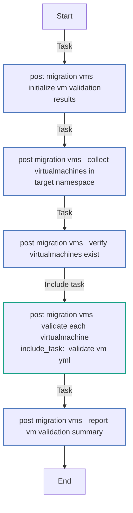

### Graph for vmware_firewall_rules.yml

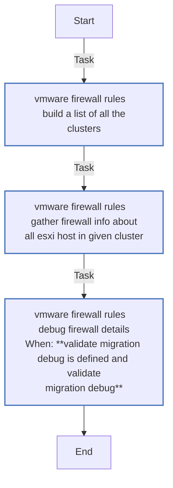

## Playbook

```yml
---
- name: Test
  hosts: localhost
  remote_user: root
  roles:
    - validate_migration
...

```

## Playbook graph

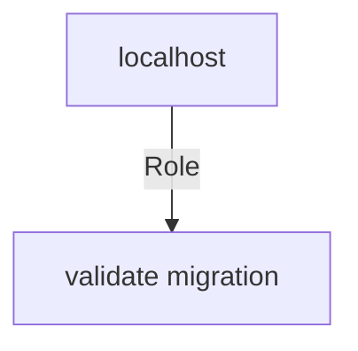

## Author Information

OpenShift Virtualization Migration Contributors

## License

GPL-3.0-only

## Minimum Ansible Version

2.15.0

## Platforms

No platforms specified.

<!-- DOCSIBLE END -->